# Chapter 1: MDPs as factor graphs: evaluating a policy by variable elimination

This chapter shows how a factor graph can represent a Markov decision process
(MDP) and evaluate a given policy on it with GTSAM's ordinary variable
elimination (VE). It is written for readers who know factor graphs from SLAM
and have not met MDPs or reinforcement learning (RL) before.

The short version: an MDP looks like a factor graph, and the standard way to
evaluate one looks like variable elimination, but the numbers that ordinary
elimination passes around cannot do the job. Giving every factor entry a second
number fixes that, and elimination then produces the quantities RL is built on.

Finding the *best* policy, rather than evaluating a given one, starts in
[Chapter 2](chapter02.md).

**Run the examples.** The code of this chapter's examples is in the companion
notebook [chapter01_examples.ipynb](chapter01_examples.ipynb), which runs
online:
[](https://colab.research.google.com/github/thduynguyen/gtsam/blob/feature/semiringfactor/gtsam/semiring/doc/chapter01_examples.ipynb)

Contents:

1. [An MDP as a factor graph](#1-an-mdp-as-a-factor-graph)
2. [What is computed on an MDP](#2-what-is-computed-on-an-mdp)
3. [Why ordinary elimination cannot compute it](#3-why-ordinary-elimination-cannot-compute-it)
4. [The fix: probability and value in every entry](#4-the-fix-probability-and-value-in-every-entry)
5. [The stored form and the expectation semiring](#5-the-stored-form-and-the-expectation-semiring)
6. [Correspondence between RL concepts and VE operations](#6-correspondence-between-rl-concepts-and-ve-operations)
7. [Worked example: the discrete case](#7-worked-example-the-discrete-case)
8. [Worked example: the continuous case](#8-worked-example-the-continuous-case)
9. [The two factor families](#9-the-two-factor-families)
10. [Using the module](#10-using-the-module)
11. [References](#11-references)

## 1. An MDP as a factor graph

An MDP describes an agent that moves through states over time, picks an action
at each step, and collects a reward for it. It has two kinds of variables and
four kinds of local terms.

| Symbol | Name | What it is | Closest SLAM notion |
|---|---|---|---|
| $s_t$ | state | where the agent is at step $t$ | a pose at time $t$ |
| $a_t$ | action | what the agent does at step $t$ | a control input, here an unknown variable |
| $p(s_0)$ | initial distribution | where the agent starts | a prior factor |
| $p(s_{t+1} \mid s_t, a_t)$ | dynamics | where an action leads, possibly at random | a motion model / odometry factor |
| $\pi(a_t \mid s_t)$ | policy | the rule the agent uses to pick an action in a state | a conditional on the control given the pose |
| $r(s_t, a_t)$ | reward | a score, positive or negative, for acting in a state | none: it is not a probability |

Each term involves only a few neighboring variables, so the MDP is a graph. For
two steps, with a final reward on the last state:

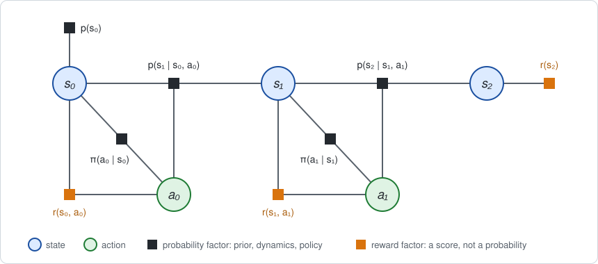

Circles are variables and squares are factors, as in any factor graph. Each
dynamics factor joins a state, the action taken in it and the next state. Each
policy factor and each reward factor joins a state and its action.

The prior, dynamics and policy are probabilities, exactly like the factors of a
SLAM graph. The reward nodes are the new ingredient: they attach to variables
like factors do, but they hold scores, **NOT** probabilities.

## 2. What is computed on an MDP

In SLAM the question is "which values of the variables are most probable?". In
an MDP the variables are not estimated. The question is **how much reward the
agent collects on average** when it follows the policy.

**Trajectory, probability and return.** A trajectory $\tau$ is one assignment to
all variables, $(s_0, a_0, s_1, a_1, \dots)$. It has a probability, the product
of the probability terms, and a return, the sum of the rewards along it:

```math
p(\tau) = p(s_0) \prod_t \pi(a_t \mid s_t)\, p(s_{t+1} \mid s_t, a_t), \qquad
R(\tau) = \sum_t r(s_t, a_t).
```

**Expected return.** The number to compute is the average return over all
trajectories,

```math
J = \mathbb{E}[R] = \sum_\tau p(\tau)\, R(\tau).
```

**How it is computed.** Enumerating trajectories is exponential, so the MDP
literature works backward in time with two helper functions:

- $Q_t(s, a)$, the **action value**: the expected reward collected from step
  $t$ to the end, given that the agent is in state $s_t = s$ and takes action
  $a_t = a$:

  $$Q _t(s, a) = \mathbb{E}\Big[\sum _{k=t}^{T-1} r(s _k, a _k) + r(s _T) \enspace \Big|\enspace s _t = s,\ a _t = a\Big] = r(s, a) + \sum _{s'} p(s' \mid s, a)\thinspace V _{t+1}(s').$$

  The second form splits it into the reward received now, which is known once
  $s$ and $a$ are given, plus the value of the next state $s'$, averaged over
  where the dynamics may lead.
- $V_t(s)$, the **state value**: the average of the action values over all
  actions available in state $s_t = s$, each weighted by the probability that
  the policy picks it:

  $$V _t(s) = \sum _a \pi(a \mid s)\thinspace Q _t(s, a) = \mathbb{E} _{a \sim \pi(\cdot \mid s)}\big[\thinspace Q _t(s, a)\thinspace \big].$$

  It is the expected reward from step $t$ to the end given only the state,
  before the action is chosen.

The two formulas refer to each other: $Q_t$ needs $V_{t+1}$, and $V_t$ needs
$Q_t$. Starting from the last step, they form a recursion, the **Bellman
backup**. Here $T$ is the last step and $r(s_T)$ is the final reward on the
last state, which is $r(s_2)$ in the figure:

```math
\begin{aligned}
V_T(s) &= r(s)
&& \text{at the last step only the final reward remains} \\
Q_t(s, a) &= r(s, a) + \sum_{s'} p(s' \mid s, a)\, V_{t+1}(s')
&& \text{add the reward now to the average value of the next state} \\
V_t(s) &= \sum_a \pi(a \mid s)\, Q_t(s, a)
&& \text{average over the actions the policy would take} \\
J &= \sum_s p(s_0 = s)\, V_0(s)
&& \text{average over the starting state}
\end{aligned}
```

**Two measures of surprise.** Two more quantities matter in RL. Each measures
how much the expected reward changes when one more variable becomes known: the
value once it is known, minus what was expected before. "Surprise" is an
informal word for this; the two standard names are below.

*Advantage.* The surprise caused by the agent's *choice of action*:

```math
A_t(s, a) = Q_t(s, a) - V_t(s).
```

It says how much better or worse action $a$ is than what the policy does on
average in state $s$. It is the signal used to improve a policy: make actions
with a positive advantage more likely.

*Temporal-difference (TD) residual.* The surprise caused by the *outcome of the
dynamics*. It is the value of the next state that occurred, minus the average
value over all the next states that could have occurred:

```math
\delta_t(s, a, s') = V_{t+1}(s') - \mathbb{E}[V_{t+1} \mid s, a],
\qquad
\mathbb{E}[V_{t+1} \mid s, a] = \sum_{s'} p(s' \mid s, a)\, V_{t+1}(s').
```

The average runs over the possible next states, weighted by the dynamics, for
the given $s$ and $a$. It is the same sum that appears in $Q_t$:

```math
Q_t(s, a) = r(s, a) + \mathbb{E}[V_{t+1} \mid s, a]
\quad\Longrightarrow\quad
\mathbb{E}[V_{t+1} \mid s, a] = Q_t(s, a) - r(s, a).
```

Substituting this into the definition gives a second form:

```math
\delta_t(s, a, s') = V_{t+1}(s') - \big(Q_t(s, a) - r(s, a)\big) =
\underbrace{r(s, a) + V_{t+1}(s')}_{\text{after the next state is known}}
\;-\; \underbrace{Q_t(s, a)}_{\text{before}}.
```

Read this way it has the same shape as the advantage. Before the next state is
known, the expected reward from step $t$ on is $Q_t(s, a)$. Once the agent has
landed in a particular $s'$, it is the reward received now plus the value of
that state. The residual is the change: how much better or worse landing in
$s'$ is than the average outcome of taking $a$ in $s$. It is the agent's luck.

<details>
<summary><span style="color: gray;">Why is the TD residual zero when the dynamics are deterministic?</span></summary>

Because there is no luck involved. Taking $a$ in $s$ then always leads to one
state, $s' = f(s, a)$, with probability 1 and to every other state with
probability 0. The average has a single term, and that term is the value of
the only state that can occur:

$$\mathbb{E}[V _{t+1} \mid s, a] = 1 \cdot V _{t+1}\big(f(s, a)\big) \quad\Longrightarrow\quad \delta _t = V _{t+1}\big(f(s, a)\big) - V _{t+1}\big(f(s, a)\big) = 0.$$

</details>

<details>
<summary><span style="color: gray;">How is the TD residual used to learn value functions from sampled transitions?</span></summary>

This module assumes the dynamics are known, so it computes
$\mathbb{E}[V_{t+1} \mid s, a]$ exactly. RL usually does not know the dynamics.
It can only try action $a$ in state $s$ and observe one transition: the reward
$r$ and the next state $s'$ that happened. The zero-mean property described
below is what makes learning from such samples possible.

Suppose the agent holds *estimates* $\hat Q$ and $\hat V$ of the value
functions, and computes the residual of one observed transition from them:

$$\hat\delta = r + \hat V _{t+1}(s') - \hat Q _t(s, a).$$

Averaged over the next states the dynamics produce, this is

$$\mathbb{E}[\hat\delta \mid s, a] = \underbrace{r + \sum _{s'} p(s' \mid s, a)\thinspace \hat V _{t+1}(s')} _{\text{what } \hat Q _t(s, a) \text{ should be}} \enspace -\enspace \underbrace{\hat Q _t(s, a)} _{\text{what it is}}.$$

For the true value functions this average is zero. If it is positive, the
estimate $\hat Q_t(s, a)$ is too low; if negative, too high. So each sampled
residual is a noisy measurement of the error in the estimate, with the right
sign on average, and the estimate is corrected by a small step $\alpha$ in its
direction:

$$\hat Q _t(s, a) \leftarrow \hat Q _t(s, a) + \alpha\thinspace \hat\delta.$$

Repeated over many transitions, the estimate settles where the residual
averages to zero for every $s$ and $a$, which is exactly the Bellman backup.
This is *temporal-difference learning*: it replaces the sum over $s'$, which
needs the dynamics, by samples of $s'$, which only need experience. The
analogous update for a policy uses the advantage.

</details>

<br>

<div>
<em>Zero mean.</em> Each of the two surprises has zero mean: averaged over the
variable that became known, weighted by that variable's own probabilities, it
cancels. A single action or outcome can have a large positive or negative
surprise; only the weighted average is zero.
<details>
<summary><span style="color: gray;">Why do both have zero mean?</span></summary>

Each is a quantity minus its own average, and the average of "something minus
its average" is zero.

For the advantage, average over the actions with the policy as weights. The
first term is the definition of $V_t(s)$, and the weights sum to one:

$$\sum _a \pi(a \mid s)\thinspace A _t(s, a) = \underbrace{\sum _a \pi(a \mid s)\thinspace Q _t(s, a)} _{V _t(s)} \enspace -\enspace V _t(s) \underbrace{\sum _a \pi(a \mid s)} _{1} = 0.$$

Some actions are better than the policy's average and some are worse, and
weighted by how often the policy takes them they balance exactly.

For the TD residual, average over the next states with the dynamics as
weights:

$$\sum _{s'} p(s' \mid s, a)\thinspace \delta _t(s, a, s') = \underbrace{\sum _{s'} p(s' \mid s, a)\thinspace V _{t+1}(s')} _{\mathbb{E}[V _{t+1} \mid s, a]} \enspace -\enspace \mathbb{E}[V _{t+1} \mid s, a] \underbrace{\sum _{s'} p(s' \mid s, a)} _{1} = 0.$$

Good luck and bad luck balance exactly.

</details>
</div>

<br>

**This has the shape of variable elimination.** Read the recursion as a SLAM
person would. The step for $Q_t$ sums out $s_{t+1}$ and leaves a function of
its neighbors $(s_t, a_t)$. The step for $V_t$ sums out $a_t$ and leaves a
function of its neighbor $s_t$. That is elimination in the order
$s_T, a_{T-1}, s_{T-1}, \dots, a_0, s_0$, where each step produces a new factor
on the separator. So it is natural to ask GTSAM's elimination to do it.

## 3. Why ordinary elimination cannot compute it

Ordinary elimination of a variable $x$ with separator $S$ does three things with
the factors $f_i$ that touch $x$:

```math
\psi(x, S) = \prod_i f_i \;\;\text{(multiply)}, \qquad
\phi(S) = \sum_x \psi \;\;\text{(sum out)}, \qquad
p(x \mid S) = \psi / \phi \;\;\text{(divide)}.
```

Here $\psi$ is the product of the factors in the bucket of $x$, and $\phi$ is
the new factor that elimination leaves on the separator.

Try it on the graph of Section 1, treating the rewards as ordinary factors.

**Eliminate $s_2$.** In the figure it touches two factors, the dynamics
$p(s_2 \mid s_1, a_1)$ and the final reward $r(s_2)$:

```math
\phi(s_1, a_1) = \sum_{s_2} p(s_2 \mid s_1, a_1)\, r(s_2).
```

This number is the expected final reward, which is what the Bellman backup
wants. The conditional that elimination stores, however, is

```math
\frac{\psi}{\phi} = \frac{p(s_2 \mid s_1, a_1)\, r(s_2)}{\phi(s_1, a_1)}.
```

It does **NOT** have the meaning of a conditional $p(s_2 \mid s_1, a_1)$,
because $r(s_2)$ is **NOT** a probability. Dividing a product of probabilities
by its sum gives a conditional; here one of the two terms is a score, so the
quotient is the dynamics reweighted by the reward. With rewards of mixed sign
it can even be negative.

**Eliminate $a_1$.** It touches the policy $\pi(a_1 \mid s_1)$, the reward
$r(s_1, a_1)$ and the new factor $\phi(s_1, a_1)$:

```math
\begin{aligned}
\text{ordinary elimination:} \quad &
\sum_{a_1} \pi(a_1 \mid s_1) \cdot r(s_1, a_1) \cdot \phi(s_1, a_1) \\
\text{Bellman backup:} \quad &
\sum_{a_1} \pi(a_1 \mid s_1) \cdot \big(r(s_1, a_1) + \phi(s_1, a_1)\big)
\end{aligned}
```

The graph **multiplies** the reward with the value of the future. The MDP needs
them **added**. From here on the numbers are wrong.

| The Bellman backup needs | Ordinary elimination does |
|---|---|
| rewards from different factors to add | all factors in a bucket multiply |
| averages weighted by the true dynamics and policy | weights that have been multiplied by rewards |
| a conditional that is the dynamics or the policy | a conditional tilted toward high reward |

The cause is that a factor entry holds **one number**, and that one number is
asked to play two incompatible roles: a probability, which weights averages and
multiplies, and a reward, which is the thing being averaged and adds.

**The usual workaround does not fix it.** One can make rewards add by encoding
each as a factor $e^{r}$, since $e^{r_1} e^{r_2} = e^{r_1 + r_2}$; a quadratic
cost written as a Gaussian factor is the common case. The graph then represents
the reweighted distribution $p(\tau) e^{R(\tau)}$. This is the
*control as inference* formulation of Kappen et al. (2012) and Levine (2018),
listed in the [references](#11-references). It is a sound method for what it
computes, but it answers a different question:

- Maximizing over it finds the single best trajectory. It maximizes over next
  states as well as actions, as if the agent could choose how the dynamics turn
  out. That is correct for deterministic dynamics and optimistic otherwise.
- Summing over it gives $\mathbb{E}[e^{R}]$ rather than $\mathbb{E}[R]$, and
  conditionals in which the dynamics and the policy are bent toward high
  reward.
- Neither evaluates the given policy, so $V$, $Q$ and $A$ are not obtained.
- A Gaussian factor must have a positive semidefinite information matrix, so
  only costs can be encoded. A reward of arbitrary sign is not a valid Gaussian
  factor and breaks Cholesky factorization.

## 4. The fix: probability and value in every entry

Since one number cannot play both roles, give each factor entry two. For one
outcome $x$ (one assignment of the factor's variables):

- $p(x)$, the **probability** of the outcome, and
- $v(x)$, the **value**: the reward accumulated so far, given that outcome.

A factor whose entries are such pairs is a **semiring factor**. Its entry for
an outcome is the pair $(p, v)$ as a whole, not $p$ alone and not $v$ alone,
and the three steps of elimination act on the pair. Those three operators,
multiply, marginalize and condition, are defined below.

The name comes from algebra: the pairs, with a product and a sum, form a
*semiring*, and this particular one is the **expectation semiring**, introduced
by Eisner (2002) and extended by Li and Eisner (2009) for computing
expectations over the paths of weighted automata and parse forests; see the
[references](#11-references).

<details>
<summary><span style="color: gray;">What is a ring, what is a semiring, and why name the factor after it?</span></summary>

A **ring** is a set of values with an addition and a multiplication that
behave like those of ordinary numbers: both are associative, addition is
commutative, there is a zero and a one, multiplication distributes over
addition, $a \times (b + c) = a \times b + a \times c$, and every value has a
negative, so subtraction is always possible. The integers
$\dots, -2, -1, 0, 1, 2, \dots$ are the standard example.

A **semiring** is the same without negatives: values can be added and
multiplied, but not necessarily subtracted. It is "half a ring". The standard
example is the counting numbers $0, 1, 2, \dots$: adding and multiplying two of
them gives another, but subtracting may not. Probabilities are the same kind of
thing, since a probability is never negative.

**Variable elimination needs exactly a semiring.** It multiplies the factors of
a bucket and adds over the values of a variable. Its correctness rests on the
distributive law, which lets a sum be pushed inside a product: a factor $f$
that does not involve the eliminated variable $y$ can be taken out of the sum
over $y$,

$$\sum _y f(x)\thinspace g(x, y) = f(x) \sum _y g(x, y).$$

This is what turns one sum over all variables jointly into a sequence of small
sums, one per variable:

$$\sum _x \sum _y f(x)\thinspace g(x, y) = \sum _x \Big( f(x) \underbrace{\sum _y g(x, y)} _{\text{new factor on } x} \Big).$$

Nothing here subtracts. So the same algorithm runs on any values that have a
product $\otimes$ and a sum $\oplus$ obeying these laws, not only on plain
numbers:

$$\bigoplus _y \big( f(x) \otimes g(x, y) \big) = f(x) \otimes \bigoplus _y g(x, y).$$

The pairs $(p, v)$ are such values. Their two operations are the first two
rules of the table below:

| | On two pairs $(p_1, v_1)$ and $(p_2, v_2)$ | Role |
|---|---|---|
| multiplication | $(p_1 p_2, v_1 + v_2)$ | multiply two factors |
| addition | $\left(p_1 + p_2, \dfrac{p_1 v_1 + p_2 v_2}{p_1 + p_2}\right)$ | marginalize: merge two exclusive outcomes of the eliminated variable. **Read:** the $+$ is the marginalization over the eliminated variable $x$, $p(x = x_1, S) + p(x = x_2, S)$ for two of its values $x_1$ and $x_2$, **NOT** the sum of two arbitrary probabilities, which would not mean anything |
| one | $(1, 0)$ | a factor that changes nothing: probability one, no value |
| zero | $(0, \cdot)$ | an impossible outcome |

A *semiring factor* is a factor whose entries are these pairs in place of plain
numbers. Section 5 shows that the laws hold, by rewriting the pairs in a form
where the two operations are ordinary arithmetic.

</details>

<br>

This section presents the pair in the form that is easiest to reason about,
$(p, v)$. Section 5 gives the equivalent form that is stored. The MDP's terms
become semiring factors as follows.

| Term | As a pair $(p, v)$ | Reason |
|---|---|---|
| prior, dynamics, policy $f$ | $(f, 0)$ | a probability that carries no reward |
| reward $r$ | $(1, r)$ | a reward that does not change any probability |

The three steps of elimination need a rule for each of the two numbers. Take a
factor on $(x, S)$, where $x$ is the variable being eliminated and $S$ is the
separator. Each rule is a standard identity of probability.

| Step | Probability | Value | Identity used |
|---|---|---|---|
| **Multiply** factors 1 and 2 | $p = p_1 p_2$ | $v = v_1 + v_2$ | a joint is the product of its factors; rewards along a trajectory add |
| **Marginalize** $x$ | $p(S) = \sum_x p(x, S)$ | $\bar v(S) = \sum_x p(x \mid S) v(x, S)$ | marginalization; conditional expectation, $\bar v(S) = \mathbb{E}[v \mid S]$ |
| **Condition** on $S$ | $p(x \mid S) = \dfrac{p(x, S)}{p(S)}$ | $v(x, S) - \bar v(S)$ | definition of a conditional; value relative to its conditional mean. This is the surprise of Section 2: the **advantage** $A_t$ when $x$ is an action, the **TD residual** $\delta_t$ when $x$ is a next state |

The value rule for marginalization is the law of total expectation: given only
$S$, the value is the average of $v(x, S)$ over $x$, weighted by how probable
each $x$ is given $S$.

In the notation of Section 3, with $p = \prod_i p_i$ and $v = \sum_i v_i$ over
the factors in the bucket of $x$, the three results of elimination are:

```math
\begin{aligned}
\text{product of the bucket:} \quad & \psi(x, S) = \big(p(x, S),\; v(x, S)\big) \\
\text{new factor on the separator:} \quad & \phi(S) = \big(p(S),\; \bar v(S)\big) \\
\text{conditional:} \quad & c(x \mid S) = \big(p(x \mid S),\; v(x, S) - \bar v(S)\big)
\end{aligned}
```

### Elimination reproduces the Bellman backup

Apply the three rules to one time step $t$ of the graph, eliminating $s_{t+1}$
and then $a_t$. Write $s = s_t$, $a = a_t$ and $s' = s_{t+1}$.

In the figures below, a black square is a probability factor $(p, 0)$ and an
orange square is a value factor $(1, v)$. A dashed red ring marks the variable
about to be eliminated. A grey node has been eliminated; the arrows into it
come from the variables its conditional depends on.

#### Starting point

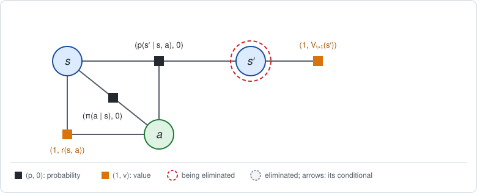

Everything after step $t$ has already been eliminated and has left one value
factor on $s'$:

```math
\big(1,\; V_{t+1}(s')\big).
```

Its value is the expected reward from $s'$ onward. At the last step there are
no later variables, and this factor is the final reward itself,
$(1, r(s_T))$, which is $V_T$.

<details>
<summary><span style="color: gray;">Why is its probability 1?</span></summary>

The probability channel never sees the rewards (each reward factor contributes
a factor of 1), so it is what ordinary elimination computes: the product of all
policy and dynamics factors after step $t$, with all future action and state
variables marginalized out,

$$\sum _{a _{t+1},\thinspace s _{t+2},\thinspace \dots,\thinspace s _T} \enspace \enspace \prod _{k=t+1}^{T-1} \pi(a _k \mid s _k)\enspace p(s _{k+1} \mid s _k, a _k) \enspace =\enspace 1.$$

It equals one because every factor in the product is a conditional
distribution, which sums to one over its own variable.

</details>

#### Eliminate the next state

The bucket of $s'$ holds the two factors attached to it in the figure above:
the dynamics $(p(s' \mid s, a), 0)$ and the future value
$(1, V_{t+1}(s'))$. The separator is $(s, a)$.

**Multiply.** Probabilities multiply and values add:

```math
\psi(s', s, a) = \big(p(s' \mid s, a) \cdot 1,\;\; 0 + V_{t+1}(s')\big)
= \big(p(s' \mid s, a),\; V_{t+1}(s')\big).
```

**Marginalize $s'$.** The probability sums to one. The value becomes its
conditional expectation, the average of $V_{t+1}(s')$ weighted by
$p(s' \mid s, a)$:

```math
\phi(s, a) = \Big(\sum_{s'} p(s' \mid s, a),\;\;
\sum_{s'} p(s' \mid s, a)\, V_{t+1}(s')\Big)
= \big(1,\; \mathbb{E}[V_{t+1}(s') \mid s, a]\big).
```

This is the second term of $Q_t$ in Section 2: the value of the next state,
averaged over where the dynamics may lead.

**Condition.** Divide the product $\psi$ by the new factor $\phi$: the
probability of $\psi$ is divided by the probability of $\phi$, which is 1, and
the value of $\phi$, the mean future value, is subtracted from the value of
$\psi$:

```math
c(s' \mid s, a) = \Big(\frac{p(s' \mid s, a)}{1},\;\;
V_{t+1}(s') - \mathbb{E}[V_{t+1}(s') \mid s, a]\Big)
= \big(p(s' \mid s, a),\; \delta_t(s, a, s')\big).
```

The value channel is the TD residual $\delta_t$ of Section 2: how much better
or worse landing in $s'$ is than the average outcome of taking $a$ in $s$.

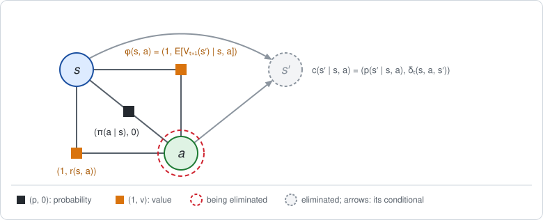

The two factors of the bucket are gone. In their place are the conditional
$c(s' \mid s, a)$, drawn as the arrows into $s'$, and one new value factor
$\phi(s, a)$ joining $s$ and $a$.

<details>
<summary><span style="color: gray;">The probability channel of this conditional is just the dynamics. Why multiply and marginalize at all?</span></summary>

The probability channel comes out equal to the dynamics factor that went in.
That is a property of this bucket, not of elimination in general: the only
probability factor touching $s'$ was already a normalized conditional on $s'$.

The multiplication and marginalization were still needed, because their purpose
here is the value channel: they produce
$\mathbb{E}[V_{t+1}(s') \mid s, a]$, which the next bucket turns into $Q_t$.

The probability channel does real work as soon as the graph is not a plain
chain of normalized conditionals eliminated backward in time, for example with
a prior on a later state, an observation factor, unnormalized factors or a
different elimination order. The conditional then differs from every input
factor, exactly as in a SLAM graph.

</details>

#### Eliminate the action

The bucket of $a$ holds the three factors attached to it in the figure above:
the policy $(\pi(a \mid s), 0)$, the reward $(1, r(s, a))$ and the new
factor $\phi(s, a)$. The separator is $s$.

**Multiply.** This is the step that failed in Section 3. The reward and the
future value now **add**, because they sit in the value channel:

```math
\psi(a, s) = \big(\pi(a \mid s) \cdot 1 \cdot 1,\;\;
0 + r(s, a) + \mathbb{E}[V_{t+1}(s') \mid s, a]\big)
= \big(\pi(a \mid s),\; Q_t(s, a)\big).
```

The value is exactly the formula for $Q_t(s, a)$ in Section 2.

**Marginalize $a$.** The policy sums to one, and the value is averaged with the
policy probabilities as weights:

```math
\phi(s) = \Big(\sum_a \pi(a \mid s),\;\; \sum_a \pi(a \mid s)\, Q_t(s, a)\Big)
= \big(1,\; V_t(s)\big).
```

The value is exactly the formula for $V_t(s)$ in Section 2.

**Condition.** Divide $\psi$ by $\phi$ in the same way: the probability is
divided by 1, and the value $V_t(s)$ of $\phi$ is subtracted:

```math
c(a \mid s) = \Big(\frac{\pi(a \mid s)}{1},\;\; Q_t(s, a) - V_t(s)\Big)
= \big(\pi(a \mid s),\; A_t(s, a)\big).
```

The probability channel is the policy and the value channel is the advantage.

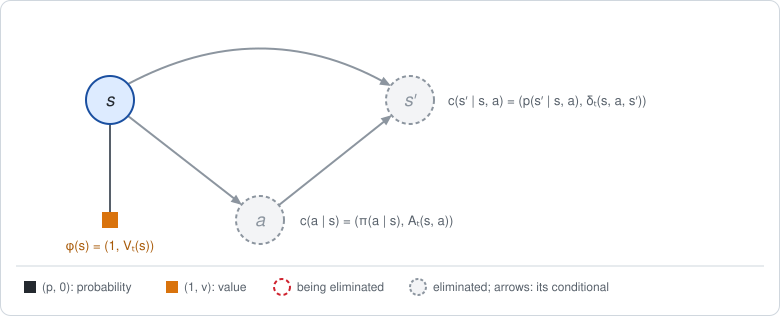

All that is left in the graph is one value factor on $s$, $(1, V_t(s))$. It
has the same form as the starting point, one step earlier.

#### Repeat, then finish at the first state

The factor $(1, V_t(s))$ joins the bucket of $s_t$ at step $t - 1$, and the
two eliminations above repeat until $t = 0$. The bucket of $s_0$, with no
separator, then holds the prior $(p(s_0), 0)$ and $(1, V_0(s_0))$:

```math
\psi(s_0) = \big(p(s_0),\; V_0(s_0)\big), \qquad
\phi = \Big(\sum_{s_0} p(s_0),\;\; \sum_{s_0} p(s_0)\, V_0(s_0)\Big) = (1,\; J),
\qquad
c(s_0) = \big(p(s_0),\; V_0(s_0) - J\big).
```

The last new factor has no variables left. Its value is the expected return
$J$, the number the whole computation is for.

### What the fix achieves

Line by line, the value channel has reproduced the four equations of the
Bellman backup in Section 2, and both failures of Section 3 are gone:

- **Rewards add**, because the value is a separate number with its own rule.
- **Probabilities are untouched.** The first number follows the ordinary rules
  and never sees a reward, so the conditionals are the true dynamics and
  policy, the ones GTSAM would produce if the rewards were not there.

And the two outputs of each elimination step are exactly the RL quantities:

- the **new factor** on the separator carries an expected value, $\bar v$: a
  value function ($Q$ or $V$);
- the **conditional** carries $v - \bar v$: a surprise, the advantage for an
  action and the TD residual for a state. It averages to zero
  under the conditional, which is the semiring analogue of a conditional
  summing to one.

**What $v - \bar v$ is in MDP terms.** It is the surprise of Section 2: the
value given $x$ and $S$, minus what was expected from $S$ alone. Which named
quantity it is depends on the variable eliminated.

| Eliminated $x$ | Separator $S$ | $v(x, S)$ | $\bar v(S)$ | $v - \bar v$ | Name in RL |
|---|---|---|---|---|---|
| action $a_t$ | $s_t$ | $Q_t(s, a)$ | $V_t(s)$ | $A_t(s, a)$ | **advantage**: how much better this action is than the policy's average |
| next state $s_{t+1}$ | $s_t, a_t$ | $V_{t+1}(s')$ | $\mathbb{E}[V_{t+1}(s') \mid s, a]$ | $\delta_t(s, a, s')$ | **TD residual**: how much better this outcome of the dynamics is than expected |
| first state $s_0$ | none | $V_0(s_0)$ | $J$ | $V_0(s_0) - J$ | how much better this start is than average |

The sum of the first two rows is the TD error with respect to $V$ that is most
often used in RL: $A_t + \delta_t = r(s, a) + V_{t+1}(s') - V_t(s)$.

Subtracting $\bar v$ is what RL calls subtracting a **baseline**.

<details>
<summary><span style="color: gray;">What does the Bayes net as a whole represent?</span></summary>

In an ordinary Bayes net, multiplying all the conditionals gives back the joint
probability of the full assignment. The same question can be asked here:
multiply all the semiring conditionals for one trajectory $\tau$, what comes
out?

**Answer:** the joint probability of the trajectory, paired with its return
relative to the average:

$$\bigotimes _{\text{all conditionals}} c \enspace =\enspace \big(p(\tau),\enspace \enspace R(\tau) - J\big).$$

In words: a particular trajectory collects a return $R(\tau)$ that is higher or
lower than the average $J$. The conditionals explain that difference piece by
piece. Each one says how much of it is due to its own variable: this much
because of where the agent started, this much because of the action it chose at
step 0, this much because of where the dynamics then took it, and so on. The
pieces add up to the whole difference.

**Why the product is this pair.** By the multiplication rule, probabilities
multiply and values **add**. So the probability channel of the product is the
joint probability $p(\tau)$, as in an ordinary Bayes net, and its value channel
is the sum of the value channels of all the conditionals. Each of those values
is a surprise: $V_0(s_0) - J$ for the first state, $A_t$ for each action and
$\delta_t$ for each next state. When they are added the intermediate terms
cancel (shown at the end), and their sum is

$$\underbrace{\big(V _0(s _0) - J\big)} _{\text{start}} + \sum _t \big(\underbrace{A _t} _{\text{action}} + \underbrace{\delta _t} _{\text{next state}}\big) = R(\tau) - J.$$

The cancellation takes three steps.

1. *Within one time step, the action value cancels.* Write out the two surprises of step
   $t$, using the second form of $\delta_t$ from Section 2:

   $$A _t + \delta _t = \big(Q _t(s _t, a _t) - V _t(s _t)\big) + \big(r(s _t, a _t) + V _{t+1}(s _{t+1}) - Q _t(s _t, a _t)\big) = r(s _t, a _t) + V _{t+1}(s _{t+1}) - V _t(s _t).$$

2. *Across time steps, the values cancel in pairs.* Each step contributes
   $+V_{t+1}$ and the next step contributes $-V_{t+1}$. For two steps:

   $$\big(r(s _0, a _0) + V _1(s _1) - V _0(s _0)\big) + \big(r(s _1, a _1) + V _2(s _2) - V _1(s _1)\big) = r(s _0, a _0) + r(s _1, a _1) + V _2(s _2) - V _0(s _0).$$

   In general only the first and the last value survive:

   $$\sum _{t=0}^{T-1} \big(A _t + \delta _t\big) = \sum _{t=0}^{T-1} r(s _t, a _t) + V _T(s _T) - V _0(s _0).$$

3. *The last value is the final reward.* Since $V_T(s_T) = r(s_T)$, the first
   two terms on the right are all the rewards along the trajectory, which is
   the return $R(\tau)$. So

   $$\sum _t \big(A _t + \delta _t\big) = R(\tau) - V _0(s _0) \quad\Longrightarrow\quad V _0(s _0) + \sum _t \big(A _t + \delta _t\big) = R(\tau).$$

   Subtracting $J$ from both sides gives the identity above.

Section 7 checks this on the numbers of the worked example.

What this gives:

- **Nothing is lost by elimination.** The Bayes net, together with the single
  number $J$, contains everything the factor graph did: the probability of
  every trajectory and its return. $J$ is the constant $(1, J)$ that
  elimination leaves at the root, read with `graph.expectation()`.
  Multiplying it back in restores the return:
  $\big(p(\tau), R(\tau) - J\big) \otimes (1, J) = \big(p(\tau), R(\tau)\big)$,
  which is the product of all the original factors (see Section 5).
- **Credit assignment.** For any trajectory, the conditionals tell which
  decision, or which piece of luck, made it better or worse than average. This
  is why RL can improve the policy at step $t$ using only $A_t$ and not the
  whole return: the other pieces are about other variables.
- **A check.** Multiplying all the conditionals gives the pair
  $\big(p(\tau), R(\tau) - J\big)$ for every trajectory. Its expected value,
  the average of the value channel weighted by the probability channel, is

  $$\sum _\tau p(\tau)\thinspace \big(R(\tau) - J\big) = \underbrace{\sum _\tau p(\tau)\thinspace R(\tau)} _{J} \enspace -\enspace J \underbrace{\sum _\tau p(\tau)} _{1} = 0.$$

  The average of "return minus average return" is zero. So putting the
  conditionals of a Bayes net back into a factor graph and calling
  `expectation()` on it must return 0. The unit tests verify this.


</details>

## 5. The stored form and the expectation semiring

The pair $(p, v)$ is the right way to think. It is awkward to compute with,
because of the value rule for marginalization,

```math
\bar v(S) = \frac{\sum_x p(x, S)\, v(x, S)}{p(S)}.
```

Two things about it are awkward.

- **It divides by $p(S)$**, so it is undefined wherever $p(S) = 0$.
- **It is a weighted average, not a sum.** Elimination marginalizes the
  variables one at a time, in whatever order the ordering dictates. That is
  only valid if marginalizing in stages gives the same result as marginalizing
  everything at once, in any order. For a sum this is obvious: numbers can be
  added in any order and in any grouping. For an average it is not obvious,
  and it is false if done carelessly: the average of two averages is not the
  overall average unless each is weighted by how much probability it stands
  for. If two groups of outcomes have probabilities $p_A$, $p_B$ and averages
  $v_A$, $v_B$, then

  $$\text{overall average} = \frac{p _A\thinspace v _A + p _B\thinspace v _B}{p _A + p _B} \enspace \neq\enspace \frac{v _A + v _B}{2} \quad \text{unless } p _A = p _B.$$

Both problems disappear if the value is stored already multiplied by its
probability. The module therefore stores the probability together with the
**weighted value** $w$:

```math
(p,\; w), \qquad w(x) = p(x)\, v(x).
```

With this choice, marginalizing either number is a plain sum over $x$:

```math
p(S) = \sum_x p(x, S), \qquad w(S) = \sum_x w(x, S).
```

The second sum is the numerator of $\bar v(S)$ above, since
$w(x, S) = p(x, S) v(x, S)$. The division by $p(S)$ is done once, at the end,
when the value is read back from the weighted value as $v = w / p$.

<details>
<summary><span style="color: gray;">Example: averaging in stages</span></summary>

Take three outcomes with probabilities $0.5, 0.25, 0.25$ and values
$4, 0, 8$. The expected value is
$0.5 \cdot 4 + 0.25 \cdot 0 + 0.25 \cdot 8 = 4$.

*With the pair* $(p, v)$. Merge the last two outcomes first. Their probability is
$0.5$ and their value is the weighted average
$(0.25 \cdot 0 + 0.25 \cdot 8) / 0.5 = 4$. Then merge with the first:
$(0.5 \cdot 4 + 0.5 \cdot 4) / 1 = 4$. This is correct, but every stage needs
both numbers and a division. Taking the plain average of the two values in the
first stage would have been as easy to write and wrong in general.

*With the pair* $(p, w)$. The weighted values are $w = 2, 0, 2$. Merging is addition:
$0 + 2 = 2$, then $2 + 2 = 4$, with probabilities $0.25 + 0.25 = 0.5$, then
$0.5 + 0.5 = 1$. Any order and any grouping gives $(1, 4)$, and the value is
read at the end as $4 / 1 = 4$.

</details>

The weighted value $w$ is the value weighted by its probability: the contribution of outcome $x$
to an expected value, i.e. one term of $\mathbb{E}[v] = \sum_x p(x) v(x)$. It
is to values what an unnormalized probability is to probabilities, and
$v = w / p$ recovers the value. Substituting $w = p v$ into the three rules of
Section 4 gives the operators on $(p, w)$.

**Product $\otimes$.** From $p = p_1 p_2$ and $v = v_1 + v_2$:

```math
w = p\, v = p_1 p_2\,(v_1 + v_2)
= p_1\,(p_2 v_2) + p_2\,(p_1 v_1) = p_1 w_2 + p_2 w_1.
```

Each term multiplies the probability of one factor with the weighted value of
the *other* factor: $p_1 w_2 = (p_1 p_2) v_2$ is the joint probability times
the value contributed by factor 2.

**Marginalization, and the sum $\oplus$.** From $p(S) = \sum_x p(x, S)$ and
$\bar v(S) = \sum_x p(x, S) v(x, S) / p(S)$:

```math
w(S) = p(S)\, \bar v(S) = \sum_x p(x, S)\, v(x, S) = \sum_x w(x, S).
```

Both stored numbers are marginalized the same way, by summing the table over
$x$, exactly as in ordinary sum-product. The division by $p(S)$ has
disappeared, so the rule also holds where $p(S) = 0$.

The semiring sum $\oplus$ is the two-term case of this. Take two entries of the
same factor that agree on $S$ and differ in $x$. They are the mutually exclusive
events $(x = x_1, S)$ and $(x = x_2, S)$, for two values $x_1$ and $x_2$ of the
eliminated variable $x$, so

```math
(p_1, w_1) \oplus (p_2, w_2) = (p_1 + p_2,\; w_1 + w_2),
```

and marginalization is $\oplus$ applied over all values of $x$:
$\phi(S) = \bigoplus_x \psi(x, S)$. It is never applied to entries of different
factors.

**Conditioning, and the division $\oslash$.** Let $(p, w)$ be an entry of the
joint over $(x, S)$ and $(p_S, w_S)$ the matching entry of its marginal over
$S$, so $p_S = p(S)$ and $\bar v = w_S / p_S$. From $p_c = p / p_S$ and
$v_c = v - \bar v$:

```math
w_c = p_c\, v_c = \frac{p}{p_S}\left(\frac{w}{p} - \frac{w_S}{p_S}\right)
= \frac{w\,p_S - p\,w_S}{p_S^2}.
```

Summary, in both forms:

| Step and operator | Meaning for probability and value, $(p, v)$ | Stored form, probability and weighted value, $(p, w)$ |
|---|---|---|
| Multiply factors 1 and 2, by $\otimes$ | $p = p_1 p_2$, $v = v_1 + v_2$ | $(p_1 p_2, p_1 w_2 + p_2 w_1)$ |
| Marginalize $x$, by $\oplus$ over its values | $p(S) = \sum_x p(x, S)$, $\bar v(S) = \mathbb{E}[v \mid S]$ | $\left(\sum_x p(x, S), \sum_x w(x, S)\right)$; for two values of $x$: $(p_1 + p_2, w_1 + w_2)$ |
| Condition on $S$, by $\oslash$ of joint $(p, w)$ by marginal $(p_S, w_S)$ | $p(x \mid S) = p / p_S$, $v - \bar v$ (the surprise) | $\left(\frac{p}{p_S}, \frac{w p_S - p w_S}{p_S^2}\right)$ |
| Zero | an impossible outcome | $(0, 0)$ |
| One | probability one, no value | $(1, 0)$ |
| Lifted probability $f$ | $(f, 0)$ | $(f, 0)$ |
| Lifted reward $r$ | $(1, r)$ | $(1, r)$ |

**Why this is called a semiring.** Variable elimination is valid for any values
with a product and a sum that are associative and commutative and satisfy the
distributive law, $a \otimes (b \oplus c) = (a \otimes b) \oplus (a \otimes c)$.
That law is what allows a sum to be pushed inside a product, and so what makes
the result independent of the elimination order. Such a structure is a
*semiring*. In the stored form the operators are ordinary arithmetic on the
dual number $p + w \varepsilon$ with $\varepsilon^2 = 0$:

```math
(p_1 + w_1\varepsilon)(p_2 + w_2\varepsilon) = p_1 p_2 + (p_1 w_2 + p_2 w_1)\,\varepsilon,
\qquad
(p_1 + w_1\varepsilon) + (p_2 + w_2\varepsilon) = (p_1 + p_2) + (w_1 + w_2)\,\varepsilon,
```

so all the laws hold automatically. This is the **expectation semiring**. It
follows that everything GTSAM builds on elimination, any ordering, elimination
trees, junction trees and Bayes trees, applies unchanged, and that the order
only affects cost through fill-in, as in SLAM.

**What the whole graph computes.** Eliminating every variable from the graph
does two things.

*First, it multiplies all the factors.* For one trajectory $\tau$,
probabilities multiply and values add. The probability factors contribute the
probability of the trajectory and the reward factors contribute its return:

```math
\text{as } (p, v): \;\; \big(p(\tau),\; R(\tau)\big),
\qquad
\text{stored as } (p, w): \;\; \big(p(\tau),\; p(\tau)\, R(\tau)\big).
```

*Then it marginalizes all the variables,* which is a sum over all trajectories.
In the stored form both numbers are plain sums:

```math
\Big(\sum_\tau p(\tau),\;\; \sum_\tau p(\tau)\, R(\tau)\Big) = (1,\; J).
```

The first sum is 1 because the probabilities of all trajectories add up to
one. The second is the definition of the expected return $J$ from Section 2.
So what is left when every variable has been eliminated is the pair $(1, J)$:
the graph computes the expected return.

If the probability factors are not normalized, for example when an observation
or a goal constraint is added as a factor, the first sum is some constant $Z$
other than 1 and the pair is $(Z, Z \mathbb{E}[R])$. The expected return is
still read back as the weighted value divided by the probability,
$w / p = \mathbb{E}[R]$.

**Factor graph versus Bayes net: where $J$ goes.** Section 4 said that the
product of all the *conditionals* of the Bayes net has value $R(\tau) - J$, yet
the product of all the *factors* of the graph has value $R(\tau)$. The
difference, $J$, sits in the one thing elimination produces besides the
conditionals: the last new factor, the constant $(1, J)$ left at the root when
no variables remain.

Every elimination step splits a bucket product into a conditional and a new
factor, $\psi = c \otimes \phi$, because the conditional was defined as
$c = \psi \oslash \phi$. Applying this at every step, the product of all the
factors becomes the product of all the conditionals times the final constant:

```math
\underbrace{\big(p(\tau),\; R(\tau)\big)}_{\text{all factors}}
= \underbrace{\big(p(\tau),\; R(\tau) - J\big)}_{\text{all conditionals: the Bayes net}}
\otimes \underbrace{\big(1,\; J\big)}_{\text{constant at the root}}.
```

Probabilities multiply, $p(\tau) \cdot 1$, and values add,
$(R(\tau) - J) + J = R(\tau)$.

This is the semiring version of a familiar fact. In an ordinary factor graph on
variables $x_1, \dots, x_n$, eliminated in that order, the product of the
factors equals the product of the conditionals times the normalization constant
$Z$:

```math
\prod_i f_i \;=\; \underbrace{\prod_{k=1}^{n} p(x_k \mid S_k)}_{\text{Bayes net}}
\;\cdot\; Z,
\qquad Z = \sum_{x_1, \dots, x_n} \prod_i f_i,
```

where $S_k$ is the separator of $x_k$. Here the constant is the pair $(1, J)$
instead of the number $Z$: its probability channel is the usual $Z$ and its
value channel is $J$. For an MDP, $Z = 1$, because all the factors $f_i$ are properly normalized
probabilities.

GTSAM's elimination returns the Bayes net and discards a factor with no
variables, so $J$ is not in the Bayes net. `graph.expectation()` recovers it.

<details>
<summary><span style="color: gray;">How does this relate to the rewards-as-factors workaround of Section 3?</span></summary>

The workaround of Section 3 turns each reward into the factor $e^{r}$, so a
trajectory gets the weight $p(\tau) e^{R(\tau)}$. Trajectories with a high
return are weighted up strongly, and the distribution is no longer $p(\tau)$.
That is why it does not evaluate the given policy.

Now put a dial on it. Use the factor $e^{\varepsilon r}$, where $\varepsilon$
sets how strongly rewards reweight the trajectories: $\varepsilon = 1$ is the
workaround, and $\varepsilon = 0$ ignores rewards altogether. For a very small
$\varepsilon$, $e^{\varepsilon R} \approx 1 + \varepsilon R$, so the weight of a
trajectory is

$$p(\tau)\thinspace e^{\varepsilon R(\tau)} \enspace \approx\enspace p(\tau)\thinspace \big(1 + \varepsilon R(\tau)\big) = \underbrace{p(\tau)} _{p} \enspace +\enspace \varepsilon\thinspace \underbrace{p(\tau)\thinspace R(\tau)} _{w}.$$

The two parts are exactly the stored pair $(p, w)$:

- the part without $\varepsilon$ is the probability $p(\tau)$, unchanged by the
  rewards;
- the part multiplying $\varepsilon$ is the weighted value $p(\tau) R(\tau)$.

So a semiring factor is the workaround with the dial turned down to an
infinitesimal $\varepsilon$, keeping track of only these two parts. Setting
$\varepsilon^2 = 0$ in the dual number $p + w \varepsilon$ says precisely
that: effects of second order in $\varepsilon$ are dropped. Because the
probability part never changes, the policy and dynamics are the given ones, and
the $\varepsilon$ part, summed over trajectories, is their expected return
$\sum_\tau p(\tau) R(\tau) = J$.

</details>

## 6. Correspondence between RL concepts and VE operations

Model the MDP as a `SemiringFactorGraph` and eliminate backward in time, in the
order $s_T, a_{T-1}, s_{T-1}, \dots, a_0, s_0$. Every quantity of Section 2 is
then an object that elimination already produces. "Probability channel" and
"value channel" below are the two numbers $p$ and $v$ of each entry. The third
table is for readers who know linear-quadratic control.

### Modeling

| MDP / RL concept | Factor graph object | In this module |
|---|---|---|
| state $s_t$, action $a_t$ | variable nodes | discrete keys or vector-valued keys |
| initial distribution $p(s_0)$ | probability factor, lifted to $(f, 0)$ | `SemiringDiscreteFactor(f)`, `SemiringGaussianFactor(f)` |
| dynamics $p(s_{t+1} \mid s_t, a_t)$ | probability factor, lifted to $(f, 0)$ | same |
| policy $\pi(a_t \mid s_t)$ | probability factor, lifted to $(f, 0)$ | same |
| reward $r(s_t, a_t)$ | reward factor, lifted to $(1, r)$ | `SemiringDiscreteFactor::Reward(r)`, `SemiringGaussianFactor::Reward(q)` or `::Cost(q)` |
| discount $\gamma$ | scale of the reward factor at step $t$ by $\gamma^t$ | scale the reward table or quadratic |
| trajectory $\tau$ | one assignment to all variables | `DiscreteValues`, `VectorValues` |
| trajectory probability $p(\tau)$ | probability channel of the product of all factors | `graph.product()` |
| return $R(\tau)$ | value channel of the product of all factors | `graph.product()` |

### Elimination

| MDP / RL concept | VE operation or result | In this module |
|---|---|---|
| Bellman expectation backup | eliminating one variable | `EliminateSemiring`, `factor.eliminate(keys)` |
| expectation over the next state, $\mathbb{E}[V(s_{t+1}) \mid s_t, a_t]$ | value channel of the new factor after summing out $s_{t+1}$ | `factor.sum(keys)` |
| action value $Q^\pi(s_t, a_t)$ | value channel of the bucket of $a_t$: reward plus the factor above | product of those factors, `value()` |
| state value $V^\pi(s_t)$ | value channel of the new factor after summing out $a_t$ against the policy | separator factor, `value()` |
| policy $\pi(a_t \mid s_t)$ | probability channel of the conditional on $a_t$ given $s_t$ | `conditional.probability()` / `conditional()` |
| advantage $A^\pi = Q^\pi - V^\pi$ | value channel of that conditional, from the semiring division | `conditional.surprise()` |
| TD residual $\delta_t(s, a, s')$ | value channel of the conditional on $s_{t+1}$ given $(s_t, a_t)$ | `conditional.surprise()` |
| baseline subtraction | normalization of the conditional: surprises average to zero | invariant of every `SemiringConditional` |
| policy evaluation (backward recursion) | sequential elimination, backward in time | `graph.eliminateSequential(ordering)` |
| value function at a chosen step | separator factor left by partial elimination | `graph.eliminatePartialSequential(ordering)` |
| expected return $J(\pi)$ | semiring sum over all variables | `graph.expectation()` |

<details>
<summary><span style="color: gray;">One more correspondence: state visitation</span></summary>

$d_t(s)$ is the probability that the agent is in state $s$ at step $t$, when it
starts from $p(s_0)$ and follows the policy. In factor graph terms it is
nothing new: it is the *marginal* of the variable $s_t$,

$$d _t(s) = \sum _{\tau \thinspace :\thinspace s _t = s} p(\tau).$$

Eliminating backward in time produces the values; the marginals come from the
forward pass over the Bayes net or Bayes tree, as in any GTSAM graph. In this
module, `bayesTree.marginalFactor(key)` returns the marginal, and its
probability channel is $d_t(s)$.

</details>

### Linear-Gaussian case

| LQR concept | VE operation or result |
|---|---|
| linear dynamics, linear-Gaussian policy | Gaussian factors in the probability channel |
| quadratic cost or reward | quadratic in the value channel, of any sign |
| quadratic value function $V(x) = \tfrac{1}{2} x^\top P x + \dots$ | value channel of a separator factor, a `HessianFactor` |
| Lyapunov recursion for a fixed policy | elimination backward in time |
| cost of process and policy noise | the trace term added when a variable is summed out |
| deterministic dynamics | a constrained noise model on the dynamics factor |

Two things are *not* results of this elimination, by design. The separator
factors holding $Q$ and $V$ are intermediate and are not stored in the Bayes
net, so use partial elimination or `factor.eliminate` to read them. And GTSAM
drops the constant factor left at the root, which is where $J$ ends up, so use
`graph.expectation()` for it.

## 7. Worked example: the discrete case

### The problem

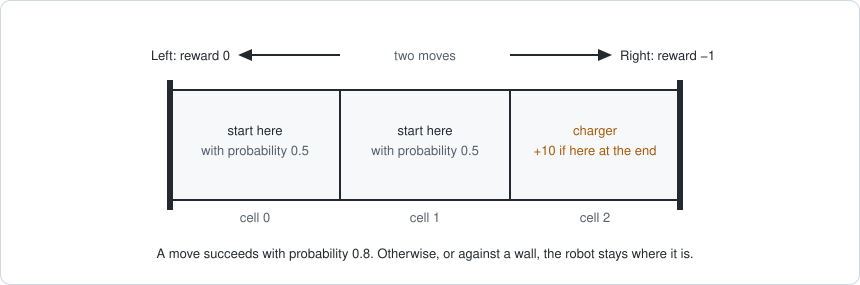

A robot lives on a track of three cells between two walls, and makes **two
moves**.

- **States.** The cell the robot is in: 0, 1 or 2.
- **Actions.** At each move it chooses Left (L) or Right (R).
- **Dynamics.** The track is slippery. A move succeeds with probability 0.8.
  Otherwise, or when it moves against a wall, the robot stays where it is.
- **Rewards.** Moving right costs effort: reward $-1$. Moving left is free:
  reward $0$. After the two moves, the robot gets $+10$ if it is in cell 2,
  where the charger is.
- **Start.** The robot starts in cell 0 or in cell 1, with probability 0.5
  each.
- **Policy.** The robot has no plan: in every cell it flips a coin, Left or
  Right with probability 0.5 each.

The question is how much reward this coin-flipping robot collects on average,
and where its choices and its luck matter. The variables are
$s_0, a_0, s_1, a_1, s_2$, and the terms of the MDP are these tables.

Start, $p(s_0)$:

| cell 0 | cell 1 | cell 2 |
|---|---|---|
| 0.5 | 0.5 | 0 |

Policy, $\pi(a \mid s)$, the same at both moves:

| $s$ | L | R |
|---|---|---|
| any cell | 0.5 | 0.5 |

Dynamics, $p(s' \mid s, a)$, the same at both moves:

| $s$ | $a$ | $s' = 0$ | $s' = 1$ | $s' = 2$ |
|---|---|---|---|---|
| 0 | L | 1 | 0 | 0 |
| 0 | R | 0.2 | 0.8 | 0 |
| 1 | L | 0.8 | 0.2 | 0 |
| 1 | R | 0 | 0.2 | 0.8 |
| 2 | L | 0 | 0.8 | 0.2 |
| 2 | R | 0 | 0 | 1 |

Reward for a move, $r(s, a)$, the same at both moves:

| $s$ | L | R |
|---|---|---|
| any cell | 0 | $-1$ |

Final reward, $r(s_2)$:

| cell 0 | cell 1 | cell 2 |
|---|---|---|
| 0 | 0 | 10 |

### The factor graph

Each table becomes one semiring factor: the probability tables are lifted to
$(p, 0)$ and the reward tables to $(1, r)$. With two moves that is eight
factors on five variables.


The variables are eliminated backward in time, in the order
$s_2, a_1, s_1, a_0, s_0$. Each step below shows the graph after the
elimination. Pairs are written as $(p, v)$, probability and value.

### Step 1: eliminate the last state

The bucket of $s_2$ holds the dynamics $(p(s_2 \mid s_1, a_1), 0)$ and the
final reward $(1, r(s_2))$.

- *Multiply:* $\big(p(s_2 \mid s_1, a_1), r(s_2)\big)$.
- *Marginalize* $s_2$: the new factor is
  $\phi(s_1, a_1) = \big(1, \sum_{s_2} p(s_2 \mid s_1, a_1) r(s_2)\big)$,
  the expected final reward for each cell and action at the second move.

Value of $\phi(s_1, a_1)$:

| $s_1$ | L | R |
|---|---|---|
| 0 | 0 | 0 |
| 1 | 0 | 8 |
| 2 | 2 | 10 |

For example, in cell 1 moving Right, the robot reaches the charger with
probability 0.8 and slips with probability 0.2, so the value is
$0.8 \cdot 10 + 0.2 \cdot 0 = 8$.

- *Condition:* the conditional $c(s_2 \mid s_1, a_1)$ is the dynamics table
  with a surprise for each outcome: the final reward of that outcome minus the
  expected final reward $\phi(s_1, a_1)$ of the row.

The conditional $c(s_2 \mid s_1, a_1)$, each entry a pair (probability,
surprise); a dash marks an outcome that cannot happen:

| $s_1$ | $a_1$ | $s_2 = 0$ | $s_2 = 1$ | $s_2 = 2$ |
|---|---|---|---|---|
| 0 | L | $(1, 0)$ | – | – |
| 0 | R | $(0.2, 0)$ | $(0.8, 0)$ | – |
| 1 | L | $(0.8, 0)$ | $(0.2, 0)$ | – |
| 1 | R | – | $(0.2, -8)$ | $(0.8, +2)$ |
| 2 | L | – | $(0.8, -2)$ | $(0.2, +8)$ |
| 2 | R | – | – | $(1, 0)$ |

The probabilities are the dynamics table, unchanged. Take the row for cell 1
and Right, where $\phi = 8$: reaching the charger has surprise $10 - 8 = +2$,
and slipping has $0 - 8 = -8$. In every row the surprises average to zero, for
example $0.8 \cdot 2 + 0.2 \cdot (-8) = 0$. Rows where the final reward does
not depend on the outcome, such as the first three, have no surprise at all.

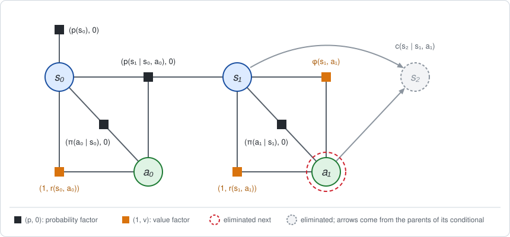

### Step 2: eliminate the last action

The bucket of $a_1$ holds the policy $(\pi(a_1 \mid s_1), 0)$, the reward
$(1, r(s_1, a_1))$ and the new factor $\phi(s_1, a_1)$.

- *Multiply:* the values add, giving the action value
  $Q_1(s, a) = r(s, a) + \phi(s, a)$. Moving right subtracts 1.
- *Marginalize* $a_1$: the state value is the average under the policy,
  $V_1(s) = 0.5 Q_1(s, L) + 0.5 Q_1(s, R)$. The new factor is
  $\phi(s_1) = (1, V_1(s_1))$.
- *Condition:* the conditional $c(a_1 \mid s_1)$ is the policy with the
  advantage $A_1(s, a) = Q_1(s, a) - V_1(s)$.

| $s_1$ | $Q_1(s, L)$ | $Q_1(s, R)$ | $V_1(s)$ | $A_1(s, L)$ | $A_1(s, R)$ |
|---|---|---|---|---|---|
| 0 | 0 | $-1$ | $-0.5$ | $+0.5$ | $-0.5$ |
| 1 | 0 | 7 | 3.5 | $-3.5$ | $+3.5$ |
| 2 | 2 | 9 | 5.5 | $-3.5$ | $+3.5$ |

The advantages already say something about the coin-flip policy. In cells 1
and 2, Right is much better than average. In cell 0, with one move left, Right
is *worse*: it costs 1 and the charger is out of reach.


### Step 3: eliminate the middle state

The bucket of $s_1$ holds the dynamics $(p(s_1 \mid s_0, a_0), 0)$ and
$\phi(s_1) = (1, V_1(s_1))$. This is step 1 again, one move earlier, with
$V_1$ in the role of the final reward.

Value of $\phi(s_0, a_0) = \big(1, \sum_{s_1} p(s_1 \mid s_0, a_0) V_1(s_1)\big)$:

| $s_0$ | L | R |
|---|---|---|
| 0 | $-0.5$ | 2.7 |
| 1 | 0.3 | 5.1 |
| 2 | 3.9 | 5.5 |

For example, in cell 1 moving Right: $0.8 \cdot 5.5 + 0.2 \cdot 3.5 = 5.1$.

The conditional $c(s_1 \mid s_0, a_0)$, as pairs (probability, surprise), where
the surprise is $V_1(s_1) - \phi(s_0, a_0)$:

| $s_0$ | $a_0$ | $s_1 = 0$ | $s_1 = 1$ | $s_1 = 2$ |
|---|---|---|---|---|
| 0 | L | $(1, 0)$ | – | – |
| 0 | R | $(0.2, -3.2)$ | $(0.8, +0.8)$ | – |
| 1 | L | $(0.8, -0.8)$ | $(0.2, +3.2)$ | – |
| 1 | R | – | $(0.2, -1.6)$ | $(0.8, +0.4)$ |
| 2 | L | – | $(0.8, -0.4)$ | $(0.2, +1.6)$ |
| 2 | R | – | – | $(1, 0)$ |

In the row for cell 1 and Right, reaching cell 2 has surprise
$5.5 - 5.1 = +0.4$ and slipping has $3.5 - 5.1 = -1.6$.

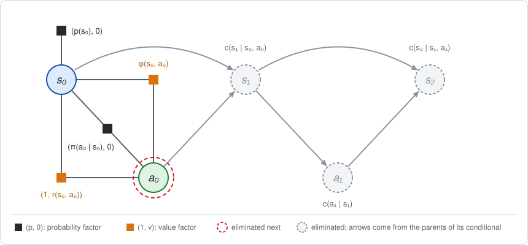

### Step 4: eliminate the first action

The bucket of $a_0$ holds the policy, the reward and $\phi(s_0, a_0)$. This is
step 2 again, one move earlier.

| $s_0$ | $Q_0(s, L)$ | $Q_0(s, R)$ | $V_0(s)$ | $A_0(s, L)$ | $A_0(s, R)$ |
|---|---|---|---|---|---|
| 0 | $-0.5$ | 1.7 | 0.6 | $-1.1$ | $+1.1$ |
| 1 | 0.3 | 4.1 | 2.2 | $-1.9$ | $+1.9$ |
| 2 | 3.9 | 4.5 | 4.2 | $-0.3$ | $+0.3$ |

With two moves left, Right is better than the coin flip in every cell.

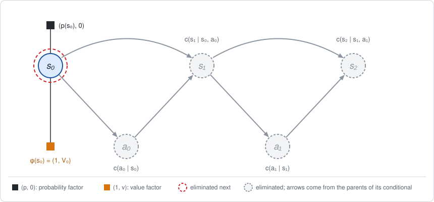

### Step 5: eliminate the first state

The bucket of $s_0$ holds the prior $(p(s_0), 0)$ and
$\phi(s_0) = (1, V_0(s_0))$.

- *Multiply:* $\big(p(s_0), V_0(s_0)\big)$.
- *Marginalize* $s_0$: no variables are left, and the new factor is the
  constant

  $$\big(1,\enspace 0.5 \cdot 0.6 + 0.5 \cdot 2.2 + 0 \cdot 4.2\big) = (1,\enspace 1.4).$$

- *Condition:* $c(s_0)$ is the prior with the surprise $V_0(s_0) - J$:
  $-0.8$ for cell 0 and $+0.8$ for cell 1.


### What the result says

- **The expected return is $J = 1.4$.** The coin-flipping robot collects 1.4 on
  average.
- **The value functions** $Q_1, V_1, Q_0, V_0$ were the values of the new
  factors along the way.
- **The Bayes net** in the last figure holds the dynamics and the policy,
  unchanged, each with its surprise: advantages for the actions and TD
  residuals for the states.

**Explain a trajectory.** Section 4 showed that the surprises along one
trajectory add up to its return relative to the average, $R - J$. Take the
trajectory that starts in cell 1, moves Right and reaches cell 2, then moves
Right again and stays in cell 2. Its return is $R = -1 - 1 + 10 = 8$, which is
$6.6$ above the average.

| Variable | Outcome | Surprise | Meaning |
|---|---|---|---|
| $s_0$ | cell 1 | $V_0(1) - J = 2.2 - 1.4 = +0.8$ | cell 1 is a better start than average |
| $a_0$ | Right | $A_0(1, R) = +1.9$ | Right is better than the coin flip |
| $s_1$ | cell 2 | $5.5 - 5.1 = +0.4$ | the move succeeded: good luck |
| $a_1$ | Right | $A_1(2, R) = +3.5$ | Right keeps the robot at the charger |
| $s_2$ | cell 2 | $10 - 10 = 0$ | no luck involved: Right in cell 2 always stays |
| | | **sum $= +6.6$** | $= R - J = 8 - 1.4$ |

The [companion notebook](chapter01_examples.ipynb) runs these steps one by one,
and Section 10 builds the example in Python. The unit tests check these
numbers, and use a smaller one-decision example as their fixture
(`gtsam/semiring/tests/TwoActionExample.h`).

## 8. Worked example: the continuous case

The same elimination works when the states and actions are real numbers. The
tables become Gaussian densities and quadratic functions, and sums over a
variable become integrals. This example is the classic *linear-quadratic*
problem (LQR): linear dynamics with Gaussian noise, and quadratic costs.

### The problem

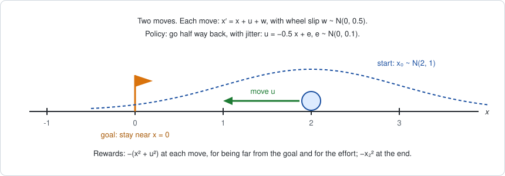

A robot moves along a line and wants to stay near the origin. It makes **two
moves**.

- **State.** Its position $x$, a real number.
- **Action.** How far it moves, $u$, a real number.
- **Dynamics.** $x' = x + u + w$, where $w \sim N(0, 0.5)$ is wheel slip.
- **Rewards.** At each move, $r(x, u) = -(x^2 + u^2)$: a penalty for being far
  from the origin and a penalty for the effort. After the two moves, a final
  penalty $r(x_2) = -x_2^2$.
- **Start.** $x_0 \sim N(2, 1)$.
- **Policy.** Go half way back to the origin, with some jitter:
  $u = -0.5 x + e$, where $e \sim N(0, 0.1)$.

Here $N(\mu, \sigma^2)$ is a Gaussian with mean $\mu$ and variance $\sigma^2$.
The question is the same as before: how much reward does this policy collect on
average, and where do its choices and its luck matter?

The terms of the MDP, which were tables in Section 7, are now formulas:

| Term | Discrete case | Here |
|---|---|---|
| start $p(x_0)$ | a table | the density $N(x_0; 2, 1)$ |
| policy $\pi(u \mid x)$ | a table | the density $N(u; -0.5 x, 0.1)$ |
| dynamics $p(x' \mid x, u)$ | a table | the density $N(x'; x + u, 0.5)$ |
| reward $r(x, u)$ | a table | the quadratic $-(x^2 + u^2)$ |
| final reward $r(x_2)$ | a table | the quadratic $-x_2^2$ |

### The factor graph

The graph is the one of Section 7 with $x$ for the states and $u$ for the
actions. The densities are lifted to $(p, 0)$ and the quadratics to $(1, r)$.

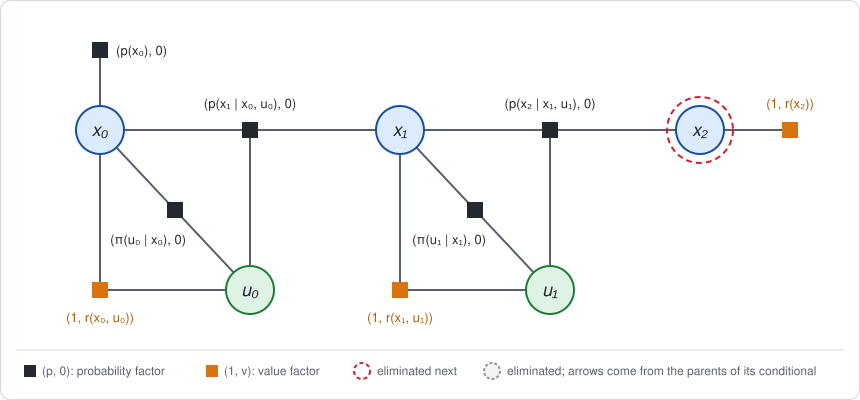

Two facts are all the arithmetic that is needed. If $z$ is Gaussian with mean
$\mu$ and variance $\sigma^2$, then

```math
\int N(z;\, \mu, \sigma^2)\, dz = 1,
\qquad
\mathbb{E}[z^2] = \mu^2 + \sigma^2.
```

The first says a density marginalizes to one, as a row of a probability table
sums to one. The second is how a quadratic value is averaged: the mean is
substituted for the variable, and the variance is added. The variables are
eliminated in the order $x_2, u_1, x_1, u_0, x_0$.

### Step 1: eliminate the last state

The bucket of $x_2$ holds the dynamics $\big(N(x_2; x_1 + u_1, 0.5), 0\big)$
and the final reward $(1, -x_2^2)$.

- *Multiply:* $\big(N(x_2; x_1 + u_1, 0.5), -x_2^2\big)$.
- *Marginalize* $x_2$: the density integrates to one, and the value is averaged
  using $\mathbb{E}[x_2^2] = (x_1 + u_1)^2 + 0.5$:

  $$\phi(x _1, u _1) = \big(1,\enspace -\big((x _1 + u _1)^2 + 0.5\big)\big).$$

  The expected final penalty is the penalty at the position the robot aims
  for, plus 0.5 for the slip.
- *Condition:* the conditional is the dynamics with the TD residual:

  $$c(x _2 \mid x _1, u _1) = \big(N(x _2;\enspace x _1 + u _1,\enspace 0.5),\enspace \enspace -x _2^2 + (x _1 + u _1)^2 + 0.5\big).$$

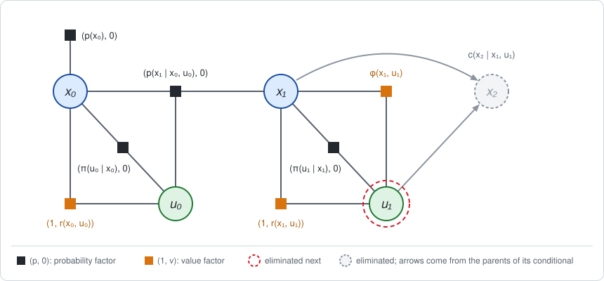

### Step 2: eliminate the last action

The bucket of $u_1$ holds the policy $\big(N(u_1; -0.5 x_1, 0.1), 0\big)$,
the reward $\big(1, -(x_1^2 + u_1^2)\big)$ and $\phi(x_1, u_1)$.

- *Multiply:* the values add, giving the action value

  $$Q _1(x, u) = -\big(x^2 + u^2 + (x + u)^2 + 0.5\big).$$

- *Marginalize* $u_1$: under the policy, $u$ has mean $-0.5 x$ and variance
  0.1, and $x + u$ has mean $0.5 x$ and variance 0.1. So
  $\mathbb{E}[u^2] = 0.25 x^2 + 0.1$ and
  $\mathbb{E}[(x + u)^2] = 0.25 x^2 + 0.1$, and the state value is

  $$V _1(x) = -\big(x^2 + (0.25\thinspace x^2 + 0.1) + (0.25\thinspace x^2 + 0.1) + 0.5\big) = -\big(1.5\thinspace x^2 + 0.7\big).$$

  The new factor is $\phi(x_1) = (1, V_1(x_1))$. The value function is a
  quadratic, as the final reward was: the family is closed under elimination.

- *Condition:* the conditional is the policy with the advantage
  $A_1 = Q_1 - V_1$, which simplifies to

  $$A _1(x, u) = 0.2 - 2\thinspace (u + 0.5\thinspace x)^2.$$

The advantage is largest at $u = -0.5 x$, the policy's own average move, so
at the last move the policy aims at the best action. Its jitter is what costs:
any deviation is penalized, and the $+0.2$ is exactly what makes the average
zero, $0.2 - 2 \cdot 0.1 = 0$.

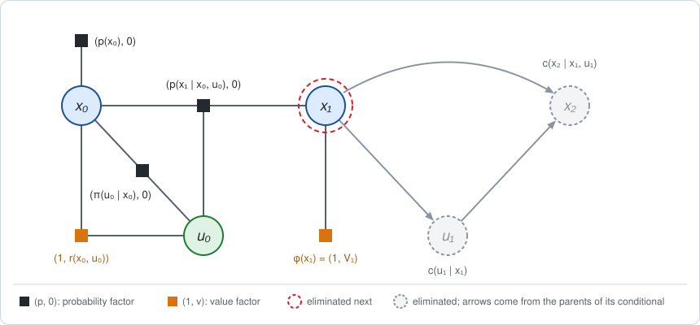

### Step 3: eliminate the middle state

The bucket of $x_1$ holds the dynamics $\big(N(x_1; x_0 + u_0, 0.5), 0\big)$
and $\phi(x_1) = \big(1, -(1.5 x_1^2 + 0.7)\big)$. This is step 1 again, with
$V_1$ in the role of the final reward:

```math
\phi(x_0, u_0) = \Big(1,\; -\big(1.5\,\big((x_0 + u_0)^2 + 0.5\big) + 0.7\big)\Big)
= \Big(1,\; -\big(1.5\,(x_0 + u_0)^2 + 1.45\big)\Big).
```

The conditional $c(x_1 \mid x_0, u_0)$ is the dynamics with the TD residual
$-1.5 x_1^2 + 1.5 (x_0 + u_0)^2 + 0.75$.

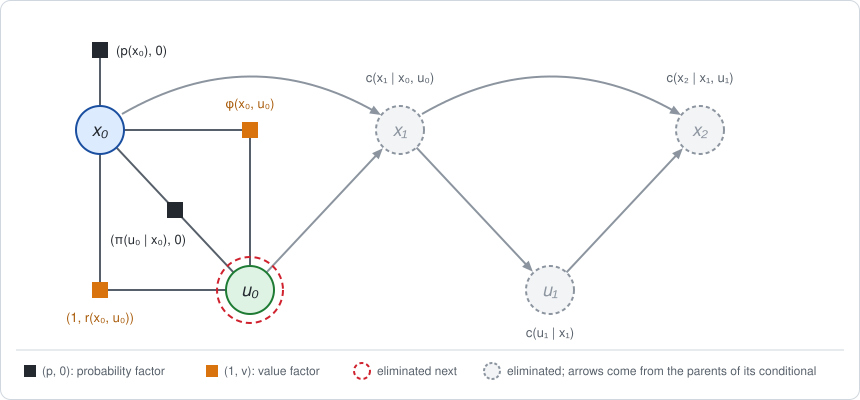

### Step 4: eliminate the first action

The bucket of $u_0$ holds the policy, the reward and $\phi(x_0, u_0)$. This is
step 2 again:

```math
Q_0(x, u) = -\big(x^2 + u^2 + 1.5\,(x + u)^2 + 1.45\big),
\qquad
V_0(x) = -\big(1.625\,x^2 + 1.7\big),
```

```math
A_0(x, u) = 0.25 + 0.025\,x^2 - 2.5\,(u + 0.6\,x)^2.
```

This time the advantage is largest at $u = -0.6 x$, not at the policy's
average move $-0.5 x$. With two moves left, the policy is slightly too timid:
moving a little further back would be better.

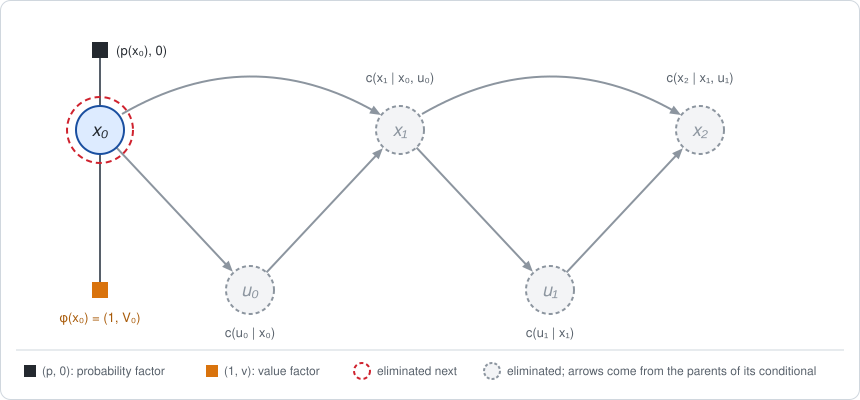

### Step 5: eliminate the first state

The bucket of $x_0$ holds the prior $\big(N(x_0; 2, 1), 0\big)$ and
$\phi(x_0) = (1, V_0(x_0))$. With $\mathbb{E}[x_0^2] = 2^2 + 1 = 5$, the
constant left at the end is

```math
\big(1,\; -(1.625 \cdot 5 + 1.7)\big) = (1,\; -9.825).
```

The conditional $c(x_0)$ is the prior with the surprise
$V_0(x_0) - J = 8.125 - 1.625 x_0^2$.

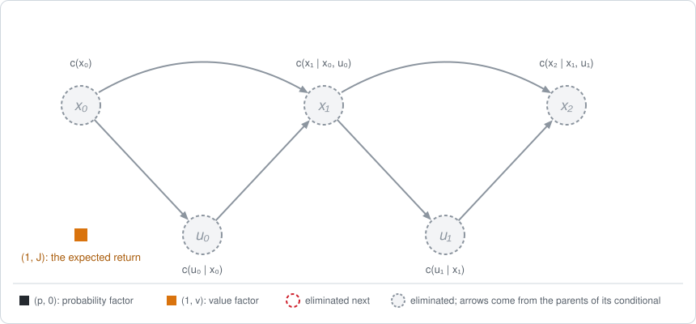

### What the result says

- **The expected return is $J = -9.825$.**
- **The value functions** are quadratics in the position, and the **advantages**
  are quadratics in the move, peaked at the best move.

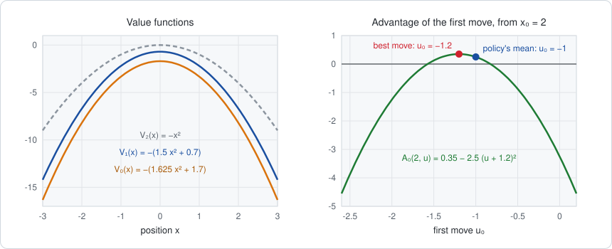

On the left, each value function lies below the next, because more moves, and
so more penalties, remain. On the right is the advantage of the first move
when the robot starts at $x_0 = 2$: the best move is $-1.2$, and the policy's
average move, $-1$, is close to it but not on it.

**Explain a trajectory.** Take the robot that starts at $x_0 = 2$, moves
$u_0 = -1$ and lands on $x_1 = 1$, then moves $u_1 = -0.5$ and lands on
$x_2 = 0.5$. Its return is $R = -(4 + 1) - (1 + 0.25) - 0.25 = -6.5$, which is
$3.325$ above the average.

| Variable | Outcome | Surprise | Meaning |
|---|---|---|---|
| $x_0$ | 2 | $V_0(2) - J = -8.2 + 9.825 = +1.625$ | starting at the mean of $x_0$ is better than the average start |
| $u_0$ | $-1$ | $A_0(2, -1) = +0.25$ | the policy's average move, with no jitter |
| $x_1$ | 1 | $V_1(1) - \phi(2, -1) = -2.2 + 2.95 = +0.75$ | landed exactly where it aimed: no slip |
| $u_1$ | $-0.5$ | $A_1(1, -0.5) = +0.2$ | the best move, with no jitter |
| $x_2$ | 0.5 | $-0.25 + 0.75 = +0.5$ | landed exactly where it aimed: no slip |
| | | **sum $= +3.325$** | $= R - J = -6.5 + 9.825$ |

Every surprise is positive here because nothing random went wrong: the average
return includes the cost of slip and jitter, and this trajectory had none.

The [companion notebook](chapter01_examples.ipynb) runs these steps one by one,
and Section 10 builds the example in Python. The unit tests check these
numbers.

## 9. The two factor families

`SemiringFactor` is the abstract interface with the operations above:
`multiply` ($\otimes$), `sum` ($\oplus$ over variables), `eliminate` (sum and
division together) and `expectation`. `SemiringConditional` is a factor in
conditional form. `EliminateSemiring` uses only this interface, so one
elimination function serves both families.

### Discrete: `SemiringDiscreteFactor`, `SemiringDiscreteConditional`

Two tables over the same discrete variables, $p(x)$ and $p(x) v(x)$, stored as
`DecisionTreeFactor`s. The operators are the formulas of Section 5, applied
entry by entry. Storing the weighted value keeps them exact where $p = 0$; the
value is reported as zero there.

### Gaussian: `SemiringGaussianFactor`, `SemiringGaussianConditional`

For continuous variables the sum is an integral, so the operators act on a
parametric form, in the log domain:

- **Probability channel:** a product of Gaussian factors, kept as a
  `GaussianFactorGraph`.
- **Value channel:** a quadratic $v(z) = \tfrac{1}{2} z^\top G z - g^\top z + \tfrac{1}{2} f$, kept as a `HessianFactor` whose error is the value. It may be
  indefinite and is never factorized.

| Operator | Implementation |
|---|---|
| Product | concatenate the Gaussian factors; add the quadratics |
| Sum over $x$ | `EliminatePreferCholesky` on the Gaussian factors gives $p(x \mid S)$, written $x = K S + k + W e$ with $e$ standard normal. Substituting into $v$ gives a quadratic in $S$, plus the constant $\tfrac{1}{2}\operatorname{tr}(G_{xx} W W^\top)$ from the noise |
| Division | the Gaussian conditional, and the quadratic $v - \bar v$ |

The family is closed: a quadratic value stays quadratic. Every eliminated
variable must appear in a Gaussian factor, since an expectation over it is
otherwise undefined.

## 10. Using the module

The track example of Section 7 in Python:

```python
import numpy as np
from gtsam import DecisionTreeFactor, Ordering
from gtsam import SemiringDiscreteFactor, SemiringFactorGraph
from gtsam.symbol_shorthand import A, S

state = lambda t: (S(t), 3)   # (key, cardinality): cell 0, 1 or 2
action = lambda t: (A(t), 2)  # 0 = Left, 1 = Right


def probability(keys, table):
    """Lift a probability table to (p, 0)."""
    return SemiringDiscreteFactor(
        DecisionTreeFactor(keys, np.ravel(table).tolist()))


def reward(keys, table):
    """Lift a reward table to (1, r)."""
    return SemiringDiscreteFactor.Reward(
        DecisionTreeFactor(keys, np.ravel(table).tolist()))


# The tables of Section 7; the first key varies slowest.
prior = [0.5, 0.5, 0.0]                           # p(s0)
policy = [[0.5, 0.5]] * 3                         # pi(a | s)
dynamics = [[[1.0, 0.0, 0.0], [0.2, 0.8, 0.0]],   # p(s' | s, a)
            [[0.8, 0.2, 0.0], [0.0, 0.2, 0.8]],
            [[0.0, 0.8, 0.2], [0.0, 0.0, 1.0]]]
moveReward = [[0.0, -1.0]] * 3                    # r(s, a)
finalReward = [0.0, 0.0, 10.0]                    # r(s2)

graph = SemiringFactorGraph()
graph.push_back(probability([state(0)], prior))
for t in range(2):
    graph.push_back(probability([state(t), action(t)], policy))
    graph.push_back(
        probability([state(t), action(t), state(t + 1)], dynamics))
    graph.push_back(reward([state(t), action(t)], moveReward))
graph.push_back(reward([state(2)], finalReward))

graph.expectation()  # 1.4, the expected return J

ordering = Ordering()
for key in [S(2), A(1), S(1), A(0), S(0)]:
    ordering.push_back(key)
bayesNet = graph.eliminateSequential(ordering)

firstAction = bayesNet.at(3)   # the conditional c(a0 | s0)
firstAction.probability()      # the policy, 0.5 everywhere
firstAction.surprise()         # the advantage A0: -1.1 / +1.1 in cell 0, ...
```

A Bellman backup by hand, with the factor interface:

```python
# Q(s, a): sum out the next state from dynamics, reward and next value.
actionValue = (dynamics * reward * nextValue).sum(orderingOfNextState)

# V(s) and the advantage: eliminate the action against the policy.
conditional, value = (policy * actionValue).eliminate(orderingOfAction)
```

The line example of Section 8 in Python. A `JacobianFactor` holds a linear
relation with Gaussian noise and is lifted to $(p, 0)$ with
`SemiringGaussianFactor(factor)`. A quadratic is given as a `HessianFactor`,
whose error is $\tfrac{1}{2} x^\top G x - g^\top x + \tfrac{1}{2} f$, and is
lifted with `SemiringGaussianFactor.Cost(factor)`, whose value is minus that
error, or `.Reward(factor)`, whose value is that error.

```python
import numpy as np
from gtsam import HessianFactor, JacobianFactor, Ordering, VectorValues
from gtsam import SemiringFactorGraph, SemiringGaussianFactor, noiseModel
from gtsam.symbol_shorthand import U, X

I = np.eye(1)
zero = np.zeros(1)


def variance(v):
    """A scalar Gaussian noise model with the given variance."""
    return noiseModel.Isotropic.Variance(1, v)


def gaussian(*args):
    """Lift a Gaussian factor to (p, 0)."""
    return SemiringGaussianFactor(JacobianFactor(*args))


def penalty(key):
    """Lift the penalty z^2 on one variable to the reward (1, -z^2)."""
    return SemiringGaussianFactor.Cost(HessianFactor(key, 2 * I, zero, 0.0))


graph = SemiringFactorGraph()
# Start: x0 = 2 + noise of variance 1.
graph.push_back(gaussian(X(0), I, np.array([2.0]), variance(1.0)))
for t in range(2):
    # Policy: u + 0.5 x = e, with e of variance 0.1.
    graph.push_back(gaussian(U(t), I, X(t), 0.5 * I, zero, variance(0.1)))
    # Dynamics: x' - x - u = w, with w of variance 0.5.
    graph.push_back(
        gaussian(X(t + 1), I, X(t), -I, U(t), -I, zero, variance(0.5)))
    graph.push_back(penalty(X(t)))  # -x^2
    graph.push_back(penalty(U(t)))  # -u^2
graph.push_back(penalty(X(2)))      # -x2^2

graph.expectation()  # -9.825, the expected return J

ordering = Ordering()
for key in [X(2), U(1), X(1), U(0), X(0)]:
    ordering.push_back(key)
bayesNet = graph.eliminateSequential(ordering)

firstMove = bayesNet.at(3)   # the conditional c(u0 | x0)
firstMove.conditional()      # the policy, a GaussianConditional
firstMove.surprise()         # the advantage A0, a quadratic (HessianFactor)

values = VectorValues()
values.insert(X(0), np.array([2.0]))
values.insert(U(0), np.array([-1.0]))
firstMove.surprise(values)   # A0(2, -1) = 0.25
```

Complete examples are in the tests:

- `gtsam/semiring/tests/testSemiringFactorGraph.cpp`: a 3-state MDP checked against
  enumeration of all trajectories, and scalar LQR checked against the Lyapunov
  recursion.
- `python/gtsam/tests/test_SemiringFactorGraph.py`: the track example of
  Section 7 with every table checked, the line example of Section 8 with every
  formula checked, the same MDP and LQR checks in Python,
  hand-written Bellman backups and greedy backward induction.

## 11. References

- J. Eisner, "Parameter estimation for probabilistic finite-state transducers",
  ACL 2002. Introduces the expectation semiring.
- Z. Li and J. Eisner, "First- and second-order expectation semirings with
  applications to minimum-risk training on translation forests", EMNLP 2009.
  The second-order semiring also yields gradients.
- S. Aji and R. McEliece, "The generalized distributive law", IEEE Transactions
  on Information Theory, 2000. Elimination over arbitrary semirings.
- M. Pouly and J. Kohlas, *Generic Inference: A Unifying Theory for Automated
  Reasoning*, Wiley, 2011. Valuation algebras, including division.
- H. J. Kappen, V. Gómez and M. Opper, "Optimal control as a graphical model
  inference problem", Machine Learning 87(2), 2012. Rewards as factors of a
  graphical model, with control computed by inference on it.
- S. Levine, "Reinforcement learning and control as probabilistic inference:
  tutorial and review", arXiv:1805.00909, 2018. The same formulation in RL
  terms, including its optimism under stochastic dynamics.

---

Next: [Chapter 2: Finding the best policy in one pass](chapter02.md).
