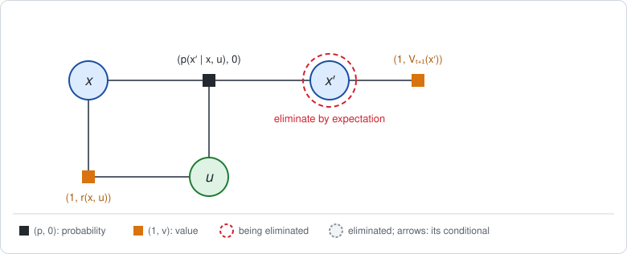
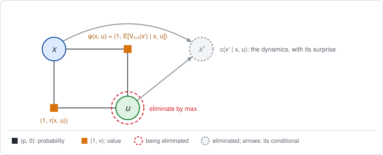
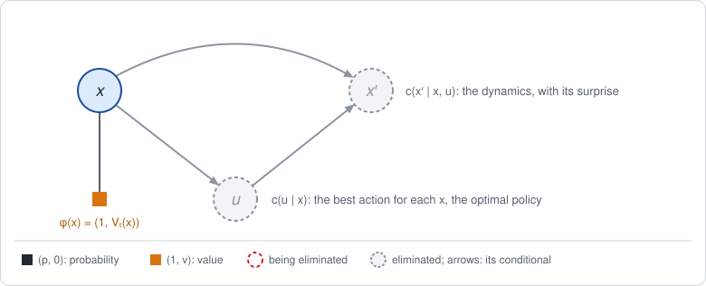

# Chapter 2: Finding the best policy in one pass

[Chapter 1](chapter01.md) *evaluated* a policy: $\pi$ was given, as a factor in
the graph, and elimination computed how good it is. In optimal control and in
RL the policy is the unknown: the goal is to **find** the policy with the
highest expected return $J$.

In general this takes two stages: an inner elimination that evaluates a
candidate policy, inside an outer loop that improves it. That general
framework is the subject of the following chapters. This chapter is a teaser
for it. In two classic cases a single backward pass is enough:

- **tabular** MDPs, where states and actions are discrete, and
- **LQR**, where the dynamics are linear-Gaussian and the rewards quadratic.

In both, the best policy comes out of elimination itself, by one change: at
the action variables, replace the expectation under $\pi$ by a **maximum**.
For LQR the result is, line by line, the Riccati recursion of classic control.

The notation, the factor pairs $(p, v)$ and the two examples (the robot on a
track and the robot on a line) are those of Chapter 1.

**Run the examples.** The code of this chapter's examples is in the companion
notebook [chapter02_examples.ipynb](chapter02_examples.ipynb), which runs
online:
[](https://colab.research.google.com/github/thduynguyen/gtsam/blob/feature/semiringfactor/gtsam/semiring/doc/chapter02_examples.ipynb)

Contents:

1. [The change: maximize over the action](#1-the-change-maximize-over-the-action)
2. [Tabular case: the Bellman optimality equation](#2-tabular-case-the-bellman-optimality-equation)
3. [LQR: the Riccati recursion](#3-lqr-the-riccati-recursion)
4. [Beyond one pass: two stages](#4-beyond-one-pass-two-stages)
5. [With the current module](#5-with-the-current-module)
6. [References](#6-references)

## 1. The change: maximize over the action

Leave the policy factors out of the graph. One time step then has the
dynamics, the reward, and the value of the future. The figures use $x$ for the
state and $u$ for the action; read them as $s$ and $a$ for the tabular case.



The next state is eliminated exactly as before, by expectation, because the
agent does not choose where the dynamics take it:



The bucket of the action now holds only the reward and $\phi(x, u)$.
Multiplying them adds their values, as before, and gives the action value
$Q_t(x, u)$. The difference is in the next step. The agent *does* choose the
action, so the action is not averaged out: the best one is taken.

| Step for an action variable | Evaluating a policy (Chapter 1) | Finding the best policy |
|---|---|---|
| bucket | policy, reward, $\phi(x, u)$ | reward, $\phi(x, u)$ |
| multiply | $\big(\pi(u \mid x), Q_t(x, u)\big)$ | $\big(1, Q_t(x, u)\big)$ |
| new factor on $x$ | $\big(1, \sum_u \pi(u \mid x) Q_t(x, u)\big)$: the average | $\big(1, \max_u Q_t(x, u)\big)$: the best |
| conditional on $u$ | the given policy, with the advantage $Q_t - V_t$ | the best action for each $x$, $u^\ast (x) = \arg\max_u Q_t(x, u)$: the **optimal policy** |



So the policy is no longer an input. It is an *output*: the conditional that
elimination leaves on each action variable.

Taking a maximum where a sum would be is the rule GTSAM already uses to find a
most probable assignment, called max-product (max-sum in the log domain). Here
it is applied to the value channel, and only at the action variables. The
state variables keep the expectation.

**The order now matters.** A maximum and an expectation cannot be swapped:

```math
\max_u\; \mathbb{E}_{x'}\big[\,\cdot\,\big] \;\le\; \mathbb{E}_{x'}\big[\max_u\; \cdot\,\big].
```

The left side is an agent that picks its action *before* knowing where the
dynamics will take it, which is the real situation. The right side is an agent
that picks after seeing the outcome. To get the left side, each next state
must be eliminated before the action that leads to it, and each action before
the state it is chosen in: the backward order
$x_T, u_{T-1}, x_{T-1}, \dots, u_0, x_0$. For policy evaluation any order was
valid; here it is not.

## 2. Tabular case: the Bellman optimality equation

With tables, the maximum is taken entry by entry, one row per state:

```math
Q^*_t(s, a) = r(s, a) + \sum_{s'} p(s' \mid s, a)\, V^*_{t+1}(s'),
\qquad
V^*_t(s) = \max_a Q^*_t(s, a),
\qquad
\pi^*_t(s) = \arg\max_a Q^*_t(s, a).
```

The stars mark the values of the best policy. Compared with Chapter 1, the
only change is $\max_a$ in place of $\sum_a \pi(a \mid s)$. This is the
*Bellman optimality equation*, and applying it backward in time is called
dynamic programming, or value iteration.

| Elimination on the factor graph | Dynamic programming |
|---|---|
| value factor on the last state, $(1, r(s_T))$ | start: $V^\ast_T(s) = r(s)$ |
| eliminate $s_{t+1}$ by expectation | average over the next state, $\sum_{s'} p(s' \mid s, a) V^\ast_{t+1}(s')$ |
| multiply with the reward factor: values add | action value $Q^\ast_t(s, a)$ |
| eliminate $a_t$ by max: new factor on $s_t$ | $V^\ast_t(s) = \max_a Q^\ast_t(s, a)$ |
| conditional on $a_t$ | the best action in each state, $\pi^\ast_t(s)$ |
| eliminate $s_0$ by expectation: the constant | the best expected return $J^\ast$ |

*On the track of Chapter 1, Section 7.* The first step is unchanged, since the last state
is eliminated by expectation either way. The tables are then:

| cell | $Q^\ast_1(s, L)$ | $Q^\ast_1(s, R)$ | $V^\ast_1(s)$ | best last move |
|---|---|---|---|---|
| 0 | 0 | $-1$ | 0 | Left |
| 1 | 0 | 7 | 7 | Right |
| 2 | 2 | 9 | 9 | Right |

| cell | $Q^\ast_0(s, L)$ | $Q^\ast_0(s, R)$ | $V^\ast_0(s)$ | best first move |
|---|---|---|---|---|
| 0 | 0 | 4.6 | 4.6 | Right |
| 1 | 1.4 | 7.6 | 7.6 | Right |
| 2 | 7.4 | 8 | 8 | Right |

The best policy moves Right, except in cell 0 with one move left, where the
charger is out of reach and moving is wasted effort. This is what the
advantages of the coin-flip policy already hinted at in Chapter 1. Its expected
return is $J^\ast = 0.5 \cdot 4.6 + 0.5 \cdot 7.6 = 6.1$, against 1.4 for the coin
flip.

## 3. LQR: the Riccati recursion

For LQR the same pass can be carried out in symbols, and it produces the
classic *Riccati recursion* of optimal control, line by line.

**The problem, with matrices.** States and actions are vectors:

```math
x_{t+1} = F\, x_t + B\, u_t + w_t, \quad w_t \sim N(0, \Sigma_w),
\qquad
r(x, u) = -\big(x^\top C_x\, x + u^\top C_u\, u\big),
\qquad
r(x_T) = -x_T^\top C_T\, x_T.
```

The control literature writes these matrices $A$, $B$, $Q$, $R$. Here they are
$F$, $B$, $C_x$, $C_u$, because $A$, $Q$ and $R$ already stand for the
advantage, the action value and the return.

**Starting point.** The future has left a value factor on $x' = x_{t+1}$ whose
value is a quadratic:

```math
\big(1,\; V_{t+1}(x')\big), \qquad
V_{t+1}(x') = -\big(x'^\top P_{t+1}\, x' + \beta_{t+1}\big).
```

At the last step this is the final reward, so $P_T = C_T$ and $\beta_T = 0$.

**Eliminate the next state, by expectation.** The bucket holds the dynamics
$\big(N(x'; F x + B u, \Sigma_w), 0\big)$ and the factor above. Averaging
a quadratic under a Gaussian substitutes the mean and adds a trace term for
the covariance, the vector form of $\mathbb{E}[z^2] = \mu^2 + \sigma^2$:

```math
\phi(x, u) = \Big(1,\; -\big((F x + B u)^\top P_{t+1}\, (F x + B u)
+ \operatorname{tr}(P_{t+1} \Sigma_w) + \beta_{t+1}\big)\Big).
```

**Multiply with the reward.** Values add, giving the action value. Collecting
the terms in $u$ and $x$:

```math
Q_t(x, u) = -\Big(u^\top H_{uu}\, u + 2\, u^\top H_{ux}\, x + x^\top H_{xx}\, x
+ \operatorname{tr}(P_{t+1} \Sigma_w) + \beta_{t+1}\Big),
```

```math
H_{uu} = C_u + B^\top P_{t+1} B, \qquad
H_{ux} = B^\top P_{t+1} F, \qquad
H_{xx} = C_x + F^\top P_{t+1} F.
```

**Eliminate the action, by max.** $Q_t$ is a downward parabola in $u$, so its
maximum is where its derivative in $u$ vanishes:

```math
H_{uu}\, u + H_{ux}\, x = 0
\quad\Longrightarrow\quad
u^* = -K_t\, x, \qquad
K_t = H_{uu}^{-1} H_{ux}
= \big(C_u + B^\top P_{t+1} B\big)^{-1} B^\top P_{t+1} F.
```

This is the conditional on $u$: the optimal policy, a linear feedback law with
gain $K_t$. Substituting $u^\ast$ back gives the new factor on $x$:

```math
\phi(x) = \big(1,\; V_t(x)\big), \qquad
V_t(x) = -\big(x^\top P_t\, x + \beta_t\big),
```

```math
P_t = C_x + F^\top P_{t+1} F
- F^\top P_{t+1} B\, \big(C_u + B^\top P_{t+1} B\big)^{-1} B^\top P_{t+1} F,
\qquad
\beta_t = \beta_{t+1} + \operatorname{tr}(P_{t+1} \Sigma_w).
```

The formula for $P_t$ is the **Riccati equation**. The new factor has the same
form as the starting point, so the two eliminations repeat back to $t = 0$.

**Eliminate the first state, by expectation.** With a prior
$x_0 \sim N(\mu_0, \Sigma_0)$, the constant left at the end is the best
expected return:

```math
J^* = -\big(\mu_0^\top P_0\, \mu_0 + \operatorname{tr}(P_0 \Sigma_0) + \beta_0\big).
```

**The correspondence.**

| Elimination on the factor graph | Riccati recursion |
|---|---|
| value factor on the last state, $(1, -x_T^\top C_T x_T)$ | terminal condition $P_T = C_T$ |
| eliminate $x_{t+1}$ by expectation: substitute its mean $F x + B u$ | propagate $P_{t+1}$ through the dynamics, $(F x + B u)^\top P_{t+1} (F x + B u)$ |
| the trace term of that expectation | the cost of the noise, $\beta_t = \beta_{t+1} + \operatorname{tr}(P_{t+1} \Sigma_w)$; zero for deterministic dynamics |
| multiply with the reward factor: values add | add the stage cost: the blocks $H_{uu}$, $H_{ux}$, $H_{xx}$ |
| eliminate $u_t$ by max: solve $H_{uu} u = -H_{ux} x$ | the gain $K_t = (C_u + B^\top P_{t+1} B)^{-1} B^\top P_{t+1} F$ |
| conditional on $u_t$ | the control law $u_t = -K_t x_t$ |
| new factor on $x_t$ | the Riccati equation for $P_t$ |
| eliminate $x_0$ by expectation: the constant | the optimal cost, $-J^\ast$ |

Three remarks.

- **The max step is ordinary Gaussian elimination.** Maximizing a quadratic
  over $u$ and keeping what is left on $x$ is what GTSAM does to every variable
  of a least-squares problem. $K_t$ is the coefficient of the conditional, as
  in back-substitution, and $P_t = H_{xx} - H_{xu} H_{uu}^{-1} H_{ux}$ is the
  Schur complement that Cholesky leaves on the separator. A SLAM reader has
  been computing Riccati steps all along. It requires $H_{uu}$ to be positive
  definite, which holds when effort is penalized.
- **Noise does not change the policy.** $\Sigma_w$ appears only in $\beta_t$,
  never in $K_t$ or $P_t$. The best action is the same as for deterministic
  dynamics; noise only lowers the return. This is called certainty
  equivalence.
- **The conditional still carries a surprise.** Its value channel is
  $Q_t(x, u) - V_t(x) = -(u + K_t x)^\top H_{uu} (u + K_t x)$: zero at the best
  action and negative everywhere else.

*On the line of Chapter 1, Section 8,* where $F = B = C_x = C_u = C_T = 1$ and
$\Sigma_w = 0.5$:

| step | gain | $P_t$ | $\beta_t$ | $V_t(x)$ |
|---|---|---|---|---|
| 2 | | 1 | 0 | $-x^2$ |
| 1 | $K_1 = \frac{1}{1 + 1} = 0.5$ | $1 + 1 - \frac{1}{2} = 1.5$ | 0.5 | $-(1.5 x^2 + 0.5)$ |
| 0 | $K_0 = \frac{1.5}{1 + 1.5} = 0.6$ | $1 + 1.5 - \frac{1.5^2}{2.5} = 1.6$ | 1.25 | $-(1.6 x^2 + 1.25)$ |

So the best policy is $u_1 = -0.5 x_1$ and $u_0 = -0.6 x_0$, the two moves
that the advantages of Chapter 1 pointed to. With $x_0 \sim N(2, 1)$,
$J^\ast = -(1.6 \cdot 5 + 1.25) = -9.25$, against $-9.825$ for the policy of
Chapter 1.

<details>
<summary><span style="color: gray;">How is a policy represented in LQR? Is it always a Gaussian?</span></summary>

In classical control, an LQR policy is **deterministic**: a linear feedback
law $u = -K x$, with one gain $K_t$ per step for a finite number of moves.
The optimal policy derived above has this form.

RL usually makes the policy **stochastic** by adding Gaussian noise to the same
linear law,

$$\pi(u \mid x) = N(u;\thickspace -K x,\thickspace \Sigma),$$

a *linear-Gaussian* policy. The noise makes the robot try moves other than its
average one, which is how RL explores, and it makes $\pi(u \mid x)$ a proper
density. This is the form evaluated in Chapter 1, with $K = 0.5$ and
$\Sigma = 0.1$.

The deterministic policy is the limit $\Sigma \to 0$. It is not a density, but
it can still be a factor: the hard constraint $u + K x = 0$, a `JacobianFactor`
with a constrained noise model. Elimination then substitutes $u = -K x$
exactly.

For the line example the three returns line up as follows: $-9.825$ for
$K = 0.5$ with jitter, $-9.375$ for $K = 0.5$ without jitter, and $-9.25$ for
the optimal gains. Noise in the policy only costs reward, so the best
$\Sigma$ is zero.

</details>

## 4. Beyond one pass: two stages

The single pass works because in these two cases the maximum over an action
can be taken exactly: by comparing table entries, or by solving a linear
equation. It also relies on the policy being free to choose a separate best
action for every state and step.

When the policy is a parametric function with shared parameters $\theta$, for
example one gain $K$ used at every step, or a neural network, neither holds.
$\theta$ cannot simply be added to the graph as one more variable to eliminate:
a policy factor $N(u; -K x, \Sigma)$ with $K$ unknown multiplies two
unknowns, $K$ and $x$, so the graph is no longer linear-Gaussian. The
computation then splits into two stages:

- **inside**, elimination on the semiring factor graph evaluates the current
  policy, as in Chapter 1, giving $J(\theta)$, the value functions and the
  advantages;
- **outside**, an optimizer uses those to change $\theta$ and increase $J$.

This mirrors GTSAM's nonlinear optimization: an outer iteration around an
inner elimination. The one-pass method of this chapter is the special case in
which the outer stage can be solved exactly, variable by variable, during the
elimination itself.

The following chapters develop this framework:

- first for **optimal control with known dynamics**, deriving the generic two
  stages on semiring factor graphs and mapping the algorithms of control to
  optimization on the graph;
- then for **reinforcement learning**, where the dynamics are unknown or only
  available through a simulator, mapping RL algorithms to the same two stages
  with the exact sums and integrals replaced by sample approximations.

## 5. With the current module

The module does not yet have an elimination function that maximizes over
action variables. One pass can still be written with the factor interface,
using the fact that the expectation under a deterministic policy *is* the
substitution of its action: read $Q_t$ from the bucket, pick the best action,
lift it as a deterministic policy factor, and eliminate as usual.

For the line example:

```python
import numpy as np
from gtsam import HessianFactor, JacobianFactor, Ordering, noiseModel
from gtsam import SemiringGaussianFactor
from gtsam.symbol_shorthand import U, X

I = np.eye(1)
zero = np.zeros(1)


def variance(v):
    """A scalar Gaussian noise model with the given variance."""
    return noiseModel.Isotropic.Variance(1, v)


def gaussian(*args):
    """Lift a Gaussian factor to (p, 0)."""
    return SemiringGaussianFactor(JacobianFactor(*args))


def penalty(key):
    """Lift the penalty z^2 on one variable to the reward (1, -z^2)."""
    return SemiringGaussianFactor.Cost(HessianFactor(key, 2 * I, zero, 0.0))


def ordering(key):
    """An ordering holding one key."""
    result = Ordering()
    result.push_back(key)
    return result


gains = {}
value = penalty(X(2))  # (1, V2)
for t in reversed(range(2)):
    # Eliminate the next state by expectation.
    dynamics = gaussian(X(t + 1), I, X(t), -I, U(t), -I, zero, variance(0.5))
    phi = dynamics.multiply(value).sum(ordering(X(t + 1)))

    # Multiply with the rewards: values add, giving (1, Q_t).
    bucket = penalty(X(t)).multiply(penalty(U(t))).multiply(phi)

    # Maximize over u: solve H_uu u = -H_ux x for the gain.
    Q = bucket.value()  # a quadratic on u and x
    keys, H = list(Q.keys()), Q.information()
    u, x = keys.index(U(t)), keys.index(X(t))
    gains[t] = H[u, x] / H[u, u]  # 0.5 at t = 1, 0.6 at t = 0

    # The best policy u = -K x as a factor, then eliminate u.
    best = gaussian(U(t), I, X(t), gains[t] * I, zero,
                    noiseModel.Constrained.All(1))
    value = best.multiply(bucket).sum(ordering(U(t)))  # (1, V_t)

# Eliminate the first state by expectation: the best expected return.
prior = gaussian(X(0), I, np.array([2.0]), variance(1.0))
prior.multiply(value).expectation()  # -9.25
```

The tabular case is the same with a one-hot policy table for the best action
in each state. Both are checked by the tests `test_best_policy` and
`test_best_policy_is_riccati` in
`python/gtsam/tests/test_SemiringFactorGraph.py`.

## 6. References

- R. Bellman, *Dynamic Programming*, Princeton University Press, 1957. The
  optimality equation and backward induction.
- D. P. Bertsekas, *Dynamic Programming and Optimal Control*, Athena
  Scientific. The Riccati recursion for linear-quadratic problems, and
  certainty equivalence.
- R. S. Sutton and A. G. Barto, *Reinforcement Learning: An Introduction*, 2nd
  edition, MIT Press, 2018. Value iteration and policy improvement in the
  tabular case.

---

Previous: [Chapter 1: MDPs as factor graphs: evaluating a policy by variable elimination](chapter01.md).
