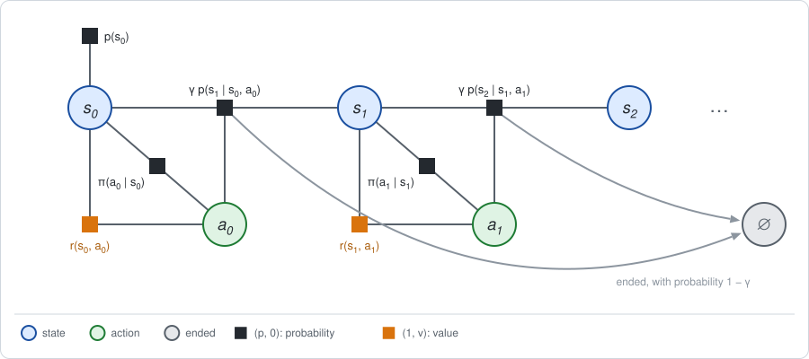
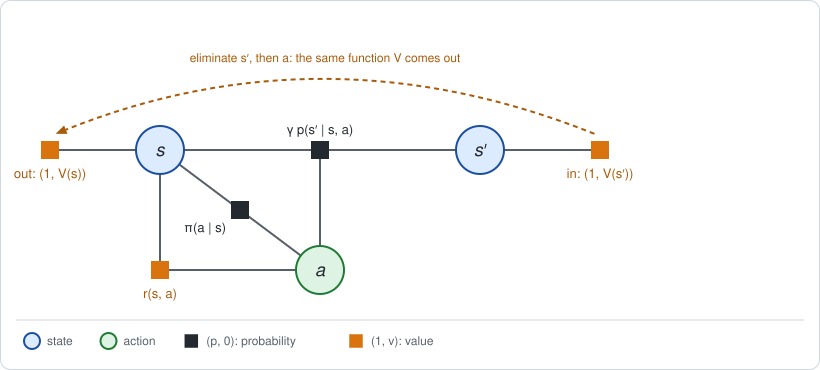

# Chapter 3: Infinite horizon and discounting

:::{div}
:class: in-progress
**This book is a work in progress.** It is still being written and revised: its content is incomplete and may contain errors.
:::

The examples of [Chapter 1](chapter01.md) had two moves. Most problems in
control and RL have no fixed number of moves: a robot balances, walks or
drives for as long as it is switched on. This chapter extends the factor graph
of Chapter 1 to that case.

The short version:

- **A discount is a termination factor.** The standard device for endless
  problems is a *discount* $\gamma < 1$ that shrinks later rewards. It is the
  same as saying that after every move the episode continues with probability
  $\gamma$ and ends otherwise. That is one more outcome in the dynamics
  factor, and nothing else in the graph changes.
- **The graph is a chain of identical steps.** The policy and the factors are
  the same at every step, so the value factor that elimination passes backward
  is the same function at every step.
- **That function is a fixed point.** It satisfies one linear equation, the
  *Bellman equation*, which can be solved directly or by eliminating a longer
  and longer chain.

**Run the examples.** The code of this chapter's examples is in the companion
notebook [chapter03_examples.ipynb](chapter03_examples.ipynb), which runs
online:
[](https://colab.research.google.com/github/thduynguyen/gtsam/blob/feature/semiringfactor/gtsam/semiring/doc/chapter03_examples.ipynb)

## 1. The problem: a chain without an end

**The example: the endless track.** Take the track of Chapter 1, Section 7,
with its three cells and its slippery moves, and let the robot keep moving.

- **States, actions, dynamics, start, policy.** As in Chapter 1: cells 0, 1
  and 2; Left or Right; a move succeeds with probability 0.8; the robot starts
  in cell 0 or 1; it flips a coin at every move.
- **Rewards.** Moving Right costs 1 and moving Left is free, as before. The
  charger in cell 2 now pays at every step: 2 for each step the robot spends
  in cell 2. There is no final reward.

Reward for a move, $r(s, a)$:

| $s$ | L | R |
|---|---|---|
| cell 0 | $0$ | $-1$ |
| cell 1 | $0$ | $-1$ |
| cell 2 | $2$ | $1$ |

**The difficulty.** With $T$ moves the return is $R = \sum_{t=0}^{T-1} r(s_t, a_t)$.
With infinitely many moves this sum has infinitely many terms and in general
does not converge: a robot that sits at the charger forever collects an
infinite reward, and so does one that sits there half of the time. All
policies that reach the charger now and then would tie at infinity.

**The standard remedy** is to weight the reward at step $t$ by $\gamma^t$, for
a *discount* $\gamma$ between 0 and 1:

$$R(\tau) = \sum_{t=0}^{\infty} \gamma^t\, r(s_t, a_t),
\qquad J = \mathbb{E}[R].$$

If no reward exceeds $r_{\max}$ in size, the sum is finite, because it is
bounded by a geometric series:

$$|R(\tau)| \le \sum_{t=0}^{\infty} \gamma^t\, r_{\max} = \frac{r_{\max}}{1 - \gamma}.$$

The example uses $\gamma = 0.9$, so no return exceeds $2 / 0.1 = 20$.

Stated this way the discount looks like a trick applied to the rewards. The
next section gives it a meaning on the graph.

## 2. The discount is a termination factor

**The claim.** Leave the rewards alone, and instead let the episode end at
random: after every move it **continues with probability $\gamma$** and ends
with probability $1 - \gamma$. Once ended, nothing more is collected. The
expected *undiscounted* return of this process is the discounted return above.

**Why.** The robot is still running at step $t$ only if the episode continued
$t$ times in a row, which has probability $\gamma^t$. The reward of step $t$
is collected only if the robot is still running. Since the coin that ends the
episode does not depend on anything else,

$$\mathbb{E}\Big[\sum_{t=0}^{\infty} \mathbf{1}[\text{running at } t]\; r(s_t, a_t)\Big]
= \sum_{t=0}^{\infty} \underbrace{P(\text{running at } t)}_{\gamma^t}\;
\mathbb{E}[r(s_t, a_t)]
= \mathbb{E}\Big[\sum_{t=0}^{\infty} \gamma^t\, r(s_t, a_t)\Big].$$

**On the graph.** Ending is one more outcome of each move. Add one state,
*ended*, written $\varnothing$, and change the dynamics factor so that every
move leads there with probability $1 - \gamma$:

$$\begin{aligned}
p_\gamma(s' \mid s, a) &= \gamma\, p(s' \mid s, a)
  && \text{continue to cell } s' \\
p_\gamma(\varnothing \mid s, a) &= 1 - \gamma
  && \text{end} \\
p_\gamma(\varnothing \mid \varnothing, a) &= 1
  && \text{once ended, stay ended} \\
r(\varnothing, a) &= 0
  && \text{and collect nothing.}
\end{aligned}$$



This is an ordinary MDP on four states, and each row of $p_\gamma$ still sums
to one. Everything in Chapter 1 applies to it without change. In particular
its factor graph is a `SemiringFactorGraph` with no discount anywhere, and
`graph.expectation()` returns the discounted return; the notebook checks this.

**The Bellman backup, discounted.** Eliminate the next state $s'$ from the
bucket holding the dynamics $(p_\gamma, 0)$ and the future value $(1, V(s'))$,
as in Chapter 1, Section 4. The outcomes of $s'$ are now the three cells and
$\varnothing$, whose value is zero:

$$\phi(s, a) = \Big(\underbrace{\sum_{s'} \gamma\, p(s' \mid s, a) + (1 - \gamma)}_{1},\;\;
\sum_{s'} \gamma\, p(s' \mid s, a)\, V(s') + (1 - \gamma) \cdot 0\Big)
= \Big(1,\;\; \gamma \sum_{s'} p(s' \mid s, a)\, V(s')\Big).$$

Multiplying with the reward adds the values, and gives the action value. The
only change from Chapter 1 is the factor $\gamma$ in front of the future:

$$Q(s, a) = r(s, a) + \gamma \sum_{s'} p(s' \mid s, a)\, V(s'),
\qquad
V(s) = \sum_a \pi(a \mid s)\, Q(s, a).$$

:::{dropdown} Why not simply let the dynamics factor sum to γ, without the extra state?
It is tempting to drop the outcome $\varnothing$ and use the dynamics factor
$(\gamma\, p(s' \mid s, a),\; 0)$, which sums to $\gamma$ over $s'$. This gives
the wrong answer, and the reason shows what the pair $(p, v)$ means.

A pair $(p, v)$ says: *this outcome has probability $p$, and on it the value
is $v$*. Summing out $s'$ without the outcome $\varnothing$ gives the pair

$$\phi(s, a) = \Big(\gamma,\;\; \sum_{s'} p(s' \mid s, a)\, V(s')\Big),$$

which says: with probability $\gamma$ the episode continues, and *given that
it continues* the future is worth $\mathbb{E}[V \mid s, a]$. Nothing is said
about the other $1 - \gamma$. Elimination would go on to compute the value
conditional on the episode never ending, which is the undiscounted return.

The missing outcome has to be stated: with probability $1 - \gamma$ the future
is worth $0$. Merging the two outcomes is the semiring sum of Chapter 1,

$$\big(\gamma,\; \mathbb{E}[V \mid s, a]\big) \oplus \big(1 - \gamma,\; 0\big)
= \big(1,\;\; \gamma\, \mathbb{E}[V \mid s, a]\big).$$
:::

:::{dropdown} What about scaling the reward at step t by γ^t?
Chapter 1 listed the discount as "scale the reward factor at step $t$ by
$\gamma^t$". That gives the same expected return, by the formula at the top of
this section, and it is the simplest thing to do on a chain of fixed length.

The termination view is used here because it keeps every step of the chain
*identical*: the same dynamics, policy and reward factors at every step. With
scaled rewards the factors differ from step to step. The next two sections
depend on the steps being identical.
:::

:::{dropdown} Episodes that end by themselves
Some problems have states where the task is over: the robot reached its goal,
or fell. These are the same construction without a coin: a state from which
every move leads to $\varnothing$ with probability one. If every policy
reaches such a state sooner or later, the return is finite without a discount.
The discount is then optional, and a problem may have both.
:::

## 3. Identical steps: the unrolled chain

With no last step, nothing distinguishes one step from another: the dynamics,
the reward and the discount are the same at every step. The policy is then
taken to be the same at every step as well, $\pi(a \mid s)$ with no index $t$,
called a **stationary** policy.

**Two tables summarize one step.** Averaging the action out of the dynamics
and of the reward, with the policy as weights, gives a state-to-state
transition table and an expected reward per state:

$$P_\pi(s, s') = \sum_a \pi(a \mid s)\, p(s' \mid s, a),
\qquad
r_\pi(s) = \sum_a \pi(a \mid s)\, r(s, a).$$

For the coin-flip policy on the endless track:

$$P_\pi = \begin{pmatrix} 0.6 & 0.4 & 0 \\ 0.4 & 0.2 & 0.4 \\ 0 & 0.4 & 0.6 \end{pmatrix},
\qquad
r_\pi = \begin{pmatrix} -0.5 \\ -0.5 \\ 1.5 \end{pmatrix}.$$

**Unrolling.** Cut the chain after $k$ moves and eliminate it backward, as in
Chapter 1. Write $V^{(k)}(s)$ for the value of a state when $k$ moves remain.
With no moves left there is nothing to collect, and each extra move is one
more pair of eliminations, of a next state and of an action:

$$V^{(0)}(s) = 0, \qquad
V^{(k)}(s) = r_\pi(s) + \gamma \sum_{s'} P_\pi(s, s')\, V^{(k-1)}(s').$$

In vector form, $V^{(k)} = r_\pi + \gamma\, P_\pi\, V^{(k-1)}$.

On the endless track, with $J^{(k)} = \sum_s p(s_0 = s)\, V^{(k)}(s)$:

| moves $k$ | $V^{(k)}(0)$ | $V^{(k)}(1)$ | $V^{(k)}(2)$ | $J^{(k)}$ |
|---|---|---|---|---|
| 1 | $-0.500$ | $-0.500$ | $1.500$ | $-0.500$ |
| 2 | $-0.950$ | $-0.230$ | $2.130$ | $-0.590$ |
| 5 | $-1.109$ | $0.117$ | $3.039$ | $-0.496$ |
| 10 | $-0.801$ | $0.521$ | $3.537$ | $-0.140$ |
| 20 | $-0.427$ | $0.899$ | $3.920$ | $0.236$ |
| 50 | $-0.233$ | $1.093$ | $4.115$ | $0.430$ |
| 100 | $-0.225$ | $1.102$ | $4.123$ | $0.438$ |

The values settle. The notebook builds the same chains as semiring factor
graphs, with the state $\varnothing$, and `graph.expectation()` returns the
last column.

**How long a chain is long enough.** Cutting the chain after $k$ moves drops
the rewards from step $k$ on. They are discounted by at least $\gamma^k$, so
by the bound of Section 1 the error is at most

$$\big|V(s) - V^{(k)}(s)\big| \le \sum_{t=k}^{\infty} \gamma^t\, r_{\max}
= \frac{\gamma^k\, r_{\max}}{1 - \gamma}.$$

Here $V$ is the value of the endless chain, computed in the next section. For
$k = 50$ the bound is $0.9^{50} \cdot 20 = 0.10$, and the actual error is
$0.009$.

## 4. The fixed point

**The answer first.** The value of the endless chain is the solution of a
linear system with one unknown per state:

$$V = r_\pi + \gamma\, P_\pi\, V
\qquad\Longleftrightarrow\qquad
(I - \gamma\, P_\pi)\, V = r_\pi.$$

This is the **Bellman equation** of the policy. On the endless track its
solution is

$$V = \begin{pmatrix} -0.225 \\ 1.102 \\ 4.123 \end{pmatrix},
\qquad
J = \sum_s p(s_0 = s)\, V(s) = 0.5 \cdot (-0.225) + 0.5 \cdot 1.102 = 0.438.$$

The coin-flip robot collects $0.438$ on average. Starting at the charger would
be worth $4.123$.

**Why it holds.** Look at one step of the endless chain.



A value factor $(1, V(s'))$ arrives from the future on the next state. The two
eliminations of this step turn it into a value factor on the current state.
But the chain to the right of $s'$ and the chain to the right of $s$ are the
same: both are endless, with identical steps. So the factor that leaves must
hold the same function as the factor that arrived. Writing the two
eliminations as in Section 3, with the same $V$ on both sides, is the Bellman
equation.

In the language of message passing: the value factor is the **backward
message** of the chain, and the Bellman equation says that the backward
message is a *fixed point* of one step of elimination.

**Why the solution exists and is unique.** Substituting the equation into
itself $k$ times unrolls it:

$$V = r_\pi + \gamma P_\pi r_\pi + \gamma^2 P_\pi^2 r_\pi + \dots
+ \gamma^{k-1} P_\pi^{k-1} r_\pi + \gamma^k P_\pi^k V
= V^{(k)} + \gamma^k P_\pi^k\, V.$$

The last term vanishes as $k$ grows, because $\gamma^k \to 0$ and the entries
of $P_\pi^k$ stay between 0 and 1. So there is exactly one solution, and it is
the limit of the unrolled chain:

$$V = \sum_{k=0}^{\infty} \gamma^k P_\pi^k\, r_\pi = (I - \gamma P_\pi)^{-1}\, r_\pi.$$

| Elimination on the factor graph | Linear algebra |
|---|---|
| eliminating one more step of the chain | one sweep $V \leftarrow r_\pi + \gamma P_\pi V$ of an iterative solver |
| the backward message after $k$ steps | the partial sum $V^{(k)}$ of the series |
| the backward message of the endless chain | the solution of $(I - \gamma P_\pi)\, V = r_\pi$ |
| the error shrinks by $\gamma$ per step | the iteration is a contraction with factor $\gamma$ |

A SLAM reader has two ways to solve a linear system, iterative and direct, and
both are available here: unroll until the message stops changing, or solve the
three equations at once.

**The conditionals.** The pass also leaves a conditional on each variable, as
in Chapter 1, and they are the same at every step too. Their value channels
are the stationary action value, advantage and TD residual:

$$Q(s, a) = r(s, a) + \gamma \sum_{s'} p(s' \mid s, a)\, V(s'),
\qquad
A(s, a) = Q(s, a) - V(s).$$

| cell | $Q(s, L)$ | $Q(s, R)$ | $V(s)$ | $A(s, L)$ | $A(s, R)$ |
|---|---|---|---|---|---|
| 0 | $-0.202$ | $-0.247$ | $-0.225$ | $+0.022$ | $-0.022$ |
| 1 | $0.037$ | $2.167$ | $1.102$ | $-1.065$ | $+1.065$ |
| 2 | $3.535$ | $4.711$ | $4.123$ | $-0.588$ | $+0.588$ |

The advantages say what Chapter 1 found on the short track: moving Right is
better than the coin flip in cells 1 and 2. In cell 0 the two moves are nearly
equal, because under a coin-flip policy the robot is unlikely to make use of
the progress it pays for.

:::{dropdown} The form of the TD residual that RL uses
RL writes the residual of one observed transition $(s, a, s')$, while the
episode is running, as

$$\delta = r(s, a) + \gamma\, V(s') - V(s).$$

It combines the two surprises of Chapter 1 for one step: the surprise of the
action and the surprise of the next state. Adding and subtracting $Q(s, a)$,

$$\delta = \underbrace{Q(s, a) - V(s)}_{A(s, a)}
\;+\; \underbrace{r(s, a) + \gamma\, V(s') - Q(s, a)}_{\gamma\,\left(V(s') - \mathbb{E}[V \mid s, a]\right)}.$$

The second part averages to zero over the next state, so the average of
$\delta$ over the next state is the advantage, and its average over the action
as well is zero. [Chapter 12](chapter12.md) builds on this form.
:::

## 5. The forward message: where the robot spends its time

Chapter 1 noted that the marginal of the state $s_t$ is the probability
$d_t(s)$ that the robot is in state $s$ at step $t$, the *state visitation*.
It is computed forward in time, one step of the chain after another:

$$d_0(s) = p(s_0 = s), \qquad
d_{t+1}(s') = \sum_s d_t(s)\, P_\pi(s, s').$$

This is the **forward message** of the chain, the counterpart of the backward
message $V$.

**The discounted visitation.** In the endless chain, add the forward messages
of all steps, each weighted by the probability $\gamma^t$ that the episode is
still running:

$$d(s) = \sum_{t=0}^{\infty} \gamma^t\, d_t(s).$$

With the termination view of Section 2, $d(s)$ is the **expected number of
steps the robot spends in state $s$ before the episode ends**. Its entries sum
to the expected length of an episode, $\sum_t \gamma^t = 1 / (1 - \gamma)$. It
satisfies a fixed-point equation of its own, the mirror image of the Bellman
equation, with the transposed table:

$$d = p_0 + \gamma\, P_\pi^\top\, d
\qquad\Longleftrightarrow\qquad
(I - \gamma\, P_\pi^\top)\, d = p_0,$$

where $p_0$ is the vector of start probabilities. On the endless track:

$$d = \begin{pmatrix} 3.806 \\ 3.475 \\ 2.719 \end{pmatrix},
\qquad \sum_s d(s) = 10.$$

An episode lasts 10 steps on average, of which the coin-flip robot spends
$2.7$ at the charger.

**The same return, from the other side.** The expected return can be computed
from either message:

$$J = \underbrace{\sum_s p_0(s)\, V(s)}_{\text{start} \,\times\, \text{backward message}}
= \underbrace{\sum_s d(s)\, r_\pi(s)}_{\text{forward message} \,\times\, \text{reward}}.$$

On the track, $3.806 \cdot (-0.5) + 3.475 \cdot (-0.5) + 2.719 \cdot 1.5 = 0.438$,
the same number as in Section 4.

:::{dropdown} Why are the two equal?
Both are the same double sum, read in two orders. Using the series for $V$
from Section 4,

$$\sum_s p_0(s)\, V(s) = p_0^\top \sum_{t=0}^{\infty} \gamma^t P_\pi^t\, r_\pi
= \Big(\sum_{t=0}^{\infty} \gamma^t\, (P_\pi^\top)^t\, p_0\Big)^{\!\top} r_\pi
= d^\top r_\pi.$$

Reading the product $p_0^\top P_\pi^t\, r_\pi$ from the right is the backward
pass: rewards are carried back to the start. Reading it from the left is the
forward pass: the start distribution is carried forward to the rewards.
:::

The backward message says *how good* each state is, and the forward message
says *how much each state matters*. [Chapter 5](chapter05.md) needs both at
once: the gradient of $J$ with respect to the policy is a sum, over states, of
the forward message times a local term times the backward message.

## 6. Implementation

In numpy, the whole chapter is a few lines:

```python
P_pi = np.einsum("sa,sat->st", policy, dynamics)   # P_pi(s, s')
r_pi = (policy * reward).sum(axis=1)               # r_pi(s)
V = np.linalg.solve(np.eye(3) - gamma * P_pi, r_pi)      # backward message
d = np.linalg.solve((np.eye(3) - gamma * P_pi).T, prior)  # forward message
J = prior @ V                                      # equals d @ r_pi
```

With the module, a discounted problem is a `SemiringFactorGraph` whose state
has one extra value, as in Section 2. The helper functions `probability` and
`value` lift tables to $(p, 0)$ and $(1, r)$ as in Chapter 1, Section 10:

```python
ENDED = 3
ended_dynamics = np.zeros((4, 2, 4))
ended_dynamics[:3, :, :3] = gamma * dynamics   # continue
ended_dynamics[:3, :, ENDED] = 1 - gamma       # end
ended_dynamics[ENDED, :, ENDED] = 1            # stay ended
ended_reward = np.vstack([reward, [0.0, 0.0]])

graph = SemiringFactorGraph()
graph.push_back(probability([state(0)], ended_prior))
for t in range(moves):
    graph.push_back(probability([state(t), action(t)], ended_policy))
    graph.push_back(probability(
        [state(t), action(t), state(t + 1)], ended_dynamics))
    graph.push_back(value([state(t), action(t)], ended_reward))

graph.expectation()   # J for a chain cut after `moves` moves
```

For 20 moves it returns $0.236$, the value in the table of Section 3.

## 7. What breaks

- **A discount close to one.** An episode lasts $1 / (1 - \gamma)$ steps on
  average, so that is how far ahead the values look. As $\gamma \to 1$ the
  unrolled chain needs more and more steps, since its error shrinks only by
  $\gamma$ per step, and the linear system becomes ill-conditioned, since
  $I - \gamma P_\pi$ approaches a singular matrix.
- **No discount and no end.** With $\gamma = 1$ and no terminal state the
  return is infinite and the equations have no solution. The alternative is to
  maximize the *average* reward per step, which this book does not cover.
- **Many states.** The fixed point has one unknown per state. For a robot with
  continuous states the table $V$ does not exist. Part II keeps $V$ exact for
  the linear-Gaussian case, where it is a quadratic, and Part III replaces it
  by a learned function.
- **Unknown dynamics.** Both messages were computed from the table $P_\pi$.
  When the dynamics are not known, they have to be estimated from sampled
  transitions, which is the subject of Part III.

(chapter03-references)=
## 8. References

- R. Bellman, *Dynamic Programming*, Princeton University Press, 1957. The
  equation that bears his name.
- M. L. Puterman, *Markov Decision Processes: Discrete Stochastic Dynamic
  Programming*, Wiley, 1994. Discounted, total-reward and average-reward
  problems; the discount as a random stopping time.
- R. S. Sutton and A. G. Barto, *Reinforcement Learning: An Introduction*, 2nd
  edition, MIT Press, 2018. Chapters 3 and 4: returns, discounting, and
  iterative policy evaluation.
- D. P. Bertsekas, *Dynamic Programming and Optimal Control*, Athena
  Scientific. Contraction arguments for discounted problems.

---

Previous: [Chapter 2: The semiring family](chapter02.md).
Next: [Chapter 4: Decision nodes and elimination order](chapter04.md).
