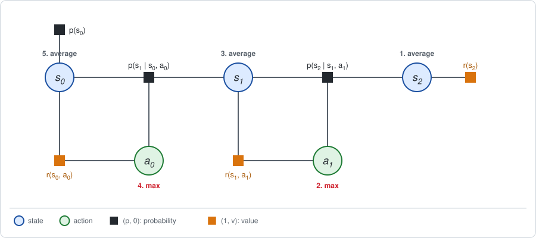

# Chapter 4: Decision nodes and elimination order

:::{div}
:class: in-progress
**This book is a work in progress.** It is still being written and revised: its content is incomplete and may contain errors.
:::

[Chapter 1](chapter01.md) *evaluated* a policy: $\pi$ was given, as a factor in
the graph, and elimination computed how good it is. In optimal control and in
RL the policy is the unknown: the goal is to **find** the policy with the
highest expected return $J$.

This chapter makes the action a *decision*: a variable that is eliminated by a
maximum, while the states are still eliminated by an average. The short
version:

- **The policy becomes an output.** Remove the policy factors. Eliminating an
  action by maximum leaves a conditional on that action, and that conditional
  is the best policy.
- **The order now matters.** A maximum and an average do not commute, so the
  elimination order is no longer free: it must run backward in time.
- **Decisions made separately need one pass.** If the agent may choose a
  separate action for every state and step, one backward pass finds the best
  policy. This is dynamic programming.
- **A shared decision needs two stages.** If the policy has parameters shared
  across states and steps, the maximum over them cannot be taken inside the
  pass. It becomes an outer loop around the elimination, the two-stage
  framework that the rest of the book is organized by.

The notation, the factor pairs $(p, v)$ and the track example are those of
Chapter 1; the endless track and the discount $\gamma$ are those of
[Chapter 3](chapter03.md).

**Run the examples.** The code of this chapter's examples is in the companion
notebook [chapter04_examples.ipynb](chapter04_examples.ipynb), which runs
online:
[](https://colab.research.google.com/github/thduynguyen/gtsam/blob/feature/semiringfactor/gtsam/semiring/doc/chapter04_examples.ipynb)

## 1. Two kinds of variables

In the graph of Chapter 1 the states and the actions were treated alike: both
were random, and both were averaged out. In a decision problem they differ in
who sets them.

| Variable | Who sets it | How it is eliminated | Name in the literature on *influence diagrams* |
|---|---|---|---|
| state $s_t$ | the dynamics, at random | by an **average**, the sum of the expectation semiring | chance node |
| action $a_t$ | the agent, by choice | by a **maximum** over the value | decision node |

A graph with chance nodes, decision nodes and rewards is called an *influence
diagram* (Howard and Matheson, 1984), and solving one by eliminating its
variables is a classic method (Shachter, 1986); see the
[references](#chapter04-references). In the terms of this book it is the
factor graph of Chapter 1 with two changes:

1. the policy factors are removed, because the policy is not given;
2. each variable has its own rule for being summed out.



**What a decision may depend on.** The agent chooses $a_t$ knowing the current
state $s_t$, and not knowing the next state $s_{t+1}$, which has not happened
yet. This is part of the problem statement, and it is what fixes the order of
elimination in the next section.

## 2. Eliminating a decision

Leave the policy factors out of the graph. One time step then has the
dynamics, the reward, and the value of the future. The figures use $x$ for the
state and $u$ for the action; read them as $s$ and $a$ for the tabular case.


The next state is eliminated exactly as in Chapter 1, by average, because the
agent does not choose where the dynamics take it:


The bucket of the action now holds only the reward and $\phi(x, u)$.
Multiplying them adds their values, as before, and gives the action value
$Q_t(x, u)$. The difference is in the next step. The agent *does* choose the
action, so the action is not averaged out: the best one is taken.

| Step for an action variable | Evaluating a policy (Chapter 1) | Finding the best policy |
|---|---|---|
| bucket | policy, reward, $\phi(x, u)$ | reward, $\phi(x, u)$ |
| multiply | $\big(\pi(u \mid x),\; Q_t(x, u)\big)$ | $\big(1,\; Q_t(x, u)\big)$ |
| new factor on $x$ | $\big(1,\; \sum_u \pi(u \mid x)\, Q_t(x, u)\big)$: the average | $\big(1,\; \max_u Q_t(x, u)\big)$: the best |
| conditional on $u$ | the given policy, with the advantage $Q_t - V_t$ | the best action for each $x$, $u^*(x) = \arg\max_u Q_t(x, u)$: the **optimal policy** |


So the policy is no longer an input. It is an *output*: the conditional that
elimination leaves on each action variable.

In the terms of [Chapter 2](chapter02.md), the action is summed out with the
max-sum rule and the states with the expectation rule. The value channel of
the action's conditional is the *regret* $Q_t(x, u) - \max_u Q_t(x, u)$: zero
for the best action and negative for the others.

**The order now matters.** Chapter 2, Section 3, showed that elimination in
any order needs one sum for all variables. Here there are two, and they cannot
be swapped:

$$\max_u\; \mathbb{E}_{x'}\big[\,\cdot\,\big] \;\le\; \mathbb{E}_{x'}\big[\max_u\; \cdot\,\big].$$

The left side is an agent that picks its action *before* knowing where the
dynamics will take it, which is the real situation. The right side is an agent
that picks after seeing the outcome. To get the left side, each next state
must be eliminated before the action that leads to it, and each action before
the state it is chosen in: the backward order
$x_T, u_{T-1}, x_{T-1}, \dots, u_0, x_0$ shown in the figure of Section 1.

The rule, in general: **a variable is eliminated before every decision that is
made without knowing it.** For policy evaluation any order was valid; here it
is not.

*On the track, at the last move.* Compare the correct order with the maximum
over both the action and the outcome of the move, which is what max-sum on all
variables computes:

| cell | average over the outcome, then max over the action | max over both |
|---|---|---|
| 0 | $0$ | $0$ |
| 1 | $7$ | $9$ |
| 2 | $9$ | $10$ |

In cell 1 the right column assumes that moving Right always succeeds. In cell
2 it assumes that the robot moves Left for free and slips, staying at the
charger. An agent cannot count on either.

## 3. Decisions made separately: one backward pass

With tables, the maximum is taken entry by entry, one row per state:

$$Q^*_t(s, a) = r(s, a) + \sum_{s'} p(s' \mid s, a)\, V^*_{t+1}(s'),
\qquad
V^*_t(s) = \max_a Q^*_t(s, a),
\qquad
\pi^*_t(s) = \arg\max_a Q^*_t(s, a).$$

The stars mark the values of the best policy. Compared with Chapter 1, the
only change is $\max_a$ in place of $\sum_a \pi(a \mid s)$. This is the
*Bellman optimality equation*, and applying it backward in time is called
dynamic programming.

| Elimination on the factor graph | Dynamic programming |
|---|---|
| value factor on the last state, $(1,\; r(s_T))$ | start: $V^*_T(s) = r(s)$ |
| eliminate $s_{t+1}$ by average | average over the next state, $\sum_{s'} p(s' \mid s, a)\, V^*_{t+1}(s')$ |
| multiply with the reward factor: values add | action value $Q^*_t(s, a)$ |
| eliminate $a_t$ by max: new factor on $s_t$ | $V^*_t(s) = \max_a Q^*_t(s, a)$ |
| conditional on $a_t$ | the best action in each state, $\pi^*_t(s)$ |
| eliminate $s_0$ by average: the constant | the best expected return $J^*$ |

*On the track of Chapter 1, Section 7.* The first step is unchanged, since the
last state is eliminated by average either way. The tables are then:

| cell | $Q^*_1(s, L)$ | $Q^*_1(s, R)$ | $V^*_1(s)$ | best last move |
|---|---|---|---|---|
| 0 | 0 | $-1$ | 0 | Left |
| 1 | 0 | 7 | 7 | Right |
| 2 | 2 | 9 | 9 | Right |

| cell | $Q^*_0(s, L)$ | $Q^*_0(s, R)$ | $V^*_0(s)$ | best first move |
|---|---|---|---|---|
| 0 | 0 | 4.6 | 4.6 | Right |
| 1 | 1.4 | 7.6 | 7.6 | Right |
| 2 | 7.4 | 8 | 8 | Right |

The best policy moves Right, except in cell 0 with one move left, where the
charger is out of reach and moving is wasted effort. This is what the
advantages of the coin-flip policy already hinted at in Chapter 1. Its expected
return is $J^* = 0.5 \cdot 4.6 + 0.5 \cdot 7.6 = 6.1$.

The same graph has now produced three numbers, with three choices of sums:

| Sum over the actions | Sum over the states | Result | Meaning |
|---|---|---|---|
| average under the coin flip | average | $1.4$ | the value of the coin-flip policy (Chapter 1) |
| maximum | average | $6.1$ | the value of the best policy |
| maximum | maximum | $9$ | the best trajectory, if the robot could also choose its luck (Chapter 2) |

**Why one pass is enough.** The maximum over the policy is a maximum over a
whole table of choices, one action for every state and every step. It could be
taken one bucket at a time because each of those choices appears in **one**
bucket only: the action chosen in state $s$ at step $t$ affects the value of
that entry of that bucket and of nothing else at that step. Section 4 shows
what happens when this is not so.

## 4. A shared decision: one global variable

A policy is rarely a free table. Usually it is a function with parameters
$\theta$, written $\pi_\theta(a \mid s)$, and the parameters are **shared**:
the same $\theta$ is used in every state and at every step. Examples are one
feedback gain used at all times, or the weights of a neural network.

On the graph, $\theta$ is one extra variable, a decision, joined to every
policy factor:


**Where does θ go in the elimination order?** By the rule of Section 2, every
variable that is unknown when a decision is made must be eliminated before it.
The parameter is chosen before the robot starts, when nothing is known. So
$\theta$ is eliminated **last**, after all states and actions:

$$\theta^* = \arg\max_\theta\; J(\theta),
\qquad
J(\theta) = \underbrace{\sum_{s_0, a_0, \dots, s_T} p_\theta(\tau)\, R(\tau)}_{\text{eliminate all states and actions, with } \theta \text{ held fixed}}.$$

This splits the computation in two:

- **Inside**: with $\theta$ held fixed, the policy factors are ordinary
  probability factors, and eliminating the states and actions is the policy
  evaluation of Chapter 1. Its result at the root is the number $J(\theta)$.
- **Outside**: the maximum over $\theta$ of the function $J(\theta)$.

The outside step cannot be done as one more elimination. For the per-step
decisions of Section 3 the new factor was a table or a quadratic, and its
maximum was found exactly. $J(\theta)$ is neither: it is a function of
$\theta$ known only through the elimination that evaluates it. Its maximum has
to be searched for by an iterative optimizer, which calls the inner
elimination again and again. That is the **two-stage framework**, defined
formally in [Chapter 5](chapter05.md).

*On the track.* Suppose the robot must use the same table at both moves, a
stationary policy. That is a sharing constraint: the choice made in cell 0 now
appears in two buckets, at the first move, where Right is best, and at the
last move, where Left is best. The backward pass of Section 3 cannot satisfy
both. Evaluating all eight deterministic stationary policies gives:

| policy in cells 0, 1, 2 | LLL | LLR | LRL | LRR | RLL | RLR | RRL | RRR |
|---|---|---|---|---|---|---|---|---|
| $J$ | $0$ | $0$ | $1$ | $3.8$ | $-1$ | $-1$ | $3.2$ | $6$ |

The best shared choice is Right everywhere, with $J = 6$, below the $6.1$ of
the policy that may differ between the moves. Finding it took eight
evaluations, one inner elimination per candidate. For a policy with many
parameters that brute-force search is replaced by the gradient steps of
Chapter 5.

## 5. The endless case: value iteration and policy iteration

On the endless chain of Chapter 3 every step is identical, and both ideas of
this chapter have a classic algorithm.

### Value iteration: the one-pass method, unrolled

Unroll the chain and eliminate backward, by average over the next state and by
max over the action. With the discount $\gamma$ of Chapter 3, one step is

$$Q^{(k)}(s, a) = r(s, a) + \gamma \sum_{s'} p(s' \mid s, a)\, V^{(k-1)}(s'),
\qquad
V^{(k)}(s) = \max_a Q^{(k)}(s, a),$$

starting from $V^{(0)} = 0$. As in Chapter 3, each step shrinks the error by
$\gamma$, so the backward message converges to a fixed point, the solution of
the Bellman optimality equation:

$$V^*(s) = \max_a \Big[r(s, a) + \gamma \sum_{s'} p(s' \mid s, a)\, V^*(s')\Big].$$

The best policy is stationary, $\pi^*(s) = \arg\max_a Q^*(s, a)$, because the
future looks the same from every step.

*On the endless track of Chapter 3:*

| moves $k$ | $V^{(k)}(0)$ | $V^{(k)}(1)$ | $V^{(k)}(2)$ | best moves in cells 0, 1, 2 |
|---|---|---|---|---|
| 1 | $0$ | $0$ | $2$ | L, L, L |
| 2 | $0$ | $0.44$ | $2.8$ | L, R, R |
| 5 | $0.247$ | $2.313$ | $4.751$ | R, R, R |
| 10 | $2.320$ | $4.462$ | $6.901$ | R, R, R |
| 50 | $5.374$ | $7.515$ | $9.954$ | R, R, R |
| 100 | $5.419$ | $7.561$ | $10.000$ | R, R, R |

The fixed point is $V^* = (5.419,\; 7.561,\; 10)$, and
$J^* = 0.5 \cdot 5.419 + 0.5 \cdot 7.561 = 6.490$, against $0.438$ for the coin
flip. The best policy is Right everywhere: go to the charger and stay there,
paying 1 per step to hold position and earning 2.

Two things are worth noticing in the table. With one move left, moving is not
worth its cost anywhere, so the best last move is Left. And the best policy
settles after 5 steps, long before the values do: the *ranking* of the actions
is found well before their exact values.

### Policy iteration: two stages, with a greedy outer step

The second algorithm alternates the two operations instead of interleaving
them:

- **Stage 1, evaluate.** With the current policy $\pi$ held fixed, eliminate
  by average, as in Chapter 3: solve $(I - \gamma P_\pi)\, V = r_\pi$. This
  gives $V$, $Q$ and the advantage $A = Q - V$ of the current policy.
- **Stage 2, improve.** In every state, switch to the action with the largest
  advantage:

  $$\pi_{\text{new}}(s) = \arg\max_a Q(s, a) = \arg\max_a A(s, a).$$

Repeat until the policy stops changing.

*On the endless track,* starting from the coin flip:

| iteration | policy evaluated | $V(0)$ | $V(1)$ | $V(2)$ | $J$ | largest advantage in cells 0, 1, 2 |
|---|---|---|---|---|---|---|
| 0 | coin flip | $-0.225$ | $1.102$ | $4.123$ | $0.438$ | L, R, R |
| 1 | L, R, R | $0$ | $7.561$ | $10$ | $3.780$ | R, R, R |
| 2 | R, R, R | $5.419$ | $7.561$ | $10$ | $6.490$ | R, R, R |

Two improvements reach the best policy. The first is the one suggested by the
advantages of the coin-flip policy computed in Chapter 3, Section 4, where
Left was slightly better in cell 0. Once the robot goes Right in cells 1 and
2, going Right in cell 0 becomes worthwhile too, and the second improvement
finds that.

:::{dropdown} Why does the greedy step never make the policy worse?
Let $\pi$ be the current policy, with values $V$ and $Q$, and
$\pi_{\text{new}}$ the greedy one. By construction, in every state the new
action is at least as good as the old average:

$$Q\big(s, \pi_{\text{new}}(s)\big) = \max_a Q(s, a) \;\ge\; \sum_a \pi(a \mid s)\, Q(s, a) = V(s).$$

So taking the new action for *one* step and then following the old policy is
at least as good as the old policy. Applying the same inequality to the next
step, and the next, replaces the old policy by the new one step after step,
and each replacement can only increase the value:

$$V(s) \;\le\; Q\big(s, \pi_{\text{new}}(s)\big)
\;\le\; \dots \;\le\; V_{\text{new}}(s).$$

There are finitely many deterministic policies and each iteration improves
the policy unless it is already greedy with respect to its own values, which
is the Bellman optimality equation. So the iteration stops at a best policy.
:::

**Policy iteration is the first instance of the two-stage framework.** Its
decision variable is the whole table $\pi$; its Stage 1 is an exact
elimination with the expectation semiring; its Stage 2 is a maximum taken
separately in every state, which is possible because the table is free.
Value iteration is the same computation with the two stages merged into one
pass. The two columns of this comparison are the first two rows of the
[taxonomy table](appendix_c.md):

| | Value iteration | Policy iteration |
|---|---|---|
| Sum over the actions in Stage 1 | maximum | average under the current policy |
| Stage 1 | exact elimination, unrolled to the fixed point | exact elimination: solve a linear system |
| Stage 2 | none: the policy is read from the conditionals | greedy: the action with the largest advantage, per state |
| Passes needed on the endless track | about 100, for 3 digits | 3 |

## 6. Implementation

The module has no elimination function that maximizes over action variables.
One pass can still be written with the factor interface, using the fact that
the average under a *deterministic* policy is the substitution of its action:
read $Q_t$ from the bucket, pick the best action, lift it as a one-hot policy
factor, and eliminate as usual.

For the track, with the helpers of Chapter 1, Section 10 (`probability` lifts a
table to $(p, 0)$ and `value` lifts one to $(1, r)$; `table` reads a
`DecisionTreeFactor` into an array, and `ordering` wraps one key):

```python
future = value([state(2)], final_reward)          # (1, V*_2)
for t in [1, 0]:
    keys = [state(t), action(t)]
    # Eliminate the next state by average. There is no policy factor.
    step = probability(keys + [state(t + 1)], dynamics)
    bucket = value(keys, move_reward) * (step * future).sum(ordering(S(t + 1)))
    Q = table(bucket.value(), keys)               # Q*_t(s, a)
    # Eliminate the action by max: the best move, as a one-hot policy factor.
    greedy = probability(keys, np.eye(2)[Q.argmax(axis=1)])
    future = (greedy * bucket).sum(ordering(A(t)))  # (1, V*_t)

prior_factor = probability([state(0)], prior)
(prior_factor * future).expectation()             # 6.1
```

The test `test_best_policy` in
`python/gtsam/tests/test_SemiringFactorGraph.py` checks these tables. Value
iteration and policy iteration on the endless track are a few lines of numpy
each, in the [companion notebook](chapter04_examples.ipynb).

## 7. What breaks

- **A decision that cannot see the state.** The pass of Section 3 assumed
  that $a_t$ is chosen knowing $s_t$. If the agent only has noisy
  observations, the maximum over $a_t$ would have to be taken before $s_t$ is
  known, and the buckets no longer separate. This is the subject of
  [Chapter 22](chapter22.md).
- **Too many actions to compare.** The maximum was taken by comparing table
  entries. For continuous actions that is impossible in general. It is exact
  when $Q$ is a quadratic in the action ([Chapter 6](chapter06.md)), and
  otherwise approximated by sampling ([Chapter 10](chapter10.md)) or by a
  gradient step ([Chapter 16](chapter16.md)).
- **Too many states for a table.** Both algorithms of Section 5 store a value
  per state. Part III replaces the table by a learned function, and then
  neither convergence argument of this chapter holds as stated
  ([Chapter 12](chapter12.md)).
- **Shared parameters.** As Section 4 showed, the maximum over a shared
  $\theta$ does not decompose. The next chapter develops the tool that
  replaces it: the gradient of $J(\theta)$, computed by elimination.

(chapter04-references)=
## 8. References

- R. Bellman, *Dynamic Programming*, Princeton University Press, 1957. The
  optimality equation and backward induction.
- R. A. Howard, *Dynamic Programming and Markov Processes*, MIT Press, 1960.
  Policy iteration.
- R. A. Howard and J. E. Matheson, "Influence diagrams", in *Readings on the
  Principles and Applications of Decision Analysis*, 1984. Chance, decision
  and value nodes in one graph.
- R. D. Shachter, "Evaluating influence diagrams", *Operations Research*,
  1986. Solving an influence diagram by removing its nodes one at a time.
- F. Jensen, F. V. Jensen and S. L. Dittmer, "From influence diagrams to
  junction trees", *Uncertainty in Artificial Intelligence*, 1994. The
  constraint on the elimination order for mixed sums and maxima.
- R. Dechter, "Bucket elimination: a unifying framework for reasoning",
  *Artificial Intelligence*, 1999.
- R. S. Sutton and A. G. Barto, *Reinforcement Learning: An Introduction*, 2nd
  edition, MIT Press, 2018. Chapter 4: value iteration and policy iteration.

---

Previous: [Chapter 3: Infinite horizon and discounting](chapter03.md).
Next: [Chapter 5: Gradients by elimination: the two-stage framework](chapter05.md).
