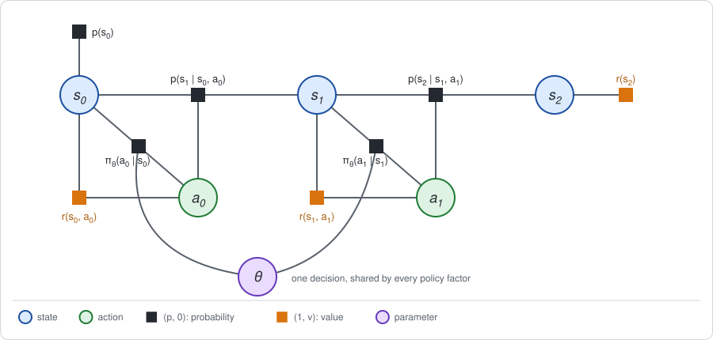
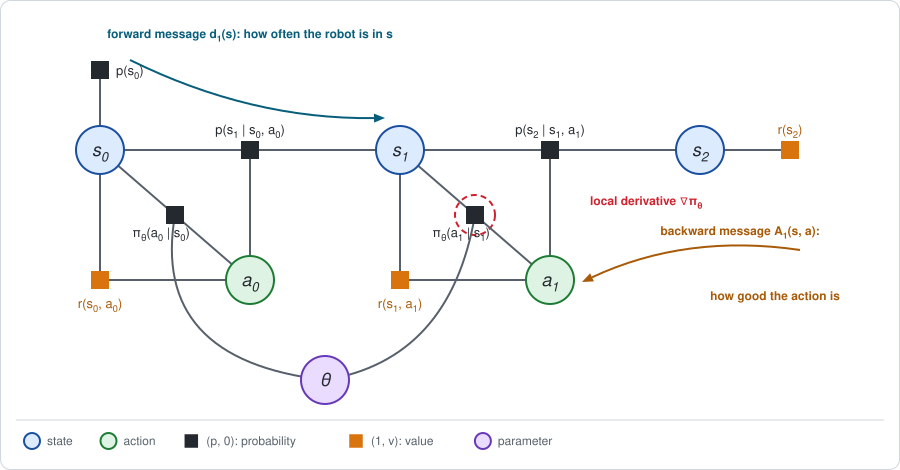
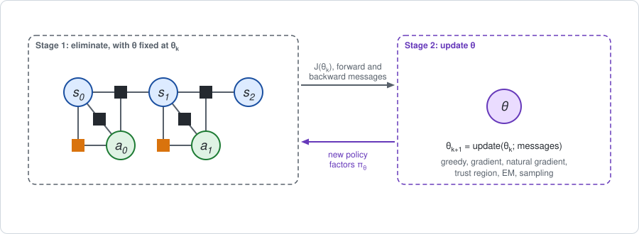

# Chapter 5: Gradients by elimination: the two-stage framework

[Chapter 4](chapter04.md) ended with a decision that elimination could not
take: a policy parameter $\theta$ shared by every policy factor. The maximum
over $\theta$ had to be searched for from outside, by trying values of
$\theta$ and evaluating each with an inner elimination.

This chapter gives that search a direction. It computes the **gradient** of
the expected return with respect to $\theta$, from quantities that the
elimination of Chapter 1 already produces, and then states the two-stage
framework that the rest of the book is organized by. The short version:

- **The gradient is a forward message times a local derivative times a
  backward message.** For each policy factor: how often its state is reached,
  how the factor changes with $\theta$, and how good each action is.
- **The same gradient comes out of one backward pass** if every factor entry
  carries its derivative along. That is a larger semiring, the *second-order
  expectation semiring*.
- **The same messages give the Fisher matrix**, the information matrix of the
  policy parameters, and with it the *natural gradient*, which is a
  Gauss-Newton step.
- **Two stages.** Stage 1 eliminates the states and actions with $\theta$
  fixed. Stage 2 uses what Stage 1 produced to update $\theta$. Every
  algorithm in this book is a choice of how to do each.

**Run the examples.** The code of this chapter's examples is in the companion
notebook [chapter05_examples.ipynb](chapter05_examples.ipynb), which runs
online:
[](https://colab.research.google.com/github/thduynguyen/gtsam/blob/feature/semiringfactor/gtsam/semiring/doc/chapter05_examples.ipynb)

## 1. The problem: a policy with parameters

**The example.** Take the track of Chapter 1, Section 7, with its two moves,
and give the robot a policy with one number per cell:

$$\pi_\theta(R \mid s) = \sigma(\theta_s), \qquad
\pi_\theta(L \mid s) = 1 - \sigma(\theta_s), \qquad
\sigma(z) = \frac{1}{1 + e^{-z}}.$$

The function $\sigma$ turns any real number into a probability. The parameter
is the vector $\theta = (\theta_0, \theta_1, \theta_2)$, one entry per cell,
and the same $\theta$ is used at both moves.

- With $\theta = (0, 0, 0)$ every probability is $\sigma(0) = 0.5$: the coin
  flip of Chapter 1, with $J = 1.4$.
- Raising $\theta_s$ makes the robot more likely to move Right in cell $s$.



The expected return is now a function $J(\theta)$ of three numbers.
Chapter 4, Section 4, found its best value over deterministic choices: Right
in every cell, with $J = 6$.

**The question.** Starting from the coin flip, in which direction should
$\theta$ be changed to increase $J$? The answer is the gradient,

$$\nabla_\theta J = \Big(\frac{\partial J}{\partial \theta_0},\;
\frac{\partial J}{\partial \theta_1},\; \frac{\partial J}{\partial \theta_2}\Big).$$

**The answer, first.** At the coin flip,

$$\nabla_\theta J = (0.15,\;\; 1.0,\;\; 0.35).$$

All three entries are positive: move Right more often everywhere, and most of
all in cell 1.

**The obvious method** is to change one parameter a little and evaluate
again: $\partial J / \partial \theta_0 \approx \big(J(\theta_0 + h, \theta_1, \theta_2) - J(\theta)\big) / h$.
That costs one elimination per parameter. It is fine for three parameters and
hopeless for a neural network with a million. The goal of this chapter is to
get every entry of the gradient from the by-products of **one** evaluation.

## 2. One decision first

Before the track, take a problem with a single decision. It is the quick-start
example of the module.

- **Action.** Left (L) or Right (R). Left costs 1.
- **Outcome.** Good or bad. After Left the outcome is good with probability
  0.9; after Right, with probability 0.2. A good outcome pays 10.
- **Policy.** One parameter: $\pi_\theta(L) = \sigma(\theta)$. Take $\theta$
  such that $\pi_\theta(L) = 0.6$.

The action values follow from one Bellman backup:

$$Q(L) = -1 + 0.9 \cdot 10 = 8, \qquad Q(R) = 0 + 0.2 \cdot 10 = 2.$$

**Step 1: write $J$ as a sum over the action.** This is the last line of the
Bellman backup of Chapter 1, the average of the action values with the policy
as weights:

$$J(\theta) = \pi_\theta(L)\, Q(L) + \pi_\theta(R)\, Q(R) = 0.6 \cdot 8 + 0.4 \cdot 2 = 5.6.$$

Only the weights depend on $\theta$. The action values do **NOT**: once the
action is taken, the policy has no further influence on what happens.

**Step 2: differentiate.** Since only the weights depend on $\theta$,

$$\frac{dJ}{d\theta} = \frac{d\pi_\theta(L)}{d\theta}\, Q(L) + \frac{d\pi_\theta(R)}{d\theta}\, Q(R).$$

For the function $\sigma$, the derivative is
$d\sigma / d\theta = \sigma\,(1 - \sigma) = 0.6 \cdot 0.4 = 0.24$. So
$d\pi_\theta(L) / d\theta = 0.24$ and, because the two probabilities sum to
one, $d\pi_\theta(R) / d\theta = -0.24$:

$$\frac{dJ}{d\theta} = 0.24 \cdot 8 - 0.24 \cdot 2 = 0.24 \cdot (8 - 2) = 1.44.$$

In words: raising $\theta$ moves probability from Right to Left, at a rate of
$0.24$, and every unit of probability moved gains $Q(L) - Q(R) = 6$.

**Step 3: only differences of values matter.** The two derivatives cancel,
because the probabilities always sum to one:

$$\frac{d\pi_\theta(L)}{d\theta} + \frac{d\pi_\theta(R)}{d\theta}
= \frac{d}{d\theta}\big(\pi_\theta(L) + \pi_\theta(R)\big) = \frac{d}{d\theta}\, 1 = 0.$$

So any constant $b$ can be subtracted from both action values without
changing the result. Choose the average value itself, $b = J = 5.6$. What is
left of each action value is its advantage, $A(a) = Q(a) - J$:

$$\frac{dJ}{d\theta} = \sum_a \frac{d\pi_\theta(a)}{d\theta}\, A(a)
= 0.24 \cdot (8 - 5.6) - 0.24 \cdot (2 - 5.6) = 0.576 + 0.864 = 1.44.$$

The constant $b$ is called a *baseline*. Using the advantage is not needed
for the exact gradient, but it matters for two reasons. The advantage is what
the conditional of Chapter 1 already holds. And when the sum is later
estimated from samples ([Chapter 11](chapter11.md)), smaller terms give a less
noisy estimate.

**Step 4: write it as an average under the policy.** For any positive
function, $d\pi = \pi \cdot d \log \pi$. Substituting,

$$\frac{dJ}{d\theta} = \sum_a \pi_\theta(a)\; \frac{d \log \pi_\theta(a)}{d\theta}\; A(a)
= \mathbb{E}_{a \sim \pi_\theta}\Big[\frac{d \log \pi_\theta(a)}{d\theta}\, A(a)\Big].$$

Here $d \log \pi_\theta(L) / d\theta = 1 - \sigma = 0.4$ and
$d \log \pi_\theta(R) / d\theta = -\sigma = -0.6$, so the average is
$0.6 \cdot 0.4 \cdot 2.4 + 0.4 \cdot (-0.6) \cdot (-3.6) = 1.44$ again. This
form is an expectation under the policy itself, which is what makes it
possible to estimate the gradient by *trying* actions.

| Form | Formula | Value |
|---|---|---|
| with action values | $\sum_a \frac{d\pi_\theta(a)}{d\theta}\, Q(a)$ | $1.44$ |
| with advantages | $\sum_a \frac{d\pi_\theta(a)}{d\theta}\, A(a)$ | $1.44$ |
| as an average under the policy | $\mathbb{E}_{a \sim \pi_\theta}\big[\frac{d \log \pi_\theta(a)}{d\theta}\, A(a)\big]$ | $1.44$ |

## 3. Many decisions: forward times local times backward

**The answer first.** With many decisions, each policy factor contributes a
term of the same form as in Section 2, weighted by how often its state is
reached:

$$\nabla_\theta J = \sum_t \sum_s \underbrace{d_t(s)}_{\text{forward message}}\;
\sum_a \underbrace{\nabla_\theta \pi_\theta(a \mid s)}_{\text{local derivative}}\;
\underbrace{A_t(s, a)}_{\text{backward message}}.$$

- $d_t(s)$ is the probability that the robot is in state $s$ at step $t$, the
  marginal of $s_t$ (Chapter 3, Section 5).
- $\nabla_\theta \pi_\theta(a \mid s)$ is the derivative of the policy factor
  itself. It involves nothing but that factor.
- $A_t(s, a)$ is the advantage, the value channel of the conditional that
  elimination leaves on $a_t$ (Chapter 1, Section 4).



This is the **policy gradient theorem** of Sutton, McAllester, Singh and
Mansour (2000); see the [references](#chapter05-references).

**Derivation.** It takes four steps.

*Step 1: the derivative of a product of factors.* The probability of a
trajectory is the product of all probability factors,

$$p_\theta(\tau) = p(s_0) \prod_t \pi_\theta(a_t \mid s_t)\; p(s_{t+1} \mid s_t, a_t).$$

The derivative of a product is a sum with one term per factor: that factor
differentiated, times all the other factors unchanged. Only the policy
factors depend on $\theta$, so there is one term per step $t$:

$$\nabla_\theta\, p_\theta(\tau) = \sum_t \nabla_\theta \pi_\theta(a_t \mid s_t)
\times \big(\text{all other factors of } \tau\big).$$

*Step 2: the derivative of $J$.* Since $J = \sum_\tau p_\theta(\tau)\, R(\tau)$
and the return $R(\tau)$ does not depend on $\theta$,

$$\nabla_\theta J = \sum_t \; \sum_\tau \nabla_\theta \pi_\theta(a_t \mid s_t)
\times \big(\text{all other factors}\big) \times R(\tau).$$

*Step 3: sum out everything except $s_t$ and $a_t$.* Fix a step $t$. The
differentiated factor involves only $s_t$ and $a_t$, so all other variables
can be summed out first. The other factors split into those before the policy
factor of step $t$ and those after it, and the return splits the same way,
into the rewards before step $t$ and the rewards from step $t$ on:

$$\sum_{\text{all but } s_t, a_t} \big(\text{all other factors}\big)\, R(\tau)
= d_t(s_t)\, \Big(\underbrace{b_t(s_t)}_{\text{rewards before } t}
+ \underbrace{Q_t(s_t, a_t)}_{\text{rewards from } t \text{ on}}\Big).$$

- The factors before sum to the probability of reaching $s_t$, which is
  $d_t(s_t)$.
- The factors after are all conditional distributions and sum to one.
- The rewards from step $t$ on, averaged over what follows, are the action
  value $Q_t(s_t, a_t)$, by its definition in Chapter 1.
- The rewards before step $t$, averaged over the ways of reaching $s_t$, are
  some function $b_t(s_t)$. It does not depend on $a_t$, because the action at
  step $t$ cannot change what was collected earlier.

So far,

$$\nabla_\theta J = \sum_t \sum_s d_t(s) \sum_a \nabla_\theta \pi_\theta(a \mid s)\,
\big(b_t(s) + Q_t(s, a)\big).$$

*Step 4: the baseline.* As in Section 2, the derivatives of the policy sum to
zero over the actions, in every state:

$$\sum_a \nabla_\theta \pi_\theta(a \mid s) = \nabla_\theta \sum_a \pi_\theta(a \mid s)
= \nabla_\theta\, 1 = 0.$$

Any term that does not depend on $a$ therefore drops out. That removes
$b_t(s)$, and it allows $V_t(s)$ to be subtracted, which turns $Q_t$ into the
advantage $A_t = Q_t - V_t$. This is the formula at the top of the section.

**On the track.** For the policy of Section 1, the parameter $\theta_s$
appears only in the row of cell $s$, with
$\partial \pi_\theta(R \mid s) / \partial \theta_s = \sigma (1 - \sigma) = 0.25$
at the coin flip and $\partial \pi_\theta(L \mid s) / \partial \theta_s = -0.25$.
So the inner sum is $0.25 \cdot \big(A_t(s, R) - A_t(s, L)\big)$, and

$$\frac{\partial J}{\partial \theta_s} = \sum_t d_t(s) \cdot 0.25 \cdot \big(A_t(s, R) - A_t(s, L)\big).$$

The forward messages and the advantages are those of Chapter 1, Section 7:

| step $t$ | cell $s$ | $d_t(s)$ | $A_t(s, R) - A_t(s, L)$ | contribution to $\partial J / \partial \theta_s$ |
|---|---|---|---|---|
| 0 | 0 | $0.5$ | $1.1 - (-1.1) = 2.2$ | $0.5 \cdot 0.25 \cdot 2.2 = 0.275$ |
| 0 | 1 | $0.5$ | $1.9 - (-1.9) = 3.8$ | $0.5 \cdot 0.25 \cdot 3.8 = 0.475$ |
| 0 | 2 | $0$ | $0.3 - (-0.3) = 0.6$ | $0$ |
| 1 | 0 | $0.5$ | $-0.5 - 0.5 = -1$ | $0.5 \cdot 0.25 \cdot (-1) = -0.125$ |
| 1 | 1 | $0.3$ | $3.5 - (-3.5) = 7$ | $0.3 \cdot 0.25 \cdot 7 = 0.525$ |
| 1 | 2 | $0.2$ | $3.5 - (-3.5) = 7$ | $0.2 \cdot 0.25 \cdot 7 = 0.35$ |

Adding the rows of each cell:

$$\nabla_\theta J = \big(0.275 - 0.125,\;\; 0.475 + 0.525,\;\; 0 + 0.35\big) = (0.15,\;\; 1.0,\;\; 0.35).$$

The entry of cell 0 shows the conflict found in Chapter 4, Section 4. Moving
Right in cell 0 is good at the first move and bad at the last one, and the
shared parameter $\theta_0$ receives the sum of the two.

**Where the pieces come from.** With the module, both messages are results of
the standard workflow:

| Piece | From | In the module |
|---|---|---|
| $J(\theta)$ | the constant left at the root | `graph.expectation()` |
| $A_t(s, a)$ | the conditional on $a_t$ | `bayesNet.at(i).surprise()` |
| $d_t(s)$ | the marginal of $s_t$ | `bayesTree.marginalFactor(key).probability()` |

A SLAM reader will recognize the pattern: eliminate, then ask for marginals.

:::{dropdown} The discounted, endless version
On the endless chain of Chapter 3 the policy and the advantage are the same
at every step, and the sum over steps of the forward messages, each weighted
by $\gamma^t$, is the discounted visitation $d(s)$ of Chapter 3, Section 5.
The formula becomes

$$\nabla_\theta J = \sum_s d(s) \sum_a \nabla_\theta \pi_\theta(a \mid s)\; A(s, a).$$
:::

:::{dropdown} The form RL uses, with logarithms
Writing $\nabla \pi = \pi\, \nabla \log \pi$ as in Section 2, and noting that
$d_t(s)\, \pi_\theta(a \mid s)$ is the probability of the pair $(s_t, a_t)$,
the gradient is an average over trajectories:

$$\nabla_\theta J = \mathbb{E}\Big[\sum_t \nabla_\theta \log \pi_\theta(a_t \mid s_t)\; A_t(s_t, a_t)\Big].$$

This is the form that sampling methods estimate: run the policy, and average
the term inside over the visited pairs $(s_t, a_t)$.
:::

:::{dropdown} The same pattern in factor-graph learning
Learning the parameters of a factor graph from data uses an identity of the
same shape. If a factor $f_\theta$ depends on a parameter, the derivative of
the log-normalizer is

$$\nabla_\theta \log Z = \sum_{x} p(x)\; \nabla_\theta \log f_\theta(x),$$

where $x$ are the variables of that factor and $p(x)$ their marginal. The
marginal collects everything the rest of the graph has to say, from both
sides, and the derivative of the factor is local. The policy gradient has the
same structure, in the expectation semiring: the marginal is split into its
forward part $d_t$ and the factor $\pi_\theta$ itself, and the backward
message carries a value, the advantage, where plain sum-product would carry a
one.
:::

## 4. One backward pass: the second-order semiring

The formula of Section 3 needs two passes, backward for the advantages and
forward for the marginals. There is a second way that needs only the backward
pass: let every factor entry carry its own derivative.

**The entry.** Chapter 1 stored a pair $(p, w)$, the probability and the
weighted value $w = p\, v$. Add the derivative of each with respect to one
entry $\theta_i$ of the parameter vector, written with a dot:

$$(p,\; w,\; \dot p,\; \dot w), \qquad
\dot p = \frac{\partial p}{\partial \theta_i}, \quad
\dot w = \frac{\partial w}{\partial \theta_i}.$$

**The rules** are those of Chapter 1, Section 5, and their derivatives by the
product rule:

$$\begin{aligned}
\text{product:} \quad
p &= p_1 p_2, &
w &= p_1 w_2 + p_2 w_1, \\
\dot p &= \dot p_1 p_2 + p_1 \dot p_2, &
\dot w &= \dot p_1 w_2 + p_1 \dot w_2 + \dot p_2 w_1 + p_2 \dot w_1, \\
\text{sum:} \quad & \text{each of the four numbers is added.}
\end{aligned}$$

**Lifting.** Only the policy factors have a nonzero derivative:

| Term | As an entry $(p, w, \dot p, \dot w)$ |
|---|---|
| prior or dynamics $f$ | $(f,\; 0,\; 0,\; 0)$ |
| policy $\pi_\theta$ | $(\pi_\theta,\; 0,\; \partial \pi_\theta / \partial \theta_i,\; 0)$ |
| reward $r$ | $(1,\; r,\; 0,\; 0)$ |

**The result.** Eliminating every variable, in the usual backward order,
leaves one entry at the root:

$$\Big(1,\;\; J,\;\; 0,\;\; \frac{\partial J}{\partial \theta_i}\Big).$$

On the track at the coin flip, the notebook gets $(1,\; 1.4,\; 0,\; 0.15)$ for
$\theta_0$, $(1,\; 1.4,\; 0,\; 1.0)$ for $\theta_1$ and
$(1,\; 1.4,\; 0,\; 0.35)$ for $\theta_2$: the gradient of Section 3, from a
single pass each. The elimination routine is the generic one of
[Chapter 2](chapter02.md); only the four small functions that define the
semiring are new.

This is the **second-order expectation semiring** of Li and Eisner (2009).
The laws that elimination needs hold for the same reason as in Chapter 1: the
entry is a number
$p + w\,\varepsilon + \dot p\,\varepsilon_\theta + \dot w\,\varepsilon\,\varepsilon_\theta$
with two units that square to zero, $\varepsilon^2 = \varepsilon_\theta^2 = 0$,
and the rules above are ordinary arithmetic on it. The unit $\varepsilon$
marks the value, as in Chapter 1, and $\varepsilon_\theta$ marks the
derivative.

:::{dropdown} What the fourth number means: the return times the score
Define the **score** of a trajectory as the derivative of its
log-probability. Only the policy factors contribute, one term per step:

$$g(\tau) = \nabla_\theta \log p_\theta(\tau) = \sum_t \nabla_\theta \log \pi_\theta(a_t \mid s_t).$$

Like the return, the score is a sum of local terms along the trajectory.
Using $\nabla p_\theta = p_\theta\, \nabla \log p_\theta$,

$$\nabla_\theta J = \sum_\tau \nabla_\theta\, p_\theta(\tau)\; R(\tau)
= \sum_\tau p_\theta(\tau)\; g(\tau)\, R(\tau) = \mathbb{E}[g\, R].$$

So the gradient is the expected *product* of two quantities that each add up
along a trajectory. Computing such an expected product is what the
second-order semiring is for, in general. The third number at the root is
$\mathbb{E}[g] = \nabla_\theta \sum_\tau p_\theta(\tau) = 0$, so the gradient
is also the covariance of the return with the score: $\theta$ should move in
the direction in which trajectories with a high return become more probable.
:::

**Which method to use.** Three ways to the same gradient, with different
costs:

| Method | Eliminations | Size of each entry | Good for |
|---|---|---|---|
| finite differences | two per parameter | 2 numbers | a check |
| second-order semiring | one | 2 numbers, plus 2 per parameter | few parameters; also a check |
| forward times local times backward (Section 3) | one, plus the marginals | 2 numbers | any number of parameters |

In the vocabulary of automatic differentiation, the second-order semiring is
*forward mode*: derivatives travel with the values, at a cost per parameter.
The forward-backward formula is *reverse mode*: one extra pass in the
opposite direction, for all parameters at once. It is the one that scales,
and the one RL algorithms use.

## 5. The Fisher matrix and the natural gradient

The gradient says which direction increases $J$ fastest *per unit of change
in the parameters*. But the parameters are only a means of describing the
policy. A better question is which direction increases $J$ fastest *per unit
of change in the behavior*. Answering it needs a measure of how much the
behavior changes with $\theta$.

**The Fisher matrix** is that measure. It is the covariance of the score
$g(\tau)$ of Section 4,

$$\mathcal{I}(\theta) = \mathbb{E}\big[g(\tau)\, g(\tau)^\top\big],$$

and it is built from the same forward messages as the gradient:

$$\mathcal{I}(\theta) = \sum_t \sum_s d_t(s) \sum_a \pi_\theta(a \mid s)\;
\nabla_\theta \log \pi_\theta(a \mid s)\; \nabla_\theta \log \pi_\theta(a \mid s)^\top.$$

:::{dropdown} Why are there no cross terms between different steps?
$g$ is a sum over steps, so $g\, g^\top$ has a term for every pair of steps.
Take two steps $t < t'$. Given everything up to $s_{t'}$, the earlier score
term is fixed, and the later one averages to zero:

$$\sum_a \pi_\theta(a \mid s)\, \nabla_\theta \log \pi_\theta(a \mid s)
= \sum_a \nabla_\theta \pi_\theta(a \mid s) = 0.$$

So the expectation of every cross term vanishes, and only the terms with
$t = t'$ remain.
:::

**What it measures.** For a small change $\Delta\theta$ of the parameters, the
distance between the old and the new distribution over trajectories, measured
by the Kullback-Leibler divergence, is

$$\mathrm{KL}\big(p_\theta \,\|\, p_{\theta + \Delta\theta}\big) \approx \tfrac{1}{2}\, \Delta\theta^\top\, \mathcal{I}(\theta)\, \Delta\theta.$$

A direction in which $\mathcal{I}$ is large changes the behavior a lot; a
direction in which it is small hardly changes it.

*On the track,* at the coin flip, each parameter belongs to one cell, so the
matrix is diagonal, with entries $\sigma (1 - \sigma) \sum_t d_t(s) = 0.25 \cdot (d_0(s) + d_1(s))$:

$$\mathcal{I} = \begin{pmatrix} 0.25 & & \\ & 0.2 & \\ & & 0.05 \end{pmatrix}.$$

The entry of cell 2 is small because the robot is rarely there: changing
$\theta_2$ changes the behavior little.

**The natural gradient** is the gradient rescaled by the inverse of the
Fisher matrix (Amari, 1998; Kakade, 2002):

$$\mathcal{I}(\theta)^{-1}\, \nabla_\theta J = \Big(\frac{0.15}{0.25},\; \frac{1.0}{0.2},\; \frac{0.35}{0.05}\Big) = (0.6,\;\; 5,\;\; 7).$$

It is the direction that increases $J$ fastest for a given change in the
distribution over trajectories. Compare the two:

| | cell 0 | cell 1 | cell 2 |
|---|---|---|---|
| gradient | $0.15$ | $1.0$ | $0.35$ |
| natural gradient | $0.6$ | $5$ | $7$ |

The plain gradient is small for cell 2 only because cell 2 is rarely visited.
The natural gradient divides that out. What remains, for this policy, is the
visitation-weighted average of the gap $A_t(s, R) - A_t(s, L)$ in each cell,
for example $(0.5 \cdot 3.8 + 0.3 \cdot 7) / 0.8 = 5$ in cell 1. It says how
much better Right is than Left in that cell, regardless of how often the cell
occurs.

**For a SLAM reader** this is familiar ground:

| Policy optimization | Nonlinear least squares in GTSAM |
|---|---|
| Fisher matrix $\mathcal{I}(\theta)$ | the information matrix (the Gauss-Newton Hessian) of the linearized problem |
| natural gradient step $\mathcal{I}^{-1} \nabla_\theta J$ | a Gauss-Newton step |
| damped step $(\mathcal{I} + \lambda_{\text{LM}} I)^{-1} \nabla_\theta J$ | a Levenberg-Marquardt step |
| a step limited by $\tfrac{1}{2} \Delta\theta^\top \mathcal{I}\, \Delta\theta \le D_{\max}$ | a trust-region (Dogleg) step |

[Chapter 7](chapter07.md) carries this out with GTSAM's optimizers for a
Gaussian policy, and [Chapter 14](chapter14.md) meets it again as TRPO and
PPO.

## 6. The two stages

### Why θ is not eliminated with the rest

The parameter $\theta$ is joined to every policy factor. If the states and
actions were eliminated with $\theta$ still unknown, every bucket would
involve $\theta$, and the new factors would be functions of $\theta$ that are
neither tables nor quadratics.

The remedy is old: **fix the troublesome variable, and solve what is left.**
With $\theta$ fixed at a value $\theta_k$, the policy factors are ordinary
probability factors and the graph is the chain of Chapter 1. In graphical
models this is called *conditioning on a cutset* (Pearl, 1988): a few
variables are held fixed so that the rest of the graph becomes easy to
eliminate. In SLAM it is the linearization point: fix the estimate, solve the
linear problem, update, repeat.

### Definition

**Stage 1 (inner).** Given $\theta_k$, eliminate all states and actions of
the semiring factor graph. The outputs are:

- the expected return $J(\theta_k)$, left at the root;
- the **backward messages**: the value factors, holding $Q_t$ and $V_t$, and
  the surprises in the conditionals, the advantage $A_t$ and the TD residual
  $\delta_t$;
- the **forward messages**: the marginals of the states, $d_t$.

**Stage 2 (outer).** Given the outputs of Stage 1, update the parameters:

$$\theta_{k+1} = \text{update}\big(\theta_k;\; J,\; d_t,\; Q_t,\; A_t\big).$$

Then repeat from Stage 1.



### The choices

An algorithm is defined by how it carries out each stage. The choices fall
along five axes, four for Stage 1 and one for Stage 2.

| Axis | The question | The options |
|---|---|---|
| 1. Sum over the actions | Which semiring sum eliminates $a_t$? | average under $\pi_\theta$ (evaluation); maximum (optimal control); soft maximum; and, at the states, a tilt for risk |
| 2. Access to the dynamics factor | How is $p(s' \mid s, a)$ known? | in closed form; linearized; through a simulator; through real transitions; as a learned model |
| 3. Backward messages | How are $Q$, $V$ and $A$ computed? | exactly; as a local quadratic; from Monte Carlo returns; by bootstrapping (TD); as a learned function, the *critic* |
| 4. Forward messages | How is $d_t$ computed? | exactly; as a moment-matched Gaussian; as particles from rollouts; from a replay buffer of old transitions |
| 5. Stage 2 update | How is $\theta$ changed? | none (the policy is read from the conditionals); greedy per state; gradient; natural gradient; trust region; EM; sampling without derivatives; relinearize and repeat |

One wrapper goes around both stages: **receding horizon**, or model
predictive control (MPC). Run both stages on a short horizon from the current
state, apply the first action, and repeat at the next step.

Every chapter from here on ends with a **framework card**: the choices of its
algorithm along these axes. The cards are collected in the
[taxonomy table](appendix_c.md). The three algorithms met so far:

| | Value iteration (Ch. 4) | Policy iteration (Ch. 4) | Exact policy gradient (this chapter) |
|---|---|---|---|
| 1. Sum over the actions | maximum | average under $\pi$ | average under $\pi_\theta$ |
| 2. Dynamics factor | closed form (tables) | closed form (tables) | closed form (tables) |
| 3. Backward messages | exact | exact | exact |
| 4. Forward messages | not needed | not needed | exact |
| 5. Stage 2 update | none | greedy per state | gradient or natural gradient |

Policy iteration does not need forward messages because its update is taken
separately in every state. A shared parameter does need them: the forward
message says how much each state's opinion should count.

### The same loop in SLAM

| Two-stage framework | Nonlinear optimization in GTSAM |
|---|---|
| fix $\theta_k$ | fix the linearization point |
| Stage 1: eliminate states and actions | linearize and eliminate: solve the linear system |
| the messages $d_t$, $A_t$ | the linear solution and its marginals |
| Stage 2: update $\theta$ | Gauss-Newton, Levenberg-Marquardt or Dogleg update |
| messages become stale as $\theta$ moves | the linearization becomes stale as the estimate moves |

## 7. Example: improving the track policy

Start from the coin flip, $\theta = (0, 0, 0)$, and repeat the two stages.
Stage 1 is one elimination of the semiring factor graph, with the module.
Stage 2 is one of two updates, with a step size $\alpha$:

$$\text{gradient:}\quad \theta \leftarrow \theta + \alpha\, \nabla_\theta J,
\qquad
\text{natural gradient:}\quad \theta \leftarrow \theta + \alpha\, \big(\mathcal{I} + \lambda_{\text{LM}} I\big)^{-1} \nabla_\theta J.$$

The notebook uses $\alpha = 1$ for the gradient, and $\alpha = 0.2$ with a
small damping $\lambda_{\text{LM}} = 0.01$ for the natural gradient.

| iteration | $J$, gradient steps | $J$, natural gradient steps |
|---|---|---|
| 0 | $1.400$ | $1.400$ |
| 1 | $2.552$ | $2.855$ |
| 2 | $3.562$ | $4.164$ |
| 5 | $5.057$ | $5.644$ |
| 10 | $5.610$ | $5.961$ |
| 20 | $5.827$ | $5.989$ |
| 50 | $5.936$ | $5.997$ |

Both climb toward $J = 6$, the value of moving Right everywhere, which
Chapter 4 found to be the best policy that uses one table for both moves.
After 50 gradient steps the policy moves Right with probability above $0.99$
in every cell.

The loop, with the helpers of the notebook:

```python
theta = np.zeros(3)
for k in range(50):
    # Stage 1: one elimination, with theta fixed.
    J, advantage, visitation = stage1(theta)
    # Stage 2: assemble the gradient from the messages and step.
    dpi = policy_derivative(theta)             # the local derivative
    gradient = sum(visitation[t] * (dpi * advantage[t]).sum(axis=1)
                   for t in range(2))
    theta = theta + 1.0 * gradient
```

where `stage1` builds the `SemiringFactorGraph` for the current $\theta$,
calls `eliminateSequential` and reads the advantages from the conditionals
with `surprise()`, and reads the marginals from the Bayes tree.

## 8. Correctness tests

Every formula of this chapter is checked in the notebook against an
independent computation.

| Quantity | Computed by | Checked against |
|---|---|---|
| $\nabla_\theta J = (0.15,\; 1.0,\; 0.35)$ | forward times local times backward, with the module | finite differences of `graph.expectation()` |
| the same | the second-order semiring | the row above |
| the same | $\mathbb{E}[g\, R]$, by enumerating all trajectories | the rows above |
| $\mathcal{I} = \operatorname{diag}(0.25,\; 0.2,\; 0.05)$ | the formula with forward messages | $\mathbb{E}[g\, g^\top]$, by enumerating all trajectories |

An exact special case ties the chapter to the previous one. If the policy is
a free table, with separate parameters for every state and step, the natural
gradient of a state does not depend on how often the state is visited, as the
example of Section 5 showed. Each state is then moved toward its actions with
positive advantage, and a large enough step puts all probability on the
action with the largest advantage. That is the greedy step of policy
iteration. Policy iteration is the limit of natural-gradient ascent on a free
table.

## 9. What breaks

- **The gradient is local.** The messages $d_t$ and $A_t$ were computed at
  $\theta_k$. After the update the policy is different, and so are its
  messages. A step that is too large can make the policy worse. Trust regions
  deal with this ([Chapter 14](chapter14.md)).
- **The messages must be available.** This chapter computed them exactly,
  from known tables. With unknown dynamics the forward message becomes a set
  of sampled states and the backward message an estimate, and the gradient
  inherits their errors (Part III).
- **$J(\theta)$ is not concave.** Gradient ascent finds a local maximum. On
  the track that is harmless; in general it is not.
- **A nearly deterministic policy stops learning.** As $\sigma(\theta_s)$
  approaches 0 or 1, the local derivative $\sigma (1 - \sigma)$ vanishes and
  the Fisher matrix becomes singular. The gradient steps slow down, and the
  natural gradient needs the damping $\lambda_{\text{LM}}$ to stay finite. Without it the
  iteration of Section 7 fails.
- **Forward mode does not scale.** The second-order semiring carries two
  numbers per parameter in every entry. It is a tool for small problems and
  for tests.

(chapter05-references)=
## 10. References

- R. S. Sutton, D. McAllester, S. Singh and Y. Mansour, "Policy gradient
  methods for reinforcement learning with function approximation", *NeurIPS*,
  2000. The policy gradient theorem.
- R. J. Williams, "Simple statistical gradient-following algorithms for
  connectionist reinforcement learning", *Machine Learning*, 1992. The
  logarithmic form and baselines.
- Z. Li and J. Eisner, "First- and second-order expectation semirings with
  applications to minimum-risk training on translation forests", *EMNLP*,
  2009. The second-order semiring, and gradients by forward-backward.
- S. Amari, "Natural gradient works efficiently in learning", *Neural
  Computation*, 1998.
- S. Kakade, "A natural policy gradient", *NeurIPS*, 2002. The natural
  gradient for policies, and its relation to policy iteration.
- J. Pearl, *Probabilistic Reasoning in Intelligent Systems*, Morgan Kaufmann,
  1988. Conditioning on a cutset.
- J. Peters and S. Schaal, "Reinforcement learning of motor skills with
  policy gradients", *Neural Networks*, 2008. Policy gradients and natural
  gradients in robotics.

---

Previous: [Chapter 4: Decision nodes and elimination order](chapter04.md).
Next: [Chapter 6: LQR and LQG](chapter06.md).
