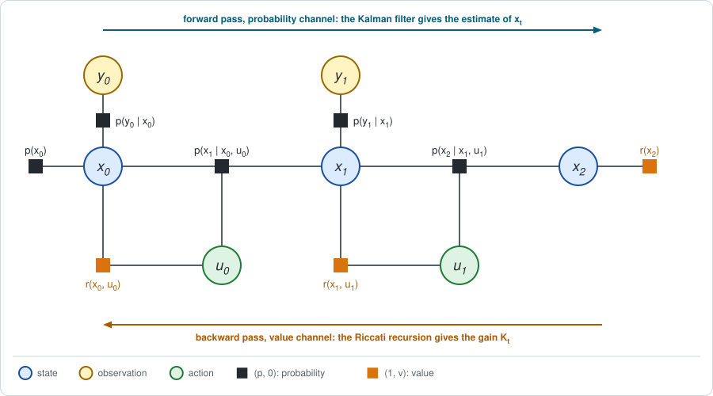

# Chapter 6: LQR and LQG

Part I worked with tables: a value for every state, a maximum by comparing
entries. A robot's state is a vector of real numbers, and no table can hold a
value for each. This part of the book keeps elimination *exact* in the one
continuous case where that is possible, and then relaxes it step by step.

The exact case is the **linear-quadratic** problem: linear dynamics with
Gaussian noise, and quadratic rewards. Every factor is then a Gaussian or a
quadratic, and stays one under elimination. It is the problem GTSAM was built
for, read in a new way. The short version:

- **LQR is one backward pass.** Eliminating each next state by average and
  each action by maximum, as in [Chapter 4](chapter04.md), gives the best
  policy in closed form. Line by line, the pass is the *Riccati recursion* of
  classic control.
- **The maximum is ordinary Gaussian elimination.** The feedback gain is the
  coefficient of a conditional, and the value matrix is a Schur complement.
- **An endless problem has a fixed point**, the algebraic Riccati equation,
  as in [Chapter 3](chapter03.md).
- **The Kalman filter is the forward pass** on the probability channel. It is
  the mirror image of the Riccati recursion: the same equation, run in the
  other direction, with the matrices exchanged.
- **LQG uses both passes.** If the robot sees its state only through a noisy
  sensor, the best policy applies the Riccati gain to the Kalman estimate.
  What the sensor noise costs can be read from the advantages.

The two examples of [Chapter 1](chapter01.md) return: this chapter is about
the robot on a line of its Section 8.

**Run the examples.** The code of this chapter's examples is in the companion
notebook [chapter06_examples.ipynb](chapter06_examples.ipynb), which runs
online:
[](https://colab.research.google.com/github/thduynguyen/gtsam/blob/feature/semiringfactor/gtsam/semiring/doc/chapter06_examples.ipynb)

## 1. The graph

**The problem, with matrices.** States and actions are vectors. The dynamics
are linear with Gaussian noise, and the rewards are negative quadratics, that
is, costs:

$$x_{t+1} = F\, x_t + B\, u_t + w_t, \quad w_t \sim N(0, \Sigma_w),
\qquad
r(x, u) = -\big(x^\top C_x\, x + u^\top C_u\, u\big),
\qquad
r(x_T) = -x_T^\top C_T\, x_T.$$

The first state is Gaussian, $x_0 \sim N(\mu_0, \Sigma_0)$.

The control literature writes these matrices $A$, $B$, $Q$, $R$. Here they are
$F$, $B$, $C_x$, $C_u$, because $A$, $Q$ and $R$ already stand for the
advantage, the action value and the return.

*The line of Chapter 1, Section 8,* is the smallest instance: every matrix is
the number 1, except the noise.

| Term | In general | On the line |
|---|---|---|
| dynamics | $x' = F x + B u + w$ | $x' = x + u + w$, so $F = B = 1$ |
| noise of the dynamics | $w \sim N(0, \Sigma_w)$ | $\Sigma_w = 0.5$ |
| reward of a move | $-(x^\top C_x x + u^\top C_u u)$ | $-(x^2 + u^2)$, so $C_x = C_u = 1$ |
| final reward | $-x_T^\top C_T x_T$ | $-x_2^2$, so $C_T = 1$, with $T = 2$ |
| first state | $N(\mu_0, \Sigma_0)$ | $N(2, 1)$ |

**The graph** is the decision graph of Chapter 4, Section 1, with $x$ for the
states and $u$ for the actions: a chain of states, one action per step, a
dynamics factor joining each state, its action and the next state, and a
reward factor on each state and action. There are no policy factors and no
parameter $\theta$. The agent may choose a separate action for every state and
step, so one backward pass will be enough.

| Term | Factor | As a pair |
|---|---|---|
| first state | the density $N(x_0;\; \mu_0,\; \Sigma_0)$ | $(p, 0)$ |
| dynamics | the density $N(x';\; F x + B u,\; \Sigma_w)$ | $(p, 0)$ |
| rewards | the quadratics above | $(1, r)$ |

One step of this graph, with the value of the future already on the next
state, is the starting point of Section 3:


## 2. A Gaussian semiring factor

Before eliminating, look at what one factor holds. Chapter 2, Section 6,
introduced the *log-dual* form of the pair, $(\ell, v)$ with $\ell = \log p$.
For this problem both numbers are **quadratic functions** of the variables:

- $\ell$ is the logarithm of a Gaussian, which is minus the squared error
  that GTSAM stores for a Gaussian factor;
- $v$ is a sum of quadratic rewards.

That is how the module stores a Gaussian semiring factor:

| Channel | What it is | Stored as | Read with |
|---|---|---|---|
| probability, $\ell$ | a Gaussian, possibly a product of several | a `GaussianFactorGraph` | `factor.gaussian()` |
| value, $v$ | a quadratic of any sign | a `HessianFactor` | `factor.value()` |

A dynamics factor has an $\ell$ and no value. A reward factor has a value and
no $\ell$:

```python
# (p, 0): the density N(x1; x0 + u0, 0.5), as a JacobianFactor.
dynamics = SemiringGaussianFactor(
    JacobianFactor(X(1), I, X(0), -I, U(0), -I, zero, variance(0.5)))

# (1, r): the reward -x1^2. A HessianFactor with G = 2 has error x1^2,
# and Cost lifts it to a value of minus that error.
final = SemiringGaussianFactor.Cost(HessianFactor(X(1), 2 * I, zero, 0.0))
```

**The three operations** act on the two quadratics:

| Operation | Probability channel $\ell$ | Value channel $v$ |
|---|---|---|
| multiply | the Gaussian factors are collected | the quadratics add |
| sum out $x$ | Gaussian elimination of $x$: the conditional $p(x \mid S)$ and the marginal on $S$ | the average of $v$ under $p(x \mid S)$: substitute the conditional mean for $x$, and add a trace term for its covariance |
| divide | the conditional $p(x \mid S)$ | $v$ minus that average: the surprise |

The rule for the value is the vector form of
$\mathbb{E}[z^2] = \mu^2 + \sigma^2$ from Chapter 1. For a Gaussian $z$ with
mean $\mu$ and covariance $\Sigma$, and any symmetric matrix $M$,

$$\mathbb{E}\big[z^\top M\, z\big] = \mu^\top M\, \mu + \operatorname{tr}(M\, \Sigma).$$

*On the line.* Multiply the two factors above and sum out $x_1$. The
conditional of $x_1$ is the dynamics, with mean $x_0 + u_0$ and variance
$0.5$, so the average of $-x_1^2$ is

$$\phi(x_0, u_0) = \big(1,\; -(x_0 + u_0)^2 - 0.5\big).$$

The notebook reads exactly this quadratic from
`dynamics.multiply(final).sum(ordering).value()`.

:::{dropdown} Why is the value kept apart from the Gaussian, if both are quadratics?
Because they play different roles, as in Chapter 1, Section 3. The $\ell$
channel is a log-probability: its quadratic must be negative semidefinite,
and elimination factorizes it by Cholesky. The $v$ channel is a value: it
may have any sign, and it is never factorized. It is only averaged.

Adding the two quadratics into one Gaussian factor is the "rewards as
probabilities" formulation. [Chapter 8](chapter08.md) shows what that
computes instead.
:::

## 3. Stage 1: the backward pass is the Riccati recursion

**What comes out.** Eliminating backward in time, each next state by average
and each action by maximum, the value factor on every state is a quadratic,

$$\big(1,\; V_t(x)\big), \qquad V_t(x) = -\big(x^\top P_t\, x + \beta_t\big),$$

and the conditional of every action is a linear feedback law,

$$u_t = -K_t\, x_t.$$

The matrices $P_t$, the constants $\beta_t$ and the gains $K_t$ follow from
three formulas, derived below.

**Starting point.** The future has left a value factor on $x' = x_{t+1}$
whose value is a quadratic, as above with $t + 1$ in place of $t$. At the last
step this is the final reward, so $P_T = C_T$ and $\beta_T = 0$.

**Eliminate the next state, by average.** The bucket holds the dynamics
$\big(N(x';\; F x + B u,\; \Sigma_w),\; 0\big)$ and the factor above. By the
rule of Section 2, the mean $F x + B u$ is substituted and a trace term is
added:

$$\phi(x, u) = \Big(1,\; -\big((F x + B u)^\top P_{t+1}\, (F x + B u)
+ \operatorname{tr}(P_{t+1} \Sigma_w) + \beta_{t+1}\big)\Big).$$


**Multiply with the reward.** Values add, giving the action value. Collecting
the terms in $u$ and $x$:

$$Q_t(x, u) = -\Big(u^\top H_{uu}\, u + 2\, u^\top H_{ux}\, x + x^\top H_{xx}\, x
+ \operatorname{tr}(P_{t+1} \Sigma_w) + \beta_{t+1}\Big),$$

$$H_{uu} = C_u + B^\top P_{t+1} B, \qquad
H_{ux} = B^\top P_{t+1} F, \qquad
H_{xx} = C_x + F^\top P_{t+1} F.$$

**Eliminate the action, by max.** $Q_t$ is a downward parabola in $u$, so its
maximum is where its derivative in $u$ vanishes:

$$H_{uu}\, u + H_{ux}\, x = 0
\quad\Longrightarrow\quad
u^* = -K_t\, x, \qquad
K_t = H_{uu}^{-1} H_{ux}
= \big(C_u + B^\top P_{t+1} B\big)^{-1} B^\top P_{t+1} F.$$

This is the conditional on $u$: the optimal policy, a linear feedback law with
gain $K_t$. Substituting $u^*$ back gives the new factor on $x$, of the same
form as the starting point:

$$P_t = C_x + F^\top P_{t+1} F
- F^\top P_{t+1} B\, \big(C_u + B^\top P_{t+1} B\big)^{-1} B^\top P_{t+1} F,
\qquad
\beta_t = \beta_{t+1} + \operatorname{tr}(P_{t+1} \Sigma_w).$$

The formula for $P_t$ is the **Riccati equation**.


**Eliminate the first state, by average.** With the prior
$x_0 \sim N(\mu_0, \Sigma_0)$, the constant left at the end is the best
expected return:

$$J^* = -\big(\mu_0^\top P_0\, \mu_0 + \operatorname{tr}(P_0 \Sigma_0) + \beta_0\big).$$

**The correspondence.**

| Elimination on the factor graph | Riccati recursion |
|---|---|
| value factor on the last state, $(1,\; -x_T^\top C_T x_T)$ | terminal condition $P_T = C_T$ |
| eliminate $x_{t+1}$ by average: substitute its mean $F x + B u$ | propagate $P_{t+1}$ through the dynamics, $(F x + B u)^\top P_{t+1} (F x + B u)$ |
| the trace term of that average | the cost of the noise, $\beta_t = \beta_{t+1} + \operatorname{tr}(P_{t+1} \Sigma_w)$; zero for deterministic dynamics |
| multiply with the reward factor: values add | add the stage cost: the blocks $H_{uu}$, $H_{ux}$, $H_{xx}$ |
| eliminate $u_t$ by max: solve $H_{uu}\, u = -H_{ux}\, x$ | the gain $K_t = (C_u + B^\top P_{t+1} B)^{-1} B^\top P_{t+1} F$ |
| conditional on $u_t$ | the control law $u_t = -K_t\, x_t$ |
| new factor on $x_t$ | the Riccati equation for $P_t$ |
| eliminate $x_0$ by average: the constant | the optimal cost, $-J^*$ |

*On the line,* where $F = B = C_x = C_u = C_T = 1$ and $\Sigma_w = 0.5$:

| step | gain | $P_t$ | $\beta_t$ | $V_t(x)$ |
|---|---|---|---|---|
| 2 | | 1 | 0 | $-x^2$ |
| 1 | $K_1 = \frac{1}{1 + 1} = 0.5$ | $1 + 1 - \frac{1}{2} = 1.5$ | 0.5 | $-(1.5\,x^2 + 0.5)$ |
| 0 | $K_0 = \frac{1.5}{1 + 1.5} = 0.6$ | $1 + 1.5 - \frac{1.5^2}{2.5} = 1.6$ | 1.25 | $-(1.6\,x^2 + 1.25)$ |

So the best policy is $u_1 = -0.5\,x_1$ and $u_0 = -0.6\,x_0$, the two moves
that the advantages of Chapter 1 pointed to. With $x_0 \sim N(2, 1)$,
$J^* = -(1.6 \cdot 5 + 1.25) = -9.25$, against $-9.825$ for the policy of
Chapter 1.

## 4. Stage 2: nothing left to do

In the terms of Chapter 5, Section 6, this algorithm has no outer stage. The
decisions are separate, one per state and step, and each maximum was taken
exactly inside the pass. The policy is read from the conditionals.

Three remarks on what the pass produced.

- **The max step is ordinary Gaussian elimination.** Maximizing a quadratic
  over $u$ and keeping what is left on $x$ is what GTSAM does to every variable
  of a least-squares problem. $K_t$ is the coefficient of the conditional, as
  in back-substitution, and $P_t = H_{xx} - H_{ux}^\top H_{uu}^{-1} H_{ux}$ is
  the Schur complement that Cholesky leaves on the separator. A SLAM reader has
  been computing Riccati steps all along. It requires $H_{uu}$ to be positive
  definite, which holds when effort is penalized.
- **Noise does not change the policy.** $\Sigma_w$ appears only in $\beta_t$,
  never in $K_t$ or $P_t$. The best action is the same as for deterministic
  dynamics; noise only lowers the return. This is called *certainty
  equivalence*.
- **The conditional still carries a surprise.** Its value channel is the
  regret of Chapter 2, Section 4:

  $$Q_t(x, u) - V_t(x) = -(u + K_t x)^\top H_{uu}\, (u + K_t x).$$

  It is zero at the best action and negative everywhere else, and it grows
  with the square of the distance from the best action. Section 7 uses it to
  price a noisy sensor.

:::{dropdown} How is a policy represented in LQR? Is it always a Gaussian?
In classical control, an LQR policy is **deterministic**: a linear feedback
law $u = -K x$, with one gain $K_t$ per step for a finite number of moves.
The optimal policy derived above has this form.

RL usually makes the policy **stochastic** by adding Gaussian noise to the same
linear law,

$$\pi(u \mid x) = N(u;\; -K x,\; \Sigma_e),$$

a *linear-Gaussian* policy. The noise makes the robot try moves other than its
average one, which is how RL explores, and it makes $\pi(u \mid x)$ a proper
density. This is the form evaluated in Chapter 1, with $K = 0.5$ and
$\Sigma_e = 0.1$.

The deterministic policy is the limit $\Sigma_e \to 0$. It is not a density,
but it can still be a factor: the hard constraint $u + K x = 0$, a
`JacobianFactor` with a constrained noise model. Elimination then substitutes
$u = -K x$ exactly.

For the line example the three returns line up as follows: $-9.825$ for
$K = 0.5$ with jitter, $-9.375$ for $K = 0.5$ without jitter, and $-9.25$ for
the optimal gains. Noise in the policy only costs reward, so the best
$\Sigma_e$ is zero. [Chapter 7](chapter07.md) optimizes the gain of such a
policy by gradient steps.
:::

## 5. The endless line: a fixed point

Chapter 3 showed that on an endless chain of identical steps the backward
message stops changing: it is a fixed point of one step of elimination. The
same holds here. The message is the matrix $P$.

**Unrolling.** Run the recursion of Section 3 over more and more moves on the
line:

| moves left | 1 | 2 | 3 | 4 | 6 | 12 |
|---|---|---|---|---|---|---|
| $P$ | $1.5$ | $1.6$ | $1.6154$ | $1.6176$ | $1.61803$ | $1.618034$ |
| $K$ | $0.5$ | $0.6$ | $0.6154$ | $0.6176$ | $0.61803$ | $0.618034$ |

**The fixed point.** A $P$ that the recursion maps to itself satisfies

$$P = C_x + F^\top P F - F^\top P B\, \big(C_u + B^\top P B\big)^{-1} B^\top P F,$$

the **algebraic Riccati equation**, with the stationary gain
$K = (C_u + B^\top P B)^{-1} B^\top P F$. It is the Bellman optimality equation
of Chapter 4, Section 5, for a quadratic value.

*On the line* the equation reads $P = 1 + P - P^2 / (1 + P)$, that is,
$P^2 = P + 1$. Its positive solution is the golden ratio,

$$P = \frac{1 + \sqrt{5}}{2} = 1.618\ldots, \qquad K = \frac{P}{1 + P} = \frac{1}{P} = 0.618\ldots$$

The best endless policy on the line removes $61.8\%$ of the distance to the
origin at every move.

**The constant does not settle without a discount.** Each step adds
$\operatorname{tr}(P \Sigma_w) = 1.618 \cdot 0.5 = 0.809$ to $\beta$: the
noise keeps pushing the robot away, and correcting it costs $0.809$ per move
forever. The undiscounted return of an endless noisy problem is $-\infty$ for
every policy; what the fixed point gives is the best policy, and the reward
lost per move.

**With a discount.** Using the termination factor of Chapter 3, the future
value is scaled by $\gamma$ in every backup,
$Q(x, u) = r(x, u) + \gamma\, \mathbb{E}[V(x') \mid x, u]$. The blocks become
$H_{uu} = C_u + \gamma B^\top P B$, $H_{ux} = \gamma B^\top P F$ and
$H_{xx} = C_x + \gamma F^\top P F$, and the constant now has a fixed point of
its own:

$$\beta = \gamma\, \big(\beta + \operatorname{tr}(P \Sigma_w)\big)
\quad\Longrightarrow\quad
\beta = \frac{\gamma\, \operatorname{tr}(P \Sigma_w)}{1 - \gamma}.$$

On the line with $\gamma = 0.9$: $P = 1.5884$, $K = 0.5884$, $\beta = 7.148$,
and $J^* = -(1.5884 \cdot 5 + 7.148) = -15.09$.

:::{dropdown} When does the fixed point exist?
Unrolling converges, and the resulting policy keeps the state bounded, under
two standard conditions on the matrices. The pair $(F, B)$ must be
*stabilizable*: every direction in which the state would grow by itself can
be reached by the actions. And the cost must *see* every such direction, so
that letting it grow is penalized. Both hold on the line: $u$ moves $x$
directly, and $x$ is penalized directly.
:::

## 6. The forward pass: the Kalman filter

So far the robot knew its state. Give it instead a noisy sensor: at every
step it receives an **observation**

$$y_t = G\, x_t + n_t, \qquad n_t \sim N(0, \Sigma_y).$$

On the line, $G = 1$ and $\Sigma_y = 0.5$: a position reading with the same
noise as a move.



Each observation adds one variable $y_t$ and one probability factor
$p(y_t \mid x_t) = N(y_t;\; G x_t,\; \Sigma_y)$. In SLAM terms it is a
measurement factor on the pose $x_t$.

**What comes out.** Eliminating the states *forward* in time, on the
probability channel alone, gives at each step the distribution of the current
state given the observations so far. It is a Gaussian,

$$d_t(x \mid y_{0:t}) = N\big(x;\; \hat x_t,\; \Sigma_{t \mid t}\big),$$

with a mean $\hat x_t$, the **estimate**, and a covariance
$\Sigma_{t \mid t}$. This is the forward message of Chapter 3, Section 5, now
conditioned on what was observed. The recursion that computes it is the
**Kalman filter**.

**One step.** Write $\Sigma_{t \mid t-1}$ for the covariance of $x_t$ before
the reading $y_t$ is used, and $\hat x_{t \mid t-1}$ for its mean. At the
first step these are $\Sigma_0$ and $\mu_0$.

*Use the reading.* The bucket of $x_t$ holds its prior and the observation
factor. Completing the square, or one step of Gaussian elimination, gives

$$L_t = \Sigma_{t \mid t-1} G^\top \big(G\, \Sigma_{t \mid t-1} G^\top + \Sigma_y\big)^{-1},
\qquad
\hat x_t = \hat x_{t \mid t-1} + L_t\, (y_t - G\, \hat x_{t \mid t-1}),
\qquad
\Sigma_{t \mid t} = \Sigma_{t \mid t-1} - L_t\, G\, \Sigma_{t \mid t-1}.$$

The matrix $L_t$ is the *Kalman gain*: how much of the difference between the
reading and its prediction is believed.

*Move.* Eliminating $x_t$ leaves a factor on $x_{t+1}$, the prior of the next
step. The action $u_t$ is known to the robot, since it chose it:

$$\hat x_{t+1 \mid t} = F\, \hat x_t + B\, u_t,
\qquad
\Sigma_{t+1 \mid t} = F\, \Sigma_{t \mid t} F^\top + \Sigma_w.$$

*On the line:*

| step | $\Sigma_{t \mid t-1}$ | $L_t$ | $\Sigma_{t \mid t}$ |
|---|---|---|---|
| 0 | $1$ | $\frac{1}{1 + 0.5} = 0.667$ | $1 - 0.667 = 0.333$ |
| 1 | $0.333 + 0.5 = 0.833$ | $\frac{0.833}{0.833 + 0.5} = 0.625$ | $0.833 - 0.625 \cdot 0.833 = 0.3125$ |

The notebook checks this against a plain `GaussianFactorGraph` holding the
prior, the two readings and the move, eliminated in the order $x_0, x_1$: the
conditional of $x_1$ has variance $0.3125$ and the mean that the formulas
give. No semiring is involved: the filter lives entirely in the probability
channel.

The covariances do **NOT** depend on the readings or on the actions. They can
be computed before the robot starts. Section 7 depends on this.

**Duality.** Substitute the update into the move. The covariance before each
reading then obeys a single recursion:

$$\Sigma_{t+1 \mid t} = \Sigma_w + F\, \Sigma_{t \mid t-1} F^\top
- F\, \Sigma_{t \mid t-1} G^\top \big(\Sigma_y + G\, \Sigma_{t \mid t-1} G^\top\big)^{-1} G\, \Sigma_{t \mid t-1} F^\top.$$

Compare it with the Riccati equation of Section 3. It is the same equation,
with other letters:

| | Controller (Section 3) | Filter (this section) |
|---|---|---|
| direction of the pass | backward in time | forward in time |
| channel | value | probability |
| message | a quadratic value, with matrix $P_t$ | a Gaussian, with covariance $\Sigma_{t \mid t-1}$ |
| what the message means | how much the future costs from a state | how uncertain the state is given the past |
| it starts from | the final cost $C_T$ | the prior covariance $\Sigma_0$ |
| each step adds | the cost of a step, $C_x$ | the noise of a move, $\Sigma_w$ |
| what limits its growth | the action, which is cheap when $C_u$ is small | the reading, which is good when $\Sigma_y$ is small |
| dynamics matrix | $F$ | $F^\top$ |
| coupling matrix | $B$ | $G^\top$ |
| gain | $K_t = (C_u + B^\top P B)^{-1} B^\top P F$ | $L_t = \Sigma\, G^\top (\Sigma_y + G\, \Sigma\, G^\top)^{-1}$ |

The notebook runs the *control* recursion on the exchanged matrices
$F^\top, G^\top, \Sigma_w, \Sigma_y, \Sigma_0$ and obtains the filter's
covariances $1,\; 0.833,\; 0.8125$. This is the duality of estimation and
control found by Kalman (1960); see the [references](#chapter06-references).
On the factor graph it is a statement about the two passes: one eliminates
backward and carries a value, the other eliminates forward and carries a
probability, and for Gaussians and quadratics the arithmetic of the two is
the same.

## 7. LQG: both passes together

Now the robot must act on its readings: it no longer knows $x_t$ when it
chooses $u_t$. This is the linear-quadratic-Gaussian problem, LQG.

**The answer first.** The best policy is the Riccati gain applied to the
Kalman estimate,

$$u_t = -K_t\, \hat x_t,$$

with $K_t$ from Section 3, computed as if the state were known, and
$\hat x_t$ from Section 6, computed without regard to the rewards. Its
expected return is the full-state optimum minus a price for each step:

$$J = J^* - \sum_t \operatorname{tr}\big(K_t^\top H_{uu, t}\, K_t\; \Sigma_{t \mid t}\big).$$

That the controller and the estimator can be designed apart is the
**separation principle**.

*On the line:*

$$J = -9.25 - \big(\underbrace{0.6^2 \cdot 2.5 \cdot 0.333}_{0.3}
+ \underbrace{0.5^2 \cdot 2 \cdot 0.3125}_{0.156}\big) = -9.706.$$

The noisy sensor costs $0.456$.

**Why, in three steps.**

*Step 1: any policy is priced by its advantages.* Let $Q^*_t$ and $V^*_t$ be
the values of Section 3. For any way of choosing the actions,

$$J = J^* + \sum_t \mathbb{E}\big[Q^*_t(x_t, u_t) - V^*_t(x_t)\big].$$

Each term is the regret of the action taken, which is never positive.

:::{dropdown} Why does this identity hold?
It is the "surprises add up" identity of Chapter 1, Section 7, written with
the optimal values. Along any trajectory, add and subtract the values of the
visited states:

$$R(\tau) - V^*_0(x_0) = \sum_t \big(r(x_t, u_t) + V^*_{t+1}(x_{t+1}) - V^*_t(x_t)\big),$$

where $V^*_T$ is the final reward. Take the average of each term over the
next state, given $x_t$ and $u_t$. By the definition of the action value,
$r(x_t, u_t) + \mathbb{E}[V^*_{t+1}(x_{t+1}) \mid x_t, u_t] = Q^*_t(x_t, u_t)$.
Averaging over everything else, and using
$\mathbb{E}[V^*_0(x_0)] = J^*$, gives the identity.
:::

*Step 2: the regret of acting on an estimate.* By the third remark of
Section 4, the regret is
$-(u_t + K_t x_t)^\top H_{uu,t}\, (u_t + K_t x_t)$. The robot does not know
$x_t$. Given its readings, $x_t$ is Gaussian with mean $\hat x_t$ and
covariance $\Sigma_{t \mid t}$, so $u_t + K_t x_t$ is Gaussian with mean
$u_t + K_t \hat x_t$ and covariance $K_t\, \Sigma_{t \mid t} K_t^\top$. By
the rule of Section 2 for averaging a quadratic,

$$\mathbb{E}\big[Q^*_t - V^*_t \;\big|\; y_{0:t}\big]
= -(u_t + K_t \hat x_t)^\top H_{uu,t}\, (u_t + K_t \hat x_t)
\;-\; \operatorname{tr}\big(K_t^\top H_{uu,t}\, K_t\, \Sigma_{t \mid t}\big).$$

*Step 3: choose the action.* The first term is zero for
$u_t = -K_t \hat x_t$ and negative otherwise. The second term cannot be
changed by any action, now or earlier, because $\Sigma_{t \mid t}$ does not
depend on the actions (Section 6). So every step is best served by
$u_t = -K_t \hat x_t$, no step can help another, and the sum of the second
terms is the price.

**Check, by elimination.** With both gains fixed, every estimate is a linear
function of the readings, so the policy is a hard linear constraint between
$u_t$ and $y_0, \dots, y_t$. The closed loop is then one semiring factor
graph on $x_0, y_0, u_0, x_1, y_1, u_1, x_2$, and `graph.expectation()`
returns $-9.70625$. A simulation of $400\,000$ episodes gives
$-9.714 \pm 0.012$.

**Check of the separation.** Moving any of the four gains away from its value
lowers the return computed by the same graph:

| change | $K_0 \pm 0.05$ | $K_1 \pm 0.05$ | $L_0 \pm 0.05$ | $L_1 \pm 0.05$ |
|---|---|---|---|---|
| change of $J$ | $-0.029$ | $-0.006$ | $-0.004$ | $-0.002$ |

**In the terms of Chapter 4.** There, a decision that cannot see the state
was listed as something that breaks the backward pass: the maximum over $u_t$
would have to be taken before $x_t$ is known. LQG is the case where it does
not break, for two reasons that are both special to it. The regret is a
quadratic, so its average over the unknown state depends on the estimate
only. And the uncertainty of the estimate does not depend on the actions.
[Chapter 22](chapter22.md) takes up the general case, where neither holds.

## 8. Exact special cases

Every number of this chapter is checked in the notebook against an
independent computation.

| Quantity | Computed by | Checked against |
|---|---|---|
| $K_t$, $P_t$, $\beta_t$, $J^* = -9.25$ | the Riccati formulas, in numpy | the reference numbers of the line |
| the same | elimination with the module: average over $x'$, maximum over $u$ | the row above |
| $P = 1.618$, $K = 0.618$ | unrolling 12 moves | the golden ratio, the solution of $P^2 = P + 1$ |
| filter means and variances | forward elimination of a `GaussianFactorGraph` | the Kalman formulas |
| filter covariances $1,\; 0.833,\; 0.8125$ | the control recursion on the exchanged matrices | the Kalman formulas |
| LQG return $-9.70625$ | elimination of the closed loop with the module | the price formula; a simulation |

## 9. Implementation

The backward pass with the module. There is no built-in maximum, so the gain
is read from the quadratic $Q_t$ and the best policy is put back as a hard
constraint, as in Chapter 4, Section 6. The helper `gaussian` lifts a
`JacobianFactor` to $(p, 0)$, `penalty` lifts the cost $z^2$ of one variable
to $(1, -z^2)$, and `quadratic` reads a value channel as a matrix and a
constant:

```python
gains = {}
value = penalty(X(2))                              # (1, V_2)
for t in reversed(range(2)):
    # Eliminate the next state by average.
    step = gaussian(X(t + 1), I, X(t), -I, U(t), -I, zero, variance(0.5))
    phi = step.multiply(value).sum(ordering(X(t + 1)))
    # Multiply with the rewards: values add, giving (1, Q_t).
    bucket = penalty(X(t)).multiply(penalty(U(t))).multiply(phi)
    # Maximize over u: solve H_uu u = -H_ux x for the gain.
    H, _ = quadratic(bucket, U(t), X(t))           # Q_t = z' H z + c
    gains[t] = H[0, 1] / H[0, 0]                   # 0.5 at t = 1, 0.6 at t = 0
    # The best policy u = -K x as a factor, then eliminate u.
    best = gaussian(U(t), I, X(t), gains[t] * I, zero,
                    noiseModel.Constrained.All(1))
    value = best.multiply(bucket).sum(ordering(U(t)))  # (1, V_t)

prior = gaussian(X(0), I, np.array([2.0]), variance(1.0))
prior.multiply(value).expectation()                # -9.25
```

The test `test_best_policy_is_riccati` in
`python/gtsam/tests/test_SemiringFactorGraph.py` checks these numbers.

The closed loop of Section 7 is a `SemiringFactorGraph` like that of
Chapter 1, Section 10, with two additions: an observation factor per step,
and the policy as a constraint on the readings.

```python
# The reading y_t = x_t + noise, as a probability factor.
graph.push_back(gaussian(Y(t), I, X(t), -I, zero, variance(0.5)))

# u0 = -K0 x_hat_0, with x_hat_0 = (1 - L0) mu_0 + L0 y0.
graph.push_back(gaussian(U(0), I, Y(0), K0 * L0 * I,
                         -K0 * (1 - L0) * mu_0, noiseModel.Constrained.All(1)))
```

The [companion notebook](chapter06_examples.ipynb) has the full graph.

## 10. What breaks

- **Dynamics that are not linear, rewards that are not quadratic.** The
  value stops being a quadratic after one backup, and the average and the
  maximum have no closed form. [Chapter 9](chapter09.md) linearizes around a
  trajectory and repeats.
- **Limits on the action.** A bounded action makes the maximum a constrained
  quadratic problem. It is no longer a linear solve, and the policy is no
  longer linear in the state.
- **A gain shared between steps or with a prescribed structure.** The
  maximum can then not be taken bucket by bucket (Chapter 4, Section 4).
  [Chapter 7](chapter07.md) optimizes such a gain with the two stages of
  Chapter 5.
- **An attitude toward risk.** Here the noise did not change the policy.
  With the tilt of Chapter 2 at the states it does
  ([Chapter 8](chapter08.md)).
- **Unknown matrices.** The pass needs $F$, $B$ and $\Sigma_w$. Learning them
  is the subject of [Chapter 18](chapter18.md).
- **Observations that are not linear-Gaussian.** The forward message is then
  not a Gaussian, its uncertainty depends on the actions, and separation
  fails: an action may be worth taking because of what it reveals
  (Chapters [22](chapter22.md) and [24](chapter24.md)).

## 11. Framework card

| | LQR | LQG |
|---|---|---|
| 1. Sum over the actions | maximum | maximum |
| 2. Dynamics factor | closed form: linear-Gaussian | closed form: linear-Gaussian, with an observation factor |
| 3. Backward messages | exact: a quadratic (Riccati recursion) | exact: the same quadratic |
| 4. Forward messages | not needed | exact: a Gaussian given the observations (Kalman filter) |
| 5. Stage 2 update | none: the policy is read from the conditionals | none: the gain is applied to the estimate |

(chapter06-references)=
## 12. References

- R. E. Kalman, "Contributions to the theory of optimal control", *Boletín de
  la Sociedad Matemática Mexicana*, 1960. The linear-quadratic regulator and
  the Riccati equation.
- R. E. Kalman, "A new approach to linear filtering and prediction problems",
  *Journal of Basic Engineering*, 1960. The filter, and its duality with the
  regulator.
- P. D. Joseph and J. T. Tou, "On linear control theory", *Transactions of the
  AIEE, Part II*, 1961; W. M. Wonham, "On the separation theorem of stochastic
  control", *SIAM Journal on Control*, 1968. The separation principle.
- B. D. O. Anderson and J. B. Moore, *Optimal Control: Linear Quadratic
  Methods*, Prentice Hall, 1990.
- D. P. Bertsekas, *Dynamic Programming and Optimal Control*, Athena
  Scientific. The Riccati recursion, certainty equivalence, and imperfect
  state information.
- E. Todorov, "General duality between optimal control and estimation", *IEEE
  Conference on Decision and Control*, 2008.
- F. Dellaert and M. Kaess, "Factor graphs for robot perception", *Foundations
  and Trends in Robotics*, 2017. Filtering and smoothing as elimination on a
  factor graph.

---

Previous: [Chapter 5: Gradients by elimination: the two-stage framework](chapter05.md).
Next: [Chapter 7: Policy optimization with exact messages](chapter07.md).
