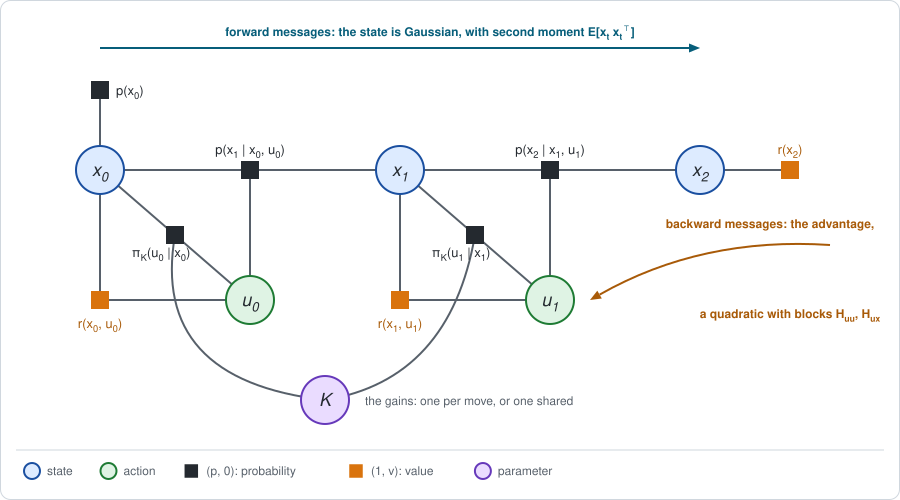

# Chapter 7: Policy optimization with exact messages

:::{div}
:class: in-progress
**This book is a work in progress.** It is still being written and revised: its content is incomplete and may contain errors.
:::

[Chapter 6](chapter06.md) found the best linear-quadratic policy in one
backward pass. That was possible because the agent could choose a separate
action for every state and step. [Chapter 4](chapter04.md) showed that this
stops working as soon as the policy has a parameter that several buckets
share, and [Chapter 5](chapter05.md) gave the replacement: two stages, an
inner elimination that evaluates the policy and an outer step that improves
its parameters.

This chapter runs the two stages on the linear-quadratic problem, where every
message is still exact. The policy is a linear feedback law with Gaussian
noise, and its parameter is the gain. Nothing is sampled, so the only new
thing is the outer loop. The short version:

- **Stage 1 is the Lyapunov recursion.** Evaluating a linear policy by
  elimination gives a quadratic value, as in Chapter 6, with an average over
  the action in place of the maximum.
- **The gradient has a closed form.** For each step it is the forward
  message, the second moment of the state, times the backward message, a
  block of the advantage, times the distance of the gain from the *greedy*
  gain that Chapter 6 would choose.
- **The natural gradient cancels the forward message.** What is left pulls
  each gain straight toward its greedy value. With the right step length it
  is policy iteration.
- **Stage 2 is the optimizer a SLAM reader knows.** The natural-gradient step
  is a Gauss-Newton step with the Fisher matrix, its damped form is
  Levenberg-Marquardt, and a step limited by a KL divergence is a trust
  region. GTSAM's own optimizers can run it.

**Run the examples.** The code of this chapter's examples is in the companion
notebook [chapter07_examples.ipynb](chapter07_examples.ipynb), which runs
online:
[](https://colab.research.google.com/github/thduynguyen/gtsam/blob/feature/semiringfactor/gtsam/semiring/doc/chapter07_examples.ipynb)

## 1. The graph

**The problem** is the linear-quadratic problem of Chapter 6, Section 1:

$$x_{t+1} = F\, x_t + B\, u_t + w_t, \quad w_t \sim N(0, \Sigma_w),
\qquad
r(x, u) = -\big(x^\top C_x\, x + u^\top C_u\, u\big),
\qquad
r(x_T) = -x_T^\top C_T\, x_T.$$

**The policy** is a linear feedback law with Gaussian noise, the
*linear-Gaussian* policy of Chapter 1, Section 8:

$$u_t = -K_t\, x_t + e_t, \quad e_t \sim N(0, \Sigma_e)
\qquad\Longleftrightarrow\qquad
\pi_K(u \mid x) = N\big(u;\; -K_t\, x,\; \Sigma_e\big).$$

The parameter is the gain: $\theta = K$. Two cases are treated.

- **One gain per move**, $\theta = (K_0, \dots, K_{T-1})$. The best gains are
  then the Riccati gains of Chapter 6, which makes this case a test.
- **One shared gain**, $\theta = K$, used at every move. This is the shared
  decision of Chapter 4, Section 4, and has no one-pass solution.

The noise covariance $\Sigma_e$ is held fixed. Section 5 says what happens if
it is not.



The graph is that of Chapter 5, Section 1, with Gaussians for tables: the
chain of states and actions, a policy factor on each pair $(x_t, u_t)$, and
the parameter joined to every policy factor.

*On the line of Chapter 1, Section 8,* every matrix is the number 1, with
$\Sigma_w = 0.5$, $x_0 \sim N(2, 1)$ and two moves. The policy noise is
$\Sigma_e = 0.1$. Chapter 1 evaluated the gains $K_0 = K_1 = 0.5$ and found
$J = -9.825$.

## 2. Stage 1: the Lyapunov recursion

Hold the gains fixed and eliminate backward in time, every variable by
average. This is the policy evaluation of Chapter 1, in matrices.

**What comes out.** The value factor on every state is a quadratic, and the
marginal of every state is a Gaussian:

$$V_t(x) = -\big(x^\top P_t\, x + \beta_t\big),
\qquad
d_t(x) = N\big(x;\; \mu_t,\; \Sigma_t\big).$$

Here $P_t$ and $\beta_t$ belong to the *given* policy. They are not the
optimal ones of Chapter 6, although they are written with the same letters.

### The backward message

**Eliminate the next state.** This step does not involve the policy, so it is
the one of Chapter 6, Section 3. Multiplied with the reward it gives the same
quadratic action value, with the same blocks:

$$Q_t(x, u) = -\Big(u^\top H_{uu}\, u + 2\, u^\top H_{ux}\, x + x^\top H_{xx}\, x
+ \operatorname{tr}(P_{t+1} \Sigma_w) + \beta_{t+1}\Big),$$

$$H_{uu} = C_u + B^\top P_{t+1} B, \qquad
H_{ux} = B^\top P_{t+1} F, \qquad
H_{xx} = C_x + F^\top P_{t+1} F.$$

**Eliminate the action, by average.** The bucket now holds the policy factor
as well. Averaging the quadratic $Q_t$ under $N(u;\; -K_t x,\; \Sigma_e)$
substitutes the mean $-K_t x$ for $u$ and adds a trace term for the
covariance (Chapter 6, Section 2):

$$P_t = C_x + K_t^\top C_u K_t + (F - B K_t)^\top P_{t+1}\, (F - B K_t),
\qquad
\beta_t = \beta_{t+1} + \operatorname{tr}(P_{t+1} \Sigma_w) + \operatorname{tr}(H_{uu} \Sigma_e).$$

This is the **Lyapunov recursion**. Compared with the Riccati recursion, the
maximum over $u$ has become a substitution of the policy's own action, and
the policy noise has added a cost of its own to the constant.

**The conditional of the action** holds the policy and, in its value channel,
the advantage. Write $e = u + K_t x$ for the deviation of the action from the
policy's mean, and define the **greedy gain**

$$K^+_t = H_{uu}^{-1} H_{ux}.$$

It is the gain that the maximum of Chapter 6 would choose at this step, given
the value $P_{t+1}$ that the *current* policy leaves for the future. Then

$$A_t(x, u) = Q_t(x, u) - V_t(x)
= \underbrace{-\, e^\top H_{uu}\, e + \operatorname{tr}(H_{uu} \Sigma_e)}_{\text{the size of the deviation}}
\;\; \underbrace{-\; 2\, e^\top H_{uu}\, (K^+_t - K_t)\, x}_{\text{its direction}}.$$

The first part averages to zero over the policy noise and says that large
deviations are bad. The second part is linear in $e$: it says in which
direction a deviation helps. If the gain is smaller than the greedy one, a
deviation opposite to $x$, a stronger correction, has a positive advantage.
This part vanishes exactly when $K_t = K^+_t$.

### The forward message

Eliminating forward, the state stays Gaussian. Its mean and covariance follow
the closed loop $x_{t+1} = (F - B K_t)\, x_t + B\, e_t + w_t$:

$$\mu_{t+1} = (F - B K_t)\, \mu_t,
\qquad
\Sigma_{t+1} = (F - B K_t)\, \Sigma_t\, (F - B K_t)^\top + B\, \Sigma_e B^\top + \Sigma_w.$$

What the gradient will need is the **second moment** of the state,

$$\mathbb{E}\big[x_t x_t^\top\big] = \Sigma_t + \mu_t \mu_t^\top.$$

### On the line

For $K_0 = K_1 = 0.5$:

| step $t$ | $H_{uu}$ | $H_{ux}$ | greedy gain $K^+_t$ | $P_t$ | $\beta_t$ | $\mu_t$ | $\Sigma_t$ | $\mathbb{E}[x_t^2]$ |
|---|---|---|---|---|---|---|---|---|
| 2 | | | | $1$ | $0$ | $0.5$ | $0.8125$ | $1.0625$ |
| 1 | $2$ | $1$ | $0.5$ | $1.5$ | $0.7$ | $1$ | $0.85$ | $1.85$ |
| 0 | $2.5$ | $1.5$ | $0.6$ | $1.625$ | $1.7$ | $2$ | $1$ | $5$ |

and $J = -(P_0\, \mathbb{E}[x_0^2] + \beta_0) = -(1.625 \cdot 5 + 1.7) = -9.825$,
the number of Chapter 1.

**With the module** all of this is the standard workflow of Chapter 5,
Section 3:

| Piece | From | In the module |
|---|---|---|
| $J$ | the constant left at the root | `graph.expectation()` |
| $H_{uu}$, $H_{ux}$ | the advantage, the surprise of the conditional on $u_t$ | `bayesNet.at(i).surprise()`, a `HessianFactor` |
| $\mu_t$, $\Sigma_t$ | the marginal of $x_t$ | `bayesTree.marginalFactor(key).conditional()` |

The notebook reads the table above from these three calls.

## 3. The gradient

**The answer first.** The derivative of the expected return with respect to
the gain of step $t$ is

$$\frac{\partial J}{\partial K_t}
= 2\; \underbrace{H_{uu}\, \big(K^+_t - K_t\big)}_{\text{backward message}}\;\;
\underbrace{\mathbb{E}\big[x_t x_t^\top\big]}_{\text{forward message}}.$$

It is a matrix of the same shape as $K_t$. For a shared gain, the derivative
is the sum of these over the steps.

In words: the gain should move toward the greedy gain; how strongly depends
on how costly a wrong action is ($H_{uu}$) and on how large the states are
that the gain is applied to.

**Derivation.** It is the formula of Chapter 5, Section 3, in its logarithmic
form, $\nabla_\theta J = \sum_t \mathbb{E}\big[g_t\, A_t(x_t, u_t)\big]$ with
the score term $g_t = \nabla_\theta \log \pi_\theta(u_t \mid x_t)$, evaluated
for a Gaussian policy.

*The local term.* The logarithm of the policy is
$-\tfrac{1}{2}\, e^\top \Sigma_e^{-1} e + \text{const}$ with $e = u + K_t x$,
so

$$g_t = \nabla_{K_t} \log \pi_K(u \mid x) = -\,\Sigma_e^{-1}\, e\, x^\top.$$

*Average over the action.* Multiply by the advantage of Section 2 and average
over $e \sim N(0, \Sigma_e)$, for a fixed $x$. The part of the advantage that
measures the size of the deviation contributes nothing: it is even in $e$,
and $g_t$ is odd. The part that is linear in $e$ gives

$$\mathbb{E}_e\big[g_t\, A_t\big]
= \mathbb{E}_e\Big[\big(-\Sigma_e^{-1}\, e\, x^\top\big)\,
\big(-2\, e^\top H_{uu}\, (K^+_t - K_t)\, x\big)\Big]
= 2\, \Sigma_e^{-1}\; \mathbb{E}\big[e\, e^\top\big]\; H_{uu}\, (K^+_t - K_t)\; x\, x^\top
= 2\, H_{uu}\, (K^+_t - K_t)\; x\, x^\top,$$

because $\mathbb{E}[e\, e^\top] = \Sigma_e$ cancels $\Sigma_e^{-1}$.

*Average over the state.* Averaging $x\, x^\top$ under the forward message
$d_t$ gives the second moment, and the formula above.

Two things are worth noticing.

- **The policy noise has dropped out.** The gradient does not depend on
  $\Sigma_e$, and it stays valid as $\Sigma_e \to 0$, for a deterministic
  policy. The noise was only the means of asking the advantage in which
  direction a deviation helps.
- **The gradient vanishes only at the greedy gain.** If $H_{uu}$ and the
  second moment are positive definite, $\partial J / \partial K_t = 0$
  requires $K_t = K^+_t$. When that holds at every step, the policy is greedy
  with respect to its own values, which is the Riccati recursion.

This closed form is due to Fazel, Ge, Kakade and Mesbahi (2018), for the
endless problem with a shared gain; see the
[references](#chapter07-references).

*On the line,* at $K_0 = K_1 = 0.5$:

$$\frac{\partial J}{\partial K_0} = 2 \cdot 2.5 \cdot (0.6 - 0.5) \cdot 5 = 2.5,
\qquad
\frac{\partial J}{\partial K_1} = 2 \cdot 2 \cdot (0.5 - 0.5) \cdot 1.85 = 0.$$

The last gain is already the best one. The first should be raised. The
notebook confirms both numbers by finite differences of
`graph.expectation()`, and at two other gains.

## 4. Stage 2: four updates

Stage 2 changes the gains, using what Stage 1 produced. Four updates are
compared, each a refinement of the one before.

### Gradient step

$$K_t \leftarrow K_t + \alpha\, \frac{\partial J}{\partial K_t}.$$

The step size $\alpha$ must be chosen by hand, and it must suit every step at
once, although the second moments differ by a factor of almost three between
the two moves. On the line $\alpha = 0.03$ works, and $\alpha = 0.1$
diverges.

### Natural-gradient step: Gauss-Newton with the Fisher matrix

**The Fisher matrix.** From Chapter 5, Section 5, with the score term $g_t$
above. For a scalar gain,

$$\mathcal{I}_{tt} = \mathbb{E}\big[g_t^2\big]
= \frac{\mathbb{E}[e^2]\; \mathbb{E}[x_t^2]}{\Sigma_e^2}
= \frac{\mathbb{E}[x_t^2]}{\Sigma_e},$$

and the entries between different steps are zero. For matrix gains the block
of step $t$ is $\Sigma_e^{-1} \otimes \mathbb{E}[x_t x_t^\top]$. On the line
at $K = (0.5, 0.5)$ it is $\operatorname{diag}(50,\; 18.5)$.

**The step.** Dividing the gradient by the Fisher matrix cancels the forward
message:

$$\mathcal{I}^{-1}\, \nabla_K J \;\;\text{at step } t
= \Sigma_e\; \frac{\partial J}{\partial K_t}\; \mathbb{E}\big[x_t x_t^\top\big]^{-1}
= 2\, \Sigma_e\, H_{uu}\, \big(K^+_t - K_t\big),$$

$$K_t \leftarrow K_t + 2\, \alpha\, \Sigma_e\, H_{uu}\, \big(K^+_t - K_t\big).$$

Each gain moves straight toward its greedy value, by a fraction that no
longer depends on how large the states are. This is what Chapter 5 found for
the track, where the natural gradient was the advantage gap of each cell
regardless of how often the cell is visited.

:::{dropdown} One more division gives policy iteration
The fraction $2\, \alpha\, \Sigma_e H_{uu}$ still depends on the step through
$H_{uu}$. Dividing by it as well, that is, taking
$\alpha = (2\, \Sigma_e H_{uu})^{-1}$ separately at every step, gives

$$K_t \leftarrow K^+_t.$$

Each gain *jumps* to its greedy value. This is the greedy Stage 2 of policy
iteration (Chapter 4, Section 5): evaluate the policy, then take the best
action against its values. For the endless linear-quadratic problem it is
known as Hewer's algorithm. On the line it reaches the Riccati gains in two
sweeps: $(0, 0) \to (0.667, 0.5) \to (0.6, 0.5)$.

Fazel et al. call this last form the Gauss-Newton step. It is an exact Newton
step on each $K_t$: with the other gains fixed, $J$ is a quadratic in $K_t$
with curvature $2\, H_{uu}\, \mathbb{E}[x_t x_t^\top]$. The Fisher matrix
$\mathbb{E}[x_t x_t^\top] / \Sigma_e$ has the right dependence on the forward
message but not on $H_{uu}$, so the natural gradient is a Gauss-Newton step
whose length still has to be chosen.
:::

### Damped step: Levenberg-Marquardt

$$K \leftarrow K + \big(\mathcal{I} + \lambda_{\text{LM}}\, I\big)^{-1}\, \nabla_K J.$$

A large damping $\lambda_{\text{LM}}$ turns the step into a short gradient
step, and a small one into the natural-gradient step. It protects against a
Fisher matrix that is nearly singular, which Chapter 5 met on the track.

### Trust-region step

Limit how far the *behavior* may move in one iteration, measured by the KL
divergence between the old and the new distribution over trajectories. For
this policy the quadratic formula of Chapter 5, Section 5, is exact:

$$\mathrm{KL}\big(p_K \,\|\, p_{K + \Delta K}\big)
= \sum_t \frac{\mathbb{E}\big[(\Delta K_t\, x_t)^2\big]}{2\, \Sigma_e}
= \tfrac{1}{2}\, \Delta K^\top\, \mathcal{I}\, \Delta K,$$

written here for scalar gains. The largest step along the natural gradient
that stays within $\mathrm{KL} \le D_{\max}$ is

$$\Delta K = \sqrt{\frac{2\, D_{\max}}{\nabla J^\top\, \mathcal{I}^{-1}\, \nabla J}}\;\; \mathcal{I}^{-1}\, \nabla J.$$

Far from the optimum this step is on the boundary of the region. Close to it
the boundary lies beyond the optimum, so the step is halved until $J$
improves. Stage 1 is exact here, so that test is one more elimination.

This is the update of TRPO, the algorithm of [Chapter 14](chapter14.md),
with every quantity computed exactly.

### On the line

Starting from $K = (0, 0)$, a robot that never corrects, with $\alpha = 0.03$
for the gradient, $\alpha = 1$ for the natural gradient,
$\lambda_{\text{LM}} = 20$ and $D_{\max} = 0.5$:

| iteration | gradient | natural gradient | damped | trust region |
|---|---|---|---|---|
| 0 | $-17.000$ | $-17.000$ | $-17.000$ | $-17.000$ |
| 1 | $-9.775$ | $-10.632$ | $-11.718$ | $-14.216$ |
| 2 | $-9.752$ | $-9.890$ | $-10.411$ | $-12.152$ |
| 5 | $-9.718$ | $-9.705$ | $-9.774$ | $-9.706$ |
| 10 | $-9.703$ | $-9.700$ | $-9.709$ | $-9.700$ |
| 20 | $-9.7001$ | $-9.7000$ | $-9.7002$ | $-9.7000$ |

All four reach the gains $(0.6,\; 0.5)$ and $J = -9.70$. The gradient step
does well at first, because its hand-tuned step size happens to suit the
starting point, and then slows down. The natural gradient converges at a
steady rate without tuning. The trust region deliberately moves slowly while
it is far away.

### The same loop in GTSAM

| This chapter | Nonlinear least squares in GTSAM |
|---|---|
| Stage 1 at the current gains | linearize at the current estimate |
| Fisher matrix $\mathcal{I}$ | the information matrix $W^\top W$ of the linearized factors, with Jacobian $W$ |
| natural-gradient system $\mathcal{I}\, \Delta K = \nabla_K J$ | the normal equations of a Gauss-Newton step |
| damping $\lambda_{\text{LM}}$ | the damping of Levenberg-Marquardt |
| the bound $D_{\max}$ on the KL divergence | the radius of a Dogleg trust region |

Section 6 runs the loop with GTSAM's optimizers and says where the
correspondence ends.

## 5. Exact special cases

### One gain per move: the Riccati gains

With a separate gain for each move, the best policy of this family is the
best linear policy, so Stage 2 must converge to the gains of Chapter 6. It
does: all four updates end at $K_0 = 0.6$, $K_1 = 0.5$.

The return there is $-9.70$, not the $J^* = -9.25$ of Chapter 6. The
difference is the price of the policy noise, the trace term that Section 2
added to $\beta_t$:

$$J(K, \Sigma_e) = J(K, 0) - \sum_t \operatorname{tr}(H_{uu,t}\, \Sigma_e)
= -9.25 - 0.1 \cdot (2.5 + 2) = -9.70.$$

Evaluating the same gains with the noise removed, as a hard constraint
$u = -K_t x$, the module returns $-9.25$.

**Noise only costs.** The formula shows that $J$ decreases in $\Sigma_e$. If
$\Sigma_e$ were a parameter too, exact optimization would shrink it to zero.
In this chapter the noise has no benefit because the gradient is computed
exactly. It becomes useful when the gradient must be estimated from sampled
actions ([Chapter 11](chapter11.md)), and it is rewarded explicitly by the
entropy term of [Chapter 8](chapter08.md).

### A shared gain

With one gain $K$ for both moves, the gradient is the sum over the steps, and
so is the Fisher matrix:

$$\frac{dJ}{dK} = \sum_t 2\, H_{uu,t}\, \big(K^+_t - K\big)\, \mathbb{E}[x_t^2],
\qquad
\mathcal{I} = \sum_t \frac{\mathbb{E}[x_t^2]}{\Sigma_e}.$$

Now the forward messages do **NOT** cancel in the natural gradient. They
weigh the two steps against each other: the shared gain is pulled toward
$K^+_0$ and toward $K^+_1$, in proportion to how large the state is at each
step. This is the role of the forward message that Chapter 5, Section 6,
pointed out.

Natural-gradient steps with $\alpha = 1$, from $K = 0$:

| iteration | 0 | 1 | 2 | 5 | 10 | 30 |
|---|---|---|---|---|---|---|
| $K$ | $0$ | $0.294$ | $0.428$ | $0.556$ | $0.5813$ | $0.5828$ |
| $J$ | $-17.000$ | $-11.129$ | $-10.095$ | $-9.734$ | $-9.7239$ | $-9.7239$ |

The limit agrees with an independent computation: a scalar search for the
maximum of the closed-form $J(K, K)$ gives $K = 0.5828$ and $J = -9.7239$.
Sharing the gain costs $0.024$ compared with a gain per move. The shared gain
lies between the two Riccati gains $0.5$ and $0.6$, closer to the gain of the
first move, where the state is larger.

### All checks

| Quantity | Computed by | Checked against |
|---|---|---|
| $J = -9.825$ at $K = (0.5, 0.5)$ | elimination with the module | the Lyapunov formulas; Chapter 1 |
| $H_{uu}$, $H_{ux}$, $\mathbb{E}[x_t^2]$ | conditionals and marginals of the module | the Lyapunov formulas |
| the gradient, at three gains | the closed form of Section 3 | finite differences of `graph.expectation()` |
| the gradient and $\mathcal{I} = \operatorname{diag}(50, 18.5)$ | the closed forms | $\mathbb{E}[g\, R]$ and $\mathbb{E}[g\, g^\top]$ over a million simulated episodes |
| the gains $(0.6, 0.5)$ and $J = -9.25$ without noise | Stage 2, four updates | the Riccati recursion of Chapter 6 |
| the shared gain $0.5828$ | natural-gradient steps | a scalar search on the closed-form $J$ |

## 6. Implementation

**Stage 1 with the module.** The graph is that of Chapter 1, Section 10, with
the gains as arguments. The backward message is read from the conditionals,
the forward message from the marginals:

```python
def stage1(K):
    """J, the blocks (H_uu, H_ux) of each advantage, and E[x_t^2]."""
    graph = build(K)
    bayes_net = graph.eliminateSequential(
        ordering(X(2), U(1), X(1), U(0), X(0)))
    blocks = {}
    for t, position in [(1, 1), (0, 3)]:   # the conditionals of u_1 and u_0
        surprise = bayes_net.at(position).surprise()   # A_t, on (u_t, x_t)
        info = surprise.augmentedInformation()          # A = z' (info / 2) z
        blocks[t] = (-0.5 * info[0, 0], -0.5 * info[0, 1])   # H_uu, H_ux
    bayes_tree = graph.eliminateMultifrontal()
    second_moment = {}
    for t in range(2):
        marginal = bayes_tree.marginalFactor(X(t)).conditional()
        mean = (marginal.d() / marginal.R()).item()
        var = (1 / marginal.R() ** 2).item()
        second_moment[t] = mean ** 2 + var
    return graph.expectation(), blocks, second_moment
```

**Stage 2 in numpy.** The gradient and the four updates are one line each:

```python
def gradient(K, blocks, second_moment):
    return np.array([2 * (blocks[t][1] - blocks[t][0] * K[t]) *
                     second_moment[t] for t in range(2)])

fisher = np.diag([second_moment[t] / Sigma_e for t in range(2)])
K += 0.03 * g                                         # gradient
K += np.linalg.solve(fisher, g)                       # natural gradient
K += np.linalg.solve(fisher + 20 * np.eye(2), g)      # damped
```

**Stage 2 with GTSAM's optimizers.** GTSAM's nonlinear optimizers minimize a
sum of squared residuals. At each iteration they take a factor's residual $h$
and its Jacobian $W$, and solve

$$\big(W^\top W + \text{damping}\big)\, \Delta = -W^\top h.$$

A custom factor on the gains with

$$W = \mathcal{I}^{1/2}, \qquad h = -\,\mathcal{I}^{-1/2}\, \nabla_K J$$

makes this the natural-gradient system $\mathcal{I}\, \Delta = \nabla_K J$,
since $W^\top W = \mathcal{I}$ and $-W^\top h = \nabla_K J$. (In the code
below the Jacobian is the argument `H`, GTSAM's name for it.) Every evaluation
of the factor runs Stage 1:

```python
def natural_gradient_factor(this, values, H):
    K = values.atVector(KEY)
    J, blocks, second_moment = stage1(K)                 # stage 1
    root = np.sqrt(np.diag(fisher(second_moment)))       # I^(1/2), diagonal
    if H is not None:
        H[0] = np.diag(root)
    return -gradient(K, blocks, second_moment) / root

graph = gtsam.NonlinearFactorGraph()
graph.add(gtsam.CustomFactor(noiseModel.Unit.Create(2), [KEY],
                             natural_gradient_factor))
result = gtsam.LevenbergMarquardtOptimizer(graph, initial, params).optimize()
```

On the line, `GaussNewtonOptimizer`, `LevenbergMarquardtOptimizer` and
`DoglegOptimizer` all converge from $K = (0, 0)$ to $(0.6,\; 0.5)$, in 26
iterations each.

**What the correspondence is, and what it is not.**

- *It is* the same linear system at every iteration: a Gauss-Newton step in
  GTSAM is a natural-gradient step with $\alpha = 1$, the damping of
  Levenberg-Marquardt is $\lambda_{\text{LM}}$, and Dogleg restricts the
  step to a region.
- *It is not* the same measure of progress. GTSAM accepts steps and decides
  when to stop by the error $\tfrac{1}{2} \lVert h \rVert^2 =
  \tfrac{1}{2}\, \nabla J^\top \mathcal{I}^{-1} \nabla J$, the squared length
  of the natural gradient. That is zero exactly where the gradient vanishes,
  but it is not $J$. The trust-region step of Section 4 tests $J$ itself.
- *It is not* a true least-squares problem. The matrix $W$ was chosen to
  produce the natural-gradient system; it is not the derivative of $h$. So
  GTSAM's prediction of how the error will change is not exact, and its
  convergence theory does not carry over.
- *The Dogleg region is a ball in the gains*, not in the KL divergence. The
  two agree only after a change of variables by $\mathcal{I}^{1/2}$, which
  itself changes with the gains.

On this problem none of the differences shows: no step was damped or
restricted, and the three optimizers took identical steps.

## 7. What breaks

- **The matrices must be known.** Both messages were computed from $F$, $B$
  and $\Sigma_w$. Without them the forward message becomes a set of sampled
  states and the backward message an estimate
  (Chapters [11](chapter11.md) to [13](chapter13.md)), or the matrices are
  learned first ([Chapter 18](chapter18.md)).
- **The messages are valid only at the current gains.** After an update,
  $H_{uu}$, $K^+_t$ and the second moments have all changed. Here Stage 1 is
  cheap and is rerun every iteration. When it is expensive, old messages are
  reused, and the size of the step must be controlled
  ([Chapter 14](chapter14.md)).
- **An endless problem can have no value at all.** With a shared gain on an
  endless chain, a gain for which the closed loop $F - B K$ is unstable makes
  the state grow without bound, and $J = -\infty$. The iteration must start
  from a stabilizing gain and must not step out of that set. Inside it, $J$
  is not concave in $K$, but Fazel et al. show that it has no stationary
  point other than the optimum.
- **Small policy noise makes the Fisher matrix large.** $\mathcal{I}$ grows
  as $1 / \Sigma_e$, so the natural-gradient step shrinks in proportion to
  $\Sigma_e$, and a fixed KL bound allows only tiny changes of a nearly
  deterministic policy.
- **Dynamics that are not linear.** The value is then not a quadratic and
  the state is not Gaussian. [Chapter 9](chapter09.md) linearizes and
  repeats.

## 8. Framework card

| | Exact policy gradient (LQ) | Natural gradient (LQ) | Trust region (LQ) |
|---|---|---|---|
| 1. Sum over the actions | average under $\pi_K$ | average under $\pi_K$ | average under $\pi_K$ |
| 2. Dynamics factor | closed form: linear-Gaussian | closed form: linear-Gaussian | closed form: linear-Gaussian |
| 3. Backward messages | exact: a quadratic (Lyapunov recursion) | exact: a quadratic | exact: a quadratic |
| 4. Forward messages | exact: Gaussian state marginals | exact: Gaussian state marginals | exact: Gaussian state marginals |
| 5. Stage 2 update | gradient | natural gradient: Gauss-Newton with the Fisher matrix; damped: Levenberg-Marquardt | trust region on the KL divergence |

(chapter07-references)=
## 9. References

- M. Fazel, R. Ge, S. Kakade and M. Mesbahi, "Global convergence of policy
  gradient methods for the linear quadratic regulator", *ICML*, 2018. The
  exact gradient, and the gradient, natural-gradient and Gauss-Newton updates
  of the gain.
- G. Hewer, "An iterative technique for the computation of the steady state
  gains for the discrete optimal regulator", *IEEE Transactions on Automatic
  Control*, 1971. Policy iteration for the linear-quadratic problem.
- S. Kakade, "A natural policy gradient", *NeurIPS*, 2002.
- J. Peters and S. Schaal, "Natural actor-critic", *Neurocomputing*, 2008.
  The natural gradient for Gaussian policies in robotics.
- J. Schulman, S. Levine, P. Abbeel, M. Jordan and P. Moritz, "Trust region
  policy optimization", *ICML*, 2015.
- J. Nocedal and S. J. Wright, *Numerical Optimization*, 2nd edition,
  Springer, 2006. Gauss-Newton, Levenberg-Marquardt and Dogleg.

---

Previous: [Chapter 6: LQR and LQG](chapter06.md).
Next: [Chapter 8: Softness and risk](chapter08.md).
