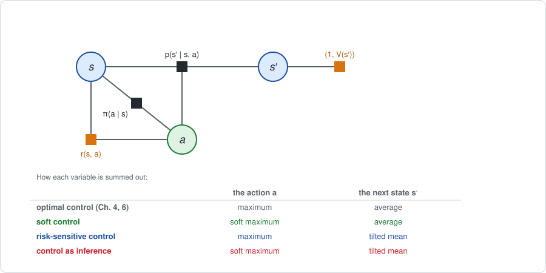
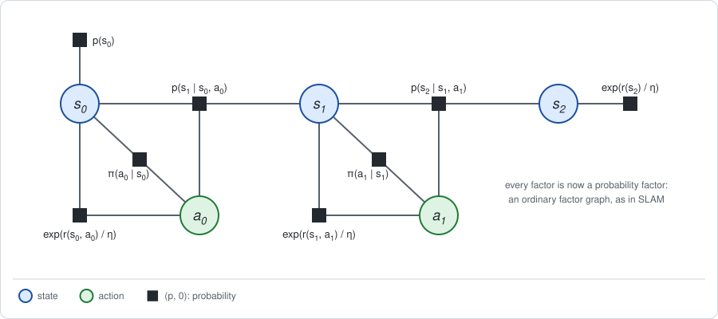

# Chapter 8: Softness and risk

Chapters [4](chapter04.md), [6](chapter06.md) and [7](chapter07.md) used two
sums: the average, for what the agent does not choose, and the maximum, for
what it does. [Chapter 2](chapter02.md) introduced a third, the *tilted
mean*, which lies between them. This chapter puts the tilted mean on the
decision graph. Where it is applied decides what it means:

- **On the actions it is a soft choice.** The agent prefers good actions
  without committing to the best one. Its policy is the tilted conditional of
  Chapter 2, and its value is the plain return minus a price for departing
  from a base policy. This is *maximum-entropy* control.
- **On the states it is an attitude toward risk.** A pessimistic tilt makes
  the agent act as if the noise were against it. For linear-quadratic
  problems the Riccati recursion changes in one place, and breaks down if the
  pessimism is too strong.
- **On both it is inference in an ordinary factor graph**, with every reward
  turned into a probability factor. The backup becomes linear, and any
  elimination order is valid. But the result is **optimistic**: it lets the
  agent choose its luck. On the track it claims a return of almost 9 where
  no policy can collect more than 6.1, and the policy it produces collects
  3.15.
- **The fix is to keep the dynamics factor fixed**: tilt the actions, average
  the states. That is the first case again.

**Run the examples.** The code of this chapter's examples is in the companion
notebook [chapter08_examples.ipynb](chapter08_examples.ipynb), which runs
online:
[](https://colab.research.google.com/github/thduynguyen/gtsam/blob/feature/semiringfactor/gtsam/semiring/doc/chapter08_examples.ipynb)

## 1. The graph

**The tilted mean**, from Chapter 2, Section 2. For a variable $x$ with
probabilities $p(x \mid S)$ and values $v(x, S)$,

$$\bar v_\kappa(S) = \frac{1}{\kappa} \log \sum_x p(x \mid S)\, e^{\kappa\, v(x, S)}.$$

The *tilt* $\kappa$ moves it from the smallest value ($\kappa \to -\infty$)
through the average ($\kappa \to 0$) to the largest ($\kappa \to +\infty$).
With a *temperature* $\eta = 1 / \kappa > 0$ it is called the soft maximum.

**The graph** is the factor graph of [Chapter 1](chapter01.md): states,
actions, a prior, dynamics factors, reward factors, and a policy factor on
each state and action. The policy factor now has a different role. It is a
**base policy** $\pi(a \mid s)$: what the agent does when it has no reason to
prefer one action. The agent's actual policy is an output, as in Chapter 4.
On the track the base policy is the coin flip.

There is no parameter $\theta$: the decisions are separate, one per state and
step, so one backward pass is enough in every case of this chapter. The cases
differ in which sum eliminates each variable.



| | Sum over the action | Sum over the next state | Section |
|---|---|---|---|
| optimal control | maximum | average | Chapters 4 and 6 |
| soft control | soft maximum, temperature $\eta$ | average | 2 |
| control as inference | soft maximum, temperature $\eta$ | tilted mean, $\kappa = 1 / \eta$ | 3 and 5 |
| risk-sensitive control | maximum | tilted mean, tilt $\kappa$ | 4 |

The examples are the track of Chapter 1, Section 7, and the line of its
Section 8.

## 2. Stage 1, softly: a soft maximum over the actions

**The backup.** Eliminate the next state by average, as always, and the
action by the soft maximum under the base policy:

$$Q_t(s, a) = r(s, a) + \sum_{s'} p(s' \mid s, a)\, V_{t+1}(s'),
\qquad
V_t(s) = \eta \log \sum_a \pi(a \mid s)\, e^{Q_t(s, a) / \eta}.$$

**The conditional** of the action is the tilted conditional of Chapter 2,
Section 5, a normalized distribution over the actions:

$$q_t(a \mid s) = \pi(a \mid s)\; e^{\left(Q_t(s, a) - V_t(s)\right) / \eta}.$$

This is the policy that the pass produces, the **soft policy**. It is the
base policy, reweighted toward the actions with a high value. The exponent is
the *soft advantage* of Chapter 2, Section 4, divided by the temperature.

**What it optimizes, first.** The soft value is the best trade-off between
collecting reward and staying close to the base policy:

$$V_t(s) = \max_q \Big[\sum_a q(a)\, Q_t(s, a) \;-\; \eta\; \mathrm{KL}\big(q \,\|\, \pi(\cdot \mid s)\big)\Big],$$

and the maximum is attained by $q_t$. Applied at every step, the number left
at the root is

$$J_\eta = \max_{\text{policies } q}\; \Big(\mathbb{E}_q[R] \;-\; \eta\, \sum_t \mathbb{E}_q\Big[\mathrm{KL}\big(q_t(\cdot \mid s_t) \,\|\, \pi(\cdot \mid s_t)\big)\Big]\Big).$$

The temperature is the price of one unit of KL divergence from the base
policy, in units of reward.

:::{dropdown} Why is the soft maximum the solution of this trade-off?
Fix a state and write $q^*(a) = \pi(a)\, e^{(Q(a) - V) / \eta}$ with
$V = \eta \log \sum_a \pi(a)\, e^{Q(a) / \eta}$. Taking logarithms,
$Q(a) = V + \eta \log \big(q^*(a) / \pi(a)\big)$. Substitute this for $Q$ in
the objective, for an arbitrary distribution $q$:

$$\sum_a q(a)\, Q(a) - \eta \sum_a q(a) \log \frac{q(a)}{\pi(a)}
= V + \eta \sum_a q(a) \log \frac{q^*(a)}{\pi(a)} - \eta \sum_a q(a) \log \frac{q(a)}{\pi(a)}
= V - \eta\; \mathrm{KL}(q \,\|\, q^*).$$

A KL divergence is never negative and is zero only for $q = q^*$. So the
objective is at most $V$, with equality exactly at $q^*$.
:::

:::{dropdown} Why is this called maximum-entropy control?
The **entropy** of a distribution measures how spread out it is,

$$\mathcal{H}(q) = -\sum_a q(a) \log q(a).$$

If the base policy is uniform over $n_a$ actions,
$\mathrm{KL}(q \,\|\, \pi) = \log n_a - \mathcal{H}(q)$. The objective is then

$$\mathbb{E}_q[R] + \eta\, \sum_t \mathbb{E}_q\big[\mathcal{H}\big(q_t(\cdot \mid s_t)\big)\big] - \text{const}:$$

collect reward, and get a bonus of $\eta$ for every unit of entropy of the
policy. The soft policy is as random as it can afford to be.
:::

*On the track,* with the coin flip as base policy and $\eta = 1$. The last
move is the example of Chapter 2, Section 5:

| cell | $q_1(L \mid s)$, $q_1(R \mid s)$ at the last move | $q_0(L \mid s)$, $q_0(R \mid s)$ at the first move |
|---|---|---|
| 0 | $0.731$, $0.269$ | $0.013$, $0.987$ |
| 1 | $0.001$, $0.999$ | $0.003$, $0.997$ |
| 2 | $0.001$, $0.999$ | $0.354$, $0.646$ |

The soft policy agrees with the best policy of Chapter 4 where the choice
matters, and stays close to the coin flip where it matters little. The soft
value is $J_\eta = 4.754$. The plain expected return of the soft policy is
$6.028$, its expected KL divergence from the coin flip is $1.275$, and
$6.028 - 1 \cdot 1.275 = 4.754$.

For several temperatures:

| $\eta$ | $10$ | $2$ | $1$ | $0.5$ | $0.2$ | $0.05$ |
|---|---|---|---|---|---|---|
| soft value $J_\eta$ | $1.864$ | $3.672$ | $4.754$ | $5.413$ | $5.823$ | $6.031$ |
| plain return of the soft policy | $2.353$ | $5.390$ | $6.028$ | $6.088$ | $6.099$ | $6.100$ |

As $\eta \to \infty$ leaving the base policy is unaffordable, and both rows
tend to the $1.4$ of the coin flip. As $\eta \to 0$ the soft maximum becomes
the maximum, and both tend to $J^* = 6.1$.

**Continuous actions.** On the line the action value is the quadratic of
Chapter 6, Section 3, which in terms of the gain $K_t$ reads
$Q_t(x, u) = V_t(x) - (u + K_t x)^\top H_{uu}\, (u + K_t x)$. Take a flat
base measure over $u$. The tilted conditional is then proportional to
$e^{Q_t / \eta}$, a Gaussian:

$$q_t(u \mid x) = N\Big(u;\; -K_t\, x,\;\; \tfrac{\eta}{2}\, H_{uu}^{-1}\Big).$$

The soft policy is the **Riccati gain plus Gaussian noise**. The gain is
unchanged, because the soft maximum of a quadratic differs from its maximum
by a constant. The noise is large where a wrong action is cheap ($H_{uu}$
small) and small where it is costly. On the line with $\eta = 1$ the
variances are $0.5 / 2.5 = 0.2$ at the first move and $0.5 / 2 = 0.25$ at the
last.

This is the linear-Gaussian policy of [Chapter 7](chapter07.md), with one
difference: there the noise $\Sigma_e$ only cost reward, and exact
optimization would remove it. Here the entropy bonus pays for it, and the
optimal amount is finite.

## 3. The tilt on every variable: linear backups, and inference

Now use the same tilted sum for the states as for the actions, with
$\kappa = 1 / \eta$.

### One sum for all variables

Chapter 2, Section 3, showed what one sum buys: the three axioms of
elimination hold, so **any elimination order is valid**. And in the stored
form $(p, m)$ with $m = p\, e^{v / \eta}$, the tilted semiring is plain
sum-product on each channel. Elimination with it is the generic routine of
Chapter 2.

**The backup is linear** in the tilted value $e^{V / \eta}$. Writing out the
two tilted sums of one step,

$$e^{V_t(s) / \eta} = \sum_a \pi(a \mid s)\; e^{r(s, a) / \eta} \sum_{s'} p(s' \mid s, a)\; e^{V_{t+1}(s') / \eta}.$$

The right side is a matrix applied to the vector $e^{V_{t+1} / \eta}$. A
whole backward pass is a product of matrices.

Compare the soft control of Section 2, where the next state is averaged
*before* the exponential is taken:

$$e^{V_t(s) / \eta} = \sum_a \pi(a \mid s)\; e^{r(s, a) / \eta}\; \exp\Big(\frac{1}{\eta} \sum_{s'} p(s' \mid s, a)\, V_{t+1}(s')\Big).$$

That is not linear in $e^{V_{t+1} / \eta}$. The linearity is the mark of a
single semiring.

*On the track* with $\eta = 2$, the matrix is

$$\Lambda(s, s') = \sum_a \pi(a \mid s)\, e^{r(s, a) / \eta}\, p(s' \mid s, a)
= \begin{pmatrix} 0.561 & 0.243 & 0 \\ 0.4 & 0.161 & 0.243 \\ 0 & 0.4 & 0.403 \end{pmatrix},$$

and two backups of $e^{r(s_2) / \eta}$ followed by the prior give
$\eta \log\big(p_0^\top \Lambda\, \Lambda\, e^{r(s_2) / \eta}\big) = 5.425$. This is the
number that the tilted semiring of Chapter 2 gave for $\kappa = 0.5$.

:::{dropdown} Linearly solvable MDPs
Todorov (2006, 2009) defined a class of problems for which this linear
backup is the *exact* optimal control, with no optimism. In them the agent
does not pick an action that then leads somewhere at random. It picks the
distribution of the next state directly, and pays $\eta$ times the KL
divergence between its choice and the *passive* dynamics $p(s' \mid s)$,
those of doing nothing in particular. The choice of the action and the
outcome of the dynamics are then one and the same variable, so there is
only one sum, and it is a soft maximum:

$$e^{V_t(s) / \eta} = e^{r(s) / \eta} \sum_{s'} p(s' \mid s)\; e^{V_{t+1}(s') / \eta}.$$

The best choice is the tilted conditional
$q(s' \mid s) \propto p(s' \mid s)\, e^{V_{t+1}(s') / \eta}$. Path-integral
control (Kappen, 2005) is the continuous form, in which the noise enters
through the same channel as the control. [Chapter 10](chapter10.md) builds on
it.
:::

### The same thing as inference

Turn every reward factor $(1, r)$ into a probability factor with entries
$e^{r / \eta}$. The graph is then an ordinary factor graph, with one kind of
factor and plain sum-product:



Its product over a trajectory is $p(\tau)\, e^{R(\tau) / \eta}$, where
$p(\tau)$ is the probability of the trajectory under the base policy. Summing
out every variable gives the normalization constant, and

$$\eta \log Z = \eta \log \sum_\tau p(\tau)\, e^{R(\tau) / \eta}
= \eta \log \mathbb{E}\big[e^{R / \eta}\big],$$

the tilted mean of the return. Eliminating this graph the ordinary way is the
same computation as the tilted semiring, with only the $m$ channel carried.

This is **control as inference** (Toussaint, 2009; Kappen, Gómez and Opper,
2012; Levine, 2018; see the [references](#chapter08-references)). The factors
$e^{r / \eta}$ are read as the likelihood of an invented observation, "this
step went well", and the Bayes net that elimination returns is the posterior
over trajectories given that every step went well. Its conditional on each
action is a policy. Chapter 1, Section 3, called this the usual workaround.

### The optimism

The posterior answers the question "given that things went well, what
happened?". That is not the question "what should I do?". The difference is
in the conditionals of the *states*. Elimination tilts them like every other
conditional:

$$q(s' \mid s, a) \;\propto\; p(s' \mid s, a)\; e^{V_{t+1}(s') / \eta}.$$

Given that things went well, the slippery track was probably kind. The
posterior dynamics are the true dynamics bent toward lucky outcomes, and the
values are computed with them.

*On the track,* at the last move in cell 2 after Left, the robot slips and
stays at the charger with probability $0.2$. With $\eta = 2$:

| next cell | 0 | 1 | 2 |
|---|---|---|---|
| true dynamics $p(s' \mid 2, L)$ | $0$ | $0.8$ | $0.2$ |
| as inference sees them, $q(s' \mid 2, L)$ | $0$ | $0.026$ | $0.974$ |

Inference plans on a slip that happens one time in five. The effect on the
values, and on the policy:

| $\eta$ | $10$ | $2$ | $1$ | $0.5$ | $0.2$ | $0.05$ |
|---|---|---|---|---|---|---|
| value that inference claims, $\eta \log Z$ | $2.237$ | $5.425$ | $6.825$ | $7.649$ | $8.363$ | $8.839$ |
| plain return of the policy it produces | $2.374$ | $4.716$ | $4.556$ | $3.893$ | $3.198$ | $3.150$ |
| plain return of the soft policy of Section 2 | $2.353$ | $5.390$ | $6.028$ | $6.088$ | $6.099$ | $6.100$ |

Three numbers summarize it, for a small temperature:

| | Value |
|---|---|
| what inference claims | $8.84$, approaching the $9$ of the best trajectory (Chapter 2) |
| what any policy can really collect | at most $J^* = 6.1$ (Chapter 4) |
| what the policy from inference really collects | $3.15$ |

The colder the temperature, the more confident the claim and the worse the
policy. At $\eta = 0.05$ its last move is Left in cell 2: it gives up a
certain $9$ for a one-in-five chance of $10$.

### The fix: keep the dynamics fixed

The agent chooses its actions. It does not choose how the dynamics turn out.
So the conditionals of the states must stay the true dynamics, and only the
conditionals of the actions may be tilted. In terms of sums: **tilt at the
actions, average at the states.** That is the soft control of Section 2.

In the language of inference this is an approximation of the posterior by a
restricted family: distributions over trajectories in which the dynamics are
the true ones and only the policy is free,

$$q(\tau) = p(s_0) \prod_t q_t(a_t \mid s_t)\; p(s_{t+1} \mid s_t, a_t).$$

The member of this family closest to the posterior maximizes
$\mathbb{E}_q[R] - \eta \sum_t \mathbb{E}_q[\mathrm{KL}(q_t \,\|\, \pi)]$,
which is the objective of Section 2. Its value is a lower bound on what
inference claims, $J_\eta \le \eta \log Z$, and unlike the claim it is the
honest value of a policy that exists: the last row of the table.

## 4. The tilt on the states: risk

A tilt on the states can also be wanted. An agent that fears bad luck should
weigh unlucky outcomes more than their probability. This is
**risk-sensitive** control: maximize the tilted mean of the return,

$$J_\kappa = \frac{1}{\kappa} \log \mathbb{E}\big[e^{\kappa R}\big]
\approx \mathbb{E}[R] + \frac{\kappa}{2}\, \operatorname{Var}[R],$$

with $\kappa < 0$ for an agent that dislikes variance (risk-averse) and
$\kappa > 0$ for one that likes it (risk-seeking). The approximation is the
expansion of Chapter 2, Section 2.

**The backup.** The states are eliminated by the tilted mean and the actions
by the maximum:

$$Q_t(x, u) = r(x, u) + \frac{1}{\kappa} \log \mathbb{E}\big[e^{\kappa V_{t+1}(x')} \,\big|\, x, u\big],
\qquad
V_t(x) = \max_u Q_t(x, u).$$

The order still matters, as in Chapter 4: the two sums differ.

### The linear-quadratic case: LEQG

For the linear-quadratic problem of Chapter 6 this is the
linear-exponential-quadratic-Gaussian problem, LEQG (Jacobson, 1973; Whittle,
1981).

**The answer first.** The backward pass is the Riccati recursion of
Chapter 6, Section 3, with one change: wherever the matrix $P_{t+1}$ of the
future value appears, it is replaced by a *tilted* matrix

$$P^\kappa_{t+1} = \big(P_{t+1}^{-1} + 2\, \kappa\, \Sigma_w\big)^{-1}.$$

So

$$K_t = \big(C_u + B^\top P^\kappa_{t+1} B\big)^{-1} B^\top P^\kappa_{t+1} F,
\qquad
P_t = C_x + F^\top P^\kappa_{t+1} F
- F^\top P^\kappa_{t+1} B\, \big(C_u + B^\top P^\kappa_{t+1} B\big)^{-1} B^\top P^\kappa_{t+1} F,$$

and the constant is
$\beta_t = \beta_{t+1} + \frac{1}{2 \kappa} \log \det\big(I + 2\, \kappa\, P_{t+1} \Sigma_w\big)$.

**Derivation.** Only the elimination of the next state changes. The value on
it is $V_{t+1}(x') = -(x'^\top P_{t+1}\, x' + \beta_{t+1})$ and its
distribution is $N(x';\; \mu,\; \Sigma_w)$ with $\mu = F x + B u$. The tilted
mean needs the average of $e^{\kappa V_{t+1}}$. Under the integral sits the
product of the Gaussian and $e^{-\kappa\, x'^\top P_{t+1} x'}$, whose exponent
is a quadratic in $x'$:

$$-\tfrac{1}{2}\, (x' - \mu)^\top \Sigma_w^{-1}\, (x' - \mu) \;-\; \kappa\, x'^\top P_{t+1}\, x'.$$

This is a Gaussian factor multiplied by a quadratic factor, and integrating
over $x'$ is an ordinary Gaussian elimination, with the information matrix

$$\Sigma_w^{-1} + 2\, \kappa\, P_{t+1}.$$

Completing the square gives

$$\frac{1}{\kappa} \log \mathbb{E}\big[e^{\kappa V_{t+1}(x')} \,\big|\, x, u\big]
= -\Big(\mu^\top P^\kappa_{t+1}\, \mu + \frac{1}{2 \kappa} \log \det\big(I + 2\, \kappa\, P_{t+1} \Sigma_w\big) + \beta_{t+1}\Big).$$

Compare the average of Chapter 6:
$-\big(\mu^\top P_{t+1}\, \mu + \operatorname{tr}(P_{t+1} \Sigma_w) + \beta_{t+1}\big)$.
The tilted mean has the same form with $P^\kappa_{t+1}$ in place of
$P_{t+1}$ and another constant. The rest of the step, multiplying with the
reward and maximizing over $u$, is unchanged.

**Reading the tilted matrix.**

- For $\kappa \to 0$, $P^\kappa_{t+1} \to P_{t+1}$ and the constant tends to
  $\operatorname{tr}(P_{t+1} \Sigma_w)$: Chapter 6 is recovered.
- For $\kappa < 0$, $P^\kappa_{t+1}$ is *larger* than $P_{t+1}$. The
  pessimist sees a costlier future and corrects harder: the gains grow.
- For $\kappa > 0$, $P^\kappa_{t+1}$ is *smaller*. The optimist expects the
  noise to help and corrects less.
- **The noise now changes the policy.** $\Sigma_w$ appears in the gain. The
  certainty equivalence of Chapter 6 is lost.

*On the line:*

| $\kappa$ | $K_0$ | $K_1$ | tilted value $J_\kappa$ | plain return $\mathbb{E}[R]$ of this policy |
|---|---|---|---|---|
| $-0.25$ | $0.721$ | $0.571$ | $-54.93$ | $-9.443$ |
| $-0.2$ | $0.693$ | $0.556$ | $-25.30$ | $-9.364$ |
| $-0.1$ | $0.643$ | $0.526$ | $-13.14$ | $-9.275$ |
| $0$ | $0.6$ | $0.5$ | $-9.25$ | $-9.25$ |
| $0.5$ | $0.452$ | $0.4$ | $-4.20$ | $-9.565$ |
| $1$ | $0.364$ | $0.333$ | $-2.89$ | $-10.089$ |
| $2$ | $0.263$ | $0.25$ | $-1.87$ | $-11.070$ |

The row $\kappa = 0$ is the LQR of Chapter 6. Every other row pays for its
attitude in plain return: the last column is largest at $\kappa = 0$.

The first state is a state too. Its tilted mean under
$x_0 \sim N(\mu_0, \Sigma_0)$ is taken by the same formula, with $\Sigma_0$
in place of $\Sigma_w$.

### The breakdown

The Gaussian integral of the derivation exists only if its information
matrix is positive definite:

$$\Sigma_w^{-1} + 2\, \kappa\, P_{t+1} \succ 0.$$

For $\kappa \ge 0$ this always holds. For $\kappa < 0$ it fails when the tilt
is too strong for the noise: the weight $e^{|\kappa|\, x'^\top P x'}$ that the
pessimist puts on far-away outcomes grows faster than the Gaussian decays,
and the tilted mean is $-\infty$. In GTSAM's terms, the factor to be
eliminated is not a valid Gaussian, and its Cholesky factorization would
fail.

On the line this first happens at the first state, whose variance
$\Sigma_0 = 1$ is the largest in the problem. The recursion exists down to
$\kappa \approx -0.287$, where the tilted value has fallen below $-30\,000$.
Beyond it the recursion has no solution, and at $\kappa = -0.4$ the notebook
evaluates the LQR gains exactly and gets $-\infty$. Whittle named this a
*neurotic breakdown*: the pessimist is so sure of disaster that no action is
worth choosing.

## 5. Rewards as Gaussian factors

Section 3 on the line is the formulation a SLAM reader would write down
first. Each reward $-z^2$ becomes the Gaussian factor $e^{-z^2 / \eta}$, an
ordinary quadratic cost factor, next to the dynamics factors. The result is a
plain `GaussianFactorGraph`, the trajectory-optimization graph. Eliminating
it backward leaves, on each action, a conditional given its state,

$$q(u_t \mid x_t) = N\big(u_t;\; -K_t\, x_t,\; \cdot\,\big),$$

whose coefficient is a gain.

**The result.** These gains are **NOT** the Riccati gains. They are the gains
of the risk-seeking LEQG problem of Section 4 with $\kappa = 1 / \eta$:

| $\eta$ | gains from the Gaussian factor graph | LEQG gains for $\kappa = 1 / \eta$ | plain return | Riccati gains | plain return |
|---|---|---|---|---|---|
| $2$ | $0.452$, $0.4$ | $0.452$, $0.4$ | $-9.565$ | $0.6$, $0.5$ | $-9.25$ |
| $1$ | $0.364$, $0.333$ | $0.364$, $0.333$ | $-10.089$ | $0.6$, $0.5$ | $-9.25$ |
| $0.5$ | $0.263$, $0.25$ | $0.263$, $0.25$ | $-11.070$ | $0.6$, $0.5$ | $-9.25$ |

**Why.** Eliminating $x_{t+1}$ from the Gaussian graph integrates the
dynamics factor times the factor $e^{V_{t+1}(x') / \eta}$ that the future
left on $x'$. That is the integral of Section 4 with $\kappa = 1 / \eta$.
Gaussian inference on this graph is LEQG with a positive tilt: it expects
the noise to help, and under-corrects.

**When it does not matter.** If the dynamics are deterministic,
$\Sigma_w = 0$, then $P^\kappa_{t+1} = P_{t+1}$ for every $\kappa$: there is
no luck to be optimistic about, and the Gaussian factor graph gives the
Riccati gains. Trajectory optimization as inference is exact for
deterministic dynamics and optimistic otherwise. [Chapter 9](chapter09.md)
returns to this.

**With the dynamics kept fixed,** the soft control of Section 2 gives the
Riccati gains $0.6$ and $0.5$ for every temperature, plus policy noise of
variance $\tfrac{\eta}{2} H_{uu}^{-1}$.

## 6. Stage 2: nothing left to do

As in Chapters 4 and 6, every algorithm of this chapter is one backward pass.
The decisions are separate, each soft or hard maximum is taken exactly inside
the pass, and the policy is read from the conditionals.

The tilted conditional of Section 2 will return as a Stage 2. When the
action values are those of the *current* policy rather than of the pass
itself, the update

$$\pi_{\text{new}}(a \mid s) \;\propto\; \pi(a \mid s)\; e^{A(s, a) / \eta}$$

is one improvement step, with the current policy as base policy and the
temperature limiting how far the new policy may move. Iterating it is the
family of algorithms of [Chapter 17](chapter17.md).

## 7. Exact special cases

| Quantity | Computed by | Checked against |
|---|---|---|
| soft value on the track | the backup of Section 2 | plain return minus $\eta$ times the KL divergence of the soft policy |
| soft policy as $\eta \to 0$ | the same, at $\eta = 0.05$ | its return is $J^* = 6.1$ of Chapter 4 |
| value claimed by inference, $5.425$ and $7.649$ | the tilted semiring and elimination routine of Chapter 2 | the numbers of Chapter 2 for $\kappa = 0.5$ and $2$; a second elimination order; the matrix product of Section 3 |
| LEQG at $\kappa = 0$ | the recursion of Section 4 | $K = (0.6, 0.5)$, $J^* = -9.25$ of Chapter 6 |
| LEQG tilted value, 7 tilts | the recursion | a closed-form Gaussian integral of $e^{\kappa R}$ over $(x_0, w_0, w_1)$ |
| LEQG gains are the best | perturbing each gain by $\pm 0.02$ | the tilted value drops, for every tilt |
| gains of Gaussian inference | elimination of a `GaussianFactorGraph` | LEQG gains for $\kappa = 1 / \eta$ |
| soft policy on the line | the formula $N(-K x,\; \tfrac{\eta}{2} H_{uu}^{-1})$ | numerical integration of $e^{Q / \eta}$ |

## 8. Implementation

The module implements the expectation semiring, so the sums of this chapter
are done in numpy, and Section 5 with GTSAM's ordinary Gaussian factors.

**Soft control**, tables as in Chapter 4:

```python
def soft_control(eta):
    """Soft value at the root, and the soft policy of each move."""
    V, policies = final_reward, []
    for t in [1, 0]:
        Q = move_reward + dynamics @ V              # average over the next state
        V = eta * np.log((base * np.exp(Q / eta)).sum(axis=1))    # soft max
        policies.insert(0, base * np.exp((Q - V[:, None]) / eta))  # q_t
    return prior @ V, policies
```

**Control as inference** differs in one line, the tilted mean over the next
state:

```python
        Q = move_reward + eta * np.log(dynamics @ np.exp(V / eta))
```

**LEQG** on the line differs from the Riccati recursion of Chapter 6 in the
tilted matrix and the constant:

```python
P_tilted = P / (1 + 2 * kappa * Sigma_w * P)          # the tilted matrix
beta += np.log(1 + 2 * kappa * Sigma_w * P) / (2 * kappa)
K[t] = P_tilted / (1 + P_tilted)
P = 1 + P_tilted - P_tilted ** 2 / (1 + P_tilted)
```

**Rewards as Gaussian factors**, with plain GTSAM. A `HessianFactor` with
$G = 2 / \eta$ has error $z^2 / \eta$, the factor $e^{-z^2 / \eta}$:

```python
graph = GaussianFactorGraph()
graph.add(JacobianFactor(X(0), I, np.array([2.0]), variance(1.0)))
for t in range(2):
    graph.add(JacobianFactor(X(t + 1), I, X(t), -I, U(t), -I, zero,
                             variance(0.5)))
    for key in [X(t), U(t)]:
        graph.add(HessianFactor(key, 2 / eta * I, zero, 0.0))
graph.add(HessianFactor(X(2), 2 / eta * I, zero, 0.0))
bayes_net = graph.eliminateSequential(ordering(X(2), U(1), X(1), U(0), X(0)))
conditional = bayes_net.at(3)                    # R u0 + S x0 = d
gain = (conditional.S() / conditional.R()).item()   # 0.364 for eta = 1
```

## 9. What breaks

- **Inference is optimistic.** With the tilt on the states, the value is not
  the value of any policy, and the policy plans on good luck. It is exact
  only for deterministic dynamics, or when the agent really chooses the
  next-state distribution. Otherwise keep the dynamics factor fixed.
- **Pessimism has a limit.** A risk-averse tilt beyond the critical value
  makes every tilted value $-\infty$. The limit depends on the noise, the
  horizon and the costs, and it is found only by running the recursion.
- **The soft policy is not the best policy.** It gives up plain return for
  entropy: $6.028$ against $6.1$ on the track at $\eta = 1$. The temperature
  has to be chosen, and the right value depends on the scale of the rewards.
- **The base policy limits the choice.** An action to which the base policy
  gives zero probability is never taken, at any temperature.
- **A soft maximum over continuous actions needs an integral.** It was a
  Gaussian integral here because $Q$ was a quadratic. In general it has no
  closed form, and is estimated by sampling ([Chapter 10](chapter10.md)) or
  replaced by a learned policy ([Chapter 17](chapter17.md)).
- **Everything was exact.** The dynamics were known and the values were
  tables or quadratics. With sampled or learned messages, the soft policy
  inherits their errors, exponentiated.

## 10. Framework card

| | Soft (maximum-entropy) control | Control as inference, linearly solvable MDPs | LEQG (risk-sensitive) |
|---|---|---|---|
| 1. Sum over the actions | soft maximum under a base policy; average at the states | soft maximum; the same tilt at the states | maximum; tilted mean at the states |
| 2. Dynamics factor | closed form: tables or linear-Gaussian | closed form: tables or linear-Gaussian | closed form: linear-Gaussian |
| 3. Backward messages | exact | exact; linear in $e^{V / \eta}$ | exact: a quadratic (Riccati recursion with a tilted matrix) |
| 4. Forward messages | not needed | not needed | not needed |
| 5. Stage 2 update | none: the policy is the tilted conditional of the action | none: the policy is the posterior conditional of the action | none: the policy is read from the conditionals |

(chapter08-references)=
## 11. References

- D. H. Jacobson, "Optimal stochastic linear systems with exponential
  performance criteria and their relation to deterministic differential
  games", *IEEE Transactions on Automatic Control*, 1973. The LEQG problem.
- P. Whittle, "Risk-sensitive linear/quadratic/Gaussian control", *Advances
  in Applied Probability*, 1981; *Risk-Sensitive Optimal Control*, Wiley,
  1990. The modified Riccati recursion and its breakdown.
- E. Todorov, "Linearly-solvable Markov decision problems", *NeurIPS*, 2006;
  "Efficient computation of optimal actions", *Proceedings of the National
  Academy of Sciences*, 2009.
- H. J. Kappen, "Path integrals and symmetry breaking for optimal control
  theory", *Journal of Statistical Mechanics*, 2005.
- H. J. Kappen, V. Gómez and M. Opper, "Optimal control as a graphical model
  inference problem", *Machine Learning*, 2012.
- M. Toussaint, "Robot trajectory optimization using approximate inference",
  *ICML*, 2009.
- K. Rawlik, M. Toussaint and S. Vijayakumar, "On stochastic optimal control
  and reinforcement learning by approximate inference", *Robotics: Science
  and Systems*, 2012.
- B. D. Ziebart, *Modeling Purposeful Adaptive Behavior with the Principle of
  Maximum Causal Entropy*, PhD thesis, Carnegie Mellon University, 2010.
  Maximum-entropy control with the dynamics kept fixed.
- S. Levine, "Reinforcement learning and control as probabilistic inference:
  tutorial and review", arXiv, 2018. Control as inference, its optimism, and
  the variational fix.

---

Previous: [Chapter 7: Policy optimization with exact messages](chapter07.md).
Next: [Chapter 9: Nonlinear dynamics](chapter09.md).
