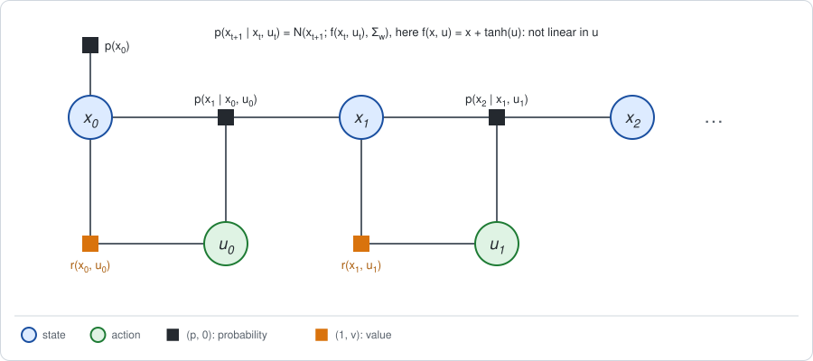
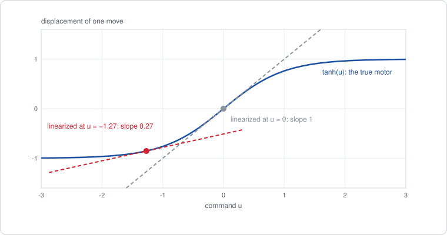
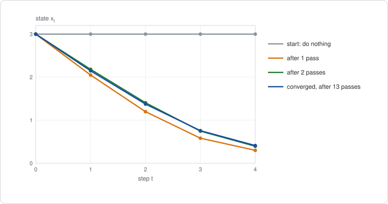
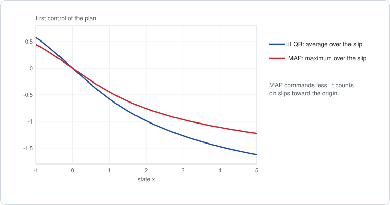

# Chapter 9: Nonlinear dynamics

[Chapter 6](chapter06.md) found the best policy of a linear-Gaussian problem
in one backward pass: average over the next state, maximize over the action,
and the result is the Riccati recursion. That pass needs every factor to be a
Gaussian or a quadratic. A real robot does not oblige: its dynamics are not
linear.

This chapter keeps the pass and repairs the factors. It replaces the
nonlinear dynamics factor by its linearization around a current trajectory,
eliminates the resulting linear-Gaussian graph exactly, and repeats around
the improved trajectory. A SLAM reader knows this loop: it is how GTSAM
solves a nonlinear least-squares problem. The short version:

- **iLQR is relinearize-then-eliminate.** Stage 1 linearizes the dynamics
  around the current trajectory and runs the backward pass of Chapter 6.
  Stage 2 rolls the resulting policy through the true dynamics, with a line
  search, and relinearizes. This is the Gauss-Newton method. DDP keeps the
  second derivative of the dynamics as well, which makes it a Newton method.
- **The result is a trajectory and a local feedback policy.** Under noise the
  policy is only valid near the trajectory. *Model predictive control* (MPC)
  wraps both stages in a loop that replans from wherever the robot is.
- **MAP trajectory optimization is a different elimination.** Posing the
  problem as one least-squares problem over all states and controls, as one
  would in GTSAM, takes the maximum over the states too. That is the same for
  deterministic dynamics and optimistic under noise.

**Run the examples.** The code of this chapter's examples is in the companion
notebook [chapter09_examples.ipynb](chapter09_examples.ipynb), which runs
online:
[](https://colab.research.google.com/github/thduynguyen/gtsam/blob/feature/semiringfactor/gtsam/semiring/doc/chapter09_examples.ipynb)

## 1. The graph

### The example: a weak motor

Take the robot on a line of Chapter 1, Section 8, and give it a motor that
saturates. A command $u$ no longer moves the robot by $u$. It moves it by
$\tanh(u)$, which is close to $u$ for small commands and never exceeds 1.

- **State.** The position $x$, a real number.
- **Action.** The command $u$, a real number.
- **Dynamics.** $x' = x + \tanh(u) + w$, where $w \sim N(0, \Sigma_w)$ is
  wheel slip. Sections 2 and 3 take $\Sigma_w = 0$, no slip. Section 4 takes
  $\Sigma_w = 0.2$.
- **Rewards.** As on the line: $r(x, u) = -(x^2 + u^2)$ at each move, and a
  final reward $r(x_T) = -x_T^2$.
- **Start.** The robot starts at $x_0 = 3$, and makes $T = 4$ moves.

The robot wants to reach the origin, three units away, and no move covers
more than one unit. A large command is wasted effort: it costs $u^2$ and
moves the robot by less than 1. If the robot does nothing, its return is
$-5 \cdot 3^2 = -45$.

### The factors

The graph is the decision graph of [Chapter 4](chapter04.md): states,
actions, a dynamics factor and a reward factor per step, and no policy
factors.



The dynamics factor is a Gaussian density in the next state,

$$p(x' \mid x, u) = N\big(x';\; f(x, u),\; \Sigma_w\big), \qquad f(x, u) = x + \tanh(u),$$

but its mean $f(x, u)$ is **NOT** a linear function of $x$ and $u$. As a
factor on the three variables $(x, u, x')$ together it is therefore not a
Gaussian factor, and the average over $x'$ of a quadratic value is no longer
a quadratic in $u$. The pass of Chapter 6 cannot start.

### What plays the role of θ

The remedy needs a point to linearize around. That point is a whole
trajectory, written with bars:

$$\bar u_0, \dots, \bar u_{T-1} \qquad\text{and}\qquad
\bar x_0 = x_0, \quad \bar x_{t+1} = f(\bar x_t, \bar u_t).$$

The planned controls $\bar u_t$ are chosen, and the states $\bar x_t$ follow
from them by running the dynamics without noise, a *rollout*. In the terms of
[Chapter 5](chapter05.md), Section 6, the planned controls are the parameter
$\theta$: Stage 1 holds them fixed, and Stage 2 updates them. The first
current trajectory is "do nothing": $\bar u_t = 0$ and $\bar x_t = 3$.

## 2. Stage 1: linearize, then eliminate

**What comes out.** For each step, a linear feedback policy valid near the
current trajectory,

$$u = \bar u_t + \Delta\bar u_t - K_t\, (x - \bar x_t),$$

with a planned change $\Delta\bar u_t$ of the control and a gain $K_t$. It is
the conditional that elimination leaves on $u_t$, as in Chapter 6.

### Linearize the dynamics factor

Write $\Delta x = x - \bar x_t$ and $\Delta u = u - \bar u_t$ for the
deviations from the current trajectory. To first order,

$$f(x, u) \approx f(\bar x_t, \bar u_t) + F_t\, \Delta x + B_t\, \Delta u,
\qquad
F_t = \frac{\partial f}{\partial x}, \quad B_t = \frac{\partial f}{\partial u}
\quad \text{at } (\bar x_t, \bar u_t).$$

Since $f(\bar x_t, \bar u_t) = \bar x_{t+1}$, the deviations obey linear
dynamics, with matrices that change from step to step:

$$\Delta x' = F_t\, \Delta x + B_t\, \Delta u + w.$$

This replaces the dynamics factor by a linear-Gaussian one, which is exactly
what GTSAM does to a nonlinear factor when it linearizes it. For the weak
motor, $F_t = 1$ and $B_t = 1 - \tanh^2(\bar u_t)$, the slope of the motor
curve at the planned command:



Around a small command the linearized motor responds fully, with slope 1.
Around a large one it hardly responds at all.

### Quadratize the rewards

The value channel must hold quadratics. If the reward is not quadratic, it is
replaced by its second-order expansion around the current trajectory:

$$r(x, u) \approx r(\bar x_t, \bar u_t) + \nabla_x r^\top \Delta x + \nabla_u r^\top \Delta u
- \big(\Delta x^\top C_x\, \Delta x + \Delta u^\top C_u\, \Delta u\big),$$

where $C_x$ and $C_u$ are minus one half of the second derivatives of $r$.
For the weak motor the reward is already quadratic, so this is exact:
$\nabla_x r = -2 \bar x_t$, $\nabla_u r = -2 \bar u_t$ and $C_x = C_u = 1$.

The only difference from Chapter 6 is that the quadratics now have linear
terms, because they are expanded around a trajectory and not around the
origin. A `HessianFactor` holds linear terms anyway, so the module needs no
change.

### Eliminate

The graph is now linear-Gaussian, and the two eliminations of Chapter 6 apply
step by step. The value factor arriving from the future is a quadratic in the
deviation, described by its gradient and its curvature at the current
trajectory:

$$V_{t+1}(\bar x_{t+1} + \Delta x') \approx V_{t+1}(\bar x_{t+1})
+ \nabla_x V_{t+1}^\top \Delta x' - \Delta x'^\top P_{t+1}\, \Delta x'.$$

At the last step it is the final reward, so $\nabla_x V_T = -2\, C_T\, \bar x_T$
and $P_T = C_T$.

**Eliminate the next state, by average, and multiply with the reward.** As in
Chapter 6, the mean of the linearized dynamics is substituted for $x'$, a
trace term $\operatorname{tr}(P_{t+1} \Sigma_w)$ is added for the noise, and
the values add. The result is the action value, a quadratic in the
deviations:

$$Q_t(\bar x_t + \Delta x,\; \bar u_t + \Delta u) \approx Q_t(\bar x_t, \bar u_t)
+ \nabla_x Q_t^\top \Delta x + \nabla_u Q_t^\top \Delta u
- \big(\Delta u^\top H_{uu}\, \Delta u + 2\, \Delta u^\top H_{ux}\, \Delta x + \Delta x^\top H_{xx}\, \Delta x\big),$$

with the gradients

$$\nabla_x Q_t = \nabla_x r + F_t^\top \nabla_x V_{t+1}, \qquad
\nabla_u Q_t = \nabla_u r + B_t^\top \nabla_x V_{t+1},$$

and the same blocks as in Chapter 6, built from the local matrices:

$$H_{uu} = C_u + B_t^\top P_{t+1} B_t, \qquad
H_{ux} = B_t^\top P_{t+1} F_t, \qquad
H_{xx} = C_x + F_t^\top P_{t+1} F_t.$$

**Eliminate the action, by max.** Setting the derivative with respect to
$\Delta u$ to zero,

$$\nabla_u Q_t - 2\, H_{uu}\, \Delta u - 2\, H_{ux}\, \Delta x = 0
\quad\Longrightarrow\quad
\Delta u = \Delta\bar u_t - K_t\, \Delta x,$$

$$\Delta\bar u_t = \tfrac{1}{2}\, H_{uu}^{-1}\, \nabla_u Q_t, \qquad
K_t = H_{uu}^{-1} H_{ux}.$$

The gain $K_t$ is the gain of Chapter 6. The planned change $\Delta\bar u_t$
is new: it is nonzero whenever the action value still has a slope in $u$ at
the current trajectory, that is, whenever the current plan can be improved.
Substituting the best $\Delta u$ back gives the new value factor on $x_t$:

$$\nabla_x V_t = \nabla_x Q_t - K_t^\top \nabla_u Q_t, \qquad
P_t = H_{xx} - H_{ux}^\top H_{uu}^{-1} H_{ux}.$$

The formula for $P_t$ is the Riccati equation of Chapter 6 with $F_t$ and
$B_t$ in place of $F$ and $B$.

| Elimination on the linearized graph | In the vocabulary of iLQR |
|---|---|
| linearize the dynamics factors, quadratize the reward factors | expand around the *nominal trajectory* |
| eliminate $x_{t+1}$ by average, $u_t$ by max, backward in time | the *backward pass* |
| the conditional on $u_t$: $\Delta u = \Delta\bar u_t - K_t\, \Delta x$ | the feedforward term and the feedback gain |
| the value factor on $x_t$: gradient $\nabla_x V_t$, curvature $P_t$ | the local quadratic model of the cost-to-go |

*On the weak motor, first pass.* Around the do-nothing trajectory,
$\bar u_t = 0$ and $\bar x_t = 3$, every slope is $B_t = 1$: the linearized
graph is the line of Chapter 1, with four moves. At the last step,
$\nabla_x V_4 = -6$ and $P_4 = 1$, so $\nabla_u Q_3 = 0 + 1 \cdot (-6) = -6$,
$H_{uu} = 1 + 1 = 2$ and $H_{ux} = 1$:

$$\Delta\bar u_3 = \tfrac{1}{2} \cdot \tfrac{-6}{2} = -1.5, \qquad K_3 = \tfrac{1}{2} = 0.5.$$

The whole pass gives:

| step $t$ | 0 | 1 | 2 | 3 |
|---|---|---|---|---|
| slope $B_t$ | $1$ | $1$ | $1$ | $1$ |
| gain $K_t$ | $0.618$ | $0.615$ | $0.6$ | $0.5$ |
| planned change $\Delta\bar u_t$ | $-1.853$ | $-1.846$ | $-1.8$ | $-1.5$ |

The last two gains are the Riccati gains $0.6$ and $0.5$ of the line. The
value factor left on $x_0$ predicts a return of $-14.56$ from $x_0 = 3$. That
prediction belongs to the linearized graph, in which a command of $-1.85$
moves the robot by $1.85$. The real motor will not do that.

## 3. Stage 2: roll out, search, relinearize

**What comes out.** A new current trajectory, with a higher return.

### The forward pass

Stage 1 produced a policy. Stage 2 runs it through the **true** dynamics,
from the start, without noise:

$$u_t = \bar u_t + \alpha\, \Delta\bar u_t - K_t\, (x_t - \bar x_t),
\qquad x_{t+1} = f(x_t, u_t), \qquad x_0 = \bar x_0.$$

The controls and states visited become the new current trajectory. The step
size $\alpha$ scales the planned change: $\alpha = 1$ is the policy of
Stage 1, and $\alpha = 0$ reproduces the old trajectory.

In a linear problem this rollout is the back-substitution that follows
elimination: each variable is computed from its conditional and from the
variables before it. Here the conditional of each state is the true dynamics
and not its linearization. That is what makes the new trajectory a valid
point to linearize around.

### The line search

The policy of Stage 1 is the best one *for the linearized graph*. Far from
the current trajectory the linearization is wrong, and a full step can make
the true return worse. So the rollout is tried with $\alpha = 1$, then
$\tfrac{1}{2}$, then $\tfrac{1}{4}$, until the true return improves. Then
Stage 1 is repeated around the new trajectory.

*On the weak motor.* The first pass, with a full step, commands
$u = (-1.853,\; -1.260,\; -0.718,\; -0.291)$ and raises the return from $-45$
to $-20.68$. The linearized graph had promised $-14.56$; the saturation of
the motor accounts for the difference. Later passes need half steps:

| pass | return before the pass | step $\alpha$ accepted |
|---|---|---|
| 1 | $-45.0000$ | $1$ |
| 2 | $-20.6752$ | $0.5$ |
| 3 | $-19.6046$ | $0.5$ |
| 4 | $-19.5592$ | $0.5$ |
| 5 | $-19.5519$ | $0.5$ |
| 8 | $-19.5500$ | $0.5$ |
| 13 | $-19.5500$ | $0.5$ |

After 13 passes the return changes by less than $10^{-8}$ per pass. The
result:

| step $t$ | 0 | 1 | 2 | 3 | 4 |
|---|---|---|---|---|---|
| control $\bar u_t$ | $-1.270$ | $-1.026$ | $-0.721$ | $-0.361$ | |
| state $\bar x_t$ | $3$ | $2.146$ | $1.374$ | $0.756$ | $0.410$ |
| gain $K_t$ | $0.572$ | $0.604$ | $0.605$ | $0.496$ | |
| curvature $P_t$ | $3.109$ | $2.496$ | $1.978$ | $1.564$ | $1$ |

The return is $-19.550$. A general-purpose optimizer applied to the four
controls finds the same controls and the same return; the notebook checks
this.



The first commands are large but not extreme. With the linearized motor of
the first pass the robot would have commanded $-1.85$; knowing that the motor
saturates, it commands $-1.27$, which moves it by $0.85$.

This algorithm is the **iterative linear-quadratic regulator**, iLQR (Li and
Todorov, 2004); see the [references](#chapter09-references).

### This is Gauss-Newton

| iLQR | Nonlinear least squares in GTSAM |
|---|---|
| the current trajectory $\bar x_t, \bar u_t$ | the linearization point |
| Stage 1: linearize the dynamics factors, quadratize the rewards | linearize the factors |
| the backward pass | elimination of the linear graph |
| the forward pass | back-substitution, here through the nonlinear dynamics |
| the line search on $\alpha$ | step control: Levenberg-Marquardt damping, or Dogleg |
| repeat until the return stops improving | iterate to convergence |

iLQR keeps the first derivatives $F_t$ and $B_t$ of the dynamics and drops
the second. That is the Gauss-Newton approximation: the curvature of the
problem is built from first derivatives only.

### DDP: keep the curvature of the dynamics

*Differential dynamic programming*, DDP (Jacobson and Mayne, 1970), keeps the
second derivatives of the dynamics too. They enter the blocks of the action
value multiplied by the gradient of the future value. For a scalar state,

$$H_{uu} = C_u + B_t^\top P_{t+1} B_t - \tfrac{1}{2}\, \nabla_x V_{t+1}\; \frac{\partial^2 f}{\partial u^2},$$

and similarly for $H_{ux}$ and $H_{xx}$ with the other second derivatives of
$f$. For a vector state the last term is a sum over the entries of
$\nabla_x V_{t+1}$. This is what a Newton method keeps and Gauss-Newton
drops.

For the weak motor only $\partial^2 f / \partial u^2 = -2 \tanh(u)\,(1 - \tanh^2(u))$
is nonzero. On the example it pays off:

| | iLQR | DDP |
|---|---|---|
| backward passes until the return changes by less than $10^{-8}$ | 13 | 6 |
| steps accepted | $\alpha = 1$, then always $0.5$ | always $\alpha = 1$ |
| return reached | $-19.550$ | $-19.550$ |

The price is the second derivative of the dynamics, which is expensive for a
robot with many joints, and a block $H_{uu}$ that is no longer guaranteed to
be positive definite and may need to be regularized.

## 4. Under noise: the local policy, and MPC

Now let the moves slip, with $\Sigma_w = 0.2$.

**Noise does not change Stage 1's policy.** In the linearized graph the noise
enters only through the trace terms, exactly as in Chapter 6: it lowers the
value by $\operatorname{tr}(P_{t+1} \Sigma_w)$ per move and changes neither
$K_t$ nor $\Delta\bar u_t$. The local model predicts an expected return of

$$-19.550 - \Sigma_w\, (P_1 + P_2 + P_3 + P_4) = -19.550 - 0.2 \cdot 7.038 = -20.958.$$

**But the policy is only local.** A slip takes the robot away from the
current trajectory, to states where the linearization is less accurate. There
are three ways to use the result of iLQR, in increasing order of cost:

| How the plan is executed | The control at step $t$ | Expected return |
|---|---|---|
| open loop | the planned $\bar u_t$, whatever happens | $-21.57$ |
| local feedback | $\bar u_t - K_t\, (x_t - \bar x_t)$, with the gains of the last backward pass | $-21.22$ |
| MPC | the first control of a fresh plan from $x_t$ | $-21.12$ |

The returns are averages over 100000 simulated runs, all three with the same
slips; the standard error of each is $0.017$.

- The open-loop plan ignores the slips, and pays for it.
- The local feedback corrects for them. It costs nothing extra: the gains
  $K_t$ are the conditionals that Stage 1 already produced. It still falls
  short of the local model's prediction of $-20.96$, because the model
  assumed linear dynamics around the plan.
- **Model predictive control** runs both stages again at every step, from the
  state the robot is actually in, over the moves that remain, and applies
  only the first control of the new plan.

MPC is the wrapper of Chapter 5, Section 6: it does not change either stage.
It changes the question they are asked, from "what is the best plan from the
start?" to "what is the best plan from here?". The result is a policy defined
everywhere, $u = \text{MPC}_t(x)$, whose value at each state is computed on
demand. Its cost is one full optimization per step, which is why it is usually
run with a short horizon and started from the previous plan.

## 5. Two relatives: MAP trajectory optimization and AICO

### MAP trajectory optimization: the maximum over everything

A SLAM practitioner would pose the weak motor differently: make every state
and every control an unknown, turn every term into a least-squares factor,
and ask the optimizer for the most probable assignment.

| Term | Factor | Its error |
|---|---|---|
| reward $-(x_t^2 + u_t^2)$ | a prior factor on $x_t$ and one on $u_t$, pulling to zero | $x_t^2 + u_t^2$ |
| dynamics $N(x_{t+1};\, f(x_t, u_t),\, \Sigma_w)$ | a factor on $(x_t, u_t, x_{t+1})$ with covariance $\Sigma_w$ | $\tfrac{1}{2}\,(x_{t+1} - f(x_t, u_t))^2 / \Sigma_w$ |
| start $x_0 = 3$ | a hard constraint | |

The notebook builds this `NonlinearFactorGraph`, with a `CustomFactor` for
the dynamics, and solves it with `LevenbergMarquardtOptimizer`. This is the
structure of trajectory optimizers built on factor graphs, such as GPMP2
(Dong et al., 2016). In the terms of [Chapter 2](chapter02.md) it is max-sum
on **all** variables: the maximum is taken over the next states as well as
over the actions,

$$\max_{u_0, \dots, u_{T-1}}\;\; \max_{x_1, \dots, x_T}\;
\Big[R(\tau) + \log p(x_1, \dots, x_T \mid x_0, u_0, \dots, u_{T-1})\Big].$$

**For deterministic dynamics it is the same problem.** As $\Sigma_w \to 0$
the dynamics factors become hard constraints, each state is determined by the
controls, and the inner maximum has nothing left to choose. With
$\Sigma_w = 10^{-6}$ the optimizer returns the controls of iLQR,
$(-1.270,\; -1.026,\; -0.721,\; -0.361)$.

**Under noise it is optimistic.** With $\Sigma_w = 0.2$ the optimizer is free
to place each state anywhere near the prediction of the dynamics, at a price
set by $\Sigma_w$. It uses that freedom in its own favor:

| step $t$ | 0 | 1 | 2 | 3 | 4 |
|---|---|---|---|---|---|
| planned control $u_t$ | $-0.965$ | $-0.581$ | $-0.249$ | $-0.078$ | |
| planned state $x_t$ | $3$ | $1.381$ | $0.537$ | $0.187$ | $0.078$ |
| slip the plan assumes, $x_{t+1} - f(x_t, u_t)$ | $-0.873$ | $-0.321$ | $-0.106$ | $-0.031$ | |

The plan commands a first move of $\tanh(-0.965) = -0.75$ and expects the
robot to travel $1.62$. The rest is a slip of $-0.87$ toward the origin, about
two standard deviations, which the plan simply assumes. Along this imagined
trajectory the return is $-12.57$, far above the $-19.55$ that is the best
possible **without** any noise. Slips are equally likely in both directions,
so no real robot gets this.

Because the plan counts on help, it commands too little. Inside MPC, replanning
at every step, the MAP planner collects an expected return of $-21.80$,
against $-21.12$ for iLQR, and worse even than the open-loop plan of
Section 4.



:::{dropdown} The same comparison, exactly, on the line
On the line of Chapter 1 everything is in closed form. The line has
$x' = x + u + w$ with $\Sigma_w = 0.5$, so the error of a dynamics factor is
$w^2 / (2 \Sigma_w) = w^2$. MAP therefore treats the slip $w$ as a second
control, with the same cost as $u$. To make a total move $m = u + w$ it
splits the move in half, $u = w = m / 2$, at a cost of $m^2 / 2$ where the
robot alone would pay $m^2$. The robot commands half of the move it plans
and expects the slip to supply the other half.

Repeating the backward pass of Chapter 6 with this cheaper move gives the
gains of the MAP plan:

| | gain at step 0 | gain at step 1 | expected return, $x_0 \sim N(2, 1)$ |
|---|---|---|---|
| average over the slip (Riccati) | $0.6$ | $0.5$ | $-9.25$ |
| maximum over the slip (MAP) | $0.364$ | $0.333$ | $-10.09$ |

The expected returns are computed exactly with the module, by evaluating each
pair of gains as a deterministic policy on the semiring factor graph of the
line.

MAP's own optimum from $x_0 = 2$ is $-5.45$. The best return from $x_0 = 2$
with no noise at all is $-6.4$, and the best expected return with the noise
is $-7.65$. MAP believes it will do better than is possible in a world
without noise.
:::

The two orders of summation, side by side:

| | iLQR | MAP trajectory optimization |
|---|---|---|
| sum over the next state | average | maximum |
| sum over the action | maximum | maximum |
| what the dynamics noise does | lowers the value; the policy is unchanged | acts as a free extra control |
| result | a trajectory and feedback gains | a trajectory |
| valid when | the linearization holds | the dynamics are close to deterministic |

This is the optimism that [Chapter 1](chapter01.md), Section 3, and
[Chapter 4](chapter04.md), Section 2, warned about, with numbers.
[Chapter 8](chapter08.md) discusses it further. For a manipulator with
accurate joint control the noise is small and the two agree, which is why MAP
trajectory optimization works well there.

### AICO: Gaussian messages in both directions

*Approximate inference control*, AICO (Toussaint, 2009), starts from the same
graph as MAP, the dynamics factors and the rewards as factors $e^{r}$, and
runs Gaussian message passing on it instead of an optimizer:

- each state $x_t$ receives a **forward message** from the past and a
  **backward message** from the future, both Gaussians;
- their product, with the local reward factor, is the current *belief* about
  $x_t$;
- the dynamics factors next to $x_t$ are relinearized at the mean of that
  belief, the messages are recomputed, and the sweep is repeated until the
  beliefs stop changing.

The two differences from iLQR are in the bookkeeping. AICO relinearizes each
factor at its own time, whenever its belief has moved, where iLQR relinearizes
the whole trajectory at once after a rollout. And AICO works with the forward
messages explicitly, where iLQR's forward pass is a rollout. For
deterministic dynamics its fixed point is a trajectory at which iLQR also
stops.

What AICO computes is the *posterior* of the graph whose factors are the
dynamics and $e^{r}$. For a Gaussian the mean and the most probable value
coincide, so under noise AICO stands on the same side as MAP: the states are
not averaged with their true probabilities but tilted toward high reward.
Rawlik, Toussaint and Vijayakumar (2012) analyze this and relate it to
risk-seeking control. The notebook does not implement AICO.

## 6. An exact special case

**The line.** If the dynamics are linear, the linearization is exact
whatever the current trajectory, so Stage 1 is the pass of Chapter 6 itself.
Running the Stage 1 of the notebook on the line of Chapter 1
($x' = x + u + w$, two moves) gives, in a single pass,

$$K_0 = 0.6, \qquad K_1 = 0.5, \qquad J^* = -9.25 \;\;\text{for } x_0 \sim N(2, 1),$$

the Riccati gains and the best expected return of Chapter 6. A second pass
changes nothing.

**The first pass on the weak motor** is a second instance. Around the
do-nothing trajectory all slopes are 1, so the linearized graph is the line
with four moves, and the last two gains of the table in Section 2 are $0.6$
and $0.5$.

**Three more checks** are in the notebook:

| Quantity | Computed by | Checked against |
|---|---|---|
| the gains and planned changes of Stage 1 | the module, with `SemiringGaussianFactor` | the formulas of Section 2, in numpy |
| the controls and the return of iLQR | 13 passes | DDP; a general-purpose optimizer on the four controls |
| the MAP plan for $\Sigma_w = 10^{-6}$ | GTSAM's Levenberg-Marquardt | the controls of iLQR |

## 7. Implementation

Stage 1 with the module. The helpers `gaussian` and `penalty` lift a
`JacobianFactor` to $(p, 0)$ and the penalty $z^2$ to the reward
$(1, -z^2)$, as in Chapter 1, Section 10. As in Chapter 4, the module has no
built-in maximum, so the best action is read from the quadratic $Q_t$ and put
back as a deterministic policy factor.

```python
def stage1(states, controls, noise):
    """One backward pass on the graph linearized around a trajectory."""
    moves = len(controls)
    gains, offsets = np.zeros(moves), np.zeros(moves)
    value = penalty(X(moves))  # (1, V_T)
    for t in reversed(range(moves)):
        # Linearized dynamics: x' = x + B u + constant, with B = df/du.
        B = f_u(controls[t])
        constant = states[t + 1] - states[t] - B * controls[t]
        dynamics = gaussian(X(t + 1), I, X(t), -I, U(t), -B * I,
                            np.array([constant]), noise_model(noise))
        # Eliminate the next state by average.
        phi = dynamics.multiply(value).sum(ordering(X(t + 1)))
        bucket = penalty(X(t)).multiply(penalty(U(t))).multiply(phi)
        # Eliminate the action by max: the vertex of the quadratic Q_t in u.
        Q = bucket.value()  # value = 1/2 z'Gz - g'z + f/2, z = (keys)
        keys, G, g = list(Q.keys()), Q.information(), np.ravel(Q.linearTerm())
        u, x = keys.index(U(t)), keys.index(X(t))
        gains[t], offsets[t] = G[u, x] / G[u, u], g[u] / G[u, u]
        best = gaussian(U(t), I, X(t), gains[t] * I, np.array([offsets[t]]),
                        noiseModel.Constrained.All(1))
        value = best.multiply(bucket).sum(ordering(U(t)))  # (1, V_t)
    return gains, offsets, value
```

The factors are written in the variables themselves, not in deviations, so
the policy comes out as $u = -K_t\, x + o_t$ with an offset
$o_t = \bar u_t + \Delta\bar u_t + K_t\, \bar x_t$. The linear terms of the
`HessianFactor` carry what Section 2 wrote as gradients.

Stage 2 is a rollout and a loop:

```python
def forward(states, controls, gains, offsets, step, x0):
    """Roll out the local policy, with the planned change scaled by step."""
    x, new_controls = x0, np.zeros(len(controls))
    for t in range(len(controls)):
        change = offsets[t] - gains[t] * states[t] - controls[t]
        new_controls[t] = (controls[t] + step * change
                           - gains[t] * (x - states[t]))
        x = f(x, new_controls[t])
    return new_controls
```

The MAP planner of Section 5 is an ordinary GTSAM program:

```python
graph = gtsam.NonlinearFactorGraph()
cost = noiseModel.Isotropic.Variance(1, 0.5)  # error z^2
graph.add(gtsam.PriorFactorVector(
    X(0), np.array([x0]), noiseModel.Constrained.All(1)))
for t in range(moves):
    graph.add(gtsam.PriorFactorVector(X(t), zero, cost))
    graph.add(gtsam.PriorFactorVector(U(t), zero, cost))
    graph.add(CustomFactor(noiseModel.Isotropic.Variance(1, variance),
                           [X(t), U(t), X(t + 1)], dynamics_error))
graph.add(gtsam.PriorFactorVector(X(moves), zero, cost))
result = gtsam.LevenbergMarquardtOptimizer(graph, initial, parameters).optimize()
```

## 8. What breaks

- **The answer is local.** Like Gauss-Newton, iLQR converges to a local
  optimum that depends on the first trajectory. The weak motor has one
  optimum; a robot that must go around an obstacle has one on each side.
- **The linearization must hold along the step.** When it does not, the line
  search shrinks the step and progress is slow, as in the 13 passes of
  Section 3. Dynamics that are not differentiable, such as contacts, break
  the linearization altogether. [Chapter 10](chapter10.md) replaces
  derivatives by samples.
- **The policy is local too.** The gains are valid near the planned
  trajectory. Section 4 showed the loss under noise, and MPC as the remedy.
  MPC pays one optimization per step.
- **Noise is treated as if the problem were linear.** In Stage 1 the noise
  does not change the policy. For linear dynamics that is correct. For
  nonlinear dynamics the best policy does depend on the noise, so even MPC
  with iLQR is not the best policy of the weak motor under slips. Computing
  that policy would take a forward message that is a distribution over
  states, not a single trajectory ([Chapter 19](chapter19.md)).
- **MAP is optimistic.** Section 5 put numbers on it. Use MAP trajectory
  optimization when the dynamics are close to deterministic.
- **The model must be known and differentiable.** Every factor was given in
  closed form, with derivatives. Part III removes the first assumption and
  Part IV learns the model.

## 9. Framework card

| | iLQR and DDP | MAP trajectory optimization | AICO |
|---|---|---|---|
| 1. Sum over the actions | maximum; average over the next state | maximum; maximum over the next state too | the posterior of the graph with factors $e^{r}$: actions and states are both tilted toward high reward |
| 2. Dynamics factor | closed form, linearized around the current trajectory (DDP: expanded to second order) | closed form, linearized at every iteration of the optimizer | closed form, linearized at the mean of each belief |
| 3. Backward messages | a local quadratic, exact for the linearized graph | none kept: one joint least-squares solve | a Gaussian per state |
| 4. Forward messages | one trajectory: the rollout of the current policy | none kept | a Gaussian per state |
| 5. Stage 2 update | relinearize and repeat, with a line search | Gauss-Newton or Levenberg-Marquardt on all states and controls | repeat the sweeps to a fixed point |

Wrapper: MPC runs any of the three on the remaining horizon at every step and
applies the first control.

(chapter09-references)=
## 10. References

- D. H. Jacobson and D. Q. Mayne, *Differential Dynamic Programming*,
  Elsevier, 1970. DDP.
- W. Li and E. Todorov, "Iterative linear quadratic regulator design for
  nonlinear biological movement systems", *International Conference on
  Informatics in Control, Automation and Robotics*, 2004. iLQR.
- Y. Tassa, T. Erez and E. Todorov, "Synthesis and stabilization of complex
  behaviors through online trajectory optimization", *IROS*, 2012. iLQR
  inside MPC, with line search and regularization.
- M. Toussaint, "Robot trajectory optimization using approximate inference",
  *ICML*, 2009. AICO.
- K. Rawlik, M. Toussaint and S. Vijayakumar, "On stochastic optimal control
  and reinforcement learning by approximate inference", *Robotics: Science
  and Systems*, 2012. What the inference formulation computes under noise.
- J. Dong, M. Mukadam, F. Dellaert and B. Boots, "Motion planning as
  probabilistic inference using Gaussian processes and factor graphs",
  *Robotics: Science and Systems*, 2016. GPMP2: MAP trajectory optimization
  on a factor graph with GTSAM.
- D. Q. Mayne, J. B. Rawlings, C. V. Rao and P. O. M. Scokaert, "Constrained
  model predictive control: stability and optimality", *Automatica*, 2000.
  A survey of MPC.

---

Previous: [Chapter 8: Softness and risk](chapter08.md).
Next: [Chapter 10: Sampling-based control](chapter10.md).
