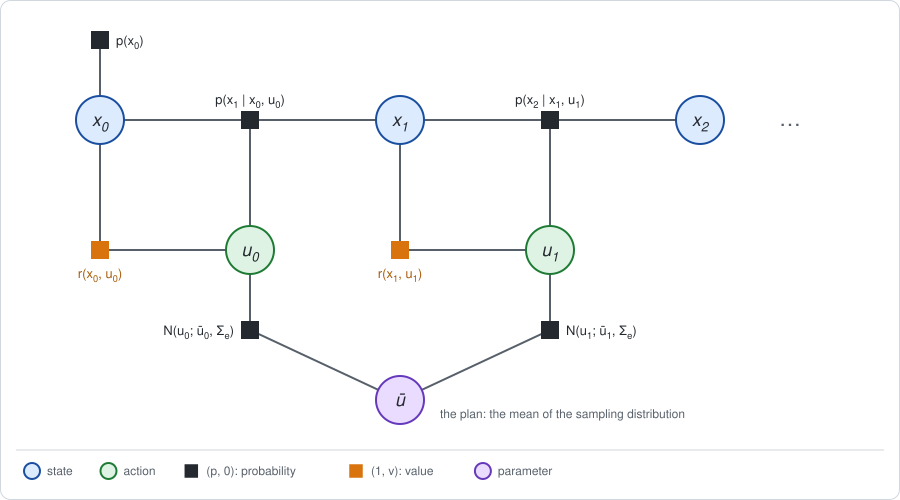
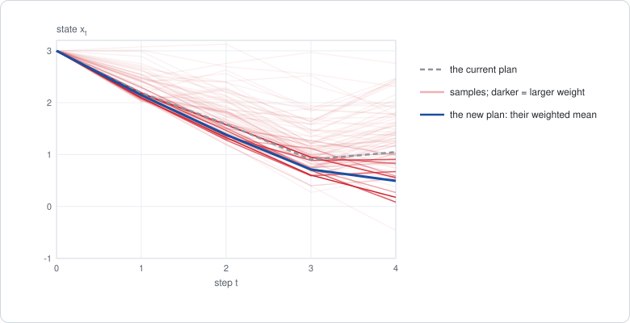

# Chapter 10: Sampling-based control

:::{div}
:class: in-progress
**This book is a work in progress.** It is still being written and revised: its content is incomplete and may contain errors.
:::

[Chapter 9](chapter09.md) handled nonlinear dynamics by linearizing them. That
needs the derivatives of the model, and a model smooth enough for a
linearization to mean something. Many robot models are not: contacts,
friction and obstacles make them jump.

This chapter needs only one thing from the model: that it can be **run**.
Given a state and an action, it returns the next state. The sum over the
actions, which Chapter 9 took exactly on a linearized graph, is now estimated
by trying actions at random and looking at what they return. The short
version:

- **MPPI is a sampled soft maximum.** Draw many action sequences, run each
  through the model, and weight each by $e^{R / \eta}$. The weighted average
  of the returns estimates the soft maximum of [Chapter 2](chapter02.md), and
  the weighted average of the sequences is the new plan.
- **CEM is a sampled maximum.** Draw many action sequences, keep the best
  few, and refit the sampling distribution to them.
- **Both are the two stages with a sampled Stage 1.** The samples are the
  forward messages, their returns are the backward messages, and Stage 2
  refits a distribution over plans. Both are run inside MPC.
- **On the line the estimate can be checked.** The exact soft maximum is a
  Riccati recursion with a larger control cost, and the sampled estimate
  converges to it.

This is the bridge to Part III. The model is still known, but one of the two
sums of elimination is no longer computed. It is estimated from samples.

**Run the examples.** The code of this chapter's examples is in the companion
notebook [chapter10_examples.ipynb](chapter10_examples.ipynb), which runs
online:
[](https://colab.research.google.com/github/thduynguyen/gtsam/blob/feature/semiringfactor/gtsam/semiring/doc/chapter10_examples.ipynb)

## 1. The graph

### A plan is one big action

The graph is the decision graph of Chapter 9: states, actions, a dynamics
factor and a reward factor per step. The planner stands at a known state
$x_0$ and uses the model without noise, $x' = f(x, u)$. Then every state is
determined by the actions before it, and the whole problem depends on one
object, the **plan**: the sequence of actions

$$\mathbf{u} = (u_0, u_1, \dots, u_{T-1}).$$

Running a plan through the model from $x_0$, a *rollout*, gives its states and
its return,

$$R(\mathbf{u}) = \sum_{t=0}^{T-1} r(x_t, u_t) + r(x_T),
\qquad x_{t+1} = f(x_t, u_t).$$

The planner does not need $f$ in any other form. It may be a formula, a
physics simulator, or a learned network.

### The policy factor: a sampling distribution over plans

To sum over the actions by sampling, the actions must be drawn from
something. Give every action a Gaussian policy factor that does not look at
the state:

$$\pi_\theta(\mathbf{u}) = \prod_{t=0}^{T-1} N\big(u_t;\; \bar u_t,\; \Sigma_e\big).$$



The means $\bar u_t$ are the current plan, written with bars as in
Chapter 9, and $\Sigma_e$ is how far around the plan the samples are spread.
In the terms of [Chapter 5](chapter05.md), Section 6:

- the parameter $\theta$ is the plan $\bar{\mathbf{u}} = (\bar u_0, \dots, \bar u_{T-1})$,
  for CEM together with the spread $\Sigma_e$;
- Stage 1 evaluates the current sampling distribution;
- Stage 2 moves it.

### The two running examples

- **The line**, for the exact test: $x' = x + u$, rewards
  $-(x^2 + u^2)$ and a final $-x_2^2$, two moves, from $x_0 = 2$. The best
  plan is the LQR plan of Chapter 6, $\mathbf{u} = (-1.2,\; -0.4)$, with
  return $-6.4$.
- **The weak motor** of Chapter 9: $x' = x + \tanh(u)$, the same rewards,
  four moves, from $x_0 = 3$. Its best plan has return $-19.550$.

## 2. Stage 1: the sum over the actions, by sampling

**What comes out.** An estimate of how good the current sampling distribution
is, and a weight for every sampled plan.

### The exact quantity: a soft maximum over plans

Eliminate the plan with the soft maximum of Chapter 2, Section 2, with a
temperature $\eta$. The value of the new factor is the tilted mean of the
return under the sampling distribution:

$$\bar v_\eta = \eta\, \log \int \pi_\theta(\mathbf{u})\; e^{R(\mathbf{u}) / \eta}\; d\mathbf{u}
= \eta\, \log\, \mathbb{E}_{\mathbf{u} \sim \pi_\theta}\big[e^{R(\mathbf{u}) / \eta}\big].$$

As in Chapter 2, the temperature moves it between two ends:

$$\mathbb{E}_{\mathbf{u} \sim \pi_\theta}\big[R(\mathbf{u})\big]
\;\;\xleftarrow{\;\eta \to \infty\;}\;\; \bar v_\eta
\;\;\xrightarrow{\;\eta \to 0\;}\;\; \max_{\mathbf{u}} R(\mathbf{u}).$$

At a high temperature it is the average return of random plans. At a low
temperature it is the return of the best plan.

Elimination also leaves a conditional. By Chapter 2, Section 5, its tilted
version is a normalized distribution over plans,

$$q(\mathbf{u}) = \pi_\theta(\mathbf{u})\; e^{(R(\mathbf{u}) - \bar v_\eta) / \eta},$$

the sampling distribution reweighted toward the plans with a high return.
This is the *improved* distribution over plans, and Stage 2 will move toward
it.

:::{dropdown} What the soft maximum optimizes
The soft maximum is itself the solution of an optimization problem. Among all
distributions $q$ over plans,

$$\bar v_\eta = \max_q\; \Big[\, \mathbb{E}_{\mathbf{u} \sim q}\big[R(\mathbf{u})\big]
- \eta\; \mathrm{KL}\big(q \,\|\, \pi_\theta\big) \Big],$$

and the maximum is attained by the tilted distribution above. In words: find
the distribution over plans with the best expected return, while paying
$\eta$ per unit of divergence from the sampling distribution. A high
temperature keeps $q$ close to $\pi_\theta$; a low one lets it concentrate on
the best plan.

On the line, with the numbers of Section 4, the tilted distribution has
$\mathbb{E}_q[R] = -7.296$ and $\mathrm{KL}(q \,\|\, \pi_\theta) = 1.518$, and
$-7.296 - 1 \cdot 1.518 = -8.814$ is the soft maximum.
:::

### The estimate: replace the average by samples

The integral over plans is an average under $\pi_\theta$, so it can be
estimated by drawing plans from $\pi_\theta$:

1. Draw $M$ plans, $\mathbf{u}^{(i)} = \bar{\mathbf{u}} + \text{noise}$, with
   noise of covariance $\Sigma_e$ on every action.
2. Roll each one through the model, and record its return
   $R^{(i)} = R(\mathbf{u}^{(i)})$.
3. Replace the average over all plans by the average over the samples:

$$\hat v_\eta = \eta\, \log\, \frac{1}{M} \sum_{i=1}^{M} e^{R^{(i)} / \eta}.$$

The hat marks an estimate. The same samples estimate the tilted distribution
$q$: each sampled plan gets a **weight**

$$\omega^{(i)} = \frac{e^{R^{(i)} / \eta}}{\sum_{j=1}^{M} e^{R^{(j)} / \eta}},
\qquad \sum_{i=1}^{M} \omega^{(i)} = 1,$$

and any average under $q$ is estimated by the weighted average over the
samples. In particular the mean of $q$, the plan that the improved
distribution is centered on, is estimated by

$$\mathbb{E}_{\mathbf{u} \sim q}[\mathbf{u}] \approx \sum_{i=1}^{M} \omega^{(i)}\, \mathbf{u}^{(i)}.$$



The figure shows one round on the weak motor of Section 5: eighty of the
sampled rollouts, each drawn darker the larger its weight, and the rollout of
their weighted mean.

### In the vocabulary of the framework

| Piece of Stage 1 | In Chapter 9 | Here |
|---|---|---|
| sum over the actions | maximum, exact on the linearized graph | soft maximum, estimated from $M$ samples |
| access to the dynamics factor | closed form, with derivatives | a simulator: the model is only run |
| forward messages | one rollout of the current plan | $M$ rollouts: *particles* |
| backward messages | a quadratic value function per step | one number per particle: the return of its rollout, a *Monte Carlo return* |

The last row is a large simplification. No value function is passed backward
from step to step. Each sample carries only the total return of its own
rollout, and the sum over the actions is taken once, over whole plans.

## 3. Stage 2: refit the sampling distribution

**What comes out.** A new plan $\bar{\mathbf{u}}$, and for CEM a new spread.

### MPPI: move to the weighted mean

*Model predictive path integral control*, MPPI (Williams et al., 2017),
replaces the plan by the estimated mean of the tilted distribution:

$$\bar{\mathbf{u}} \;\leftarrow\; \sum_{i=1}^{M} \omega^{(i)}\, \mathbf{u}^{(i)}.$$

Good samples pull the plan toward themselves, in proportion to their weight.
The spread $\Sigma_e$ is kept. Then Stage 1 is repeated around the new plan.

This is a fit of the policy factor to the tilted distribution: among all
Gaussians with covariance $\Sigma_e$, the one closest to $q$, in the sense of
the KL divergence from $q$, has the mean of $q$. It is the update $\pi_{\text{new}} \propto \pi\, e^{A / \eta}$ of
Chapter 2, Section 5, restricted to a Gaussian. [Chapter 17](chapter17.md)
meets the same step, applied to a policy that looks at the state.

**What one step does.** For a quadratic return the step can be written in
closed form, and it is a familiar one:

$$\bar{\mathbf{u}}_{\text{new}} = \arg\max_{\mathbf{u}}\;
\Big[\, R(\mathbf{u}) - \frac{\eta}{2\, \Sigma_e}\, \lVert \mathbf{u} - \bar{\mathbf{u}} \rVert^2 \Big].$$

The new plan maximizes the return minus a penalty for moving away from the
current plan. That is a damped step, with $\eta / (2 \Sigma_e)$ in the role
of the damping $\lambda_{\text{LM}}$ of Levenberg-Marquardt. MPPI is a
Levenberg-Marquardt method that estimates its step from samples and never
computes a derivative.

:::{dropdown} Why is the step a damped maximization?
The tilted distribution is the product of the sampling distribution and
$e^{R / \eta}$, up to a constant:

$$q(\mathbf{u}) \;\propto\; \exp\Big(-\frac{\lVert \mathbf{u} - \bar{\mathbf{u}} \rVert^2}{2\, \Sigma_e} + \frac{R(\mathbf{u})}{\eta}\Big).$$

If $R$ is quadratic, the exponent is quadratic, so $q$ is a Gaussian. The
mean of a Gaussian is the point where its exponent is largest. Multiplying
the exponent by $\eta$ does not move that point, and gives the expression
above.

For a return that is not quadratic, the mean of $q$ and the maximizer of the
exponent differ, and the statement holds approximately when $\Sigma_e$ is
small.
:::

### CEM: keep the best, refit

The *cross-entropy method*, CEM (Rubinstein, 1999), makes the weights as
simple as possible:

1. Draw $M$ plans from the sampling distribution and roll them out.
2. Keep the $M_{\text{elite}}$ plans with the highest returns, the *elites*.
3. Set the mean $\bar u_t$ and the variance $\Sigma_e$ of each action to the
   mean and variance of the elites. Repeat.

The spread is refit too, so it shrinks as the elites agree, and the sampling
distribution closes in on one plan. The name comes from step 3: fitting a
Gaussian to the elites by maximum likelihood minimizes a cross-entropy.

| | MPPI | CEM |
|---|---|---|
| weight of a sampled plan | $\omega^{(i)} \propto e^{R^{(i)} / \eta}$ | $1 / M_{\text{elite}}$ for the best $M_{\text{elite}}$, zero for the rest |
| what is refit | the mean | the mean and the variance |
| what it estimates | the soft maximum | the maximum |
| what sets how greedy it is | the temperature $\eta$ | the fraction of elites |

In the terms of Chapter 2, MPPI samples the soft-maximum rule and CEM samples
the max-sum rule. As $\eta \to 0$ the weights of MPPI concentrate on the best
sample, and the two meet.

### Inside MPC

A plan is open loop: it does not look at the state. Under noise the robot
will not follow it. So both planners are run inside the MPC wrapper of
Chapter 9: plan from the current state, apply the first action, and plan
again at the next step, starting the new search from the old plan shifted by
one step.

## 4. An exact special case: the line

On the line the return is quadratic in the plan and the sampling distribution
is Gaussian, so the soft maximum has a closed form. Take $\eta = 1$,
$\Sigma_e = 1$ and a sampling distribution centered on doing nothing,
$\bar{\mathbf{u}} = (0, 0)$.

### The exact soft maximum, by Gaussian elimination

**The answer first.** Eliminating an action by soft maximum under a Gaussian
is the max step of the Riccati recursion of [Chapter 6](chapter06.md), with
the control cost **increased by** $\tfrac{\eta}{2} \Sigma_e^{-1}$, plus a
constant:

$$K_t = \big(H_{uu} + \tfrac{\eta}{2}\, \Sigma_e^{-1}\big)^{-1} H_{ux},
\qquad
P_t = H_{xx} - H_{ux}^\top \big(H_{uu} + \tfrac{\eta}{2}\, \Sigma_e^{-1}\big)^{-1} H_{ux},$$

$$\beta_t = \beta_{t+1} + \tfrac{\eta}{2}\, \log \det\big(I + \tfrac{2}{\eta}\, \Sigma_e\, H_{uu}\big),$$

where $V_t(x) = -(x^\top P_t\, x + \beta_t)$ and $H_{uu}$, $H_{ux}$, $H_{xx}$
are the blocks of the action value, as in Chapter 6. With $\eta = 0$ this is
the Riccati recursion itself.

:::{dropdown} Derivation, for a scalar action
The action value is $Q_t(x, u) = -(H_{uu}\, u^2 + 2 H_{ux}\, u\, x + H_{xx}\, x^2 + \beta_{t+1})$.
Its soft maximum over $u \sim N(0, \Sigma_e)$ needs one Gaussian integral,

$$\int N(u;\, 0,\, \Sigma_e)\; e^{-a u^2 + 2 b u}\; du
= \frac{1}{\sqrt{1 + 2 a \Sigma_e}}\; \exp\Big(\frac{2\, b^2\, \Sigma_e}{1 + 2 a \Sigma_e}\Big),$$

with $a = H_{uu} / \eta$ and $b = -H_{ux}\, x / \eta$. Taking $\eta \log$ of
it,

$$\eta \log \int N(u;\, 0,\, \Sigma_e)\; e^{Q_t(x, u) / \eta}\; du
= -H_{xx}\, x^2 - \beta_{t+1}
+ \frac{H_{ux}^2\, x^2}{H_{uu} + \eta / (2 \Sigma_e)}
- \frac{\eta}{2} \log\Big(1 + \frac{2\, \Sigma_e\, H_{uu}}{\eta}\Big).$$

The terms in $x^2$ give $P_t$, and the last term is what $\beta_t$ gains.
The mean of the tilted conditional on $u$ is $-K_t\, x$.
:::

A sampling distribution $N(0, \Sigma_e)$ thus acts like a quadratic cost on
the action, scaled by the temperature. The robot is asked to do well *and*
to stay close to what the sampling distribution would do.

On the line, $H_{uu} = 1 + P_{t+1}$, $H_{ux} = P_{t+1}$ and
$H_{xx} = 1 + P_{t+1}$, and the extra control cost is
$\eta / (2 \Sigma_e) = 0.5$:

| step | $H_{uu}$ | gain | $P_t$ | $\beta_t$ |
|---|---|---|---|---|
| 2 | | | $1$ | $0$ |
| 1 | $2$ | $K_1 = \frac{1}{2 + 0.5} = 0.4$ | $1.6$ | $0.805$ |
| 0 | $2.6$ | $K_0 = \frac{1.6}{2.6 + 0.5} = 0.516$ | $1.774$ | $1.717$ |

So the exact soft value at $x_0 = 2$ is

$$\bar v_\eta = -(1.774 \cdot 4 + 1.717) = -8.814,$$

and the mean of the tilted distribution is the plan
$(-1.032,\; -0.387)$, whose first action is $-K_0\, x_0$. The notebook
computes the same two results a second way, from one Gaussian integral over
the whole plan.

The soft value lies between the two ends of Section 2: the return of the
best plan is $-6.4$, and the average return of plans drawn from the sampling
distribution is $-17$.

### The sampled estimate converges to it

Sampling $M$ plans from $N(0, \Sigma_e)$ and applying the formulas of
Section 2 gives, in one seeded run:

| samples $M$ | estimate $\hat v_\eta$ | error | weighted mean of the first action |
|---|---|---|---|
| $10$ | $-8.309$ | $+0.505$ | $-0.982$ |
| $100$ | $-8.894$ | $-0.080$ | $-1.003$ |
| $1000$ | $-8.754$ | $+0.060$ | $-1.046$ |
| $10^4$ | $-8.820$ | $-0.006$ | $-1.018$ |
| $10^5$ | $-8.821$ | $-0.007$ | $-1.032$ |
| $10^6$ | $-8.813$ | $+0.001$ | $-1.033$ |
| exact | $-8.814$ | | $-1.032$ |

The error shrinks roughly like $1 / \sqrt{M}$, the rate of any Monte Carlo
average: a hundred times more samples for one more digit.

### As the temperature goes to zero, the plan becomes the LQR plan

The exact mean of the tilted distribution, for decreasing temperatures, and
its estimate from the same $10^4$ samples:

| $\eta$ | exact soft value | exact tilted mean | sampled mean, $M = 10^4$ |
|---|---|---|---|
| $100$ | $-16.483$ | $(-0.075,\; -0.037)$ | $(-0.084,\; -0.045)$ |
| $10$ | $-13.615$ | $(-0.473,\; -0.218)$ | $(-0.472,\; -0.219)$ |
| $1$ | $-8.814$ | $(-1.032,\; -0.387)$ | $(-1.025,\; -0.397)$ |
| $0.1$ | $-6.861$ | $(-1.180,\; -0.400)$ | $(-1.183,\; -0.414)$ |
| $0.01$ | $-6.469$ | $(-1.198,\; -0.400)$ | $(-1.197,\; -0.400)$ |
| $0.001$ | $-6.409$ | $(-1.200,\; -0.400)$ | $(-1.199,\; -0.392)$ |

The exact soft value tends to $-6.4$ and the exact tilted mean to the LQR
plan $(-1.2,\; -0.4)$, whose first action is $-K_0\, x_0 = -0.6 \cdot 2$.

### Repeating the two stages also reaches the LQR plan

At a fixed temperature, the tilted mean is not the best plan. But Stage 2
moves the sampling distribution there, and the next Stage 1 samples around
the new plan. By Section 3 each round is a damped step on the return, and
damped steps converge to the maximizer. With $\eta = 1$ and $\Sigma_e = 1$:

| round | exact tilted mean | its return | sampled, $M = 1000$ | its return |
|---|---|---|---|---|
| 0 | $(0,\; 0)$ | $-12$ | $(0,\; 0)$ | $-12$ |
| 1 | $(-1.032,\; -0.387)$ | $-6.489$ | $(-1.039,\; -0.390)$ | $-6.481$ |
| 2 | $(-1.174,\; -0.408)$ | $-6.402$ | $(-1.179,\; -0.411)$ | $-6.401$ |
| 3 | $(-1.195,\; -0.403)$ | $-6.400$ | $(-1.200,\; -0.381)$ | $-6.401$ |
| 5 | $(-1.200,\; -0.400)$ | $-6.400$ | $(-1.204,\; -0.392)$ | $-6.400$ |

The exact iteration converges to $(-1.2,\; -0.4)$. The sampled one reaches
its neighborhood and then jitters there, because every round uses fresh
samples.

CEM on the same problem, with $M = 100$ and 10 elites, converges to
$(-1.2,\; -0.4)$ and a return of $-6.4$ in about six rounds, while its spread
shrinks from $1$ to below $0.001$.

## 5. On the weak motor

The weak motor has no closed form. The planners treat its model as a black
box that is run, $M$ times per round.

**Planning from $x_0 = 3$.** MPPI with $\eta = 0.5$, $\Sigma_e = 0.25$ and
$M = 1000$, and CEM with $M = 100$ and 10 elites, both starting from the plan
"do nothing":

| round | MPPI: return of the plan | MPPI: effective samples | CEM: return of the plan |
|---|---|---|---|
| 0 | $-45.000$ | $2.0$ | $-45.000$ |
| 1 | $-20.706$ | $127.6$ | $-20.075$ |
| 2 | $-19.600$ | $232.2$ | $-19.695$ |
| 3 | $-19.572$ | $222.1$ | $-19.581$ |
| 5 | $-19.575$ | $233.2$ | $-19.552$ |
| 10 | $-19.565$ | $214.8$ | $-19.550$ |
| 14 | $-19.570$ | $224.3$ | $-19.550$ |

The best plan, found by iLQR in Chapter 9, has return $-19.550$. CEM reaches
it. MPPI settles about $0.02$ below it and jitters there, for two reasons:
its plan is an average of noisy samples, and at a temperature above zero the
tilted mean is not exactly the best plan. The column of *effective samples*
is explained in Section 7.

Neither planner computed a derivative of $\tanh$.

**Inside MPC, under slips.** As in Chapter 9, let the real moves slip,
$x' = x + \tanh(u) + w$ with $w \sim N(0, 0.2)$. Each planner replans at
every step with the noise-free model and applies its first action. The
reference is MPC with iLQR. All planners face the same 5000 sequences of
slips, so they can be compared run by run:

| Planner inside MPC | rollouts per step | expected return | gap to iLQR |
|---|---|---|---|
| iLQR (Chapter 9) | | $-21.171$ | |
| MPPI, 64 samples, 2 rounds | 128 | $-21.280$ | $-0.109 \pm 0.003$ |
| MPPI, 256 samples, 2 rounds | 512 | $-21.203$ | $-0.031 \pm 0.001$ |
| MPPI, 256 samples, 4 rounds | 1024 | $-21.182$ | $-0.011 \pm 0.001$ |
| CEM, 64 samples, 4 rounds | 256 | $-21.181$ | $-0.010 \pm 0.001$ |
| CEM, 64 samples, 8 rounds | 512 | $-21.174$ | $-0.003 \pm 0.000$ |

The expected return of iLQR differs slightly from the $-21.12$ of Chapter 9
because it is averaged over 5000 runs here, with a standard error of
$0.074$. The gaps are much more precise than that, because each is a
difference between two planners on the same slips.

With enough rollouts the sampling planners match the planner that uses
derivatives. With few, they lose a little. That is the trade this chapter
offers: derivatives are replaced by rollouts, and rollouts can be run in
parallel.

## 6. Implementation

Stage 1 and Stage 2 of MPPI are a few lines of numpy. `motor_return` rolls a
batch of plans through the model and returns their returns:

```python
def mppi_estimate(returns, eta):
    """Soft value, normalized weights and effective number of samples."""
    log_weights = returns / eta - logsumexp(returns / eta)
    weights = np.exp(log_weights)
    value = eta * (logsumexp(returns / eta) - np.log(len(returns)))
    return value, weights, 1 / np.sum(weights ** 2)

plan = np.zeros(T)
for k in range(15):
    # Stage 1: sample plans around the current one and roll them out.
    plans = plan + rng.normal(0.0, np.sqrt(motor_variance), (1000, T))
    _, weights, effective = mppi_estimate(
        motor_return(plans, x_start), motor_eta)
    # Stage 2: move the plan to the weighted mean.
    plan = weights @ plans
```

The weights are computed with `logsumexp`, in the logarithmic form of
Chapter 2, Section 6: $e^{R / \eta}$ itself underflows for returns like
$-45$ at a low temperature.

CEM:

```python
def cem(plan_return, moves, samples, elites, iterations, rng, verbose=True):
    mean, spread = np.zeros(moves), np.ones(moves)
    for k in range(iterations):
        plans = mean + spread * rng.normal(size=(samples, moves))
        best = plans[np.argsort(plan_return(plans))[-elites:]]
        mean, spread = best.mean(axis=0), best.std(axis=0)
    return mean
```

This chapter does not use the module. The module's factors hold tables and
quadratics, and here no factor is ever formed: the model is only run. The
exact values that the samples are checked against come from the recursion of
Section 4 and from Chapter 9.

## 7. What breaks

- **The weights collapse at a low temperature.** A weighted average is only
  as good as the number of samples that carry weight. The *effective number
  of samples* measures it:

  $$M_{\text{eff}} = \frac{1}{\sum_{i=1}^{M} \big(\omega^{(i)}\big)^2},$$

  which is $M$ when all weights are equal and $1$ when one sample has all the
  weight. On the line, with $M = 10^4$ samples:

  | $\eta$ | $1$ | $0.1$ | $0.01$ | $0.001$ |
  |---|---|---|---|---|
  | $M_{\text{eff}}$ | $1711$ | $193$ | $15.7$ | $2.2$ |

  A low temperature asks for the maximum and gets the best of two samples.
  The first round on the weak motor, sampled around a poor plan, had
  $M_{\text{eff}} = 2$ out of $1000$.
- **Long plans need many more samples.** A plan of $T$ actions is a point in
  a space of dimension $T$ times the size of an action, and random samples
  cover it thinly. On the line with a longer horizon, where the exact soft
  value is still given by the recursion of Section 4, and $M = 10^4$:

  | moves $T$ | exact soft value | estimate | $M_{\text{eff}}$ |
  |---|---|---|---|
  | 2 | $-8.814$ | $-8.827$ | $1653$ |
  | 5 | $-11.839$ | $-11.864$ | $217$ |
  | 10 | $-16.575$ | $-16.246$ | $13.2$ |
  | 20 | $-26.045$ | $-27.806$ | $2.5$ |
  | 40 | $-44.985$ | $-67.643$ | $1.3$ |

  This is why these planners are used with short horizons inside MPC, with
  a small spread around a good previous plan, and with thousands of rollouts
  on parallel hardware.
- **Tilting the luck as well.** The planners above ran the model without
  noise. If the planner samples the slips together with the actions and
  weights whole rollouts by $e^{R / \eta}$, the tilt applies to the slips
  too. In the terms of Chapter 2, that is a tilt at the state variables: an
  attitude toward luck. On the line, with slips of variance $0.5$, the exact
  tilted first action drops from $-1.032$ to $-0.557$, and the plan expects a
  first slip of $-0.835$ in its favor. It is the optimism of the MAP plan of
  Chapter 9, at a finite temperature. [Chapter 8](chapter08.md) treats it. A
  planner that wants the average over the slips must average the return over
  several noisy rollouts of the **same** plan before weighting.
- **A plan does not react.** The sampling distribution does not look at the
  state, so within one plan there is no feedback. MPC supplies it by
  replanning, at the price of a full search per step.
- **Nothing is remembered.** Every step starts the search again, from the
  shifted plan at best. No value function is kept that would say how good a
  state is beyond the horizon. Part III learns one.
- **The settings are chosen by hand.** The temperature, the spread, the
  number of samples and the number of elites all change the result, and none
  of them is set by the problem.

## 8. Framework card

| | MPPI | CEM |
|---|---|---|
| 1. Sum over the actions | soft maximum over whole plans, at temperature $\eta$, estimated from $M$ samples | maximum over whole plans, estimated by the best $M_{\text{elite}}$ of $M$ samples |
| 2. Dynamics factor | a simulator: the known model is run, never differentiated | the same |
| 3. Backward messages | Monte Carlo: the return of each sampled rollout | the same |
| 4. Forward messages | particles: the sampled rollouts from the current state | the same |
| 5. Stage 2 update | refit the mean of the sampling distribution to the weighted samples (an EM step, without derivatives) | refit its mean and variance to the elites |

Wrapper: both are run inside MPC, replanning at every step.

(chapter10-references)=
## 9. References

- G. Williams, N. Wagener, B. Goldfain, P. Drews, J. M. Rehg, B. Boots and
  E. A. Theodorou, "Information theoretic MPC for model-based reinforcement
  learning", *ICRA*, 2017. MPPI, derived from the soft maximum and its KL
  form.
- G. Williams, A. Aldrich and E. A. Theodorou, "Model predictive path
  integral control: from theory to parallel computation", *Journal of
  Guidance, Control, and Dynamics*, 2017.
- H. J. Kappen, "Path integrals and symmetry breaking for optimal control
  theory", *Journal of Statistical Mechanics*, 2005. The class of problems in
  which the best value is exactly a log-sum-exp over rollouts of the
  uncontrolled noisy system.
- E. Theodorou, J. Buchli and S. Schaal, "A generalized path integral control
  approach to reinforcement learning", *Journal of Machine Learning
  Research*, 2010.
- R. Y. Rubinstein, "The cross-entropy method for combinatorial and
  continuous optimization", *Methodology and Computing in Applied
  Probability*, 1999. CEM.
- P.-T. de Boer, D. P. Kroese, S. Mannor and R. Y. Rubinstein, "A tutorial on
  the cross-entropy method", *Annals of Operations Research*, 2005.

---

Previous: [Chapter 9: Nonlinear dynamics](chapter09.md).
Next: [Chapter 11: Monte Carlo messages](chapter11.md).
