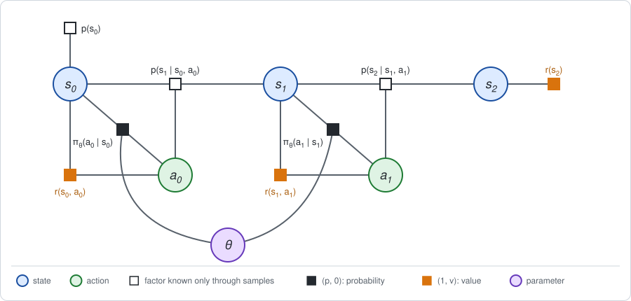
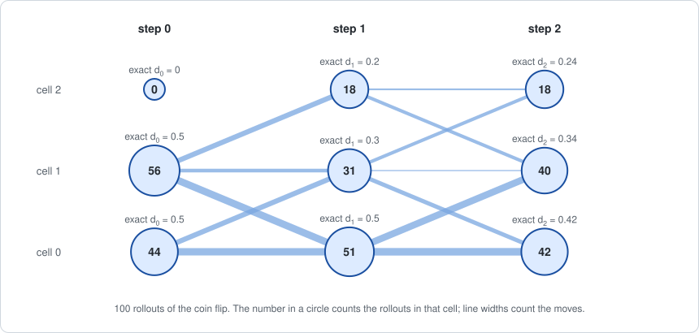

# Chapter 11: Monte Carlo messages

:::{div}
:class: in-progress
**This book is a work in progress.** It is still being written and revised: its content is incomplete and may contain errors.
:::

Parts I and II assumed that the dynamics factor $p(s' \mid s, a)$ can be
*read*: as a table, or as a linear-Gaussian formula. Elimination then summed
over the next state exactly.

Part III drops that assumption. The dynamics are hidden inside a simulator or
a real robot: one can **try** an action in a state and **see** which state
follows, and nothing else. This is the setting of model-free reinforcement
learning.

The algorithm does not change. It is still the two-stage loop of
[Chapter 5](chapter05.md): Stage 1 produces a forward message and a backward
message, and Stage 2 moves the policy parameters along the gradient built
from them. What changes is how the messages are obtained. This chapter uses
the simplest substitute, plain sampling. The short version:

- **The forward message becomes particles.** The states visited at step $t$
  in a set of sampled trajectories stand for the marginal $d_t$.
- **The backward message becomes a sampled return.** The rewards collected
  from step $t$ to the end of one trajectory are one sample of the action
  value $Q_t$.
- **The gradient of Chapter 5 becomes an average over trajectories.** This
  estimator is called REINFORCE.
- **Subtracting a baseline costs nothing and helps.** The normalization
  invariant of [Chapter 2](chapter02.md) is the reason it leaves the average
  unchanged; it reduces the noise.
- **The estimate converges to the exact gradient**, with an error that shrinks
  like $1 / \sqrt{M}$ for $M$ trajectories.

**Run the examples.** The code of this chapter's examples is in the companion
notebook [chapter11_examples.ipynb](chapter11_examples.ipynb), which runs
online:
[](https://colab.research.google.com/github/thduynguyen/gtsam/blob/feature/semiringfactor/gtsam/semiring/doc/chapter11_examples.ipynb)

## 1. The graph: a simulator in place of the dynamics factor

**The example** is the track of Chapter 1, Section 7, with the parametric
policy of Chapter 5: two moves, and one parameter per cell,

$$\pi_\theta(R \mid s) = \sigma(\theta_s), \qquad \sigma(z) = \frac{1}{1 + e^{-z}}.$$

At $\theta = (0, 0, 0)$ it is the coin flip, with $J = 1.4$ and the exact
gradient $\nabla_\theta J = (0.15,\; 1.0,\; 0.35)$ found in Chapter 5.

**What is known and what is not.** The graph has the same variables and the
same factors as before. The difference is in how each factor can be used:

| Factor | In Chapters 1 to 5 | In this chapter |
|---|---|---|
| policy $\pi_\theta(a \mid s)$ | a table | a table: the agent owns its policy, and can read it, sample from it and differentiate it |
| reward $r(s, a)$ | a table | observed: the reward of each move that is actually made |
| dynamics $p(s' \mid s, a)$, start $p(s_0)$ | a table | **samples only**: the next state of each move that is actually made |



The white squares cannot be multiplied into a bucket or summed over. The only
operation they support is to draw from them.

**A rollout** is one draw from the whole graph, forward in time: draw $s_0$
from the start, draw $a_0$ from the policy, observe $r(s_0, a_0)$, let the
simulator draw $s_1$, and so on. It is one trajectory $\tau$, drawn with its
probability $p_\theta(\tau)$. Five rollouts of the coin flip from the
notebook:

| rollout | states $s_0, s_1, s_2$ | actions $a_0, a_1$ | rewards | return $R$ |
|---|---|---|---|---|
| 0 | 1, 1, 1 | L, R | $0, -1, 0$ | $-1$ |
| 1 | 0, 0, 0 | L, L | $0, 0, 0$ | $0$ |
| 2 | 0, 0, 0 | L, L | $0, 0, 0$ | $0$ |
| 3 | 0, 0, 1 | L, R | $0, -1, 0$ | $-1$ |
| 4 | 1, 0, 1 | L, R | $0, -1, 0$ | $-1$ |

A set of $M$ rollouts, $\tau^{(1)}, \dots, \tau^{(M)}$, is all the
information this chapter uses about the dynamics.

**The principle.** Any average over trajectories can be estimated by the
average over rollouts. For a function $h$ of the trajectory,

$$\mathbb{E}[h(\tau)] = \sum_\tau p_\theta(\tau)\, h(\tau)
\;\approx\; \frac{1}{M} \sum_{i=1}^{M} h\big(\tau^{(i)}\big).$$

The right side needs no table. It is correct on average, and its error
shrinks like $1 / \sqrt{M}$. Everything below is this one approximation,
applied to the two messages and to the gradient.

## 2. Stage 1: sampled messages

Stage 1 of Chapter 5 eliminated the states and actions and returned two
messages. Here Stage 1 is: run $M$ rollouts with the current $\theta$.

| Output of Stage 1 | Chapter 5: exact | This chapter: sampled |
|---|---|---|
| sum over the actions | average under $\pi_\theta$, over the table | average under $\pi_\theta$, over the actions the rollouts took |
| forward message $d_t(s)$ | the marginal of $s_t$ | the states the rollouts are in at step $t$: **particles** |
| backward message $Q_t(s, a)$ | the value of the bucket of $a_t$ | the rewards a rollout collects from step $t$ on: a **sampled return** |

### The forward message: particles

The forward message $d_t(s)$ is the probability of being in state $s$ at step
$t$. Its estimate is the fraction of rollouts that are there:

$$d_t(s) \;\approx\; \frac{1}{M} \sum_{i=1}^{M} \mathbf{1}\big[s_t^{(i)} = s\big].$$



| | $d_1(0)$ | $d_1(1)$ | $d_1(2)$ |
|---|---|---|---|
| exact (Chapter 5) | $0.5$ | $0.3$ | $0.2$ |
| 100 rollouts | $0.51$ | $0.31$ | $0.18$ |
| 10000 rollouts | $0.507$ | $0.299$ | $0.194$ |

A SLAM reader knows this representation from the particle filter: a
distribution is carried by a set of samples instead of a table or a Gaussian.
The set of states at step $t$ is never turned into a table in practice. It is
used directly: a sum over states weighted by $d_t(s)$ becomes a sum over the
rollouts.

### The backward message: sampled returns

Write $R_t$ for the rewards one rollout collects from step $t$ to the end,
the *return from step $t$*:

$$R_t = \sum_{k=t}^{T-1} r(s_k, a_k) + r(s_T), \qquad R_0 = R(\tau).$$

The action value was defined in Chapter 1 as the average of exactly this
quantity, given the state and action at step $t$:

$$Q_t(s, a) = \mathbb{E}\big[R_t \mid s_t = s,\; a_t = a\big].$$

So the return from step $t$ of a rollout that passes through $(s, a)$ is one
sample of $Q_t(s, a)$. Averaging over the rollouts that pass through $(s, a)$
estimates it. From 10000 rollouts of the coin flip:

| cell | $Q_1(s, L)$, exact | sampled | $Q_1(s, R)$, exact | sampled |
|---|---|---|---|---|
| 0 | $0$ | $0$ | $-1$ | $-1$ |
| 1 | $0$ | $0$ | $7$ | $6.96$ |
| 2 | $2$ | $1.98$ | $9$ | $9$ |

| cell | $Q_0(s, L)$, exact | sampled | $Q_0(s, R)$, exact | sampled |
|---|---|---|---|---|
| 0 | $-0.5$ | $-0.51$ | $1.7$ | $1.50$ |
| 1 | $0.3$ | $0.27$ | $4.1$ | $4.01$ |
| 2 | $3.9$ | none | $4.5$ | none |

Two things are visible.

- **No particles, no message.** The robot never starts in cell 2, so no
  rollout says anything about $Q_0(2, \cdot)$. This is harmless here, because
  the forward message gives that state weight zero in the gradient anyway.
- **One return is a noisy sample.** The returns of the rollouts that start
  with Right in cell 1 average $4.01$, close to $Q_0(1, R) = 4.1$, but they
  spread around it with a standard deviation of $4.6$. A single return can be
  $-2$ or $9$, depending on the later coin flips and slips.

This estimate of a value function by averaged returns is called *Monte Carlo
policy evaluation*.

## 3. Stage 2: the gradient from rollouts

**The answer first.** The gradient is estimated by the average, over the
rollouts, of a sum over the steps:

$$\widehat{\nabla_\theta J} = \frac{1}{M} \sum_{i=1}^{M} \sum_{t}
\; g_t^{(i)}\; \big(R_t^{(i)} - b_t(s_t^{(i)})\big),
\qquad
g_t = \nabla_\theta \log \pi_\theta(a_t \mid s_t).$$

- $g_t$ is the term of the score at step $t$ (Chapter 5, Section 4). It
  involves only the policy factor, which is known exactly.
- $R_t$ is the sampled return from step $t$.
- $b_t(s)$ is a *baseline*: any function of the state. The usual choice is an
  estimate of $V_t(s)$.

Stage 2 is then the gradient step of Chapter 5,
$\theta \leftarrow \theta + \alpha\, \widehat{\nabla_\theta J}$. With
$b_t = 0$ this algorithm is **REINFORCE** (Williams, 1992); see the
[references](#chapter11-references).

For the policy of this chapter the score term is a vector with one nonzero
entry, in the position of the visited cell:

$$\frac{\partial \log \pi_\theta(a \mid s)}{\partial \theta_s} =
\begin{cases} 1 - \sigma(\theta_s) & \text{if } a = R, \\ -\sigma(\theta_s) & \text{if } a = L. \end{cases}$$

**Where it comes from.** Chapter 5, Section 3, wrote the exact gradient as an
average over trajectories:

$$\nabla_\theta J = \mathbb{E}\Big[\sum_t g_t\; A_t(s_t, a_t)\Big].$$

The estimator replaces each piece of this formula by its sampled counterpart:

| Piece | Exact | Sampled |
|---|---|---|
| the average over trajectories | $\sum_\tau p_\theta(\tau)$, by forward messages | the average over $M$ rollouts |
| the local derivative $g_t$ | exact | exact: the policy factor is known |
| the advantage $A_t(s_t, a_t)$ | $Q_t - V_t$, from the conditional | $R_t - b_t(s_t)$ |

The first row is the principle of Section 1. The third row needs an argument:
why may the advantage be replaced by one noisy return?

**Why a sampled return may replace the action value.** Fix a step $t$.
Average first over everything that happens after $(s_t, a_t)$, and only then
over $(s_t, a_t)$ itself. The score term $g_t$ depends only on $(s_t, a_t)$,
so it comes out of the inner average, and the inner average of $R_t$ is $Q_t$
by definition:

$$\mathbb{E}\big[g_t\, R_t\big]
= \mathbb{E}\Big[g_t\; \mathbb{E}\big[R_t \mid s_t, a_t\big]\Big]
= \mathbb{E}\big[g_t\; Q_t(s_t, a_t)\big].$$

The noise in the return averages out, because it is uncorrelated with the
score term of that step.

**Why a baseline costs no bias.** For any function $b$ of the state,

$$\mathbb{E}\big[g_t\; b(s_t)\big]
= \sum_s d_t(s)\; b(s) \sum_a \pi_\theta(a \mid s)\, \nabla_\theta \log \pi_\theta(a \mid s)
= \sum_s d_t(s)\; b(s)\; \nabla_\theta \underbrace{\sum_a \pi_\theta(a \mid s)}_{1} = 0.$$

This is the normalization invariant of Chapter 2, Section 5, at work. The
conditional of an action is normalized for every value of $\theta$, so the
derivative of its sum is zero. Subtracting $b(s_t)$ from the return therefore
changes the average of the estimator by exactly nothing. With $b = V_t$ the
average of $R_t - V_t(s_t)$ given $(s_t, a_t)$ is the advantage, and the
estimator is the sampled form of the formula of Chapter 5.

:::{dropdown} Why may the rewards before step t be dropped?
The first version of REINFORCE multiplies each score term by the *whole*
return $R = R(\tau)$. Split the return into the rewards before step $t$ and
the return from step $t$:

$$\mathbb{E}\big[g_t\, R\big] = \mathbb{E}\big[g_t\, (R - R_t)\big] + \mathbb{E}\big[g_t\, R_t\big].$$

The rewards before step $t$ are already fixed when the action $a_t$ is drawn.
Given the past and $s_t$, the score term averages to zero, by the same
identity as for the baseline. So the first term vanishes: the earlier rewards
act as a baseline, and a poor one. An action cannot be credited for rewards
that were collected before it was taken.
:::

**Three estimators, one average.** On the track, the notebook computes each
estimator from 200000 rollouts, and computes the mean and the spread of a
single rollout's contribution exactly, by enumerating all 24 possible
trajectories.

| The value that multiplies $g_t$ | Mean over rollouts | Standard deviation of one rollout, for $\theta_0$, $\theta_1$, $\theta_2$ |
|---|---|---|
| the whole return $R$ | $(0.15,\; 1.0,\; 0.35)$ | $1.19$, $1.92$, $1.38$ |
| the return from step $t$, $R_t$ | $(0.15,\; 1.0,\; 0.35)$ | $1.18$, $2.03$, $1.55$ |
| $R_t - V_t(s_t)$ | $(0.15,\; 1.0,\; 0.35)$ | $1.14$, $1.62$, $0.94$ |

All three have the exact gradient as their mean. They differ in their noise.

- The baseline reduces the standard deviation for every parameter, and for
  $\theta_2$ from $1.55$ to $0.94$: the variance drops by 63%.
- Dropping the earlier rewards makes little difference on this problem, and
  slightly increases the noise for two parameters. With two moves there is
  only one earlier reward, and it happens to act as a weak baseline. On long
  problems the earlier rewards are pure noise and dropping them matters.

**A baseline is a control variate.** In statistics, a *control variate* is a
quantity with a known mean, here zero, that is subtracted from an estimator
to cancel part of its noise. The term $g_t\, b(s_t)$ is one. It helps when it
is correlated with $g_t R_t$, which it is when $b(s_t)$ predicts the return.
The notebook checks both sides of this: an absurd baseline,
$b = (50, -20, 7)$, still gives the right mean, $(0.12,\; 1.01,\; 0.35)$ from
200000 rollouts, and raises the standard deviation for $\theta_0$ from
$1.2$ to $24.9$.

:::{dropdown} Is the state value the best baseline?
Not exactly. For one parameter, the baseline that minimizes the variance of
$g_t (R_t - b)$ in a state $s$ weights the returns by the squared score:

$$b^*(s) = \frac{\mathbb{E}\big[g_t^2\, R_t \mid s_t = s\big]}{\mathbb{E}\big[g_t^2 \mid s_t = s\big]}.$$

At the coin flip $g_t^2 = 0.25$ for both actions, so the weights cancel and
$b^*(s) = \mathbb{E}[R_t \mid s_t = s] = V_t(s)$. In general the two differ,
but $V_t$ is close, and it is the quantity that Stage 1 already has a use
for.
:::

In practice the exact $V_t$ is not available either. The table above used it
to isolate the effect of the baseline. The loop of Section 5 estimates it
from the same rollouts, and Chapters [12](chapter12.md) and
[13](chapter13.md) learn it.

## 4. An exact special case: the gradient of Chapter 5

The test of this chapter is that sampling reproduces Chapter 5. At the coin
flip the exact gradient is $(0.15,\; 1.0,\; 0.35)$. The notebook estimates it
from $M$ rollouts, 20 times for each $M$, and reports the average distance
between the estimate and the exact gradient:

| rollouts $M$ | whole return | return from $t$ | return from $t$ minus baseline |
|---|---|---|---|
| 10 | $0.65$ | $0.66$ | $0.62$ |
| 100 | $0.23$ | $0.25$ | $0.18$ |
| 1000 | $0.078$ | $0.083$ | $0.069$ |
| 10000 | $0.027$ | $0.028$ | $0.021$ |
| 100000 | $0.0077$ | $0.0083$ | $0.0064$ |

These numbers are from one seeded run.

- **The estimate converges to the exact gradient.** Every column goes to
  zero.
- **The rate is $1 / \sqrt{M}$.** A hundred times more rollouts give ten times
  less error, in every column. The error of an average of $M$ independent
  samples with standard deviation $\sigma_1$ is $\sigma_1 / \sqrt{M}$; the
  baseline lowers $\sigma_1$ and leaves the rate alone.
- **Ten rollouts say very little.** With $M = 10$ the error, $0.6$, is more
  than half as large as the gradient itself, whose length is $1.07$.

## 5. Implementation

The notebook is plain numpy. The simulator runs all rollouts at once:

```python
def rollouts(theta, M, rng):
    """Run the policy M times: states s[i, t], actions a[i, t], rewards r[i, t]."""
    s = np.zeros((M, 3), dtype=int)
    a = np.zeros((M, 2), dtype=int)
    r = np.zeros((M, 3))
    s[:, 0] = sample(np.tile(prior, (M, 1)), rng)
    for t in range(2):
        a[:, t] = rng.random(M) < sigmoid(theta[s[:, t]])   # 1 = Right
        r[:, t] = move_reward[s[:, t], a[:, t]]
        s[:, t + 1] = sample(dynamics[s[:, t], a[:, t]], rng)
    r[:, 2] = final_reward[s[:, 2]]
    return s, a, r
```

The table `dynamics` appears inside the simulator only. One step of the
two-stage loop is then:

```python
def reinforce_step(theta, M, rng):
    s, a, r = rollouts(theta, M, rng)                 # stage 1: sample
    to_go = np.stack([r.sum(axis=1), r[:, 1:].sum(axis=1)], axis=1)  # R_t
    gradient = np.zeros(3)
    for t in range(2):
        # Baseline: the average return from each cell at this step.
        counts = np.bincount(s[:, t], minlength=3)
        sums = np.bincount(s[:, t], weights=to_go[:, t], minlength=3)
        baseline = sums / np.maximum(counts, 1)
        g = a[:, t] - sigmoid(theta[s[:, t]])          # the score term
        np.add.at(gradient, s[:, t], g * (to_go[:, t] - baseline[s[:, t]]))
    return gradient / M

theta = theta + 0.5 * reinforce_step(theta, 100, rng)  # stage 2
```

Nothing in it is a table over states: the sum over $s$ weighted by $d_t(s)$
has become the sum over rollouts, as Section 2 announced.

**The whole loop.** Starting from the coin flip, with $M = 100$ rollouts per
iteration and step size $\alpha = 0.5$, next to the exact loop of Chapter 5
with the same step size. The expected return of each iterate is evaluated
exactly, for the table only:

| iteration | $J$, sampled messages | $J$, exact messages |
|---|---|---|
| 0 | $1.400$ | $1.400$ |
| 1 | $1.889$ | $1.985$ |
| 2 | $2.482$ | $2.582$ |
| 5 | $3.874$ | $3.968$ |
| 10 | $4.917$ | $5.036$ |
| 20 | $5.537$ | $5.596$ |
| 50 | $5.852$ | $5.862$ |
| 100 | $5.936$ | $5.935$ |
| 200 | $5.969$ | $5.969$ |

The sampled loop follows the exact one closely, toward $J = 6$, the value of
moving Right everywhere. It used $200 \times 100 = 20000$ rollouts to get
there; the exact loop used 200 eliminations and no rollouts. That is the
price of not knowing the dynamics factor.

The module is not used in this chapter. Its factors need the dynamics as a
table, which is exactly what is missing. It returns in the role it had in
Section 4: the exact reference that a sampled method is tested against.

## 6. What breaks

- **The noise grows with the length of the problem.** A return is a sum of
  many random rewards, and its variance grows with the number of steps. On
  the two-move track one rollout has a standard deviation of about 1 to 2 per
  parameter; on a problem with hundreds of steps the gradient signal drowns
  unless $M$ is very large. [Chapter 12](chapter12.md) replaces the full
  return by a shorter one that leans on an estimate of the value.
- **A rollout must run to the end.** The return from step $t$ is known only
  when the episode is over. On the endless chain of Chapter 3 it is never
  over. Chapter 12 removes this requirement as well.
- **Every rollout is used once.** The rollouts were drawn with the current
  $\theta$. After the update the policy is different, and the old rollouts
  are samples from the wrong distribution: the messages are stale. Stage 1
  starts from scratch at every iteration. [Chapter 14](chapter14.md) reuses a
  batch for several updates, and [Chapter 15](chapter15.md) keeps old
  transitions in a buffer.
- **States that are not visited get no message.** The table of $Q_0$ in
  Section 2 has no entry for cell 2. For the gradient this is consistent,
  since such states have weight zero. It becomes a problem when the best
  policy needs to go where the current one never goes, which is the question
  of exploration ([Chapter 24](chapter24.md)).
- **The baseline has to come from somewhere.** The exact $V_t$ is as
  unavailable as the exact $Q_t$. Estimating it well is a learning problem of
  its own, the subject of the next two chapters.

## 7. Framework card

| | REINFORCE with a baseline |
|---|---|
| 1. Sum over the actions | average under $\pi_\theta$, by sampling the action |
| 2. Dynamics factor | samples from a simulator: whole rollouts |
| 3. Backward messages | Monte Carlo: the sampled return $R_t$, minus a baseline |
| 4. Forward messages | particles: the states visited by the rollouts |
| 5. Stage 2 update | gradient step with the sampled gradient |

(chapter11-references)=
## 8. References

- R. J. Williams, "Simple statistical gradient-following algorithms for
  connectionist reinforcement learning", *Machine Learning*, 1992. REINFORCE
  and its baselines.
- R. S. Sutton, D. McAllester, S. Singh and Y. Mansour, "Policy gradient
  methods for reinforcement learning with function approximation", *NeurIPS*,
  2000. The exact formula that REINFORCE samples.
- E. Greensmith, P. L. Bartlett and J. Baxter, "Variance reduction techniques
  for gradient estimates in reinforcement learning", *Journal of Machine
  Learning Research*, 2004. Baselines as control variates, and the best one.
- R. S. Sutton and A. G. Barto, *Reinforcement Learning: An Introduction*, 2nd
  edition, MIT Press, 2018. Chapter 5, Monte Carlo methods, and Chapter 13,
  policy gradient methods.
- J. Peters and S. Schaal, "Reinforcement learning of motor skills with
  policy gradients", *Neural Networks*, 2008. Sampled policy gradients in
  robotics.

---

Previous: [Chapter 10: Sampling-based control](chapter10.md).
Next: [Chapter 12: Bootstrapped messages](chapter12.md).
