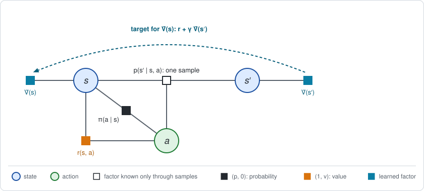
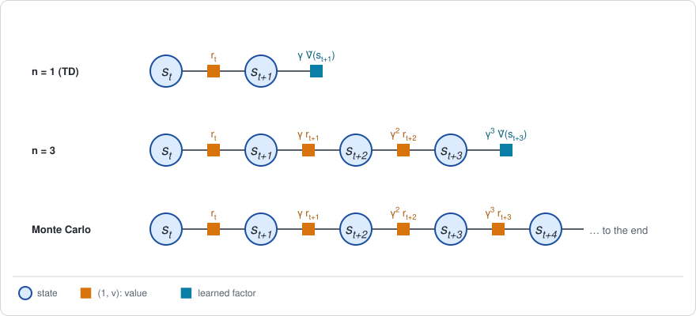

# Chapter 12: Bootstrapped messages

:::{div}
:class: in-progress
**This book is a work in progress.** It is still being written and revised: its content is incomplete and may contain errors.
:::

[Chapter 11](chapter11.md) replaced the backward message by a sampled return:
the rewards one rollout collects from a step to the end of the episode. That
estimate is correct on average, but it is noisy, and it is only available
when the episode is over.

This chapter builds the backward message in a different way. It does not wait
for the end. It uses the fact, from [Chapter 3](chapter03.md), that the
backward message is a *fixed point*: the value of a state is tied to the
value of the next state by the Bellman equation. Enforcing that tie on one
sampled transition at a time is enough to learn the message. The short
version:

- **The backward message is learned from local consistency.** After each
  sampled transition $(s, r, s')$, the estimate $\hat V(s)$ is moved toward
  $r + \gamma\, \hat V(s')$. The target is built from the estimate itself,
  which is called *bootstrapping*. The method is temporal-difference learning,
  TD(0).
- **It is the unrolled chain of Chapter 3, one sample at a time.** In a table
  it converges to the exact $V$.
- **There is a dial between one step and the whole return.** Using $n$
  sampled rewards before leaning on the estimate trades bias against noise.
  TD($\lambda$) and GAE mix all $n$ with one parameter $\lambda$.
- **With a parametric $\hat V$ it converges to a different fixed point**, and
  with data from another policy it can diverge. That combination is known as
  the *deadly triad*.

This chapter only builds the backward message, for a fixed policy. Stage 2
returns in [Chapter 13](chapter13.md).

**Run the examples.** The code of this chapter's examples is in the companion
notebook [chapter12_examples.ipynb](chapter12_examples.ipynb), which runs
online:
[](https://colab.research.google.com/github/thduynguyen/gtsam/blob/feature/semiringfactor/gtsam/semiring/doc/chapter12_examples.ipynb)

## 1. The graph: one transition at a time

**The example** is the endless track of Chapter 3: the three cells, the
slippery moves, a reward of 2 for every step at the charger in cell 2, a cost
of 1 for moving Right, and the discount $\gamma = 0.9$. The policy is the
coin flip. Chapter 3 computed its backward message exactly, by solving
$(I - \gamma P_\pi)\, V = r_\pi$:

$$V = (-0.2248,\;\; 1.1017,\;\; 4.1231).$$

That number is the target of this chapter. As in Chapter 11, the dynamics
factor cannot be read; it can only be sampled. The unit of data is now
smaller than a rollout. It is a single **transition**: the robot is in $s$,
takes $a$, receives $r$ and lands in $s'$.



The figure shows one step of the stationary chain of Chapter 3, Section 4,
with two changes. The dynamics factor is white: only one sampled next state
is seen. And the value factors on $s$ and on $s'$ are teal: they hold the
current *estimate* $\hat V$, a table with one entry per cell, which is being
learned.

Because every step of the endless chain is identical, one long run of the
robot is a stream of such transitions, and the same table $\hat V$ sits on
both ends of every one of them.

## 2. Stage 1: the backward message from local consistency

### The condition

Chapter 3 showed that the backward message of the endless chain satisfies the
Bellman equation: eliminating one step returns the same function. Written per
state,

$$V(s) = \sum_a \pi(a \mid s) \Big[r(s, a) + \gamma \sum_{s'} p(s' \mid s, a)\, V(s')\Big]
= \mathbb{E}\big[\,r + \gamma\, V(s') \;\big|\; s\,\big].$$

The right side is an average over the action and the next state, that is,
over the transitions that start in $s$. Move $V(s)$ inside the average:

$$\mathbb{E}\big[\,\underbrace{r + \gamma\, V(s') - V(s)}_{\delta}\;\big|\; s\,\big] = 0
\qquad \text{for every state } s.$$

The quantity $\delta$ is the TD residual of a transition, in the form given in
Chapter 3, Section 4. So the Bellman equation says: **at the exact $V$, the
TD residual averages to zero in every state.** It is a condition between the
values of neighboring states only. It involves no return and no end of the
episode.

The notebook checks it on 200000 sampled transitions of the coin flip. With
the exact $V$, the average residual of the transitions leaving each cell is
$-0.001$, $-0.003$ and $-0.001$.

### The update

Turn the condition into a correction. Keep a table $\hat V$, and after every
transition $(s, r, s')$ compute the residual with the current table and move
the entry of $s$ a small step $\alpha$ in its direction:

$$\hat\delta = r + \gamma\, \hat V(s') - \hat V(s),
\qquad
\hat V(s) \leftarrow \hat V(s) + \alpha\, \hat\delta.$$

Equivalently, $\hat V(s)$ is moved toward the **target**
$r + \gamma\, \hat V(s')$. This is **TD(0)** (Sutton, 1988); see the
[references](#chapter12-references). Chapter 1, Section 2, described the same
update for $\hat Q$ in a side note.

**Why it works.** Average the target over the transitions that leave $s$:

$$\mathbb{E}\big[\,r + \gamma\, \hat V(s') \;\big|\; s\,\big]
= r_\pi(s) + \gamma \sum_{s'} P_\pi(s, s')\, \hat V(s').$$

This is one sweep of the unrolled chain of Chapter 3, Section 3,
$V \leftarrow r_\pi + \gamma\, P_\pi\, V$, applied to the current estimate.
That sweep is a contraction: each application shrinks the error by $\gamma$.
TD(0) performs it without the tables $P_\pi$ and $r_\pi$: every sampled
transition is a noisy sample of the sweep for one state, and the step size
$\alpha$ averages the noise out over many transitions.

| Chapter 3: exact | This chapter: sampled |
|---|---|
| one sweep $V \leftarrow r_\pi + \gamma P_\pi V$, all states at once | one transition: move $\hat V(s)$ toward $r + \gamma \hat V(s')$ |
| the average over $a$ and $s'$, from the tables | one sampled $a$ and $s'$ |
| the fixed point: the Bellman equation | the point where $\hat\delta$ averages to zero |

**Bootstrapping.** The target contains $\hat V(s')$, the estimate itself. A
sampled return, by contrast, contains only rewards. This is the difference
between the two chapters:

| | Chapter 11: Monte Carlo | This chapter: bootstrapped |
|---|---|---|
| target for $\hat V(s_t)$ | the sampled return $R_t$ | $r_t + \gamma\, \hat V(s_{t+1})$ |
| built from | all later rewards of the rollout | one reward and the current estimate |
| available | when the episode is over | after one transition |
| average | exactly $V(s_t)$ | $V(s_t)$ only once $\hat V$ is right |
| noise | of a whole future | of one step |

In the language of message passing, a sampled return computes the backward
message at a state from scratch. Bootstrapping reuses the backward message
already stored at the neighboring state, as a sweep of an iterative solver
reuses the current values of the neighbors.

:::{dropdown} Where did the termination coin of Chapter 3 go?
Chapter 3 read the discount as a coin: after every move the episode continues
with probability $\gamma$. A simulator could toss that coin, and the target
of a transition would then be $r + \hat V(s')$ if the episode continues and
$r + 0$ if it ends.

The average of that target over the coin is

$$\gamma\, \big(r + \hat V(s')\big) + (1 - \gamma)\, \big(r + 0\big) = r + \gamma\, \hat V(s').$$

The target of TD(0) is this average, taken by formula. Averaging by formula
whatever can be averaged by formula removes noise for free, so the coin is
not tossed. The robot simply keeps running, and $\gamma$ appears in the
target.
:::

### On the endless track

One long run of the coin-flip robot, starting from $\hat V = 0$, with the
step size $\alpha = 20 / (20 + \text{number of visits to } s)$:

| transitions | $\hat V(0)$ | $\hat V(1)$ | $\hat V(2)$ | largest error |
|---|---|---|---|---|
| 100 | $-0.968$ | $1.394$ | $3.531$ | $0.74$ |
| 1000 | $-0.059$ | $1.152$ | $4.500$ | $0.38$ |
| 10000 | $-0.312$ | $1.035$ | $4.228$ | $0.10$ |
| 100000 | $-0.240$ | $1.122$ | $4.079$ | $0.044$ |
| 200000 | $-0.230$ | $1.087$ | $4.094$ | $0.030$ |
| exact (Chapter 3) | $-0.225$ | $1.102$ | $4.123$ | |

The table is from one seeded run. The estimate approaches the exact backward
message of Chapter 3, with an error that shrinks like one over the square
root of the number of transitions, as any average of samples does.

## 3. Between one step and the whole return

TD(0) and Monte Carlo are the two ends of a family. The members differ in how
many sampled rewards the target uses before it leans on the estimate.



### The n-step target

Use $n$ sampled rewards, then the estimate at the state reached:

$$R_t^{(n)} = \sum_{k=0}^{n-1} \gamma^k\, r_{t+k} \;+\; \gamma^n\, \hat V(s_{t+n}).$$

With $n = 1$ this is the target of TD(0). As $n \to \infty$ the last term
vanishes and it is the sampled return of Chapter 11.

**Its bias, exactly.** If the estimate is wrong, the target is wrong on
average, and by a known amount:

$$\mathbb{E}\big[R_t^{(n)} \mid s_t = s\big] - V(s)
= \gamma^n \sum_{s'} P_\pi^n(s, s')\, \big(\hat V(s') - V(s')\big).$$

The error of the estimate enters $n$ steps later, discounted by $\gamma^n$.

:::{dropdown} Why?
The $n$ sampled rewards average to the first $n$ terms of the unrolled chain,
and the last term to the estimate carried $n$ steps forward:

$$\mathbb{E}\big[R_t^{(n)} \mid s_t = s\big]
= \Big(\sum_{k=0}^{n-1} \gamma^k P_\pi^k\, r_\pi + \gamma^n P_\pi^n\, \hat V\Big)(s).$$

Chapter 3, Section 4, unrolled the exact value in the same way:
$V = \sum_{k=0}^{n-1} \gamma^k P_\pi^k\, r_\pi + \gamma^n P_\pi^n\, V$.
Subtracting the two leaves $\gamma^n P_\pi^n (\hat V - V)$.
:::

**Its noise** goes the other way: every additional sampled reward adds its
own randomness.

*On the endless track.* Take a critic that is half right, $\hat V = 0.5\, V$,
and the targets for cell 1, whose exact value is $1.102$. From 20000 sampled
paths:

| steps $n$ | mean of the target | bias, sampled | bias, exact formula | standard deviation |
|---|---|---|---|---|
| 1 | $0.299$ | $-0.803$ | $-0.801$ | $0.51$ |
| 2 | $0.436$ | $-0.666$ | $-0.666$ | $0.99$ |
| 5 | $0.610$ | $-0.492$ | $-0.492$ | $1.73$ |
| 10 | $0.818$ | $-0.283$ | $-0.291$ | $2.21$ |
| 60 | $1.103$ | $+0.001$ | $-0.001$ | $2.43$ |

One step gives a quiet target that is badly biased by the poor critic. Sixty
steps give an unbiased target that is five times noisier. This is the
**bias-variance trade-off** of bootstrapping.

### Residuals add up

An $n$-step target can be written with TD residuals. Subtract the estimate at
the starting state and insert $\pm\, \gamma^k \hat V(s_{t+k})$ for every step
in between; the sum telescopes:

$$R_t^{(n)} - \hat V(s_t) = \sum_{l=0}^{n-1} \gamma^l\, \hat\delta_{t+l},
\qquad
\hat\delta_{t+l} = r_{t+l} + \gamma\, \hat V(s_{t+l+1}) - \hat V(s_{t+l}).$$

This is the sampled, discounted form of an identity from Chapter 1,
Section 7: the surprises along a trajectory add up to its return relative to
what was expected at the start.

### One dial for all n: TD(λ) and GAE

Instead of choosing one $n$, mix all of them, giving the $n$-step target the
weight $(1 - \lambda)\, \lambda^{n-1}$ for a number $\lambda$ between 0 and 1.
With the telescoped form the mixture collapses to a single sum, in which the
residual $l$ steps ahead is weighted by $(\gamma\lambda)^l$:

$$\hat A_t = \sum_{l=0}^{\infty} (\gamma\lambda)^l\; \hat\delta_{t+l}.$$

- With $\lambda = 0$ it is one residual, $\hat\delta_t$: TD(0).
- With $\lambda = 1$ it is the sampled return minus $\hat V(s_t)$: Monte Carlo
  with the estimate as a baseline.

:::{dropdown} Why does the mixture collapse to this sum?
Write each $n$-step target, minus $\hat V(s_t)$, as its sum of residuals, and
exchange the two sums. The residual $l$ steps ahead appears in every target
with $n > l$, so its total weight is

$$\gamma^l\, (1 - \lambda) \sum_{n = l + 1}^{\infty} \lambda^{n - 1}
= \gamma^l\, (1 - \lambda)\, \frac{\lambda^l}{1 - \lambda} = (\gamma\lambda)^l.$$
:::

Used as a target for $\hat V$, the mixture is **TD($\lambda$)** (Sutton,
1988). Used as an estimate of the advantage of the action taken at step $t$,
it is **generalized advantage estimation**, GAE (Schulman et al., 2016). It
is an estimate of the advantage because its first term, $\hat\delta_t$,
averages to $A(s_t, a_t)$ when the critic is exact (Chapter 3, Section 4) and
the later terms average to zero.

*On the endless track*, with the same half-right critic, for cell 1. The
gradient of Chapter 5 uses the difference between the advantages of the two
actions, the *gap* $A(1, R) - A(1, L) = 2.130$, so the table reports the bias
of the estimated gap, computed exactly, and the standard deviation of one
estimate of $A(1, R)$, from 20000 sampled paths:

| $\lambda$ | estimated gap | bias of the gap | standard deviation of $\hat A(1, R)$ |
|---|---|---|---|
| 0 | $0.56$ | $-1.565$ | $0.55$ |
| 0.5 | $1.05$ | $-1.072$ | $0.82$ |
| 0.9 | $1.82$ | $-0.305$ | $1.62$ |
| 0.95 | $1.96$ | $-0.161$ | $1.92$ |
| 1 | $2.12$ | $0$ | $2.38$ |

With this poor critic, $\lambda = 0$ underestimates the gap by three
quarters. With $\lambda = 1$ the gap is unbiased whatever the critic is, as
Chapter 11 showed for any baseline, at four times the noise. Values such as
$\lambda = 0.95$ are the usual compromise.

:::{dropdown} Computing the mixture online: traces
The sum over future residuals can be computed without looking ahead. Keep,
for every state, a *trace* $z(s)$ that records how recently the state was
visited. At each transition, decay all traces by $\gamma\lambda$, add one to
the trace of the current state, and let the residual update *every* state in
proportion to its trace:

$$z \leftarrow \gamma\lambda\, z, \qquad z(s_t) \leftarrow z(s_t) + 1,
\qquad \hat V(s) \leftarrow \hat V(s) + \alpha\, \hat\delta_t\, z(s) \;\; \text{for all } s.$$

A residual observed now is credited to the states visited earlier, with the
weights $(\gamma\lambda)^l$ of the formula above. On the endless track, with
$\lambda = 0.8$ and 200000 transitions, the notebook gets
$\hat V = (-0.222,\; 1.103,\; 4.139)$, within $0.02$ of the exact values.
:::

## 4. A backward message with parameters

A table has one entry per state. A robot with continuous states has no such
table. The estimate is then a function with parameters $\theta_V$, written
$\hat V_{\theta_V}(s)$: a linear combination of features, or a neural
network. This is called *function approximation*, and the learned function is
the **critic**.

**The update.** Move the parameters, instead of a table entry, in the
direction that changes $\hat V$ at the visited state:

$$\theta_V \leftarrow \theta_V + \alpha\; \hat\delta\;\; \nabla_{\theta_V} \hat V_{\theta_V}(s),
\qquad
\hat\delta = r + \gamma\, \hat V_{\theta_V}(s') - \hat V_{\theta_V}(s).$$

For a table, the gradient is 1 for the entry of $s$ and 0 elsewhere, and this
is the update of Section 2. The target is treated as a constant when the
gradient is taken, although it depends on $\theta_V$ too; the update is
therefore called a *semi-gradient*.

**The parameters are shared.** One parameter now affects the estimate at many
states. This is the situation of Chapter 4, Section 4, on the value side: the
consistency conditions of the individual states can no longer be satisfied
one by one.

**The fixed point.** The update stops moving, on average, where the residual
is uncorrelated with the gradient. Write $\zeta(s)$ for the fraction of the
updates that are made in state $s$:

$$\sum_s \zeta(s)\;\; \mathbb{E}\big[\hat\delta \mid s\big]\;\; \nabla_{\theta_V} \hat V_{\theta_V}(s) = 0.$$

With a table this forces the average residual to zero in every state, which
is the Bellman equation. With fewer parameters than states it forces only
some weighted combinations of the residuals to zero.

*On the endless track.* Let cells 0 and 1 share one value:
$\hat V = (\theta_{V,0},\; \theta_{V,0},\; \theta_{V,1})$, two numbers for
three cells. The coin flip visits the three cells equally often in the long
run, so $\zeta = (\tfrac13, \tfrac13, \tfrac13)$.

| | $\hat V(0) = \hat V(1)$ | $\hat V(2)$ |
|---|---|---|
| exact $V$ | $-0.225$ and $1.102$ | $4.123$ |
| the best fit to the exact $V$ | $0.438$ | $4.123$ |
| the TD fixed point | $0.625$ | $3.750$ |
| semi-gradient TD(0) on 200000 transitions | $0.594$ | $3.736$ |

The best fit is the average of the two shared cells and the exact value of
cell 2. TD does **NOT** find it. It settles at a fixed point of its own. Even
cell 2, which has a parameter to itself, is off by $0.37$: its target
bootstraps from the shared value of cell 1, which is wrong, and the error
travels along the chain. With bootstrapping, an approximation error in one
place becomes a bias everywhere.

## 5. Stage 2

There is none in this chapter. TD methods *evaluate* a fixed policy: they
compute the backward message and stop.

What they hand to Stage 2 is the pair that the gradient of Chapter 5 needs:

| Needed by the gradient | Chapter 11 | This chapter |
|---|---|---|
| forward message | the states visited by rollouts | the states visited by the stream of transitions |
| advantage of the action taken | $R_t - b_t(s_t)$ | $\hat A_t = \sum_l (\gamma\lambda)^l\, \hat\delta_{t+l}$, from the critic |

[Chapter 13](chapter13.md) puts the two together.

## 6. An exact special case: the fixed point of Chapter 3

Three results of this chapter are checked against exact computations.

| Result | Sampled or learned | Exact reference |
|---|---|---|
| tabular TD(0) on the coin flip | $\hat V = (-0.230,\; 1.087,\; 4.094)$ after 200000 transitions | $V = (-0.2248,\; 1.1017,\; 4.1231)$, by elimination with the module |
| bias of the $n$-step target | measured on 20000 paths | $\gamma^n P_\pi^n (\hat V - V)$: the error carried back $n$ moves, by $n$ elimination steps without rewards |
| parametric TD(0) | $\theta_V = (0.594,\; 3.736)$ | the TD fixed point $(0.625,\; 3.750)$, from a $2 \times 2$ linear system |

The first row is the correctness test of the chapter: in a table, with a
decaying step size, bootstrapping reproduces the backward message that exact
elimination computes.

## 7. Implementation

Tabular TD(0) is a loop over the transitions of one long run:

```python
V_hat = np.zeros(3)
visits = np.zeros(3)
for i in range(len(s)):                      # transitions (s, r, s')
    visits[s[i]] += 1
    alpha = 20 / (20 + visits[s[i]])
    residual = r[i] + gamma * V_hat[s_next[i]] - V_hat[s[i]]   # TD residual
    V_hat[s[i]] += alpha * residual
```

GAE for a batch of sampled paths, given a critic:

```python
residuals = rewards + gamma * V_hat[states[:, 1:]] - V_hat[states[:, :-1]]
weights = (gamma * lam) ** np.arange(residuals.shape[1])
advantage = (residuals * weights).sum(axis=1)     # A_hat of the first step
```

The semi-gradient update for a critic that is linear in its parameters, where
`features[s]` is the gradient of $\hat V$ at $s$:

```python
residual = r[i] + gamma * features[s_next[i]] @ theta_V - features[s[i]] @ theta_V
theta_V += alpha * residual * features[s[i]]
```

**The exact reference, with the module.** As in Chapter 11, the module does
not appear in the algorithm, since its factors need the dynamics as a table.
It computes every exact number of this chapter. The endless track is built
from semiring factors with the termination outcome of
[Chapter 3](chapter03.md), and three kinds of elimination are used.

```python
# One step: sum out the next state, then the action, by the average.
bucket = policy_factor * reward_factor * (step * value([later], V)).sum(
    ordering(X(1)))
new_V = bucket.sum(ordering(U(0))).value()

# The value of the endless chain: compose the factor of one move with itself.
moves = one_move(policy)                    # a factor on (s, s')
for i in range(1, 11):                      # 2, 4, ..., 1024 moves
    copy = relabel(moves, [now, middle], [middle, end])
    moves = (moves * copy).sum(ordering(X(i)))
V = moves.sum(ordering(...)).value()

# Q: the bucket of the action, without a policy factor.
Q = (reward_factor * (step * value([later], V)).sum(ordering(X(1)))).value()
```

The doubling in the middle is the unrolled chain of Chapter 3 built quickly:
multiplying the factor of $n$ moves with a copy of itself on the following
states, and summing out the state in between, gives the factor of $2n$ moves.
After ten doublings the chain has 1024 moves, and the probability that an
episode is still running is $0.9^{1024}$, far below rounding error.

The same tools give the other exact numbers. The bias of the $n$-step target
is $n$ steps of the first kind applied to the error $\hat V - V$, without
rewards. The mean of the GAE estimate is the value of a chain whose reward is
the expected TD residual and whose continuation probability is
$\gamma \lambda$. The long-run visit frequencies are the probability channel
of 256 moves without a discount. Only the TD fixed point of Section 4 is a
plain linear solve: it is a statement about the learning rule, not about the
chain.

## 8. What breaks

### The deadly triad

Three ingredients, each harmless alone, can make the estimate **diverge**
when combined (Sutton and Barto, 2018, Chapter 11):

1. **bootstrapping**: the target contains the estimate;
2. **function approximation**: parameters shared between states;
3. **off-policy data**: transitions that are not visited with the frequencies
   of the policy being evaluated. In the terms of this book, the updates are
   weighted by the wrong forward message.

*A two-state example*, in the style of Tsitsiklis and Van Roy (1997). State 1
always leads to state 2, and state 2 leads to itself. All rewards are zero,
so the exact value is zero in both. The critic has one parameter:
$\hat V(1) = \theta_V$ and $\hat V(2) = 2\, \theta_V$. The exact value is
representable, with $\theta_V = 0$.

Let a fraction $\zeta$ of the updates be made in state 1 and $1 - \zeta$ in
state 2. The residuals are $\gamma \cdot 2\theta_V - \theta_V$ in state 1 and
$\gamma \cdot 2\theta_V - 2\theta_V$ in state 2, and the gradients of
$\hat V$ are 1 and 2. One expected update multiplies the parameter by

$$1 + \alpha\, \big[\zeta\, (2\gamma - 1) + 4\, (1 - \zeta)\, (\gamma - 1)\big].$$

With $\gamma = 0.9$ the bracket is $0.8\, \zeta - 0.4\, (1 - \zeta)$, which is
positive when $\zeta > \tfrac13$. The update in state 1 pulls $\hat V(1)$ up
toward $\gamma\, \hat V(2) = 1.8\, \theta_V$, and because the parameter is
shared this raises $\hat V(2)$ as well, which raises the target again.

The chain itself spends all its time in state 2, so on-policy data has
$\zeta = 0$. The notebook applies the expected update 200 times, from
$\theta_V = 1$ with $\alpha = 0.5$:

| Setting | Factor per update | $\hat V(1)$ after 200 updates |
|---|---|---|
| all three: bootstrapping, shared parameter, updates split evenly ($\zeta = 0.5$) | $1.1$ | $1.9 \times 10^8$ |
| no bootstrapping: the full return, which is 0, as the target | | $0$ |
| no shared parameter: a table | | $0.013$ |
| on-policy frequencies ($\zeta = 0$) | $0.8$ | $0$ |

Removing any one of the three ingredients restores convergence. With all
three, the estimate grows without bound although the exact answer is
representable.

For on-policy data and a critic that is linear in its parameters, TD is
proved to converge (Tsitsiklis and Van Roy, 1997). The weights of the
policy's own forward message are what make the expected update a contraction.
Methods that learn from stored or foreign data
([Chapter 15](chapter15.md)) do not have that protection.

### Other limits

- **A wrong critic biases everything built on it.** Section 3 showed a gap
  underestimated by three quarters. Unlike the noise of Chapter 11, this
  error does not average out with more samples. The dial $\lambda$ trades it
  against noise but removes neither.
- **The fixed point of a parametric critic is not the best fit.** Section 4
  showed an error at a state that has a parameter of its own.
- **Step sizes.** Convergence in the table needed a step size that decays.
  With a constant step size the estimate keeps fluctuating around the fixed
  point.
- **The policy is fixed.** Everything here evaluates one policy. As soon as
  Stage 2 changes the policy, the backward message being learned is the
  message of a moving target ([Chapter 13](chapter13.md)).

## 9. Framework card

| | TD(0) | TD($\lambda$) and GAE |
|---|---|---|
| 1. Sum over the actions | average under $\pi$, by sampling the action | average under $\pi$, by sampling the action |
| 2. Dynamics factor | samples: single transitions | samples: short sequences of transitions |
| 3. Backward messages | bootstrapped: $\hat V(s)$ moved toward $r + \gamma \hat V(s')$; a table or a learned critic | bootstrapped, with $n$-step targets mixed by $\lambda$; advantage $\hat A = \sum_l (\gamma\lambda)^l \hat\delta_{t+l}$ |
| 4. Forward messages | particles: the states visited by the stream of transitions | particles: the states visited by the stream of transitions |
| 5. Stage 2 update | none: evaluation only | none: evaluation only |

(chapter12-references)=
## 10. References

- R. S. Sutton, "Learning to predict by the methods of temporal differences",
  *Machine Learning*, 1988. TD(0) and TD($\lambda$).
- J. N. Tsitsiklis and B. Van Roy, "An analysis of temporal-difference
  learning with function approximation", *IEEE Transactions on Automatic
  Control*, 1997. Convergence of on-policy linear TD, its fixed point, and
  divergence off-policy.
- L. Baird, "Residual algorithms: reinforcement learning with function
  approximation", *International Conference on Machine Learning*, 1995. A
  classic divergence example.
- J. Schulman, P. Moritz, S. Levine, M. Jordan and P. Abbeel,
  "High-dimensional continuous control using generalized advantage
  estimation", *International Conference on Learning Representations*, 2016.
  GAE.
- R. S. Sutton and A. G. Barto, *Reinforcement Learning: An Introduction*, 2nd
  edition, MIT Press, 2018. Chapters 6, 7 and 12 for TD, $n$-step returns and
  traces; Chapter 11 for the deadly triad.

---

Previous: [Chapter 11: Monte Carlo messages](chapter11.md).
Next: [Chapter 13: Actor-critic](chapter13.md).
