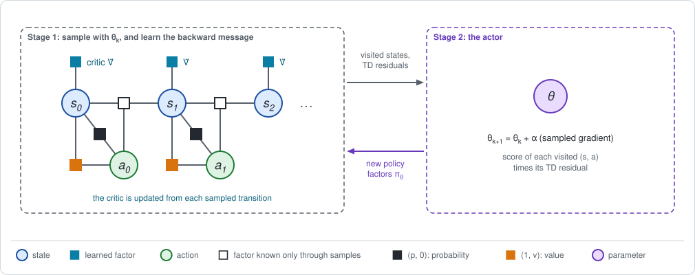

# Chapter 13: Actor-critic

The last two chapters each replaced one exact message of
[Chapter 5](chapter05.md) by an estimate from samples.
[Chapter 11](chapter11.md) estimated the gradient from whole rollouts, with
sampled returns as the backward message. [Chapter 12](chapter12.md) learned
the backward message itself, from single transitions, but for a fixed policy.

This chapter joins them. A learned backward message, the **critic**, supplies
the advantages. A gradient step on the policy parameters, the **actor**, uses
them. Both are updated from the same sampled transitions, in turn. The short
version:

- **Stage 1 samples the forward message and learns the backward one.** The
  states visited by episodes that end with probability $1 - \gamma$ stand for
  the discounted visitation $d$. The critic $\hat V$ is updated by TD(0).
- **Stage 2 is the gradient step of Chapter 5**, with the TD residual of each
  visited transition in the place of the advantage.
- **With the exact critic the sampled gradient is unbiased**; the notebook
  recovers the exact gradient. With a wrong critic it is biased, and the bias
  has a simple form.
- **The loop reaches the same policy as the exact two-stage loop** on the
  endless track, from about 6000 episodes of experience instead of the
  dynamics table.

**Run the examples.** The code of this chapter's examples is in the companion
notebook [chapter13_examples.ipynb](chapter13_examples.ipynb), which runs
online:
[](https://colab.research.google.com/github/thduynguyen/gtsam/blob/feature/semiringfactor/gtsam/semiring/doc/chapter13_examples.ipynb)

## 1. The graph

**The example** is the endless track of [Chapter 3](chapter03.md), with the
parametric policy of Chapter 5: one parameter per cell, the same at every
step,

$$\pi_\theta(R \mid s) = \sigma(\theta_s), \qquad \sigma(z) = \frac{1}{1 + e^{-z}}.$$

At $\theta = (0, 0, 0)$ it is the coin flip, with $J = 0.4385$. The best
policy moves Right everywhere, with $J^* = 6.4902$
([Chapter 4](chapter04.md)).

**The exact two-stage loop**, for reference. On the endless chain the
gradient of Chapter 5 uses the discounted visitation $d$ and the stationary
advantage $A$ (Chapter 5, Section 3):

$$\nabla_\theta J = \sum_s d(s) \sum_a \nabla_\theta \pi_\theta(a \mid s)\; A(s, a).$$

For this policy only the row of cell $s$ depends on $\theta_s$, with
$\partial \pi_\theta(R \mid s) / \partial \theta_s = \sigma (1 - \sigma)$, so

$$\frac{\partial J}{\partial \theta_s} = d(s)\; \sigma(\theta_s) \big(1 - \sigma(\theta_s)\big)\; \big(A(s, R) - A(s, L)\big).$$

At the coin flip, with the messages of Chapter 3:

| cell $s$ | $d(s)$ | $A(s, R) - A(s, L)$ | $\partial J / \partial \theta_s$ |
|---|---|---|---|
| 0 | $3.806$ | $-0.045$ | $3.806 \cdot 0.25 \cdot (-0.045) = -0.043$ |
| 1 | $3.475$ | $2.130$ | $3.475 \cdot 0.25 \cdot 2.130 = 1.851$ |
| 2 | $2.719$ | $1.175$ | $2.719 \cdot 0.25 \cdot 1.175 = 0.799$ |

The notebook confirms $\nabla_\theta J = (-0.043,\; 1.851,\; 0.799)$ by finite
differences. This is the number the sampled method has to reproduce.

**The graph of this chapter** is the same chain with two changes, both
inherited from the last two chapters. The dynamics factors can only be
sampled. And a learned value factor, the critic $\hat V$, sits on every
state.



| Name | What it is in this book | Its parameters |
|---|---|---|
| actor | the policy factor $\pi_\theta(a \mid s)$ | $\theta$ |
| critic | a learned backward message $\hat V(s)$ | $\theta_V$; here a table with one entry per cell |

## 2. Stage 1: a sampled forward message and a learned backward message

### The forward message: episodes that end

The gradient weights each state by the discounted visitation $d(s)$.
Chapter 3, Section 5, gave it a meaning: with the discount read as a
termination coin, $d(s)$ is the **expected number of steps the robot spends
in $s$ before the episode ends**.

That meaning is a sampling recipe. Start the robot from $p(s_0)$; after
every move, continue with probability $\gamma$ and stop otherwise. The states
visited by such episodes are particles for $d$: a sum over states weighted by
$d(s)$ becomes a sum over all the visited states, divided by the number of
episodes $M$,

$$\sum_s d(s)\; h(s) \;\approx\; \frac{1}{M} \sum_{i=1}^{M}\; \sum_{t \,\in\, \text{episode } i} h\big(s_t^{(i)}\big).$$

From 20000 episodes of the coin flip:

| | cell 0 | cell 1 | cell 2 | total |
|---|---|---|---|---|
| visits per episode | $3.76$ | $3.47$ | $2.73$ | $9.96$ |
| exact $d$ (Chapter 3) | $3.806$ | $3.475$ | $2.719$ | $10$ |

### The backward message: the critic

The critic is learned as in Chapter 12. For every visited transition
$(s, a, r, s')$, compute the TD residual with the current critic and move the
critic a small step $\alpha_V$ along it:

$$\hat\delta = r + \gamma\, \hat V(s') - \hat V(s),
\qquad
\hat V(s) \leftarrow \hat V(s) + \alpha_V\, \hat\delta.$$

The same residual serves as the estimate of the advantage of the action that
was taken. Chapter 3, Section 4, showed why: with the exact $V$, the residual
of a transition averages, over the next state, to the advantage,

$$\mathbb{E}\big[\,r + \gamma\, V(s') - V(s) \;\big|\; s, a\,\big] = Q(s, a) - V(s) = A(s, a).$$

It is the advantage estimate of Chapter 12 with $\lambda = 0$. Any other
$\lambda$ can be used in its place.

| Output of Stage 1 | Chapter 5: exact | This chapter |
|---|---|---|
| forward message $d(s)$ | solve $(I - \gamma P_\pi^\top)\, d = p_0$ | the states visited by $M$ episodes that end with probability $1 - \gamma$ |
| backward message $V(s)$ | solve $(I - \gamma P_\pi)\, V = r_\pi$ | the critic $\hat V$, updated by TD(0) on the same transitions |
| advantage $A(s, a)$ | $Q - V$, from the conditional | the TD residual $\hat\delta$ of each visited transition |

## 3. Stage 2: the actor's gradient step

**The update.** Sum, over all visited transitions, the score term times the
TD residual, and step along it with a step size $\alpha_\theta$:

$$\widehat{\nabla_\theta J} = \frac{1}{M} \sum_{i=1}^{M}\; \sum_{t \,\in\, \text{episode } i}
g\big(s_t, a_t\big)\; \hat\delta_t,
\qquad
\theta \leftarrow \theta + \alpha_\theta\, \widehat{\nabla_\theta J},$$

where $g(s, a) = \nabla_\theta \log \pi_\theta(a \mid s)$ is the score term of
a visited pair. With many simulators running in parallel to supply the
transitions, this is the *advantage actor-critic*, A2C (Mnih et al., 2016);
see the [references](#chapter13-references).

**Where it comes from.** It is the exact gradient, piece by piece:

$$\nabla_\theta J = \sum_s \underbrace{d(s)}_{\text{visited states}}\;
\sum_a \underbrace{\pi_\theta(a \mid s)}_{\text{sampled actions}}\;
\underbrace{g(s, a)}_{\text{exact}}\;
\underbrace{A(s, a)}_{\hat\delta}.$$

Compared with REINFORCE in Chapter 11, only the last piece is different: the
sampled return minus a baseline has become one reward plus the critic's
estimate of the rest.

**With the exact critic the estimate is unbiased.** The notebook plugs the
exact $V$ of the coin flip into $\hat\delta$ and averages over 20000
episodes:

| | $\theta_0$ | $\theta_1$ | $\theta_2$ |
|---|---|---|---|
| sampled, exact critic | $-0.041$ | $1.848$ | $0.800$ |
| exact gradient | $-0.043$ | $1.851$ | $0.799$ |

**With a wrong critic it is biased, in a readable way.** Average the
estimator over the next state. The term $-\hat V(s)$ is a baseline and drops
out (Chapter 11, Section 3). What remains is

$$\mathbb{E}\big[\widehat{\nabla_\theta J}\big] = \sum_s d(s) \sum_a \nabla_\theta \pi_\theta(a \mid s)\;
\Big[r(s, a) + \gamma \sum_{s'} p(s' \mid s, a)\; \hat V(s')\Big].$$

This is the exact gradient with the action value computed *as if the future
were worth $\hat V$*. The actor believes the critic about everything beyond
the next step.

For a critic that is zero everywhere, the bracket is the reward of the
current move alone. The estimate then says to stop paying for moves:

| | $\theta_0$ | $\theta_1$ | $\theta_2$ |
|---|---|---|---|
| sampled, critic $= 0$ | $-0.942$ | $-0.868$ | $-0.683$ |
| its exact mean, $d(s) \cdot 0.25 \cdot \big(r(s, R) - r(s, L)\big)$ | $-0.952$ | $-0.869$ | $-0.680$ |
| exact gradient | $-0.043$ | $1.851$ | $0.799$ |

A blind critic makes the actor short-sighted. The gradient points the wrong
way in cells 1 and 2 until the critic has learned that the charger is worth
reaching.

### How good must the critic be?

Not perfect. There is a class of critics for which the gradient is exact even
though the critic is only a fit.

**The statement.** Let the critic estimate the advantage by a linear function
of the score term, with parameters $\theta_Q$,

$$\hat A(s, a) = \theta_Q^\top\, g(s, a),$$

and fit $\theta_Q$ by least squares to the exact advantage, weighting each
pair by how often it is visited, $d(s)\, \pi_\theta(a \mid s)$. Then:

1. the gradient computed from the fit is the exact gradient;
2. the fitted parameters are the natural gradient of Chapter 5, Section 5:
   $\theta_Q = \mathcal{I}(\theta)^{-1}\, \nabla_\theta J$.

Such a critic is said to have *compatible* features (Sutton et al., 2000;
Konda and Tsitsiklis, 2000; Kakade, 2002).

:::{dropdown} Why?
The least-squares fit makes the error uncorrelated with the features:

$$\sum_s d(s) \sum_a \pi_\theta(a \mid s)\;\; g(s, a)\; \big(A(s, a) - g(s, a)^\top \theta_Q\big) = 0.$$

Split the two terms. The first is the exact gradient, in its logarithmic
form. The second contains the Fisher matrix of Chapter 5, Section 5:

$$\underbrace{\sum_s d(s) \sum_a \pi_\theta\; g\, A}_{\nabla_\theta J}
= \underbrace{\Big(\sum_s d(s) \sum_a \pi_\theta\; g\, g^\top\Big)}_{\mathcal{I}(\theta)}\; \theta_Q.$$

So $\theta_Q = \mathcal{I}^{-1} \nabla_\theta J$, which is statement 2. And
the gradient computed with the fitted advantage is
$\sum_s d \sum_a \pi_\theta\, g\, g^\top \theta_Q = \mathcal{I}\, \theta_Q = \nabla_\theta J$,
which is statement 1.
:::

*On the endless track,* at the coin flip:

| | cell 0 | cell 1 | cell 2 |
|---|---|---|---|
| Fisher matrix $\mathcal{I}$ (diagonal), $d(s) \cdot 0.25$ | $0.952$ | $0.869$ | $0.680$ |
| fitted $\theta_Q$ | $-0.045$ | $2.130$ | $1.175$ |
| natural gradient $\mathcal{I}^{-1} \nabla_\theta J$ | $-0.045$ | $2.130$ | $1.175$ |
| gradient from the fit, $\mathcal{I}\, \theta_Q$ | $-0.043$ | $1.851$ | $0.799$ |

For this policy the fit is exact, and its parameters are the advantage gaps
$A(s, R) - A(s, L)$ of the first table. The fitted critic *is* the natural
gradient: a critic of this form computes the Gauss-Newton direction as a
by-product of regression.

In SLAM terms, the actor asks the critic only for the component of the
advantage that lies in the span of its own Jacobian. A critic that gets that
component right is enough, whatever it does elsewhere.

## 4. An exact special case: the two-stage loop of Chapter 5

The test of this chapter is the loop as a whole. Run both from the coin flip,
with the same actor step size $\alpha_\theta = 0.2$:

- **exact messages**: Stage 1 solves the two linear systems of Chapter 3;
  Stage 2 steps along the exact gradient;
- **actor-critic**: Stage 1 runs $M = 20$ episodes and updates a tabular
  critic by TD(0) with $\alpha_V = 0.05$, starting from $\hat V = 0$; Stage 2
  steps along the sampled gradient.

The expected return of every iterate is evaluated exactly, for the table
only.

| iteration | $J$, actor-critic | $J$, exact messages |
|---|---|---|
| 0 | $0.438$ | $0.438$ |
| 1 | $0.610$ | $1.256$ |
| 5 | $3.403$ | $3.793$ |
| 10 | $5.023$ | $5.068$ |
| 20 | $5.875$ | $5.806$ |
| 50 | $6.227$ | $6.214$ |
| 100 | $6.360$ | $6.349$ |
| 200 | $6.420$ | $6.418$ |
| 300 | $6.439$ | $6.442$ |

The actor-critic column is from one seeded run. Over ten seeds the final
return lies between $6.433$ and $6.446$.

- **The two loops agree.** Both climb toward $J^* = 6.490$ and end with the
  same policy: Right with probability $0.95$, $0.99$ and $1.00$ in cells 0, 1
  and 2.
- **The start is slower.** At iteration 1 the critic is still nearly zero,
  and the actor is short-sighted, as Section 3 predicted. After about ten
  iterations the critic has caught up.
- **The critic tracks a moving target.** At the end it holds
  $(5.23,\; 7.55,\; 9.90)$, against the exact values
  $(5.35,\; 7.52,\; 9.98)$ of the final policy. It never evaluates one fixed
  policy to convergence; it follows the actor.
- **The cost.** 300 iterations of 20 episodes of about 10 transitions: 6000
  episodes, or 60000 transitions, in place of the dynamics table.

## 5. Implementation

The simulator runs $M$ episodes at once and returns all visited transitions:

```python
def episodes(theta, M, rng):
    """Run M episodes. Returns the visited transitions s, a, r, s'."""
    right = sigmoid(theta)
    s = (rng.random(M)[:, None] > prior.cumsum()).sum(axis=1)     # s0
    batch = []
    while len(s):
        a = (rng.random(len(s)) < right[s]).astype(int)            # the actor acts
        s_next = (rng.random(len(s))[:, None] > cumulative[s, a]).sum(axis=1)
        batch.append((s, a, reward[s, a], s_next))
        running = rng.random(len(s)) < gamma                       # continue?
        s = s_next[running]
    return [np.concatenate(column) for column in zip(*batch)]
```

One iteration of the loop:

```python
s, a, r, s_next = episodes(theta, M, rng)             # stage 1: sample

for i in rng.permutation(len(s)):                     # stage 1: the critic, TD(0)
    V_hat[s[i]] += alpha_V * (r[i] + gamma * V_hat[s_next[i]] - V_hat[s[i]])

residual = r + gamma * V_hat[s_next] - V_hat[s]       # advantage estimates
g = a - sigmoid(theta[s])                             # score terms
gradient = np.bincount(s, weights=g * residual, minlength=3) / M
theta = theta + alpha_theta * gradient                # stage 2: the actor
```

The last four lines are the gradient formula of Section 3: the sum over
visited transitions is `np.bincount`, which adds each term to the parameter
of the cell it was visited in.

The exact loop, used as the reference, is the code of
[Chapter 3](chapter03.md) for the two linear systems and one line for the
gradient. The module is not used: its factors need the dynamics as a table.

## 6. What breaks

- **The critic's errors go into the gradient.** Unlike the noise of
  Chapter 11, a bias of the critic does not average out with more samples.
  Section 3 showed the extreme case. Mixing in longer returns with $\lambda$
  ([Chapter 12](chapter12.md)) reduces the dependence on the critic at the
  price of noise.
- **Two learners chase each other.** The critic evaluates a policy that the
  actor keeps changing, and the actor follows a critic that is still
  learning. With a table and small steps this settled. With function
  approximation on both sides nothing guarantees it; the usual remedy is to
  let the critic learn faster than the actor.
- **A parametric critic adds the problems of Chapter 12.** Its fixed point is
  not the best fit, and with stored data it can diverge.
- **Every transition is still used once.** The samples are drawn with the
  current policy and discarded after one update, as in Chapter 11. The
  messages are stale as soon as the actor moves.
  [Chapter 14](chapter14.md) reuses them for several updates, within a trust
  region.
- **The discount in the forward message is often dropped.** The recipe of
  Section 2 ends each episode with probability $1 - \gamma$, so that the
  visited states follow $d$. Most implementations instead let episodes run
  and count every visited state once. Their forward message is then the
  undiscounted visitation, while their backward message is still discounted.
  The resulting update is **NOT** the gradient of the discounted return
  (Thomas, 2014). It works well in practice, and it is worth knowing that it
  is a different quantity.
- **A nearly deterministic actor stops exploring.** As in Chapter 5,
  Section 9, the score terms vanish when $\sigma(\theta_s)$ approaches 0 or
  1, and the actions that are no longer tried are no longer evaluated.

## 7. Framework card

| | Actor-critic (A2C) |
|---|---|
| 1. Sum over the actions | average under $\pi_\theta$, by sampling the action |
| 2. Dynamics factor | samples from a simulator: single transitions |
| 3. Backward messages | a learned critic $\hat V$, bootstrapped by TD; advantage $\hat\delta$ or GAE |
| 4. Forward messages | particles: the states visited by the current policy |
| 5. Stage 2 update | gradient step with the sampled gradient |

(chapter13-references)=
## 8. References

- A. G. Barto, R. S. Sutton and C. W. Anderson, "Neuronlike adaptive elements
  that can solve difficult learning control problems", *IEEE Transactions on
  Systems, Man, and Cybernetics*, 1983. The first actor and critic.
- V. R. Konda and J. N. Tsitsiklis, "Actor-critic algorithms", *NeurIPS*,
  2000. Convergence with a critic that learns faster than the actor, and
  compatible features.
- R. S. Sutton, D. McAllester, S. Singh and Y. Mansour, "Policy gradient
  methods for reinforcement learning with function approximation", *NeurIPS*,
  2000. The gradient with an approximate critic.
- S. Kakade, "A natural policy gradient", *NeurIPS*, 2002. The compatible
  critic computes the natural gradient.
- V. Mnih, A. P. Badia, M. Mirza, A. Graves, T. Lillicrap, T. Harley,
  D. Silver and K. Kavukcuoglu, "Asynchronous methods for deep reinforcement
  learning", *International Conference on Machine Learning*, 2016. Parallel
  actors with an advantage critic.
- P. Thomas, "Bias in natural actor-critic algorithms", *International
  Conference on Machine Learning*, 2014. The missing discount in the forward
  message.
- R. S. Sutton and A. G. Barto, *Reinforcement Learning: An Introduction*, 2nd
  edition, MIT Press, 2018. Chapter 13.

---

Previous: [Chapter 12: Bootstrapped messages](chapter12.md).
Next: [Chapter 14: Stale messages and trust regions](chapter14.md).
