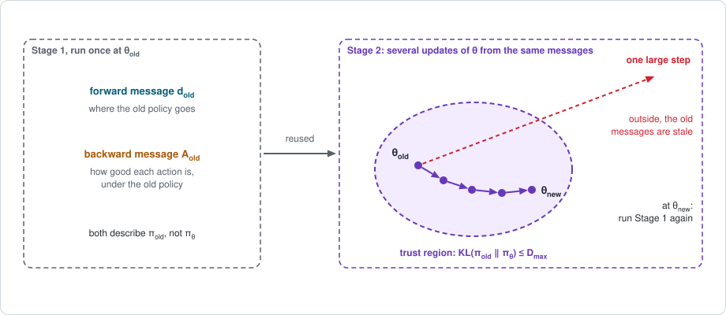

# Chapter 14: Stale messages and trust regions

:::{div}
:class: in-progress
**This book is a work in progress.** It is still being written and revised: its content is incomplete and may contain errors.
:::

In the loops of Chapters [11](chapter11.md) and [13](chapter13.md), Stage 1
was run afresh for every small step of Stage 2: sample with the current
policy, estimate the messages, take one gradient step, throw the samples
away. Samples are the expensive part, so this is wasteful.

The obvious saving is to take a larger step, or several steps, from the same
messages. But the messages were computed for the old policy. As the policy
moves away from it, they describe it less and less well: they become
**stale**. This chapter answers how far a policy may move before its messages
must be recomputed. The short version:

- **An exact identity**, the *performance difference lemma*, says what the
  old messages can tell about a new policy: the gain in return is the *new*
  forward message times the *old* advantages.
- **The surrogate objective** replaces the new forward message, which is not
  available, by the old one. It is exact at the old policy, correct to first
  order around it, and wrong far from it.
- **Staying close makes it safe.** Closeness is measured by the KL
  divergence between the trajectory distributions, which is a sum of
  per-state divergences weighted by the forward message, and to second order
  the Fisher matrix of [Chapter 5](chapter05.md).
- **Three algorithms are three ways to stay close**: the natural gradient
  with a small step, TRPO with a bound on the divergence, and PPO with a clip
  on the probability ratio.
- **A SLAM reader has seen all of this**: it is the logic of trust regions
  in Dogleg and Levenberg-Marquardt, and of the relinearization thresholds of
  iSAM2.

**Run the examples.** The code of this chapter's examples is in the companion
notebook [chapter14_examples.ipynb](chapter14_examples.ipynb), which runs
online:
[](https://colab.research.google.com/github/thduynguyen/gtsam/blob/feature/semiringfactor/gtsam/semiring/doc/chapter14_examples.ipynb)

## 1. The graph: old messages, new policy

**The example** is the endless track of [Chapter 3](chapter03.md), with the
policy $\pi_\theta(R \mid s) = \sigma(\theta_s)$ of Chapter 13. The old policy
$\pi_{\text{old}}$ is the coin flip, $\theta_{\text{old}} = (0, 0, 0)$. Stage 1
at the coin flip gave, exactly (Chapter 3):

$$J_{\text{old}} = 0.4385, \qquad
d_{\text{old}} = (3.806,\; 3.475,\; 2.719), \qquad
A_{\text{old}} = \begin{pmatrix} 0.022 & -0.022 \\ -1.065 & 1.065 \\ -0.588 & 0.588 \end{pmatrix},$$

with one row of $A_{\text{old}}$ per cell and the columns Left and Right.

**The situation.** The graph is that of Chapter 13. What is new is that two
policies are in play at once:

| | Computed for | Used for |
|---|---|---|
| forward message $d_{\text{old}}$ | $\pi_{\text{old}}$ | judging a candidate $\pi_\theta$ |
| backward message $A_{\text{old}}$ | $\pi_{\text{old}}$ | judging a candidate $\pi_\theta$ |
| policy factor $\pi_\theta$ | the candidate | the only thing that is recomputed |



## 2. Stage 1: what the old messages say about a new policy

### The performance difference lemma

**The statement.** For *any* two policies on the same dynamics,

$$J_{\text{new}} - J_{\text{old}} = \sum_s d_{\text{new}}(s) \sum_a \pi_{\text{new}}(a \mid s)\; A_{\text{old}}(s, a).$$

The gain is the **new** policy's forward message times the **old** policy's
advantages. There is no approximation in it, and the two policies need not
be close. This is the *performance difference lemma* of Kakade and Langford
(2002); see the [references](#chapter14-references).

**In words.** The old advantage $A_{\text{old}}(s, a)$ says how much better
action $a$ is than what the old policy does on average in $s$. If the new
policy, in the states it actually visits, picks actions with positive old
advantage, it is better, by exactly the accumulated amount.

**Derivation.** Follow one episode of the **new** policy, and evaluate it
with the **old** value function $V_{\text{old}}$. For each of its transitions
write the TD residual with respect to the old values:

$$\delta_t = r_t + \gamma\, V_{\text{old}}(s_{t+1}) - V_{\text{old}}(s_t).$$

*Step 1: the residuals add up to the return, relative to the old value of the
start.* In the discounted sum of the residuals every $V_{\text{old}}(s_{t})$
with $t \ge 1$ appears twice with opposite signs, and cancels:

$$\sum_{t=0}^{\infty} \gamma^t\, \delta_t = \sum_{t=0}^{\infty} \gamma^t\, r_t \;-\; V_{\text{old}}(s_0).$$

*Step 2: average over the episodes of the new policy.* The right side
averages to $J_{\text{new}} - \sum_s p_0(s)\, V_{\text{old}}(s) = J_{\text{new}} - J_{\text{old}}$.

*Step 3: the left side.* Given the pair $(s_t, a_t)$, the next state is drawn
from the dynamics, which are the same for both policies. So the residual
averages over the next state to the old advantage (Chapter 3, Section 4):

$$\mathbb{E}\big[\delta_t \mid s_t, a_t\big] = r(s_t, a_t) + \gamma \sum_{s'} p(s' \mid s_t, a_t)\, V_{\text{old}}(s') - V_{\text{old}}(s_t) = A_{\text{old}}(s_t, a_t).$$

The pairs $(s_t, a_t)$ themselves are visited by the *new* policy: the
discounted sum over steps is a sum over states with the weights
$d_{\text{new}}(s)$ and over actions with the weights
$\pi_{\text{new}}(a \mid s)$. That is the right side of the lemma.

**In the terms of Chapter 1.** Chapter 1, Section 7, showed that the
surprises along a trajectory add up to its return relative to the average,
and that under the policy which defined them they average to zero. Under a
*different* policy two things happen. The surprises of the dynamics still
average to zero, because the dynamics have not changed. The surprises of the
actions, the old advantages, no longer do, because the actions are now drawn
from another conditional. Their average is the gain.

*On the endless track,* from the coin flip, with all quantities computed
exactly:

| new policy | $J_{\text{new}} - J_{\text{old}}$ | the lemma: $d_{\text{new}}$ times $A_{\text{old}}$ |
|---|---|---|
| Right everywhere | $6.0517$ | $6.0517$ |
| Left in cell 0, Right in cells 1 and 2 | $3.3420$ | $3.3420$ |
| $\theta = (1, -2, 0.5)$ | $-3.2429$ | $-3.2429$ |
| Left everywhere | $-0.4385$ | $-0.4385$ |

Over 1000 random pairs of policies the two sides differ by at most
$1.4 \times 10^{-14}$.

### The surrogate: the old forward message in place of the new one

The lemma cannot be used as it stands. Its right side contains
$d_{\text{new}}$, the forward message of the candidate, and computing that
means running Stage 1 for the candidate, which is what was to be avoided.

**The surrogate objective** uses what is at hand, the old forward message:

$$L(\pi_{\text{new}}) = J_{\text{old}} + \sum_s d_{\text{old}}(s) \sum_a \pi_{\text{new}}(a \mid s)\; A_{\text{old}}(s, a).$$

Everything in it except the candidate's policy factor comes from one Stage 1
at the old policy.

**What is right about it.**

- *At the old policy it is exact.* With $\pi_{\text{new}} = \pi_{\text{old}}$
  the inner sum is the average of the old advantage under the old policy,
  which is zero. So $L(\pi_{\text{old}}) = J_{\text{old}}$.
- *Its gradient at the old policy is the policy gradient.* Differentiating
  $L$ with respect to $\theta$ moves only the policy factor:

  $$\nabla_\theta L \,\big|_{\theta_{\text{old}}} = \sum_s d_{\text{old}}(s) \sum_a \nabla_\theta \pi_\theta(a \mid s)\; A_{\text{old}}(s, a) = \nabla_\theta J \,\big|_{\theta_{\text{old}}}.$$

  This is the formula of Chapter 5. The notebook confirms it:
  $(-0.043,\; 1.851,\; 0.799)$ for both.

So the surrogate agrees with the true return in value and in slope at
$\theta_{\text{old}}$. It is a first-order model of $J$, built from the
messages, in the way a linearization is a first-order model of a nonlinear
cost.

**What is wrong about it.** It ignores that a new policy visits different
states: $d_{\text{new}} \ne d_{\text{old}}$. For the four policies above:

| new policy | true gain | gain according to the surrogate |
|---|---|---|
| Right everywhere | $6.05$ | $5.21$ |
| Left in cell 0, Right in cells 1 and 2 | $3.34$ | $5.38$ |
| $\theta = (1, -2, 0.5)$ | $-3.24$ | $-2.47$ |
| Left everywhere | $-0.44$ | $-5.21$ |

The second row is the policy that *maximizes* the surrogate: in every cell,
the action with the largest old advantage. It is the greedy step of policy
iteration ([Chapter 4](chapter04.md)). The surrogate promises a gain of
$5.38$ for it and the truth is $3.34$. It also ranks this policy above "Right
everywhere", which is in fact much better.

*Along a path.* Move from the coin flip toward the surrogate's maximizer,
along $\theta = \text{step} \cdot (-1, 1, 1)$:

| step | true $J$ | surrogate $L$ | $L - J$ | KL from the old policy |
|---|---|---|---|---|
| 0.05 | $0.5729$ | $0.5731$ | $+0.0001$ | $0.003$ |
| 0.1 | $0.7069$ | $0.7075$ | $+0.0006$ | $0.012$ |
| 0.25 | $1.104$ | $1.108$ | $+0.004$ | $0.078$ |
| 0.5 | $1.738$ | $1.757$ | $+0.019$ | $0.31$ |
| 1 | $2.826$ | $2.927$ | $+0.10$ | $1.20$ |
| 2 | $4.003$ | $4.540$ | $+0.54$ | $4.34$ |
| 4 | $3.993$ | $5.630$ | $+1.64$ | $13.3$ |
| 8 | $3.786$ | $5.820$ | $+2.03$ | $33.1$ |

Near the old policy the two agree to three digits. Farther out the surrogate
keeps rising while the true return has turned around: beyond a step of about
2, moving on makes the policy *worse*, and the surrogate does not notice. The
last column, defined in Section 3, measures how far the policy has moved.

**From samples.** With transitions sampled from the old policy, the sum over
states weighted by $d_{\text{old}}$ is a sum over the visited states, as in
Chapter 13. The sum over the actions of the *new* policy is obtained from the
actions the *old* policy took, by weighting each with the ratio of the two
probabilities, the **importance weight** $\rho$:

$$\sum_a \pi_{\text{new}}(a \mid s)\, A_{\text{old}}(s, a)
= \sum_a \pi_{\text{old}}(a \mid s)\; \underbrace{\frac{\pi_{\text{new}}(a \mid s)}{\pi_{\text{old}}(a \mid s)}}_{\rho(s, a)}\; A_{\text{old}}(s, a),
\qquad
L \approx J_{\text{old}} + \frac{1}{M} \sum_{\text{visited } (s, a)} \rho(s, a)\; \hat A(s, a).$$

## 3. Stage 2: three ways to stay close

Stage 2 maximizes the surrogate, but only over policies close enough to the
old one for the surrogate to be trusted. First, a measure of closeness.

### How far a policy has moved

The natural measure is the KL divergence between the two distributions over
trajectories. It has a form that uses the forward message once more:

$$\mathrm{KL}\big(p_{\text{old}} \,\|\, p_{\text{new}}\big)
= \sum_s d_{\text{old}}(s)\;\; \mathrm{KL}\big(\pi_{\text{old}}(\cdot \mid s) \,\|\, \pi_{\text{new}}(\cdot \mid s)\big).$$

The divergence between the trajectory distributions is the divergence between
the two policies in each state, weighted by how often the old policy is
there.

:::{dropdown} Why?
The KL divergence is the average, under the old distribution, of the
logarithm of the ratio of the two trajectory probabilities. Both are products
of the same start and dynamics factors and of their own policy factors, so
everything but the policy factors cancels:

$$\log \frac{p_{\text{old}}(\tau)}{p_{\text{new}}(\tau)} = \sum_t \log \frac{\pi_{\text{old}}(a_t \mid s_t)}{\pi_{\text{new}}(a_t \mid s_t)}.$$

Averaging the term of step $t$ over the old distribution gives the per-state
divergence, weighted by the old visitation. On the endless chain the steps
are weighted by $\gamma^t$, the probability that the episode is still
running, and the weights add up to $d_{\text{old}}$. The notebook checks the
identity on the two-move track of Chapter 1 by enumerating all trajectories:
$0.042693$ both ways.
:::

For a small change $\Delta\theta$ of the parameters this is the quadratic
form of the Fisher matrix (Chapter 5, Section 5):

$$\mathrm{KL}\big(p_{\theta_{\text{old}}} \,\|\, p_{\theta_{\text{old}} + \Delta\theta}\big) \approx \tfrac{1}{2}\, \Delta\theta^\top\, \mathcal{I}(\theta_{\text{old}})\, \Delta\theta.$$

A safe step is one with a small divergence. A guarantee of this kind exists:
Schulman et al. (2015) prove that

$$J_{\text{new}} \;\ge\; L(\pi_{\text{new}}) - C\, \max_s \mathrm{KL}\big(\pi_{\text{old}}(\cdot \mid s) \,\|\, \pi_{\text{new}}(\cdot \mid s)\big),
\qquad C = \frac{4\, \gamma\, \max_{s, a} |A_{\text{old}}(s, a)|}{(1 - \gamma)^2}.$$

A policy that improves the right side improves the true return. On the
endless track $C = 383$, and the bound holds for 2000 random policies in the
notebook. It is far too cautious to choose a step with: it would allow only
tiny moves. Its role is to justify the principle. The three algorithms below
keep the principle and choose the size of the step by other means.

### The natural gradient: a fixed small step

Take the natural-gradient step of Chapter 5 with a small step size $\alpha$:

$$\theta_{\text{new}} = \theta_{\text{old}} + \alpha\; \mathcal{I}(\theta_{\text{old}})^{-1}\, \nabla_\theta J.$$

The Fisher matrix makes the step uniform in the divergence rather than in the
parameters: the divergence of the step is
$\tfrac{1}{2} \alpha^2\, \nabla_\theta J^\top \mathcal{I}^{-1} \nabla_\theta J$
whatever the parametrization. This is the *natural policy gradient* (Kakade,
2002). The step size $\alpha$ is still chosen by hand.

### TRPO: bound the divergence

*Trust region policy optimization* (Schulman et al., 2015) fixes the
divergence instead of the step size. It maximizes the surrogate subject to a
bound $D_{\max}$:

$$\max_\theta\; L(\pi_\theta)
\qquad \text{subject to} \qquad
\mathrm{KL}\big(p_{\theta_{\text{old}}} \,\|\, p_\theta\big) \le D_{\max}.$$

With the surrogate replaced by its linear model and the divergence by its
quadratic model, the solution is in closed form. It is the natural-gradient
direction, with the step size that reaches the boundary of the region:

$$\Delta\theta = \sqrt{\frac{2\, D_{\max}}{\nabla_\theta J^\top\, \mathcal{I}^{-1}\, \nabla_\theta J}}\;\; \mathcal{I}^{-1}\, \nabla_\theta J.$$

In practice TRPO computes $\mathcal{I}^{-1} \nabla_\theta J$ by conjugate
gradients, without forming the matrix, and then shortens the step until the
sampled surrogate has improved and the sampled divergence is within the
bound.

### PPO: clip the ratio

*Proximal policy optimization* (Schulman et al., 2017) avoids the constrained
problem. It maximizes the sampled surrogate by plain gradient steps, for
several passes over the same batch, and removes the incentive to move far by
clipping the importance weight to a range $1 \pm \epsilon_{\text{clip}}$:

$$L^{\text{clip}}(\theta) = \frac{1}{M} \sum_{\text{visited } (s, a)}
\min\Big(\rho\, \hat A,\;\; \operatorname{clip}\big(\rho,\; 1 - \epsilon_{\text{clip}},\; 1 + \epsilon_{\text{clip}}\big)\, \hat A\Big),
\qquad \rho = \frac{\pi_\theta(a \mid s)}{\pi_{\text{old}}(a \mid s)}.$$

The effect is on each sample separately. A sample with a positive advantage
pushes its action's probability up, until the ratio reaches
$1 + \epsilon_{\text{clip}}$; from there it contributes no gradient. A sample
with a negative advantage pushes down, until $1 - \epsilon_{\text{clip}}$. No
sample can ask for more than a change of $\epsilon_{\text{clip}}$ in the
probability ratio of its action. The usual value is
$\epsilon_{\text{clip}} = 0.2$.

### The same idea in SLAM

| Policy optimization | Nonlinear least squares in GTSAM |
|---|---|
| the messages $d_{\text{old}}$, $A_{\text{old}}$, computed at $\theta_{\text{old}}$ | the Jacobians, computed at the linearization point |
| the surrogate $L$ | the linearized cost |
| the true return $J$ | the nonlinear cost |
| the Fisher matrix $\mathcal{I}$ | the information matrix of the linearized problem |
| natural gradient with a small or damped step | Gauss-Newton, Levenberg-Marquardt |
| TRPO: a step limited by $\mathrm{KL} \le D_{\max}$ | Dogleg: a step limited by the trust-region radius |
| shorten the step until the surrogate's promise is kept | compare the actual with the predicted decrease, and shrink the region if they disagree |
| PPO: reuse one batch until the ratios have moved by $\epsilon_{\text{clip}}$ | iSAM2: reuse a linearization until the variable has moved by the relinearization threshold |
| run Stage 1 again at $\theta_{\text{new}}$ | relinearize |

The last two rows are the point of the chapter title. iSAM2 does not
relinearize every factor at every step. It keeps the cached linear messages
of a clique as long as the estimates they were computed at have not moved
beyond a threshold. PPO does the same with sampled messages: it keeps a batch
as long as the policy has not moved beyond the clip. In both, the threshold
trades the cost of recomputing messages against the error of using stale
ones.

## 4. Exact special cases

**The lemma, to machine precision.** Section 2: both sides agree to
$1.4 \times 10^{-14}$ over 1000 random pairs of policies.

**A TRPO step is a natural-gradient step.** Take the two-move track of
Chapter 1 with the policy of Chapter 5 at $\theta = 0$, where Chapter 5 found

$$\nabla_\theta J = (0.15,\; 1,\; 0.35), \qquad
\mathcal{I} = \operatorname{diag}(0.25,\; 0.2,\; 0.05), \qquad
\mathcal{I}^{-1} \nabla_\theta J = (0.6,\; 5,\; 7).$$

Then $\nabla_\theta J^\top \mathcal{I}^{-1} \nabla_\theta J = 0.15 \cdot 0.6 + 1 \cdot 5 + 0.35 \cdot 7 = 7.54$,
and the closed-form step is $\sqrt{2 D_{\max} / 7.54}\; (0.6,\; 5,\; 7)$. The
notebook compares it with the true constrained maximum of the exact surrogate
under the exact divergence, found by a numerical optimizer:

| $D_{\max}$ | natural-gradient step | constrained maximum of the surrogate | relative difference | $J$ after the step |
|---|---|---|---|---|
| $0.5$ | $(0.219,\; 1.821,\; 2.549)$ | $(0.440,\; 2.042,\; 2.370)$ | $11\%$ | $3.970$ |
| $0.1$ | $(0.098,\; 0.814,\; 1.140)$ | $(0.114,\; 0.847,\; 1.098)$ | $4\%$ | $2.702$ |
| $0.01$ | $(0.031,\; 0.258,\; 0.361)$ | $(0.031,\; 0.259,\; 0.359)$ | $0.5\%$ | $1.803$ |
| $0.001$ | $(0.0098,\; 0.0814,\; 0.1140)$ | $(0.0098,\; 0.0815,\; 0.1139)$ | $0.05\%$ | $1.525$ |
| $0.0001$ | $(0.0031,\; 0.0258,\; 0.0361)$ | $(0.0031,\; 0.0258,\; 0.0360)$ | $0.01\%$ | $1.439$ |

As the region shrinks, the TRPO step and the natural-gradient step of
Chapter 5 coincide. For a large region they differ, because the linear and
quadratic models are no longer accurate inside it. Every step in the table
improves on $J = 1.4$.

The step size chosen by the region and the damping $\lambda_{\text{LM}}$ of
Chapter 5 are two handles on the same thing: a damped step is the solution of
a trust-region problem for some radius, and the other way round. Dogleg
chooses the radius; Levenberg-Marquardt chooses the damping.

## 5. Implementation

**PPO on the endless track.** The setting is that of Chapter 13: each
iteration runs $M = 5$ episodes with the current policy and updates a tabular
critic by TD(0). The advantage estimates are the TD residuals. Stage 2 is one
of three rules, each with the step size $0.2$:

- **one step**: one gradient step per batch, as in Chapter 13;
- **unclipped**: 20 gradient steps on the sampled surrogate, from the same
  batch;
- **clipped**: 20 gradient steps on the clipped surrogate, with
  $\epsilon_{\text{clip}} = 0.2$.

The core of Stage 2:

```python
pi_old = policy_table(theta)[s, a]                 # fixed for this batch
for epoch in range(epochs):
    rho = policy_table(theta)[s, a] / pi_old       # importance weight
    if rule == "clipped":
        active = ~(((advantage > 0) & (rho > 1 + clip)) |
                   ((advantage < 0) & (rho < 1 - clip)))
    else:
        active = np.ones(len(s), dtype=bool)
    g = a - sigmoid(theta[s])                      # score term
    theta = theta + alpha * np.bincount(
        s, weights=active * rho * advantage * g, minlength=3) / M
```

A sample is `active` while its ratio is inside the range, or is being pushed
back toward it. The gradient of $\rho\, \hat A$ with respect to $\theta$ is
$\rho\, \hat A\, g$, since $\nabla_\theta \rho = \rho\, \nabla_\theta \log \pi_\theta$.

Results over 40 seeded runs of 60 iterations, with the expected return of
every iterate evaluated exactly:

| Stage 2 rule | mean $J$ after 10 iterations | after 30 | after 60 | worst run at the end | runs ending below $J = 5$ | largest drop in one iteration |
|---|---|---|---|---|---|---|
| one step | $4.19$ | $6.07$ | $6.28$ | $6.22$ | $0\%$ | $-0.19$ |
| unclipped, 20 steps | $3.41$ | $5.16$ | $5.54$ | $0.01$ | $20\%$ | $-3.33$ |
| clipped, 20 steps | $5.29$ | $6.37$ | $6.45$ | $6.43$ | $0\%$ | $-0.97$ |

The best possible value is $J^* = 6.490$.

- **Reusing the batch pays.** After 10 iterations the clipped rule is at
  $J = 5.29$, where one step per batch is at $4.19$. The same samples do more
  work.
- **Reusing it without a limit is dangerous.** Without the clip, twenty steps
  on five episodes of noisy advantage estimates follow the noise. One run in
  five ends at a poor policy, and single iterations lose up to $3.3$ of
  return. A policy that has been pushed to near-certainty on a wrong action
  no longer tries the right one, and cannot recover.
- **The clip removes the failures and keeps the speed.**

The module is not used in the sampled loop. It appears in the exact tests,
through the numbers of Chapter 5.

## 6. What breaks

- **The trust region is a setting, not a guarantee.** The bound of Section 3
  is far too cautious to use, so $D_{\max}$ and $\epsilon_{\text{clip}}$ are
  chosen by experience. Too small wastes samples; too large brings back the
  failures of the unclipped rule.
- **The messages are still estimates.** Staying close protects against
  staleness, not against a biased critic
  ([Chapter 12](chapter12.md)) or a noisy batch. With five episodes the
  clipped rule still loses up to $0.97$ in one iteration.
- **The clip limits each sample, not the policy.** The ratio of a state that
  is not in the batch is not limited at all, and with shared parameters it
  can move far. PPO implementations watch the sampled KL divergence and stop
  the passes early when it grows.
- **The Fisher matrix is expensive for large policies.** TRPO never forms it;
  it solves the linear system by conjugate gradients with products
  $\mathcal{I}\, x$ computed from samples. PPO avoids it altogether, which is
  a large part of why it is the more widely used.
- **The data is still thrown away after each iteration.** A batch is reused
  for a few passes, then discarded. Keeping transitions for much longer needs
  methods that can learn from the forward message of *another* policy, which
  [Chapter 15](chapter15.md) takes up.

## 7. Framework card

| | Natural policy gradient | TRPO | PPO |
|---|---|---|---|
| 1. Sum over the actions | average under $\pi_\theta$, by sampling | average under $\pi_\theta$, by sampling; importance weights $\rho$ when reusing | average under $\pi_\theta$, by sampling; importance weights $\rho$ when reusing |
| 2. Dynamics factor | samples from a simulator | samples from a simulator | samples from a simulator |
| 3. Backward messages | a learned critic; advantage by GAE | a learned critic; advantage by GAE; frozen at $\theta_{\text{old}}$ | a learned critic; advantage by GAE; frozen at $\theta_{\text{old}}$ and reused for several passes |
| 4. Forward messages | particles from the current policy | particles from $\pi_{\text{old}}$, frozen | particles from $\pi_{\text{old}}$, frozen and reused for several passes |
| 5. Stage 2 update | natural gradient: one step $\alpha\, \mathcal{I}^{-1} \nabla_\theta J$ | trust region: maximize the surrogate subject to $\mathrm{KL} \le D_{\max}$ | several gradient steps on the surrogate clipped at $1 \pm \epsilon_{\text{clip}}$ |

(chapter14-references)=
## 8. References

- S. Kakade and J. Langford, "Approximately optimal approximate reinforcement
  learning", *International Conference on Machine Learning*, 2002. The
  performance difference lemma and conservative policy updates.
- S. Kakade, "A natural policy gradient", *NeurIPS*, 2002.
- J. Schulman, S. Levine, P. Moritz, M. Jordan and P. Abbeel, "Trust region
  policy optimization", *International Conference on Machine Learning*, 2015.
  The lower bound, and the constrained step.
- J. Schulman, F. Wolski, P. Dhariwal, A. Radford and O. Klimov, "Proximal
  policy optimization algorithms", arXiv, 2017. The clipped surrogate.
- J. Peters and S. Schaal, "Natural actor-critic", *Neurocomputing*, 2008.
- M. Kaess, H. Johannsson, R. Roberts, V. Ila, J. Leonard and F. Dellaert,
  "iSAM2: incremental smoothing and mapping using the Bayes tree",
  *International Journal of Robotics Research*, 2012. Fluid relinearization
  with thresholds.
- J. Nocedal and S. J. Wright, *Numerical Optimization*, Springer, 2006.
  Trust-region methods, Dogleg and Levenberg-Marquardt.

---

Previous: [Chapter 13: Actor-critic](chapter13.md).
Next: [Chapter 15: Value-based control](chapter15.md).
