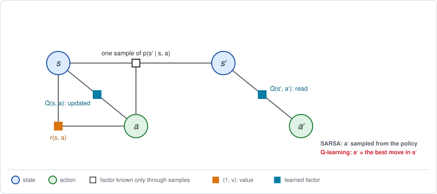
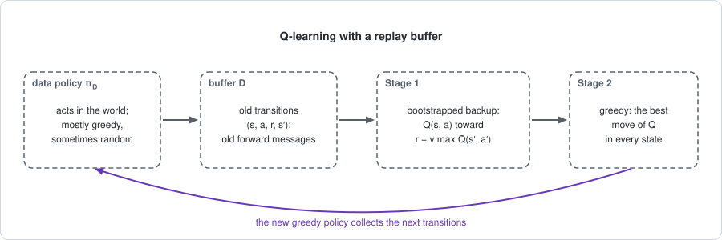

# Chapter 15: Value-based control

:::{div}
:class: in-progress
**This book is a work in progress.** It is still being written and revised: its content is incomplete and may contain errors.
:::

Chapters 11 to 14 improved a policy with parameters $\theta$ by following a
gradient, with messages estimated from samples. This chapter goes back to the
other way of finding a policy, the one of [Chapter 4](chapter04.md): let the
agent choose a separate action in every state, and take a **maximum**.

In Chapter 4 the maximum was taken over a table of action values computed
from a known dynamics table. Here the dynamics factor can only be sampled.
The methods of this chapter learn the table of action values itself, the
backward message $Q$, from sampled transitions, and read the policy from it.
They are called *value-based*.

The short version:

- **The learned object is the backward message.** There are no policy
  parameters. The parameters $\theta_Q$ are those of an estimate $\hat Q$ of
  the action value, and Stage 2 is greedy: the best action of $\hat Q$.
- **One update, three sums.** Each update moves one entry of $\hat Q$ toward
  a target $r + \gamma \cdot (\text{value of the next state})$. The sum over
  the next state is replaced by one sample. The sum over the next action is
  the average under the policy (SARSA) or the maximum (Q-learning).
- **Old data can be reused.** For a one-step target nothing that is sampled
  depends on the policy that collected the data, so transitions from any
  policy can be stored and replayed. Longer targets need importance weights.
- **With a table as the regressor, fitted Q iteration is exactly the value
  iteration of Chapter 4**, on a dynamics table estimated by counting. DQN is
  the same loop with a neural network, a replay buffer and a frozen copy of
  the network.

The example is the endless track of [Chapter 3](chapter03.md), with the
discount $\gamma = 0.9$.

**Run the examples.** The code of this chapter's examples is in the companion
notebook [chapter15_examples.ipynb](chapter15_examples.ipynb), which runs
online:
[](https://colab.research.google.com/github/thduynguyen/gtsam/blob/feature/semiringfactor/gtsam/semiring/doc/chapter15_examples.ipynb)

## 1. The graph

**What is known and what is not.** The graph is the chain of Chapter 3
without policy factors, as in Chapter 4. The difference is in how its factors
can be accessed.

| Factor | In Chapter 4 | In this chapter |
|---|---|---|
| dynamics $p(s' \mid s, a)$ | a table | a *simulator*: given $s$ and $a$, it returns one sampled $s'$ |
| reward $r(s, a)$ | a table | observed along with each sample |
| value factor $Q(s, a)$ | computed exactly, by elimination | a table $\hat Q(s, a)$ that is **learned** |
| policy | read from the conditional on $a$ | read from $\hat Q$: the best action in each state |

The data are **transitions**. A transition is one visit of one dynamics
factor: the robot is in state $s$, takes action $a$, receives the reward $r$
and lands in the next state $s'$,

$$(s,\; a,\; r,\; s'), \qquad s' \sim p(\cdot \mid s, a).$$



The white square is the dynamics factor, known only through the sample. The
two teal squares are the same learned table $\hat Q$, used at two places: the
entry $\hat Q(s, a)$ is updated, and the entries of the next state $s'$ are
read.

**Why learn $Q$ and not $V$.** Stage 2 needs the best action in each state.
With a table of $Q$ that is a comparison of entries,
$\arg\max_a \hat Q(s, a)$. With a table of $V$ it would need

$$\arg\max_a \Big[r(s, a) + \gamma \sum_{s'} p(s' \mid s, a)\, V(s')\Big],$$

which contains the sum over the next state, and that sum needs the dynamics
table. In $Q$ the next state has already been eliminated.

**The exact answers.** The dynamics table of the endless track is used in the
notebook for two things only: to draw samples, and to compute the exact
values that the samples are checked against. From Chapters 3 and 4:

| cell | $Q(s, L)$, coin flip | $Q(s, R)$, coin flip | $Q^*(s, L)$ | $Q^*(s, R)$ |
|---|---|---|---|---|
| 0 | $-0.202$ | $-0.247$ | $4.878$ | $5.419$ |
| 1 | $0.037$ | $2.167$ | $5.263$ | $7.561$ |
| 2 | $3.535$ | $4.711$ | $9.244$ | $10$ |

**How the data are collected.** The robot follows some policy, the *data
policy* $\pi_D$. After each move the episode ends with probability
$1 - \gamma$, as in Chapter 3, Section 2, and the robot is put back at the
start. The notebook collects 200,000 transitions under the coin flip.

## 2. Stage 1: a bootstrapped backward message from samples

**The answer first.** For each transition $(s, a, r, s')$, move the entry
$\hat Q(s, a)$ a small step $\alpha$ toward a *target*:

$$\hat Q(s, a) \leftarrow \hat Q(s, a) + \alpha\, \big(\text{target} - \hat Q(s, a)\big).$$

The target is the reward plus the discounted value of the next state. Three
algorithms differ only in how they sum over the next action $a'$:

| Algorithm | Target | Sum over the next action |
|---|---|---|
| SARSA | $r + \gamma\, \hat Q(s', a')$, with $a' \sim \pi(\cdot \mid s')$ | the average under the policy, by one sample |
| expected SARSA | $r + \gamma \sum_{a'} \pi(a' \mid s')\, \hat Q(s', a')$ | the average under the policy, exactly |
| Q-learning | $r + \gamma \max_{a'} \hat Q(s', a')$ | the maximum |

**Where the target comes from.** The exact backward message satisfies the
Bellman equation, which is one step of elimination (Chapters 3 and 4). For a
policy $\pi$, and for the best policy:

$$Q(s, a) = r(s, a) + \gamma \sum_{s'} p(s' \mid s, a) \sum_{a'} \pi(a' \mid s')\, Q(s', a'),
\qquad
Q^*(s, a) = r(s, a) + \gamma \sum_{s'} p(s' \mid s, a)\, \max_{a'} Q^*(s', a').$$

The right-hand side contains three sums, and each is treated differently:

| Sum | Over | How it is done |
|---|---|---|
| over whether the episode continues | two outcomes, with probabilities $\gamma$ and $1 - \gamma$ | exactly: it is the factor $\gamma$ |
| over the next state $s'$ | the outcomes of the dynamics | by **one sample**: the $s'$ of the transition |
| over the next action $a'$ | the actions | the semiring sum of the algorithm: an average or a maximum |

So the target is a noisy sample of the right-hand side, with the current
estimate $\hat Q$ in place of the unknown $Q$.

**Why the update converges to the right table.** Average the update over the
next state, for a fixed pair $(s, a)$. For Q-learning:

$$\mathbb{E}\big[\text{target} - \hat Q(s, a) \;\big|\; s, a\big]
= \underbrace{r(s, a) + \gamma \sum_{s'} p(s' \mid s, a)\, \max_{a'} \hat Q(s', a')}_{\text{what } \hat Q(s, a) \text{ should be}}
\;-\; \underbrace{\hat Q(s, a)}_{\text{what it is}}.$$

The entry moves, on average, toward the value the Bellman optimality equation
asks for. The table stops moving on average only when every entry satisfies
that equation, and its only solution is $Q^*$ (Chapter 4, Section 5). With
the average under $\pi$ in place of the maximum, the same argument gives the
$Q$ of the policy $\pi$. This is the argument of Chapter 1, Section 2, for
the TD residual, applied to a table of action values.

The target contains $\hat Q$ itself: the backward message is estimated from
the backward message. This is called **bootstrapping**, and it is the subject
of [Chapter 12](chapter12.md).

**On the endless track.** All three rules are run on the same 200,000
transitions collected under the coin flip, from $\hat Q = 0$. The numbers are
from one seeded run.

SARSA and expected SARSA use the coin flip as their policy $\pi$, so they
estimate the $Q$ of the coin flip:

| cell | SARSA $\hat Q(s, L)$ | SARSA $\hat Q(s, R)$ | exact $Q(s, L)$ | exact $Q(s, R)$ |
|---|---|---|---|---|
| 0 | $-0.236$ | $-0.306$ | $-0.202$ | $-0.247$ |
| 1 | $0.010$ | $2.100$ | $0.037$ | $2.167$ |
| 2 | $3.428$ | $4.647$ | $3.535$ | $4.711$ |

The largest error is $0.108$ for SARSA and $0.071$ for expected SARSA, which
has less noise because it does one of the sums exactly.

Q-learning, on the same data, estimates $Q^*$:

| cell | Q-learning $\hat Q(s, L)$ | Q-learning $\hat Q(s, R)$ | exact $Q^*(s, L)$ | exact $Q^*(s, R)$ |
|---|---|---|---|---|
| 0 | $4.843$ | $5.394$ | $4.878$ | $5.419$ |
| 1 | $5.226$ | $7.542$ | $5.263$ | $7.561$ |
| 2 | $9.167$ | $10.000$ | $9.244$ | $10$ |

The largest error is $0.077$, and the best action of the learned table is
Right in every cell, the best policy of Chapter 4.

Note what happened. The data were collected by a robot flipping coins, which
earns $J = 0.438$. From those data Q-learning computed the values of the
*best* policy, which earns $J^* = 6.490$ and which the robot never followed.
Learning about one policy from the data of another is called **off-policy**
learning. Section 4 explains why it works here.

:::{dropdown} The step size
The update averages noisy targets, so its step size must shrink: large enough
that the entry can travel any distance, and small enough that the noise
averages out. The classical conditions on the step size $\alpha_k$ of the
$k$-th update of an entry are

$$\sum_k \alpha_k = \infty, \qquad \sum_k \alpha_k^2 < \infty.$$

The notebook uses $\alpha_k = k^{-0.6}$, which satisfies both. With these
conditions, and if every pair $(s, a)$ keeps being updated, tabular
Q-learning converges to $Q^*$ (Watkins and Dayan, 1992).
:::

:::{dropdown} Sampling the end of the episode instead of averaging it
The target above averages the coin that ends the episode exactly, through the
factor $\gamma$. It could be sampled too, like the next state: if the episode
ended on this transition the target is $r$, and if it continued the target is
$r + \hat Q(s', a')$, with no discount. The average of the two is the same,

$$(1 - \gamma) \cdot r + \gamma \cdot \big(r + \hat Q(s', a')\big) = r + \gamma\, \hat Q(s', a'),$$

and the sampled version is noisier. Whenever a sum can be done exactly at no
cost, it is.
:::

## 3. Stage 2: greedy

**The update.** Stage 2 has nothing to fit. The policy is the best action of
the current table:

$$\pi(s) = \arg\max_a \hat Q(s, a).$$

This is the greedy step of policy iteration (Chapter 4, Section 5), with the
learned table in place of the exact one.

**A greedy policy must still try the other actions.** If the robot always
takes the action that currently looks best, the entries of the other actions
are never updated, and a wrong first impression is never corrected. The
standard remedy is to follow the greedy action most of the time and a random
action otherwise. The notebook uses a random action with probability $0.1$;
this is called an *epsilon-greedy* policy.

**The two stages, interleaved.** For Q-learning, Stage 2 is already inside
the target: the maximum over $a'$ is the greedy policy applied at the next
state. For SARSA the stages alternate, one sample at a time:

1. act with the current epsilon-greedy policy and observe one transition;
2. Stage 1: one SARSA update, where $a'$ is the action the policy takes next;
3. Stage 2: the policy is epsilon-greedy for the updated table.

*On the endless track,* SARSA run this way for 200,000 steps gives:

| cell | $\hat Q(s, L)$ | $\hat Q(s, R)$ | exact $Q(s, L)$ of its own policy | exact $Q(s, R)$ of its own policy |
|---|---|---|---|---|
| 0 | $4.444$ | $5.037$ | $4.451$ | $4.971$ |
| 1 | $4.935$ | $7.212$ | $4.831$ | $7.174$ |
| 2 | $8.848$ | $9.651$ | $8.807$ | $9.630$ |

The greedy action is Right in every cell, so SARSA finds the best policy too.
But its table is **NOT** an estimate of $Q^*$. It is an estimate of the
values of the policy the robot actually follows, which takes a random action
one time in ten. That is why the entry of cell 2 and Right is $9.65$ and not
$10$: the robot knows it will sometimes step away from the charger by
mistake. Q-learning learns the values of the greedy policy while following
the exploring one.

| | SARSA | Q-learning |
|---|---|---|
| sum over the next action | average under the policy being followed | maximum |
| the table estimates | $Q$ of the policy being followed, exploration included | $Q^*$ |
| the data must come from | the current policy: *on-policy* | any policy: *off-policy* |

## 4. Forward messages: where the data come from

**The forward message of the data.** In [Chapter 5](chapter05.md) the forward
message $d$ of the current policy weighted every term of the gradient. Here
the forward message is the set of visited pairs $(s, a)$, and it belongs to
the data policy $\pi_D$. With episodes that end with probability
$1 - \gamma$, the share of each pair in the data is its discounted visitation
(Chapter 3, Section 5), normalized by the episode length $1 / (1 - \gamma) = 10$:

$$\text{share of } (s, a) = \frac{d(s)\, \pi_D(a \mid s)}{10}.$$

For the coin flip, $d = (3.806,\; 3.475,\; 2.719)$, so each action of cells
0, 1 and 2 should have a share of $0.190$, $0.174$ and $0.136$. The 200,000
transitions of the notebook have shares within $0.001$ of these.

**For a table, the forward message only sets the pace.** Each entry of the
table has its own target, and the data decide how often each entry is
updated, not what it converges to. Any data policy that keeps visiting every
pair will do. The forward message starts to matter when the table is
replaced by a function with shared parameters (Section 6), because the data
then decide which states the function fits best.

**Why a one-step target needs no correction.** Look at what is sampled in the
target of expected SARSA or Q-learning for a policy $\pi$ that is not the
data policy:

- The pair $(s, a)$ is not averaged over at all. The entry $\hat Q(s, a)$ is
  a statement about *this* state and *this* action, whoever chose them.
- The next state $s'$ is sampled from the dynamics factor, which does not
  involve any policy.
- The sum over the next action $a'$ is done exactly, under $\pi$ or by a
  maximum.

Nothing that is sampled was drawn from $\pi_D$ in place of $\pi$. The data
policy chose where to look, and not what was seen there.

**A longer target does need a correction.** A target can use two sampled
steps before reading the table:

$$\text{target} = r + \gamma\, r' + \gamma^2\, V(s''),
\qquad
V(s'') = \sum_{a''} \pi(a'' \mid s'')\, Q(s'', a''),$$

where $r'$ and $s''$ are the reward and the state after the next action
$a'$. Now $a'$ is sampled, and it was sampled from the data policy
$\pi_D$. Its average is taken with the wrong weights. The remedy is to
multiply what follows $a'$ by the **importance weight**

$$\rho = \frac{\pi(a' \mid s')}{\pi_D(a' \mid s')},$$

because for any function $f$ of the action,

$$\sum_{a'} \pi_D(a' \mid s')\; \rho\; f(a') = \sum_{a'} \pi(a' \mid s')\, f(a').$$

The weight replaces one policy factor by another. In the terms of this book,
it turns particles of the forward message of $\pi_D$ into weighted particles
of the forward message of $\pi$.

*On the endless track.* Let the data come from the coin flip, and let the
policy to evaluate, $\pi$, move Right with probability $0.9$ in every cell.
The weights are $\rho = 0.1 / 0.5 = 0.2$ for Left and
$\rho = 0.9 / 0.5 = 1.8$ for Right. The notebook computes the *average* of
each target exactly, with the true $Q$ of $\pi$ in the target, so that the
differences below are not sampling noise:

| cell, action | exact $Q$ of $\pi$ | one-step target | two-step target, no weight | two-step target, with $\rho$ |
|---|---|---|---|---|
| 0, L | $3.979$ | $3.979$ | $3.802$ | $3.979$ |
| 0, R | $4.470$ | $4.470$ | $3.750$ | $4.470$ |
| 1, L | $4.352$ | $4.352$ | $4.039$ | $4.352$ |
| 1, R | $6.730$ | $6.730$ | $6.303$ | $6.730$ |
| 2, L | $8.315$ | $8.315$ | $7.566$ | $8.315$ |
| 2, R | $9.202$ | $9.202$ | $8.882$ | $9.202$ |

The unweighted two-step target is too low everywhere, because the coin flip
takes the worse action more often than $\pi$ does.

**The price of the weights.** A target with $n$ sampled actions needs the
product of $n$ weights. Such a product is $1$ on average and very far from
$1$ on most samples, so the estimate becomes noisy. For a greedy $\pi$ the
weight is zero as soon as the data take an action that is not greedy, and
the longer target has to be cut off there. This is why value-based methods
mostly use one-step targets.

## 5. An exact special case: fitted Q iteration with a table

**The algorithm.** *Fitted Q iteration* separates the two things that the
update of Section 2 does at once. It takes a fixed batch $\mathcal{D}$ of
transitions and repeats:

1. compute a target for every transition of the batch, from the current
   estimate $\hat Q_k$:
   $\;\text{target}_i = r_i + \gamma \max_{a'} \hat Q_k(s'_i, a')$;
2. fit a new function to the targets by least squares, a regression:

$$\hat Q_{k+1} = \arg\min_{\hat Q} \sum_{i \in \mathcal{D}} \big(\hat Q(s_i, a_i) - \text{target}_i\big)^2.$$

Any regressor can be used in step 2: a table, trees (Ernst et al., 2005) or
a neural network (Riedmiller, 2005).

**The claim.** If the regressor is a table, with one free number per pair
$(s, a)$, fitted Q iteration is **exactly the value iteration of Chapter 4**,
run on a dynamics table estimated from the batch by counting.

**Why.** With one free number per pair, the least-squares fit of each number
is the mean of the targets of the transitions that start with that pair.
Group those transitions by their next state. If $\hat p(s' \mid s, a)$ is
the fraction of them that land in $s'$,

$$\hat Q_{k+1}(s, a) = \text{mean of the targets}
= r(s, a) + \gamma \sum_{s'} \hat p(s' \mid s, a)\, \max_{a'} \hat Q_k(s', a').$$

This is one sweep of value iteration with $\hat p$ as the dynamics factor.
The batch method never builds $\hat p$, but it computes what $\hat p$ would
give. [Chapter 18](chapter18.md) builds it on purpose.

**The test.** The notebook makes a batch of 30 transitions, five per pair
$(s, a)$, in which the next states occur in exactly the proportions of the
true table; for example the pair (cell 0, Right) has one transition that
stays and four that reach cell 1. Then $\hat p = p$, and every sweep must
equal the corresponding row of the value-iteration table of Chapter 4,
Section 5:

| sweep $k$ | $\max_a \hat Q_k(0, a)$ | $\max_a \hat Q_k(1, a)$ | $\max_a \hat Q_k(2, a)$ |
|---|---|---|---|
| 1 | $0$ | $0$ | $2$ |
| 2 | $0$ | $0.44$ | $2.8$ |
| 5 | $0.247$ | $2.313$ | $4.751$ |
| 100 | $5.419$ | $7.561$ | $10.000$ |

They agree to machine precision at every sweep, and the limit is $Q^*$.

On a batch of 2,000 *sampled* transitions the counts are only close to the
true proportions. Fitted Q iteration then converges to the $Q^*$ of the
counted table, which differs from the true $Q^*$ by at most $0.113$ in this
run, with the best action Right in every cell.

The other exact checks of this chapter, all against the tables of Section 1:

| Method | Must reproduce | Largest error in the seeded run |
|---|---|---|
| SARSA, coin-flip policy | $Q$ of the coin flip | $0.108$ |
| expected SARSA, coin-flip policy | $Q$ of the coin flip | $0.071$ |
| Q-learning, coin-flip data | $Q^*$ | $0.077$ |
| fitted Q iteration, exact batch | value iteration, sweep by sweep | $0$ |
| fitted Q iteration, 2,000 samples | $Q^*$ | $0.113$ |
| small DQN (Section 6) | $Q^*$ | $0.091$ |

## 6. DQN: a network, a buffer and a frozen copy

For a robot with continuous states, or an agent that sees images, a table is
impossible. *Deep Q-networks* (DQN; Mnih et al., 2015) replace the table by a
neural network $Q_{\theta_Q}(s, a)$ with parameters $\theta_Q$, and keep the
loop of fitted Q iteration. Three ingredients make that work in practice.

| Ingredient of DQN | What it is | In the terms of this book |
|---|---|---|
| **replay buffer** $\mathcal{D}$ | a store of past transitions; each update draws a random minibatch from it | a store of old forward messages, reused many times |
| **target network** $\theta_Q^-$ | a copy of the network that is held fixed and refreshed only now and then; targets are computed from it | a *frozen* backward message: the $\hat Q_k$ of fitted Q iteration |
| **gradient steps** on $\theta_Q$ | a few steps on the squared residual, in place of a full regression | the fit to the targets, done partially |

The loss minimized on a minibatch is the squared residual against a target
computed from the frozen copy:

$$\sum_{i} \Big(Q_{\theta_Q}(s_i, a_i) - \big[r_i + \gamma \max_{a'} Q_{\theta_Q^-}(s'_i, a')\big]\Big)^2.$$



**Why freeze the target.** In Section 2 each update changed one entry of a
table and left the others alone. A network shares its parameters between all
states, so a step that changes $Q_{\theta_Q}(s, a)$ also changes the value at
$s'$ that its own target reads. The target moves as the estimate chases it.
Freezing a copy restores the structure of fitted Q iteration: the target is
fixed while the fit is made, and is replaced only between fits.

**Why a buffer.** Consecutive transitions of a robot are strongly correlated,
and the data policy changes as the robot learns. Drawing minibatches at
random from a large store gives each update a mixture of old and recent
forward messages, and lets every transition be used many times.

*A small version.* The notebook runs this loop on the endless track with a
table in place of the network, so that the result can be checked: a buffer
of 5,000 transitions, minibatches of 32, a frozen copy refreshed every 100
steps, and an epsilon-greedy data policy that takes a random action one time
in five. After 30,000 steps, in one seeded run:

| cell | small DQN $\hat Q(s, L)$ | small DQN $\hat Q(s, R)$ | exact $Q^*(s, L)$ | exact $Q^*(s, R)$ |
|---|---|---|---|---|
| 0 | $4.810$ | $5.338$ | $4.878$ | $5.419$ |
| 1 | $5.172$ | $7.639$ | $5.263$ | $7.561$ |
| 2 | $9.160$ | $10.000$ | $9.244$ | $10$ |

The notebook does **NOT** train a neural network. What a network adds is
generalization between states, and with it the failure described in
Section 8.

## 7. Implementation

The simulator and the three updates, from the notebook:

```python
def step(rng, s, a):
    """One sampled transition: the reward and the next state."""
    return reward[s, a], rng.choice(3, p=dynamics[s, a])

for s, a, r, s_next in data:                    # a stream of transitions
    if rule == "sarsa":                         # a' sampled from the coin flip
        future = Q[s_next, rng.choice(2)]
    elif rule == "expected sarsa":              # the average under the coin flip
        future = coin_flip[s_next] @ Q[s_next]
    else:                                       # Q-learning: the maximum
        future = Q[s_next].max()
    visits[s, a] += 1
    alpha = visits[s, a] ** -0.6
    Q[s, a] += alpha * (r + gamma * future - Q[s, a])
```

Fitted Q iteration with a table as the regressor:

```python
Q = np.zeros((3, 2))
for sweep in range(200):
    targets = batch[:, 2] + gamma * Q[batch[:, 3].astype(int)].max(axis=1)
    Q = fit_table(batch, targets)   # the mean target of each pair (s, a)
```

The module is not used in this chapter: it eliminates known factors exactly,
and here the dynamics factor is not known. Its role is the reference: the
exact tables that these estimates are compared with are the results of the
eliminations of Chapters 3 and 4.

## 8. What breaks

- **The maximum of noisy estimates is too high.** If the entries of $\hat Q$
  carry errors of both signs, the maximum picks out the entries whose error
  is positive:

  $$\mathbb{E}\big[\max_{a'} \hat Q(s', a')\big] \;\ge\; \max_{a'} \mathbb{E}\big[\hat Q(s', a')\big].$$

  This is the inequality of Chapter 4, Section 2, with estimation noise in
  the place of the dynamics. The targets are biased upward and the bias is
  bootstrapped into the table. Double Q-learning (van Hasselt, 2010) and the
  twin critics of [Chapter 16](chapter16.md) are repairs.
- **A network instead of a table.** The convergence argument of Section 2
  treated each entry separately. With shared parameters, bootstrapping and
  off-policy data together, the iteration can diverge. This combination is
  the *deadly triad* of [Chapter 12](chapter12.md). The frozen copy and the
  buffer make divergence less likely; they do not exclude it.
- **Exploration.** Every result here assumed that all pairs $(s, a)$ keep
  being visited. Random actions achieve that on three cells. On a large
  problem they do not, and deciding where to look becomes a problem of its
  own ([Chapter 24](chapter24.md)).
- **Rarely visited entries.** The forward message of the data decides how
  accurate each entry is. An entry that is seldom updated stays close to its
  initial value for a long time, and the maximum may prefer it for that
  reason alone.
- **Continuous actions.** The maximum over $a'$ was a comparison of two
  entries. For a real-valued action there is no list of entries to compare.
  [Chapter 16](chapter16.md) replaces the comparison by a gradient step on
  the action.
- **Long targets with old data.** Importance weights correct them, at the
  price of a variance that grows with the number of steps (Section 4).

## 9. Framework card

| | SARSA | Q-learning | Fitted Q iteration | DQN |
|---|---|---|---|---|
| 1. Sum over the actions | average under the current policy, sampled | maximum | maximum | maximum |
| 2. Dynamics factor | sampled transitions, from the current policy | sampled transitions, from any policy | a fixed batch of transitions | sampled transitions, kept in a replay buffer |
| 3. Backward messages | bootstrapped table $\hat Q$, one-step target | bootstrapped table $\hat Q$, one-step target | bootstrapped $\hat Q$, refitted by regression at every sweep | learned critic $Q_{\theta_Q}$, bootstrapped from a frozen copy $\theta_Q^-$ |
| 4. Forward messages | particles of the current policy | particles of any data policy $\pi_D$ | the batch | replay buffer of old transitions |
| 5. Stage 2 update | greedy per state, with random actions for exploration | greedy per state | greedy per state | greedy per state, with random actions for exploration |

(chapter15-references)=
## 10. References

- C. J. C. H. Watkins, *Learning from Delayed Rewards*, PhD thesis,
  University of Cambridge, 1989; C. J. C. H. Watkins and P. Dayan,
  "Q-learning", *Machine Learning*, 1992. Q-learning and its convergence.
- G. A. Rummery and M. Niranjan, "On-line Q-learning using connectionist
  systems", technical report, University of Cambridge, 1994. The algorithm
  later named SARSA.
- H. van Seijen, H. van Hasselt, S. Whiteson and M. Wiering, "A theoretical
  and empirical analysis of Expected Sarsa", *IEEE Symposium on Adaptive
  Dynamic Programming and Reinforcement Learning*, 2009.
- D. Precup, R. S. Sutton and S. Singh, "Eligibility traces for off-policy
  policy evaluation", *ICML*, 2000. Importance weights for multi-step
  targets.
- L.-J. Lin, "Self-improving reactive agents based on reinforcement learning,
  planning and teaching", *Machine Learning*, 1992. Experience replay.
- D. Ernst, P. Geurts and L. Wehenkel, "Tree-based batch mode reinforcement
  learning", *Journal of Machine Learning Research*, 2005. Fitted Q
  iteration.
- M. Riedmiller, "Neural fitted Q iteration: first experiences with a data
  efficient neural reinforcement learning method", *ECML*, 2005.
- V. Mnih et al., "Human-level control through deep reinforcement learning",
  *Nature*, 2015. DQN.
- H. van Hasselt, "Double Q-learning", *NeurIPS*, 2010. The upward bias of
  the maximum, and a repair.
- R. S. Sutton and A. G. Barto, *Reinforcement Learning: An Introduction*, 2nd
  edition, MIT Press, 2018. Chapters 6 and 7: SARSA, Q-learning and
  multi-step off-policy methods.

---

Previous: [Chapter 14: Stale messages and trust regions](chapter14.md).
Next: [Chapter 16: Off-policy actor-critic](chapter16.md).
