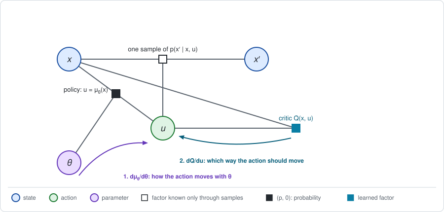
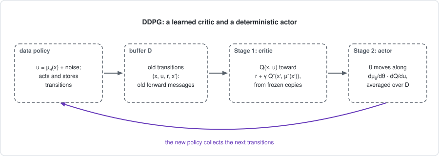

# Chapter 16: Off-policy actor-critic

[Chapter 15](chapter15.md) learned the backward message $Q$ from replayed
transitions and read the policy from it with a maximum, taken by comparing
the entries of a table. A robot arm or a car does not have a table of
actions. Its action is a vector of real numbers, and there is no list of
entries to compare.

This chapter keeps the learned $Q$ and the replayed data, and replaces the
maximum by a **gradient step on the action**. The methods are DPG, DDPG and
TD3. The short version:

- **The policy is a deterministic function** $u = \mu_\theta(x)$. On the
  graph it is a policy factor that is a hard constraint.
- **The gradient is a chain rule**: forward message, times how the action
  moves with $\theta$, times how $Q$ changes with the action. It is the
  policy gradient of [Chapter 5](chapter05.md) in the limit of a policy
  without noise.
- **The exact test is LQR.** With a linear policy and the exact quadratic
  $Q$, the gradient is zero exactly at the Riccati gain. With a learned
  quadratic $\hat Q$ and sampled transitions, a small DDPG finds that gain.
- **TD3 repairs a biased backward message.** A policy that climbs a learned
  $\hat Q$ climbs its errors too. TD3 adds three corrections.

The example is the line of Chapter 1, Section 8: first with its two moves,
then without a last move.

**Run the examples.** The code of this chapter's examples is in the companion
notebook [chapter16_examples.ipynb](chapter16_examples.ipynb), which runs
online:
[](https://colab.research.google.com/github/thduynguyen/gtsam/blob/feature/semiringfactor/gtsam/semiring/doc/chapter16_examples.ipynb)

## 1. The graph

**The difficulty.** Stage 2 of Chapter 15 was
$\pi(s) = \arg\max_a \hat Q(s, a)$, a comparison of two numbers. For a
real-valued action $u$ the same step is an optimization problem,

$$\arg\max_u \hat Q(x, u),$$

to be solved for every state $x$ the robot visits. It has a closed form when
$\hat Q$ is a quadratic in $u$, which is the LQR case of
[Chapter 6](chapter06.md). For a general learned $\hat Q$, such as a neural
network, it does not.

**The idea.** Do not solve the maximization for every state. Keep a function
that outputs an action for each state,

$$u = \mu_\theta(x),$$

and improve the function a little at a time, by moving its output in the
direction in which $\hat Q$ increases. The function $\mu_\theta$ is called
the **actor** and $\hat Q$ the **critic**.

**The policy factor.** The function $\mu_\theta$ is the *mean action* of a
Gaussian policy whose noise has been removed:

$$\pi_\theta(u \mid x) = N\big(u;\; \mu_\theta(x),\; \Sigma_e\big)
\quad\xrightarrow{\;\Sigma_e \to 0\;}\quad u = \mu_\theta(x).$$

The limit is not a density, but it is still a factor: a hard constraint
between $u$ and $x$, the same kind of factor as a constrained noise model in
GTSAM. Eliminating $u$ against it substitutes $\mu_\theta(x)$ for $u$. On the
line the policy is a linear feedback law, one gain per move:

$$\mu_\theta(x_t) = -K_t\, x_t, \qquad \theta = (K_0, K_1).$$



| Factor | How it is known |
|---|---|
| dynamics $p(x' \mid x, u)$ | through sampled transitions $(x, u, r, x')$ |
| reward $r(x, u)$ | observed with each transition |
| policy $u = \mu_\theta(x)$ | a hard constraint with parameters $\theta$: the actor |
| value factor $Q(x, u)$ | a learned function $\hat Q$ with parameters $\theta_Q$: the critic |

The next two sections derive the gradient with **exact** messages, where
every step can be checked. Section 5 then replaces the messages by learned
and sampled ones.

## 2. Stage 1 with exact messages

On the line the two messages have closed forms. The line has
$x' = x + u + w$ with noise of variance $\Sigma_w = 0.5$, the reward
$r(x, u) = -(x^2 + u^2)$, the final reward $-x_2^2$, and
$x_0 \sim N(2, 1)$.

**The backward message.** The value after step $t$ is a quadratic,
$V_{t+1}(x) = -(P_{t+1}\, x^2 + \beta_{t+1})$, starting from $P_2 = 1$ and
$\beta_2 = 0$. Eliminating the next state by average and adding the reward
gives the action value, as in Chapter 6:

$$Q_t(x, u) = -\big(H_{uu}\, u^2 + 2 H_{ux}\, u\, x + H_{xx}\, x^2
+ P_{t+1} \Sigma_w + \beta_{t+1}\big),$$

$$H_{uu} = 1 + P_{t+1}, \qquad H_{ux} = P_{t+1}, \qquad H_{xx} = 1 + P_{t+1}.$$

Eliminating the action against the deterministic policy substitutes
$u = -K_t\, x$:

$$V_t(x) = Q_t(x, -K_t\, x) = -(P_t\, x^2 + \beta_t),
\qquad
P_t = H_{xx} - 2 H_{ux} K_t + H_{uu} K_t^2,
\qquad
\beta_t = \beta_{t+1} + P_{t+1} \Sigma_w.$$

**The forward message.** The marginal of $x_t$ is a Gaussian. All that the
gradient will need from it is the average of $x_t^2$, which is carried
forward through the closed-loop dynamics $x_{t+1} = (1 - K_t)\, x_t + w$:

$$\mathbb{E}[x_0^2] = \mu_0^2 + \Sigma_0 = 5,
\qquad
\mathbb{E}[x_1^2] = (1 - K_0)^2\, \mathbb{E}[x_0^2] + \Sigma_w.$$

**The expected return** is the constant left after the first state is
eliminated: $J = -\big(P_0\, \mathbb{E}[x_0^2] + \beta_0\big)$.

*For the gains $K = (0.5, 0.5)$:* $P_1 = 2 - 2 \cdot 0.5 + 2 \cdot 0.25 = 1.5$,
$P_0 = 2.5 - 2 \cdot 1.5 \cdot 0.5 + 2.5 \cdot 0.25 = 1.625$,
$\beta_0 = 0.5 + 1.5 \cdot 0.5 = 1.25$, and
$J = -(1.625 \cdot 5 + 1.25) = -9.375$, the value of this policy without
jitter given in Chapter 6. The forward message is
$\mathbb{E}[x_1^2] = 0.25 \cdot 5 + 0.5 = 1.75$.

## 3. Stage 2: the deterministic policy gradient

**The answer first.** The gradient of the expected return with respect to the
parameters of a deterministic policy is

$$\nabla_\theta J = \sum_t\; \mathbb{E}_{x \sim d_t}\Big[
\underbrace{\nabla_\theta \mu_\theta(x)}_{\text{how the action moves with } \theta}\;
\underbrace{\frac{\partial Q_t(x, u)}{\partial u}\Big|_{u = \mu_\theta(x)}}_{\text{which way the action should move}}
\Big].$$

The average is over the forward message $d_t$, the marginal of the state at
step $t$. This is the **deterministic policy gradient** (DPG) of Silver et
al. (2014); see the [references](#chapter16-references).

**Derivation.** It is the chain rule, applied along the chain.

*Step 1: where $\theta$ enters.* The value of a state under the policy is the
action value at the action the policy takes:

$$V_t(x) = Q_t\big(x,\; \mu_\theta(x)\big).$$

The parameter enters in two places: through the action taken at step $t$,
and through $Q_t$ itself, which depends on the actions taken later.

*Step 2: the chain rule.* Differentiating both:

$$\nabla_\theta V_t(x) = \nabla_\theta \mu_\theta(x)\;
\frac{\partial Q_t(x, u)}{\partial u}\Big|_{u = \mu_\theta(x)}
\;+\; \big(\nabla_\theta Q_t\big)(x, u)\Big|_{u = \mu_\theta(x)}.$$

*Step 3: the second term is the same problem one step later.* By its
definition, $Q_t(x, u) = r(x, u) + \mathbb{E}[V_{t+1}(x') \mid x, u]$. The
reward and the dynamics do not depend on $\theta$, so

$$\big(\nabla_\theta Q_t\big)(x, u) = \mathbb{E}\big[\nabla_\theta V_{t+1}(x') \;\big|\; x, u\big].$$

*Step 4: unroll.* Substituting Step 3 into Step 2 again and again, each step
contributes its first term, averaged over the states that the policy reaches
at that step. With $J = \mathbb{E}[V_0(x_0)]$, that is the formula at the top.

**Compared with Chapter 5.** The two gradients have the same three parts.

| | Policy with noise (Chapter 5) | Deterministic policy |
|---|---|---|
| forward message | $d_t(s)$ | $d_t(x)$ |
| local derivative | $\nabla_\theta \pi_\theta(a \mid s)$, for every action | $\nabla_\theta \mu_\theta(x)$, for the one action taken |
| backward message | the advantage $A_t(s, a)$, for every action | the slope $\partial Q_t / \partial u$, at the one action taken |

The stochastic gradient compares the values of *all* actions. The
deterministic gradient looks at one action and asks in which direction $Q_t$
rises from there.

:::{dropdown} The deterministic gradient is the limit of the stochastic one
Take the Gaussian policy $\pi_\theta(u \mid x) = N(u;\; \mu_\theta(x),\; \Sigma_e)$
with a scalar action. Its logarithm depends on $\theta$ through the mean:

$$\nabla_\theta \log \pi_\theta(u \mid x) = \nabla_\theta \mu_\theta(x)\; \frac{u - \mu_\theta(x)}{\Sigma_e}.$$

The policy gradient of Chapter 5, Section 3, in its logarithmic form and with
$Q_t$ in the place of the advantage, is then

$$\nabla_\theta J = \sum_t \mathbb{E}_{x \sim d_t}\Big[\nabla_\theta \mu_\theta(x)\;\;
\mathbb{E}_{u \sim \pi_\theta}\Big[\frac{u - \mu_\theta(x)}{\Sigma_e}\; Q_t(x, u)\Big]\Big].$$

For a small $\Sigma_e$ the action stays close to the mean, where
$Q_t(x, u) \approx Q_t(x, \mu_\theta) + \frac{\partial Q_t}{\partial u}\,(u - \mu_\theta)$.
The first term averages to zero against $u - \mu_\theta$, and the second
gives

$$\mathbb{E}_{u \sim \pi_\theta}\Big[\frac{(u - \mu_\theta)^2}{\Sigma_e}\Big]\,
\frac{\partial Q_t}{\partial u} = \frac{\partial Q_t}{\partial u}.$$

So the inner average tends to the slope of $Q_t$ at the mean action. For a
$Q_t$ that is quadratic in $u$ the next term of the expansion averages to
zero as well, and the identity is exact for every $\Sigma_e$.
:::

**On the line.** For $\mu_\theta(x_t) = -K_t\, x_t$ the two derivatives are

$$\frac{\partial \mu_\theta(x_t)}{\partial K_t} = -x_t,
\qquad
\frac{\partial Q_t}{\partial u}\Big|_{u = -K_t x_t}
= -2\,\big(H_{uu}\, u + H_{ux}\, x_t\big)\Big|_{u = -K_t x_t}
= -2\,\big(H_{ux} - H_{uu} K_t\big)\, x_t.$$

Their product is $2\,(H_{ux} - H_{uu} K_t)\, x_t^2$, and its average over the
forward message is

$$\frac{\partial J}{\partial K_t} = 2\,\big(H_{ux} - H_{uu}\, K_t\big)\; \mathbb{E}[x_t^2].$$

| gains $(K_0, K_1)$ | $J$ | $\mathbb{E}[x_0^2]$, $\mathbb{E}[x_1^2]$ | $\partial J / \partial K_0$ | $\partial J / \partial K_1$ |
|---|---|---|---|---|
| $(0.5,\; 0.5)$ | $-9.375$ | $5$, $1.75$ | $2.5$ | $0$ |
| $(0.3,\; 0.8)$ | $-10.906$ | $5$, $2.95$ | $8.76$ | $-3.54$ |
| $(0.6,\; 0.5)$ | $-9.25$ | $5$, $1.3$ | $0$ | $0$ |

For example, at $K = (0.5, 0.5)$ and $t = 0$: $P_1 = 1.5$, so
$H_{ux} = 1.5$ and $H_{uu} = 2.5$, and
$\partial J / \partial K_0 = 2 \cdot (1.5 - 2.5 \cdot 0.5) \cdot 5 = 2.5$.
The first gain should be raised.

*The limit, in numbers.* The notebook differentiates $J$ numerically for the
noisy policy $u = -K_t\, x + e$, with $e$ of variance $\Sigma_e$, at
$K = (0.3, 0.8)$:

| $\Sigma_e$ | $0.1$ | $0.01$ | $0.001$ | $0$ |
|---|---|---|---|---|
| $\partial J / \partial K_0$ | $8.76$ | $8.76$ | $8.76$ | $8.76$ |
| $\partial J / \partial K_1$ | $-3.66$ | $-3.552$ | $-3.5412$ | $-3.54$ |

The gradient of the noisy policy tends to the deterministic one. The second
entry depends on $\Sigma_e$ because the noise of the first move spreads the
state at the second move: it changes the forward message
$\mathbb{E}[x_1^2]$, not the slope of $Q_1$.

## 4. An exact special case: the Riccati gain

**The claim.** With a linear policy and the exact quadratic $Q_t$, the
deterministic policy gradient is zero exactly at the gains of the Riccati
recursion.

**Why.** The formula of Section 3 vanishes when

$$K_t = \frac{H_{ux}}{H_{uu}},$$

which is the gain of the Riccati recursion: the action that maximizes the
quadratic $Q_t$ (Chapter 6). Since $H_{ux}$ and $H_{uu}$ at step $t$ depend
on the later gains through $P_{t+1}$, the gradient is zero for all steps at
once only if every later gain is optimal too. That is the backward
recursion.

**The test, on the two-move line.** The Riccati gains are $K_0 = 0.6$ and
$K_1 = 0.5$, with $J^* = -9.25$. The last row of the table above shows both
entries of the gradient equal to zero there. At the other two points the
formula agrees with finite differences of $J$ to five digits. The expected
returns of the three rows are also computed with the module, with the policy
entered as a hard constraint, and `graph.expectation()` returns the same
three numbers.

**The test, on the endless line.** DDPG is built for problems without a last
step. So take the line with no last move, the discount $\gamma = 0.9$ of
[Chapter 3](chapter03.md), and **one** gain $K$ used at every step. With the
discount as a termination factor, each elimination of a next state
multiplies the future value by $\gamma$, and the Riccati recursion becomes a
fixed point:

$$H_{uu} = 1 + \gamma P, \qquad H_{ux} = \gamma P, \qquad H_{xx} = 1 + \gamma P,
\qquad
P = H_{xx} - \frac{H_{ux}^2}{H_{uu}}, \qquad K^* = \frac{H_{ux}}{H_{uu}}.$$

Its solution is the exact reference for the rest of the chapter:

$$P^* = 1.588, \qquad K^* = 0.588, \qquad J^* = -15.09,$$

$$Q^*(x, u) = -\big(2.430\, u^2 + 2 \cdot 1.430\, u\, x + 2.430\, x^2 + 7.148\big).$$

For any gain $K$ the two messages are again in closed form. The value
satisfies $P = 1 + K^2 + \gamma\, (1 - K)^2 P$, and the forward message is
the discounted sum of the second moments of the state:

$$P = \frac{1 + K^2}{1 - \gamma\, (1 - K)^2},
\qquad
\sum_{t=0}^{\infty} \gamma^t\, \mathbb{E}[x_t^2]
= \frac{\mathbb{E}[x_0^2] + \gamma\, \Sigma_w / (1 - \gamma)}{1 - \gamma\, (1 - K)^2}.$$

The gradient is $2\,(H_{ux} - H_{uu} K)$ times that sum:

| $K$ | $J$ | deterministic policy gradient | finite differences |
|---|---|---|---|
| $0.3$ | $-18.524$ | $31.557$ | $31.557$ |
| $0.588$ | $-15.090$ | $0$ | $0$ |
| $0.8$ | $-16.162$ | $-9.732$ | $-9.732$ |

Gradient ascent on $K$ with these exact messages, started at $K = 0.3$,
converges to $K^* = 0.5884$.

## 5. DDPG: both stages from samples

*Deep deterministic policy gradient* (DDPG; Lillicrap et al., 2016) runs the
gradient of Section 3 with a learned critic and replayed data. It is DPG
with the machinery of DQN (Chapter 15, Section 6).

### Stage 1: the critic

The critic $\hat Q$ is learned as in Chapter 15, from one-step targets on
transitions drawn from a replay buffer $\mathcal{D}$. The one difference is
the sum over the next action. There is no maximum to take. The next action
is the one the actor would choose:

$$\text{target} = r + \gamma\, \hat Q^-\big(x',\; \mu^-(x')\big).$$

The superscript marks slowly updated copies of the critic and of the actor,
with parameters $\theta_Q^-$ and $\theta^-$. They play the role of the
frozen copy of DQN: the target holds still while the critic is fitted to it.

| Sum in the target | How it is done |
|---|---|
| over whether the episode continues | exactly: the factor $\gamma$ |
| over the next state $x'$ | by one sample |
| over the next action | the average under a deterministic policy: substitute $\mu^-(x')$ |

**Old data can be reused**, for the reason given in Chapter 15, Section 4.
The target is a one-step target, and its next action is computed by the
actor, not taken from the data. So the action $u$ of a stored transition can
have been chosen by any policy. This matters because a deterministic policy
does not explore: the robot must act with noise added,

$$u = \mu_\theta(x) + e, \qquad e \sim N(0, \Sigma_e),$$

and the critic still learns the $Q$ of the policy *without* the noise.

### Stage 2: the actor

The actor follows the formula of Section 3, with the learned critic in the
place of $Q_t$ and a minibatch of states from the buffer in the place of the
forward message:

$$\theta \leftarrow \theta + \alpha\; \frac{1}{M} \sum_{i=1}^{M}
\nabla_\theta \mu_\theta(x^{(i)})\;
\frac{\partial \hat Q(x^{(i)}, u)}{\partial u}\Big|_{u = \mu_\theta(x^{(i)})}.$$



### A small DDPG on the endless line

The notebook runs this loop with the smallest function classes that contain
the exact answer.

- **Actor:** the gain $K$, starting from $K = 0$.
- **Critic:** a quadratic with four learned coefficients,
  $\hat Q(x, u) = -\big(\hat H_{xx}\, x^2 + 2 \hat H_{ux}\, x\, u + \hat H_{uu}\, u^2 + \hat H_0\big)$,
  starting from zero. Its slope at the actor's action is
  $-2\,(\hat H_{ux} - \hat H_{uu} K)\, x$.
- **Data:** the robot acts with exploration noise of variance
  $\Sigma_e = 0.25$. After each move the episode ends with probability
  $1 - \gamma$ and restarts from $x_0 \sim N(2, 1)$. Every transition is
  stored.
- **Each step:** one gradient step on the critic and one on the actor, on a
  minibatch of 64 stored transitions; the copies move 1% of the way toward
  the current actor and critic.

The result of one seeded run of 20,000 steps:

| step | 0 | 4,000 | 8,000 | 12,000 | 16,000 | 20,000 | exact |
|---|---|---|---|---|---|---|---|
| $K$ | $0$ | $0.613$ | $0.599$ | $0.588$ | $0.586$ | $0.584$ | $0.588$ |

| | $\hat H_{xx}$ | $\hat H_{ux}$ | $\hat H_{uu}$ | $\hat H_0$ |
|---|---|---|---|---|
| learned critic | $2.418$ | $1.418$ | $2.438$ | $6.592$ |
| exact $Q^*$ | $2.430$ | $1.430$ | $2.430$ | $7.148$ |

The actor finds the Riccati gain from samples, without ever being given the
dynamics or solving a Riccati equation. The constant $\hat H_0$ is the
slowest coefficient to settle. It does not matter to the actor, which only
uses the slope of $\hat Q$ in $u$.

## 6. TD3: repairing a biased backward message

**The problem.** The actor climbs the learned critic. Where the critic is
too high by mistake, the actor is drawn there, and the critic's own value at
the action the actor chose is then too high on average. This is the
inequality of Chapter 4, Section 2, once more, with the errors of the critic
in the place of the dynamics:

$$\mathbb{E}\big[\max_u \hat Q(x, u)\big] \;\ge\; \max_u\, \mathbb{E}\big[\hat Q(x, u)\big].$$

The target of Section 5 bootstraps from that value, so the bias feeds itself.

*In numbers.* At $x = 1$ on the endless line, the part of $Q^*$ that depends
on the action is $-(H_{uu}\, u^2 + 2 H_{ux}\, u)$, with its maximum
$H_{ux}^2 / H_{uu} = 0.841$ at $u = -K^*$. The notebook perturbs the two
coefficients with independent noise of standard deviation $0.3$, as a
learned critic would have, and lets the actor maximize the perturbed critic.
Averages over 100,000 draws:

| Quantity | Average |
|---|---|
| the true maximum | $0.841$ |
| what the critic reports at the action it prefers | $0.893$ |
| the true value of that action | $0.787$ |
| a second, independent critic at the same action | $0.787$ |
| the smaller of the two critics | $0.622$ |

The critic reports more than the true maximum, and the action it prefers
achieves less. A second critic with independent errors is not fooled: it is
right on average about the action the first one chose.

**The three repairs** of TD3 (Fujimoto et al., 2018):

| Repair | What is done | In the terms of this book |
|---|---|---|
| **twin critics** | learn two critics; the target uses the smaller of the two, $r + \gamma \min\big(\hat Q_1^-, \hat Q_2^-\big)$ | a backward message biased downward on purpose, which the actor cannot exploit, in place of one biased upward |
| **delayed policy updates** | update the actor once for every two updates of the critics | more of Stage 1 before each Stage 2: let the backward message settle before using it |
| **target policy smoothing** | compute the target at $\mu^-(x')$ plus a small clipped noise | read the backward message as an average over nearby actions, so that a narrow peak of error does not count |

*On the endless line,* the small DDPG with these three changes reaches
$K = 0.585$ in the same number of steps. Its two critics have
$(\hat H_{xx}, \hat H_{ux}, \hat H_{uu}) = (2.44, 1.44, 2.41)$ and
$(2.45, 1.43, 2.41)$, close to the exact $(2.43, 1.43, 2.43)$, and constants
$\hat H_0 = 7.52$ and $7.54$. The constants are larger than the exact
$7.148$, so the reported values are lower. That is by design: the target is
evaluated at a noisy action and takes the smaller of two estimates. In this
problem the critic's function class contains the exact answer, so DDPG had
little bias to repair. The repairs matter when the critic is a network.

## 7. Implementation

Stage 1 with exact messages on the two-move line, from the notebook:

```python
def stage1(gains, sigma_e=0.0):
    P, beta = 1.0, 0.0                       # V_2(x) = -x^2
    H = {}
    for t in [1, 0]:
        K = gains[t]
        H_uu, H_ux, H_xx = 1 + P, P, 1 + P   # blocks of Q_t(x, u)
        H[t] = (H_uu, H_ux)
        beta = beta + P * SIGMA_W + H_uu * sigma_e
        P = H_xx - 2 * H_ux * K + H_uu * K ** 2
    m = {0: MU_0 ** 2 + SIGMA_0}             # forward: E[x_t^2]
    m[1] = (1 - gains[0]) ** 2 * m[0] + sigma_e + SIGMA_W
    return -(P * m[0] + beta), H, m

def deterministic_gradient(gains):
    _, H, m = stage1(gains)
    return [2 * (H[t][1] - H[t][0] * gains[t]) * m[t] for t in range(2)]
```

The same expected return with the module. The deterministic policy is a
`JacobianFactor` with a constrained noise model:

```python
graph.push_back(gaussian(U(t), I, X(t), gains[t] * I, zero,
                         noiseModel.Constrained.All(1)))   # u + K x = 0
...
graph.expectation()   # -9.375 for K = (0.5, 0.5); -9.25 for K = (0.6, 0.5)
```

The two updates of the small DDPG, on a minibatch `(b_x, b_u, b_r, b_next)`
of stored transitions:

```python
# Stage 1: the critic moves toward the target of the frozen copies.
u_next = -K_frozen * b_next
target = b_r + gamma * -(features(b_next, u_next) @ frozen)
residual = -(features(b_x, b_u) @ critic) - target
critic += critic_step * (residual[:, None] * features(b_x, b_u)).mean(axis=0)

# Stage 2: the actor follows dmu/dK * dQ/du, averaged over the minibatch.
H_xx, H_ux, H_uu, H_0 = critic
K += actor_step * (2 * (H_ux - H_uu * K) * b_x * b_x).mean()
```

where `features(x, u)` returns $(x^2,\; 2xu,\; u^2,\; 1)$.

## 8. What breaks

- **The forward message is the buffer's.** The formula of Section 3 averages
  over the states that the *current* policy visits. DDPG averages over the
  states in the buffer, visited by older policies with noise. The actor is
  improved where the data are, which is not exactly where it will go.
- **The actor exploits the critic.** Section 6. The repairs of TD3 reduce
  the bias; they do not remove the cause, which is a maximization over an
  estimate.
- **A learned critic can diverge.** Stage 1 is the bootstrapped, off-policy,
  function-approximated update of Chapter 15, with the same risk: the
  *deadly triad* of [Chapter 12](chapter12.md).
- **The gradient is local in the action.** The actor moves uphill from its
  current action. If $\hat Q(x, u)$ has several peaks in $u$, it finds the
  nearest one. Chapters [10](chapter10.md) and [17](chapter17.md) search
  over actions more broadly, by sampling and by a soft maximum.
- **No noise, no exploration.** A deterministic policy tries nothing new.
  The exploration noise is added by hand, and how much to add is a tuning
  choice ([Chapter 24](chapter24.md)).
- **The action must be continuous.** The method differentiates $\hat Q$ with
  respect to the action. For discrete actions use Chapter 15.

## 9. Framework card

| | DPG with exact messages (Sections 2 to 4) | DDPG | TD3 |
|---|---|---|---|
| 1. Sum over the actions | average under a deterministic policy: substitute $\mu_\theta(x)$ | the same | the same, at a slightly noisy action |
| 2. Dynamics factor | closed form (linear-Gaussian) | sampled transitions, kept in a replay buffer | sampled transitions, kept in a replay buffer |
| 3. Backward messages | exact quadratic $Q_t$ | learned critic $\hat Q$, bootstrapped from frozen copies | two learned critics; the target uses the smaller |
| 4. Forward messages | exact (second moments of the state) | replay buffer of old transitions | replay buffer of old transitions |
| 5. Stage 2 update | gradient through the action, $\nabla_\theta \mu_\theta \cdot \partial Q / \partial u$ | the same, with $\hat Q$ | the same, once per two critic updates |

(chapter16-references)=
## 10. References

- D. Silver, G. Lever, N. Heess, T. Degris, D. Wierstra and M. Riedmiller,
  "Deterministic policy gradient algorithms", *ICML*, 2014. The gradient of
  Section 3, and its relation to the stochastic policy gradient.
- T. P. Lillicrap, J. J. Hunt, A. Pritzel, N. Heess, T. Erez, Y. Tassa, D.
  Silver and D. Wierstra, "Continuous control with deep reinforcement
  learning", *ICLR*, 2016. DDPG.
- S. Fujimoto, H. van Hoof and D. Meger, "Addressing function approximation
  error in actor-critic methods", *ICML*, 2018. TD3.
- T. Degris, M. White and R. S. Sutton, "Off-policy actor-critic", *ICML*,
  2012. Policy gradients with the forward message of another policy.
- S. J. Bradtke, "Reinforcement learning applied to linear quadratic
  regulation", *NeurIPS*, 1992. A learned quadratic $Q$ for LQR.
- S. Thrun and A. Schwartz, "Issues in using function approximation for
  reinforcement learning", *Connectionist Models Summer School*, 1993; H. van
  Hasselt, "Double Q-learning", *NeurIPS*, 2010. The upward bias of a maximum
  over estimates.

---

Previous: [Chapter 15: Value-based control](chapter15.md).
Next: [Chapter 17: Soft and EM methods](chapter17.md).
