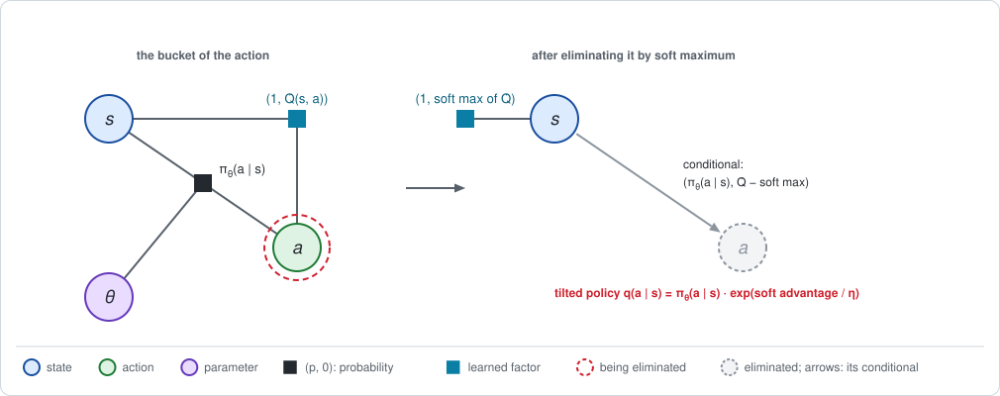
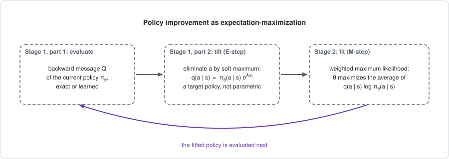

# Chapter 17: Soft and EM methods

:::{div}
:class: in-progress
**This book is a work in progress.** It is still being written and revised: its content is incomplete and may contain errors.
:::

The last two chapters took a hard maximum over the action: by comparing table
entries in [Chapter 15](chapter15.md), and by climbing a learned $\hat Q$ in
[Chapter 16](chapter16.md). A hard maximum trusts the estimate completely,
and it leaves a policy that tries nothing else.

This chapter uses the third sum over the actions of
[Chapter 2](chapter02.md), the **soft maximum**. Eliminating an action by
soft maximum leaves a conditional that, reweighted by its own surprise, is a
new policy: the old one, tilted toward the actions with a high value. A
family of algorithms is built on that one step: REPS, MPO, AWR and SAC. The
short version:

- **Stage 1 produces a tilted policy.** Eliminating the action by soft
  maximum at temperature $\eta$ gives
  $q(a \mid s) \propto \pi(a \mid s)\, e^{A(s, a) / \eta}$. It is the best
  trade-off between a high value and staying close to $\pi$.
- **Stage 2 fits the policy factor to it**, by weighted maximum likelihood:
  a supervised regression. Together the two stages are an
  expectation-maximization (EM) loop.
- **With exact messages and a free table the loop never makes the policy
  worse**, and it converges to the best policy. Its small-temperature limit
  is the policy iteration of [Chapter 4](chapter04.md).
- **SAC keeps the tilt.** It fixes the reference policy and the temperature,
  and computes the fixed point of the soft maximum: a policy that stays
  random on purpose.

The example is the endless track of [Chapter 3](chapter03.md).

**Run the examples.** The code of this chapter's examples is in the companion
notebook [chapter17_examples.ipynb](chapter17_examples.ipynb), which runs
online:
[](https://colab.research.google.com/github/thduynguyen/gtsam/blob/feature/semiringfactor/gtsam/semiring/doc/chapter17_examples.ipynb)

## 1. The graph

The graph is the endless chain of Chapter 3 with its policy factors left
**in**. In Chapter 4 the policy factors were removed and the action was
eliminated by a hard maximum. Here the policy factor stays, as the starting
point that the new policy is measured against, and the action is eliminated
by a soft maximum.

| Factor | Role in this chapter |
|---|---|
| dynamics $p(s' \mid s, a)$ | exact in Sections 2 to 6, where everything can be checked; sampled in the last experiment of Section 4 |
| reward $r(s, a)$ | a value factor, as always |
| policy $\pi_\theta(a \mid s)$ | the current policy, with parameters $\theta$: the *reference* that the tilt starts from |
| value factor $Q(s, a)$ | the backward message of the current policy, exact or learned |

The bucket of an action holds two factors: the policy $(\pi_\theta, 0)$ and
the value factor $(1, Q)$.



*The numbers used below.* For the coin-flip policy on the endless track,
Chapter 3 computed

| cell | $Q(s, L)$ | $Q(s, R)$ | $V(s)$ |
|---|---|---|---|
| 0 | $-0.202$ | $-0.247$ | $-0.225$ |
| 1 | $0.037$ | $2.167$ | $1.102$ |
| 2 | $3.535$ | $4.711$ | $4.123$ |

with $J = 0.4385$. The best policy moves Right everywhere, with
$J^* = 6.4902$.

## 2. Stage 1: the tilted conditional

**The answer first.** Stage 1 has two parts. The first evaluates the current
policy $\pi$ and gives its action values $Q$, as in every chapter so far.
The second eliminates the action from its bucket by soft maximum, and reads a
new policy from the conditional:

$$q(a \mid s) = \frac{\pi(a \mid s)\, e^{A(s, a) / \eta}}{\sum_{a'} \pi(a' \mid s)\, e^{A(s, a') / \eta}},
\qquad A(s, a) = Q(s, a) - V(s).$$

The old policy is reweighted toward the actions with a positive advantage.
The temperature $\eta > 0$ sets how strongly.

**The elimination.** Apply the three steps of Chapter 2, Section 2, with the
soft maximum as the sum.

*Multiply.* Probabilities multiply and values add:
$\psi(a, s) = \big(\pi(a \mid s),\; Q(s, a)\big)$.

*Sum out the action.* The new factor holds the soft maximum of $Q$:

$$\phi(s) = \big(1,\; \bar v_\eta(s)\big), \qquad
\bar v_\eta(s) = \eta \log \sum_a \pi(a \mid s)\, e^{Q(s, a) / \eta}.$$

*Divide.* The conditional keeps the policy, with the value relative to the
soft maximum:

$$c(a \mid s) = \big(\pi(a \mid s),\;\; Q(s, a) - \bar v_\eta(s)\big).$$

Its value channel is the *soft advantage*.

**From the conditional to a policy.** The normalization invariant of
Chapter 2, Section 5, says that adding a conditional over its variable gives
the one of the semiring, $\mathbf{1} = (1, 0)$. For the soft maximum that
reads

$$\sum_a \pi(a \mid s)\; e^{\left(Q(s, a) - \bar v_\eta(s)\right) / \eta} = 1
\qquad \text{for every } s.$$

So the terms of this sum are the probabilities of a new policy:

$$q(a \mid s) = \pi(a \mid s)\; e^{\left(Q(s, a) - \bar v_\eta(s)\right) / \eta}.$$

This is the formula at the top of the section. Subtracting $V(s)$ from $Q$
in the exponent changes numerator and normalizer by the same factor, so $Q$
may be replaced by the ordinary advantage $A$.

*On the endless track,* at the coin flip and with $\eta = 1$:

| cell | $\bar v_\eta(s)$ | soft advantage of L, R | $q(L \mid s)$ | $q(R \mid s)$ |
|---|---|---|---|---|
| 0 | $-0.224$ | $+0.022$, $-0.023$ | $0.511$ | $0.489$ |
| 1 | $1.586$ | $-1.550$, $+0.581$ | $0.106$ | $0.894$ |
| 2 | $4.287$ | $-0.751$, $+0.424$ | $0.236$ | $0.764$ |

Every row of $q$ sums to one. In cell 0, where the two actions are nearly
equal under the coin flip, $q$ stays near the coin flip. In cells 1 and 2 it
moves most of the probability to Right.

**What $q$ is the solution of.** The tilted policy is the answer to a
question with two competing terms. Among all policies $q'$ for the action in
state $s$,

$$q(\cdot \mid s) = \arg\max_{q'} \Big[\underbrace{\sum_a q'(a)\, Q(s, a)}_{\text{value}}
\;-\; \eta\, \underbrace{\mathrm{KL}\big(q' \,\|\, \pi(\cdot \mid s)\big)}_{\text{distance from } \pi}\Big],$$

and the value of the maximum is the soft maximum $\bar v_\eta(s)$.

:::{dropdown} Why is the tilted policy the maximizer?
From the definition of $q$, $\log q(a \mid s) = \log \pi(a \mid s) + \big(Q(s, a) - \bar v_\eta(s)\big) / \eta$.
Solve for $Q$:

$$Q(s, a) = \bar v_\eta(s) + \eta \log \frac{q(a \mid s)}{\pi(a \mid s)}.$$

Average both sides over any policy $q'$, and split the logarithm:

$$\sum_a q'(a)\, Q(s, a) = \bar v_\eta(s)
+ \eta \sum_a q'(a) \log \frac{q'(a)}{\pi(a \mid s)}
- \eta \sum_a q'(a) \log \frac{q'(a)}{q(a \mid s)}.$$

The two sums are KL divergences. Rearranging,

$$\sum_a q'(a)\, Q(s, a) - \eta\, \mathrm{KL}(q' \,\|\, \pi)
= \bar v_\eta(s) - \eta\, \mathrm{KL}(q' \,\|\, q).$$

A KL divergence is never negative and is zero only when its two arguments
are equal. So the left side is at most $\bar v_\eta(s)$, with equality
exactly at $q' = q$. The notebook checks the inequality on a thousand random
policies.
:::

**The temperature.** It sets the exchange rate between value and distance:

$$q \;\xrightarrow{\;\eta \to \infty\;}\; \pi \quad\text{(no change)},
\qquad
q \;\xrightarrow{\;\eta \to 0\;}\; \text{all probability on } \arg\max_a Q(s, a) \quad\text{(greedy)}.$$

| $\eta$ | $0.5$ | $1$ | $2$ | $5$ |
|---|---|---|---|---|
| average KL from the coin flip to $q$ | $0.324$ | $0.163$ | $0.054$ | $0.010$ |

The average is over the states, each weighted by how often it is visited.

**The tilted policy is never worse.** In every state, the average of the old
action values under the new policy is at least the old state value:

$$\sum_a q(a \mid s)\, Q(s, a) \;\ge\; V(s) + \eta\, \mathrm{KL}\big(q(\cdot \mid s) \,\|\, \pi(\cdot \mid s)\big) \;\ge\; V(s).$$

This is the condition under which a new policy is at least as good as the
old one in every state, by the same argument as for the greedy step in
Chapter 4, Section 5.

:::{dropdown} Where does this inequality come from?
Put $q' = \pi$ in the identity of the previous dropdown. Its left side is
$\sum_a \pi(a \mid s)\, Q(s, a) - 0 = V(s)$, and it is at most
$\bar v_\eta(s)$. Put $q' = q$: the left side is
$\sum_a q\, Q - \eta\, \mathrm{KL}(q \,\|\, \pi)$ and equals
$\bar v_\eta(s)$. Together,

$$V(s) \;\le\; \bar v_\eta(s) = \sum_a q(a \mid s)\, Q(s, a) - \eta\, \mathrm{KL}(q \,\|\, \pi).$$
:::

## 3. Stage 2: fitting the policy factor

**The difficulty.** The tilted policy $q$ is a table with a separate row for
every state. The policy factor is a function $\pi_\theta$ with shared
parameters. In general no $\theta$ reproduces $q$ exactly.

**The update.** Choose the $\theta$ whose policy is closest to $q$, with each
state weighted by its visitation $d(s)$. Measuring closeness by
$\mathrm{KL}(q \,\|\, \pi_\theta)$ and dropping the terms that do not depend
on $\theta$, this is

$$\theta_{k+1} = \arg\max_\theta\; \sum_s d(s) \sum_a q(a \mid s)\; \log \pi_\theta(a \mid s).$$

This is **weighted maximum likelihood**: the problem of fitting a model
$\pi_\theta$ to labels $a$, where the labels of state $s$ occur in the
proportions $q(a \mid s)$. It is a supervised regression, solved with the
usual tools, and no gradient of $J$ is needed.

**With a free table** the fit is exact, $\pi_{k+1} = q$.

**With shared parameters** the fit is a projection. Take the policy
$\pi_\theta(R \mid s) = \sigma(\theta_0 + \theta_1 s)$ on the track, with
$\sigma$ the function of Chapter 5, Section 1: two parameters for three
cells, and a probability of moving Right that can only rise or only fall
along the track. Starting from the coin flip, $\theta = (0, 0)$:

| cell | 0 | 1 | 2 |
|---|---|---|---|
| E-step: $q(R \mid s)$ | $0.489$ | $0.894$ | $0.764$ |
| M-step: $\pi_\theta(R \mid s)$ | $0.560$ | $0.739$ | $0.863$ |

The tilted policy is highest in the middle cell, and the fitted policy
cannot follow that. It takes the closest shape it has.

**Written with samples.** The states and actions of collected transitions are
draws from $d(s)\, \pi(a \mid s)$. Since $q = \pi\, e^{A / \eta}$ up to a
normalizer, the objective is an average over the data, with a weight on each
action that was actually taken:

$$\sum_s d(s) \sum_a q(a \mid s) \log \pi_\theta(a \mid s)
\;\approx\; \frac{1}{M} \sum_{i=1}^{M} e^{\hat A(s^{(i)}, a^{(i)}) / \eta}\;
\log \pi_\theta\big(a^{(i)} \mid s^{(i)}\big).$$

In words: imitate the actions in the data, and imitate the ones that turned
out well more strongly. This form is called *advantage-weighted regression*.

:::{dropdown} How is this related to the policy gradient of Chapter 5?
Take the gradient of the weighted likelihood at the current parameters, with
the weights $q$ held fixed:

$$\nabla_\theta \sum_s d(s) \sum_a q(a \mid s) \log \pi_\theta(a \mid s)
= \sum_s d(s) \sum_a q(a \mid s)\; \frac{\nabla_\theta \pi_\theta(a \mid s)}{\pi_\theta(a \mid s)}.$$

For a large temperature, $e^{A / \eta} \approx 1 + A / \eta$, and the
normalizer of $q$ is close to one because the advantages average to zero. So
$q \approx \pi_\theta\, (1 + A / \eta)$, and the gradient becomes

$$\sum_s d(s) \sum_a \Big(1 + \frac{A(s, a)}{\eta}\Big)\, \nabla_\theta \pi_\theta(a \mid s)
= \frac{1}{\eta} \sum_s d(s) \sum_a \nabla_\theta \pi_\theta(a \mid s)\, A(s, a).$$

The term with the 1 vanishes, because $\sum_a \nabla_\theta \pi_\theta = 0$.
What remains is the policy gradient of Chapter 5, Section 3, in its
discounted form, divided by $\eta$. So for a large temperature the first
gradient step of the M-step is a policy-gradient step. The M-step goes
further than one step: it solves the fit, and the KL term of Section 2
limits how far the answer can be from the old policy.
:::

## 4. The loop: expectation-maximization

The two stages alternate:



The names come from the EM algorithm for fitting a model with hidden
variables. The E-step computes a distribution over what is not observed, here
the tilted policy $q$ over actions. The M-step fits the parameters to that
distribution by maximum likelihood. Reading policy improvement as EM goes
back to Dayan and Hinton (1997); see the
[references](#chapter17-references).

### Three algorithms

| | REPS | MPO | AWR |
|---|---|---|---|
| backward message | a learned $V$; the weight uses the TD residual of each transition | a learned $\hat Q$, from replayed transitions as in Chapter 15 | returns from the data minus a learned $V$ |
| actions that are weighted | those in the data | several actions sampled from $\pi_\theta$ at each stored state | those in the data |
| temperature $\eta$ | solved from a bound on the KL divergence | solved from a bound on the KL divergence | fixed by hand |
| M-step | weighted maximum likelihood | weighted maximum likelihood, with a second KL bound on $\pi_\theta$ | weighted maximum likelihood |

### The temperature from a KL bound

A temperature is hard to choose: it has the units of the reward, and the
right value changes as the advantages shrink. REPS and MPO choose instead how
far the policy may move, a bound $D_{\max}$ on the average KL divergence from
$\pi$ to $q$, and find the temperature that meets it.

**The answer first.** The temperature is the minimizer of a function of one
variable,

$$\mathcal{L}(\eta) = \eta\, D_{\max} + \sum_s (1 - \gamma)\, d(s)\; \bar v_\eta(s),$$

where $(1 - \gamma)\, d(s)$ is the visitation normalized to sum to one.

:::{dropdown} Why does the minimizer meet the bound?
The soft maximum $\bar v_\eta(s)$ is the maximum over $q'$ of
$\sum_a q' Q - \eta\, \mathrm{KL}(q' \,\|\, \pi)$ (Section 2). The derivative
of a maximum with respect to a parameter is the derivative of the expression
at the maximizer, so

$$\frac{d\, \bar v_\eta(s)}{d \eta} = -\mathrm{KL}\big(q(\cdot \mid s) \,\|\, \pi(\cdot \mid s)\big).$$

Therefore

$$\frac{d \mathcal{L}}{d \eta} = D_{\max} - \sum_s (1 - \gamma)\, d(s)\; \mathrm{KL}\big(q(\cdot \mid s) \,\|\, \pi(\cdot \mid s)\big),$$

which is zero exactly when the average KL divergence of the tilted policy
equals $D_{\max}$.
:::

*On the endless track,* at the coin flip with $D_{\max} = 0.1$, the minimizer
is $\eta = 1.396$. The tilted policy at that temperature has
$q(R \mid s) = (0.492,\; 0.822,\; 0.699)$, and its average KL divergence from
the coin flip is $0.1000$.

This is a trust region, the subject of [Chapter 14](chapter14.md), solved in
closed form: because $q$ is a free table, the best policy within a KL
distance of the old one is known exactly, and only one number, $\eta$, has
to be searched for.

### Both steps from samples

The last experiment of the notebook uses the dynamics table only as a
simulator. Each iteration:

1. collects $M = 5{,}000$ transitions with the current policy, episodes
   ending with probability $1 - \gamma$;
2. learns $\hat Q$ from them, by the fitted evaluation of Chapter 15 with the
   average under the current policy as the sum over the next action;
3. re-estimates the policy table from the actions in the data, each counted
   with the weight $e^{\hat A / \eta}$, $\eta = 1$.

For a table, the weighted maximum-likelihood fit of step 3 is the weighted
count of each action, normalized per state. The exact $J$ of each policy,
from one seeded run:

| iteration | 0 | 1 | 2 | 3 | 5 | 10 | 14 |
|---|---|---|---|---|---|---|---|
| $J$ | $0.4385$ | $4.4525$ | $5.6238$ | $6.0430$ | $6.3939$ | $6.4878$ | $6.4902$ |

## 5. SAC: keeping the tilt

The EM methods tilt away from the *current* policy, and repeat. Every
iteration moves the reference, and the loop ends at the best policy, which is
deterministic. *Soft actor-critic* (SAC; Haarnoja et al., 2018) uses the same
operator differently: the reference policy and the temperature are **fixed**,
and the tilt becomes part of the problem.

**The objective.** Fix a reference policy $\pi_{\text{ref}}$, here the coin
flip. At every step the agent pays $\eta$ times its KL divergence from the
reference:

$$J_\eta(\pi) = \mathbb{E}\Big[\sum_{t=0}^{\infty} \gamma^t\, \Big(r(s_t, a_t)
- \eta\, \mathrm{KL}\big(\pi(\cdot \mid s_t) \,\|\, \pi_{\text{ref}}(\cdot \mid s_t)\big)\Big)\Big].$$

For a uniform reference over $n_a$ actions,
$\mathrm{KL}(\pi \,\|\, \pi_{\text{ref}}) = \log n_a - \mathcal{H}(\pi)$,
where $\mathcal{H}$ is the entropy. So the agent is rewarded for staying
random. This is the *maximum-entropy* objective.

**Its solution is an elimination.** By Section 2, the best trade-off in one
state is the soft maximum, attained by the tilted reference. Applying that at
every step of the endless chain gives the fixed point of two eliminations:
the next state by average, and the action by soft maximum.

$$Q_\eta(s, a) = r(s, a) + \gamma \sum_{s'} p(s' \mid s, a)\, V_\eta(s'),
\qquad
V_\eta(s) = \eta \log \sum_a \pi_{\text{ref}}(a \mid s)\, e^{Q_\eta(s, a) / \eta},$$

$$\pi_\eta(a \mid s) = \pi_{\text{ref}}(a \mid s)\; e^{\left(Q_\eta(s, a) - V_\eta(s)\right) / \eta}.$$

These are the value iteration of Chapter 4, Section 5, with the soft maximum
in the place of the maximum: the third row of the table of Chapter 2,
Section 8. Here $V_\eta$ and $Q_\eta$ are the *soft values* at temperature
$\eta$, and $\pi_\eta$ is the soft-optimal policy.

*On the endless track:*

| $\eta$ | $V_\eta(0)$ | $V_\eta(1)$ | $V_\eta(2)$ | $\pi_\eta(R \mid s)$ in cells 0, 1, 2 | $J$ of $\pi_\eta$, without the KL term |
|---|---|---|---|---|---|
| $5$ | $0.213$ | $1.660$ | $4.631$ | $0.502$, $0.607$, $0.557$ | $1.439$ |
| $1$ | $1.762$ | $3.603$ | $6.321$ | $0.581$, $0.907$, $0.722$ | $4.360$ |
| $0.5$ | $2.836$ | $4.868$ | $7.407$ | $0.716$, $0.990$, $0.840$ | $5.460$ |
| $0.1$ | $4.727$ | $6.868$ | $9.307$ | $0.996$, $1.000$, $1.000$ | $6.486$ |
| $0.01$ | $5.350$ | $7.492$ | $9.931$ | $1$, $1$, $1$ | $6.490$ |
| $0.001$ | $5.413$ | $7.554$ | $9.993$ | $1$, $1$, $1$ | $6.490$ |
| hard maximum (Chapter 4) | $5.419$ | $7.561$ | $10$ | $1$, $1$, $1$ | $6.490$ |

As $\eta \to 0$ the soft values tend to $V^*$ and the policy to the best one.
The soft values are bracketed by

$$V^*(s) - \frac{\eta \log n_a}{1 - \gamma} \;\le\; V_\eta(s) \;\le\; V^*(s),$$

with $n_a = 2$ actions here: the KL term costs at most $\eta \log n_a$ per
step, for $1 / (1 - \gamma)$ steps on average.

**Why keep a random policy.** The last column shows the price: at $\eta = 1$
the soft-optimal policy earns $4.36$, not $6.49$. What it buys is a policy
that keeps trying every action, with more weight on the better ones, so the
data keep covering the actions that Chapters 15 and 16 had to visit by added
noise. The tilt is applied at the actions only. The next state is still
averaged with the true dynamics, so the values are not optimistic about luck;
[Chapter 8](chapter08.md) discusses what goes wrong otherwise.

**SAC from samples.** SAC computes this fixed point with learned functions
and replayed transitions.

| Part of SAC | What it does | In the terms of this book |
|---|---|---|
| critic target | $r + \gamma\, \big(\hat Q^-(s', a') - \eta \log \pi_\theta(a' \mid s')\big)$, with $a' \sim \pi_\theta(\cdot \mid s')$ | a one-sample estimate of the soft value $V_\eta(s')$, bootstrapped from a frozen copy |
| actor update | gradient steps that reduce $\mathrm{KL}\big(\pi_\theta(\cdot \mid s) \,\|\, q(\cdot \mid s)\big)$, with $q \propto e^{\hat Q(s, \cdot) / \eta}$ | Stage 2: fit the policy factor to the tilted reference |
| temperature update | adjust $\eta$ so that the entropy of $\pi_\theta$ stays near a target | the dual of Section 4, with a bound on the entropy |
| two critics, the smaller in the target | as in TD3 | the repair of Chapter 16 |

The critic target uses the fact that the soft maximum is attained by the
tilted policy: $V_\eta(s') = \sum_{a'} \pi_\eta\, \big(Q_\eta - \eta \log (\pi_\eta / \pi_{\text{ref}})\big)$,
which for a uniform reference is the average of $Q_\eta - \eta \log \pi_\eta$
plus a constant.

**The two families side by side.**

| | EM methods (REPS, MPO, AWR) | SAC |
|---|---|---|
| reference of the tilt | the current policy; it moves every iteration | a fixed policy, usually uniform |
| what the loop converges to | the best policy; deterministic | the soft-optimal policy $\pi_\eta$; random |
| role of the KL term | a limit on each step: a trust region | part of the objective: a reward for staying random |
| fit of the policy factor | $\mathrm{KL}(q \,\|\, \pi_\theta)$: weighted maximum likelihood | $\mathrm{KL}(\pi_\theta \,\|\, q)$: gradient steps through sampled actions |

## 6. Exact special cases

**The EM loop with a free table and exact messages.** Stage 1 evaluates the
policy by the elimination of Chapter 3 and tilts it; Stage 2 sets
$\pi_{k+1} = q$. By Section 2 no iteration can lower the value of any state.
Starting from the coin flip:

| iteration | 0 | 1 | 2 | 3 | 5 | 10 | 20 |
|---|---|---|---|---|---|---|---|
| $J$, with $\eta = 1$ | $0.4385$ | $4.3914$ | $5.6221$ | $6.0322$ | $6.3687$ | $6.4862$ | $6.4902$ |
| $J$, with $\eta = 0.3$ | $0.4385$ | $6.0387$ | $6.4665$ | $6.4873$ | $6.4901$ | $6.4902$ | $6.4902$ |

$J$ increases at every iteration and converges to $J^* = 6.4902$, the value
of the best policy of Chapter 4.

**The small-temperature limit is policy iteration.** With $\eta = 0.001$ the
tilt puts all probability on the action with the largest advantage. The loop
then gives $J = 0.4385,\; 3.7805,\; 6.4902$: the three rows of the
policy-iteration table of Chapter 4, Section 5.

**The loop with shared parameters.** With the two-parameter policy of
Section 3 the M-step is a projection, and the guarantee of Section 2 no
longer applies. In this example $J$ still increases at every iteration:

| iteration | 0 | 1 | 2 | 3 | 5 | 10 | 29 |
|---|---|---|---|---|---|---|---|
| $J$ | $0.4385$ | $4.1051$ | $5.8665$ | $6.2747$ | $6.4539$ | $6.4894$ | $6.4902$ |

**The soft fixed point, two ways.** For $\eta = 1$, soft value iteration
gives $V_\eta = (1.762,\; 3.603,\; 6.321)$. The two alternating steps of
SAC, done exactly, reach the same point: evaluate the current policy with
the KL term included as one more reward factor, by elimination, then replace
the policy by the tilted reference.

**The other checks of the notebook:**

| Statement | Check |
|---|---|
| the rows of every tilted policy sum to one | the normalization invariant, at every temperature |
| $q \propto \pi\, e^{(Q - \bar v_\eta) / \eta}$ and $q \propto \pi\, e^{A / \eta}$ are the same policy | compared entry by entry |
| $q$ maximizes value minus $\eta$ KL, with maximum $\bar v_\eta$ | 1,000 random policies never exceed it |
| the minimizer of $\mathcal{L}(\eta)$ meets the KL bound | average KL $= 0.1000$ for $D_{\max} = 0.1$ |
| $V^* - \eta \log 2 / (1 - \gamma) \le V_\eta \le V^*$ | for six temperatures |
| the entropy form of SAC differs from the KL form by a constant | $V$ differs by $\eta \log 2 / (1 - \gamma) = 6.931$ in every cell |

## 7. Implementation

The E-step is one elimination with the module. The bucket of the action holds
the pair $(\pi, Q)$, and the action is summed out with the rule
`SemiringSum.SoftMaximum(eta)`. The value of the new factor is the soft
maximum, the value channel of the conditional is the soft advantage, and
`tilted` returns the conditional reweighted by it, the policy $q$:

```python
def soft_eliminate(policy, Q, eta):
    bucket = SemiringDiscreteFactor(
        DecisionTreeFactor([now, move], policy.ravel()),    # p = pi(a | s)
        DecisionTreeFactor([now, move], Q.ravel()))         # v = Q(s, a)
    conditional, new_factor = bucket.eliminate(
        ordering(A(0)), SemiringSum.SoftMaximum(eta))
    return conditional, table(new_factor.value(), [now])    # the soft maximum

conditional, soft_V = soft_eliminate(policy, Q, eta)
conditional.surprise()              # the soft advantage Q - soft_V
q = conditional.tilted(1 / eta)     # the tilted policy, rows sum to one
```

The module computes the tilted mean relative to its largest value, so it does
not overflow at small temperatures.

The EM loop with a free table and exact messages. `evaluate` is the
elimination of Chapter 3, repeated on one step of the endless chain until the
value stops changing:

```python
policy = coin_flip.copy()
for k in range(80):
    V, Q = evaluate(policy)          # stage 1: evaluate (Chapter 3) ...
    policy = tilt(policy, Q, eta)    # ... and tilt; stage 2: the fit is exact
```

The M-step from samples, for a table: weighted counts of the actions taken.
This part is plain numpy, since it works on samples:

```python
A_hat = Q_hat - (policy * Q_hat).sum(axis=1, keepdims=True)
weighted = np.zeros((3, 2))
np.add.at(weighted, (s, a), np.exp(A_hat[s, a] / eta))   # weights exp(A/eta)
policy = weighted / weighted.sum(axis=1, keepdims=True)
```

Soft value iteration, the exact computation behind SAC, is the step of
Chapter 4 with one word changed, the rule at the action:

```python
soft = SemiringSum.SoftMaximum(eta)
V = np.zeros(4)                      # three cells and the state "ended"
for sweep in range(sweeps):
    # Eliminate s' by average: the bucket of the action, (1, Q).
    bucket = move_reward * (transition * value([later], V)).sum(ordering(S(1)))
    # Eliminate a by soft maximum, with the reference policy as weights.
    conditional, new_factor = (policy_factor(reference) * bucket).eliminate(
        ordering(A(0)), soft)
    V = table(new_factor.value(), [now])
policy = conditional.tilted(1 / eta)   # the soft-optimal policy
```

Two more factors appear in the notebook's checks. The price of leaving the
reference policy, $-\eta \log(\pi / \pi_{\text{ref}})$, is a value factor on
$(s, a)$: its average under the policy is $-\eta$ times the KL divergence, so
the soft value of a policy is an ordinary evaluation with one more reward
factor. And the entropy convention of SAC is the KL convention plus the
constant value factor $\eta \log 2$ on every step.

## 8. What breaks

- **A soft policy is not the best policy.** At a fixed temperature SAC
  converges to $\pi_\eta$, which gives up return for randomness: $4.36$
  against $6.49$ at $\eta = 1$ on the track. The temperature is in the units
  of the reward, so rescaling the rewards changes the policy.
- **The tilt can only reweight.** $q$ is $\pi$ times a positive weight. An
  action to which $\pi$ gives probability zero stays at zero, and with
  samples an action that was not tried gets no weight. The loop cannot
  discover an action; it can only shift probability among those it has.
- **A small temperature amplifies errors.** The weights are
  $e^{\hat A / \eta}$. With a learned $\hat A$ and a small $\eta$, one
  overestimated action receives nearly all the weight. This is the upward
  bias of Chapter 16 again, which is why SAC uses two critics.
- **The projection loses the guarantee.** The inequality of Section 2 holds
  for $q$. After the fit, $\pi_\theta$ is not $q$, and improvement is no
  longer certain. MPO adds a second KL bound in the M-step to keep the fit
  from moving far.
- **The direction of the fit matters.** Fitting by
  $\mathrm{KL}(q \,\|\, \pi_\theta)$ makes $\pi_\theta$ cover everything $q$
  does, and averages between separate good actions. Fitting by
  $\mathrm{KL}(\pi_\theta \,\|\, q)$ makes it settle on one of them.
- **The forward message is the buffer's.** As in Chapters 15 and 16, the
  states of the M-step come from stored data, not from the visitation of the
  policy being fitted.

## 9. Framework card

| | SAC | REPS | MPO | AWR |
|---|---|---|---|---|
| 1. Sum over the actions | soft maximum, with a fixed reference policy | soft maximum, relative to the current policy | soft maximum, relative to the current policy | soft maximum, relative to the current policy |
| 2. Dynamics factor | sampled transitions, kept in a replay buffer | sampled transitions from the current policy | sampled transitions, kept in a replay buffer | sampled transitions, kept in a replay buffer |
| 3. Backward messages | learned soft critic $\hat Q$, bootstrapped; two critics, the smaller in the target | learned $V$; the weights use TD residuals | learned critic $\hat Q$, bootstrapped | returns from the data minus a learned $V$ |
| 4. Forward messages | replay buffer of old transitions | particles of the current policy | replay buffer of old transitions | replay buffer of old transitions |
| 5. Stage 2 update | gradient steps fitting $\pi_\theta$ to the tilted reference; temperature adjusted to a target entropy | EM: weighted maximum likelihood; temperature from a KL bound | EM: weighted maximum likelihood with a KL bound; temperature from a KL bound | EM: weighted maximum likelihood; fixed temperature |

(chapter17-references)=
## 10. References

- P. Dayan and G. E. Hinton, "Using expectation-maximization for
  reinforcement learning", *Neural Computation*, 1997. Policy improvement as
  an EM step.
- J. Peters and S. Schaal, "Reinforcement learning by reward-weighted
  regression for operational space control", *ICML*, 2007. The M-step as a
  weighted regression, on a robot arm.
- J. Peters, K. Mülling and Y. Altün, "Relative entropy policy search",
  *AAAI*, 2010. REPS: the KL bound and its dual.
- A. Abdolmaleki, J. T. Springenberg, Y. Tassa, R. Munos, N. Heess and M.
  Riedmiller, "Maximum a posteriori policy optimisation", *ICLR*, 2018. MPO.
- X. B. Peng, A. Kumar, G. Zhang and S. Levine, "Advantage-weighted
  regression: simple and scalable off-policy reinforcement learning",
  arXiv preprint, 2019. AWR.
- T. Haarnoja, H. Tang, P. Abbeel and S. Levine, "Reinforcement learning with
  deep energy-based policies", *ICML*, 2017. Soft Q-learning and the soft
  Bellman equation.
- T. Haarnoja, A. Zhou, P. Abbeel and S. Levine, "Soft actor-critic:
  off-policy maximum entropy deep reinforcement learning with a stochastic
  actor", *ICML*, 2018. SAC.
- B. D. Ziebart, *Modeling Purposeful Adaptive Behavior with the Principle of
  Maximum Causal Entropy*, PhD thesis, Carnegie Mellon University, 2010. The
  maximum-entropy objective with the dynamics kept fixed.
- S. Levine, "Reinforcement learning and control as probabilistic inference:
  tutorial and review", arXiv preprint, 2018.

---

Previous: [Chapter 16: Off-policy actor-critic](chapter16.md).
Next: [Chapter 18: Learning the dynamics factor](chapter18.md).
