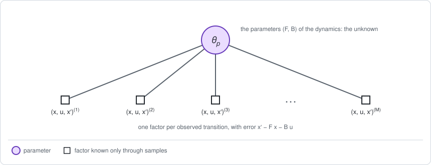
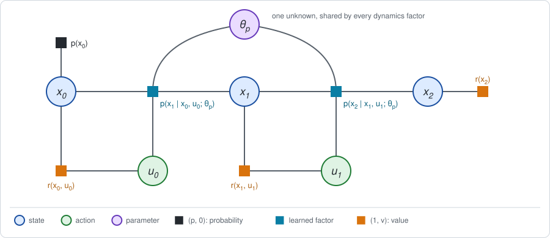

# Chapter 18: Learning the dynamics factor

Parts I and II assumed that the dynamics factor $p(x' \mid x, u)$ is known.
Part III did without it: it replaced the factor by transitions sampled from
the real system and never wrote the factor down.

Part IV takes the third route. It **learns** the dynamics factor from sampled
transitions, and then runs Stage 1 on the learned factor as if it were the
true one. This chapter is about the learning step and about what a learned
factor does to the result. The short version:

- **Learning the dynamics is a calibration problem.** The transitions are
  measurements, the parameters $\theta_p$ of the dynamics are the unknown, and
  the fit is a least-squares problem on a factor graph, solved with GTSAM as
  it stands.
- **A learned factor carries two kinds of uncertainty.** The noise *of* the
  dynamics stays however much data there is. The uncertainty *about* the
  dynamics shrinks with data. On the graph the second is a variable shared by
  every dynamics factor, and it is handled the way the policy parameter
  $\theta$ was: by fixing it, at one value or at several.
- **Using the estimate as if it were exact works well when there is enough
  data.** The loss in expected return is quadratic in the model error, so it
  falls in proportion to one over the number of transitions.
- **The data only tell what they excite.** Transitions collected under one
  policy determine what that policy does, and little else.

**Run the examples.** The code of this chapter's examples is in the companion
notebook [chapter18_examples.ipynb](chapter18_examples.ipynb), which runs
online:
[](https://colab.research.google.com/github/thduynguyen/gtsam/blob/feature/semiringfactor/gtsam/semiring/doc/chapter18_examples.ipynb)

## 1. The graph

**The example.** Take the line of Chapter 1, Section 8. Its dynamics are

$$x' = F x + B u + w, \qquad w \sim N(0, \Sigma_w), \qquad
F = 1,\; B = 1,\; \Sigma_w = 0.5.$$

The learner does **NOT** know $F$, $B$ or $\Sigma_w$. It knows the form of
the equation, and it can watch the robot: every move gives one *transition*
$(x, u, x')$, the position before, the action, and the position after. The
first transitions of the notebook, from a robot that moves at random:

| $x$ | $u$ | $x'$ |
|---|---|---|
| $3.053$ | $1.777$ | $3.024$ |
| $3.024$ | $-0.138$ | $3.603$ |
| $3.352$ | $0.654$ | $5.065$ |
| $5.065$ | $0.290$ | $5.744$ |

**The model.** Collect the unknown numbers of the dynamics in one vector,
the **parameters of the dynamics**,

$$\theta_p = (F, B),$$

and write the dynamics factor as a function of them:

$$p(x' \mid x, u;\, \theta_p) = N\big(x';\; F x + B u,\; \Sigma_w\big).$$

There are now two graphs, one for learning and one for control.

**The graph for learning.** In a transition, $x$, $u$ and $x'$ were all
observed. They are data, not variables. The only variable is $\theta_p$, and
each transition is one factor on it:



A SLAM reader knows this graph as *calibration*: one unknown that every
measurement depends on. The control literature calls the same problem *system
identification*.

**The graph for control.** It is the decision graph of
[Chapter 4](chapter04.md), with one change: every dynamics factor depends on
$\theta_p$.



This is the picture of Chapter 4, Section 4, again. There, a policy parameter
$\theta$ was joined to every policy factor. Here a dynamics parameter
$\theta_p$ is joined to every dynamics factor. The two differ in who sets
them:

| Shared variable | Joined to | Who sets it | How it is handled |
|---|---|---|---|
| $\theta$, the policy parameters | every policy factor | the agent: a decision | maximized, in Stage 2 |
| $\theta_p$, the dynamics parameters | every dynamics factor | nature: an unknown | estimated from data |

And they are alike in one respect: neither can be eliminated together with
the states and actions, because the factor $N(x';\, F x + B u,\, \Sigma_w)$
with $F$ unknown multiplies two unknowns, $F$ and $x$. The remedy is the one
of Chapter 5, Section 6: **fix $\theta_p$, and eliminate what is left.**
Section 4 fixes it at its estimate. Section 3 fixes it at several values and
averages.

## 2. Learning the factor

**The answer first.** The estimate of $\theta_p$ is the solution of a linear
least-squares problem, and its uncertainty is the marginal covariance of the
variable $\theta_p$ in the graph of Section 1. With 20 transitions the
notebook gets

$$\hat F = 1.081 \pm 0.064, \qquad \hat B = 0.839 \pm 0.224, \qquad
\hat\Sigma_w = 0.636,$$

against the true values $1$, $1$ and $0.5$.

**The factor of one transition.** Transition $i$ is the triple
$(x^{(i)}, u^{(i)}, x'^{(i)})$. Under the model, the next position is
$F x^{(i)} + B u^{(i)}$ plus Gaussian noise, so the transition contributes the
factor

$$f_i(\theta_p) = N\big(x'^{(i)};\; F x^{(i)} + B u^{(i)},\; \Sigma_w\big)
\;\propto\; \exp\Big(-\frac{\big(x'^{(i)} - F x^{(i)} - B u^{(i)}\big)^2}{2\, \Sigma_w}\Big).$$

This is an ordinary GTSAM factor with a Gaussian noise model. Its error,
$x'^{(i)} - F x^{(i)} - B u^{(i)}$, is linear in the variable $\theta_p$.

**The estimate.** The most probable $\theta_p$ maximizes the product of the
$M$ factors, which is the same as minimizing the sum of the squared errors:

$$\hat\theta_p = \arg\min_{F, B} \sum_{i=1}^{M} \big(x'^{(i)} - F x^{(i)} - B u^{(i)}\big)^2.$$

Write $z^{(i)} = (x^{(i)}, u^{(i)})^\top$ for the input of transition $i$.
Setting the derivative to zero gives the normal equations, which GTSAM solves
by elimination:

$$\Big(\sum_i z^{(i)} z^{(i)\top}\Big)\, \hat\theta_p = \sum_i z^{(i)}\, x'^{(i)}.$$

The noise variance does not appear: it scales every factor alike and does not
move the minimum.

**The noise of the dynamics** is then estimated from what the fit leaves
unexplained, the squared errors at the estimate, averaged with $M - 2$ in
place of $M$ because two parameters were fitted:

$$\hat\Sigma_w = \frac{1}{M - 2} \sum_{i=1}^{M} \big(x'^{(i)} - \hat F x^{(i)} - \hat B u^{(i)}\big)^2.$$

**The uncertainty about the dynamics** is the marginal covariance of
$\theta_p$, as for any variable of a GTSAM graph. For this graph it is the
noise variance times the inverse of the matrix of the normal equations:

$$\Sigma_{\theta_p} = \hat\Sigma_w\, \Big(\sum_i z^{(i)} z^{(i)\top}\Big)^{-1}.$$

**More data.** The same fit on the first $M$ transitions of one long run:

| $M$ | $\hat F$ | $\hat B$ | $\hat\Sigma_w$ | standard deviation of $\hat F$, $\hat B$ |
|---|---|---|---|---|
| 6 | $1.064$ | $0.513$ | $1.137$ | $0.148$, $0.516$ |
| 20 | $1.081$ | $0.839$ | $0.636$ | $0.064$, $0.224$ |
| 100 | $1.039$ | $0.930$ | $0.495$ | $0.029$, $0.072$ |
| 1000 | $1.007$ | $0.982$ | $0.487$ | $0.009$, $0.022$ |
| 10000 | $1.001$ | $1.000$ | $0.505$ | $0.003$, $0.007$ |

The estimates approach $F = B = 1$ and $\Sigma_w = 0.5$. The standard
deviations shrink like $1 / \sqrt{M}$: ten times smaller for a hundred times
more data. The numbers are from one seeded run.

### What the data can and cannot tell

The matrix $\sum_i z^{(i)} z^{(i)\top}$ is the information matrix of
$\theta_p$. It is built from the inputs $z = (x, u)$ that the robot happened
to visit, so the uncertainty depends on how the data were collected.

Suppose the transitions come from a robot that follows the policy
$u = -0.5\, x$ with very little jitter. Then every input is nearly
proportional to one vector,

$$z^{(i)} = \begin{pmatrix} x^{(i)} \\ u^{(i)} \end{pmatrix}
\approx x^{(i)} \begin{pmatrix} 1 \\ -0.5 \end{pmatrix},$$

and the information matrix is nearly of rank one. The data determine the
combination $F - 0.5\, B$, which is how the position evolves under that
policy, since $x' = F x + B (-0.5\, x) + w = (F - 0.5\, B)\, x + w$. They say
almost nothing about $F$ and $B$ separately. With 100 transitions:

| Data from | $\hat F$ | $\hat B$ | $\hat F - 0.5\, \hat B$ |
|---|---|---|---|
| the policy $u = -0.5\, x$, jitter of variance $0.01$ | $1.36 \pm 0.37$ | $1.58 \pm 0.74$ | $0.569 \pm 0.044$ |
| random actions of variance $1$ | $1.039 \pm 0.029$ | $0.930 \pm 0.072$ | |

A SLAM reader has met this as a weakly observed direction in a calibration:
the motion must *excite* a parameter for the data to determine it. The
consequence for control is specific. A model learned from the data of one
policy predicts well what that policy does. It may be badly wrong about what
another policy would do, and Stage 1 on the learned factor compares
policies. Deciding which data to collect is the subject of
[Chapter 24](chapter24.md).

## 3. Two kinds of uncertainty

A prediction made with a learned factor is uncertain for two different
reasons.

- **The noise of the dynamics.** Even with $F$ and $B$ known exactly, the
  next position is random, with variance $\Sigma_w$. More data do not reduce
  it. The literature calls it *aleatoric* uncertainty.
- **The uncertainty about the dynamics.** $F$ and $B$ are known only up to
  the covariance $\Sigma_{\theta_p}$. More data reduce it. The literature
  calls it *epistemic* uncertainty.

**The example.** Predict the position $x_2$ after two moves of the policy
$u = -0.5\, x$, starting from $x_0 = 2$. For one given model $\theta_p$ the
position evolves as $x' = a\, x + w$ with $a = F - 0.5\, B$, so

$$\mathbb{E}[x_2 \mid \theta_p] = a^2 \cdot 2, \qquad
\operatorname{Var}[x_2 \mid \theta_p] = (a^2 + 1)\, \Sigma_w.$$

On the true system $a = 0.5$, which gives a mean of $0.5$ and a variance of
$0.625$.

**The decomposition.** Now treat $\theta_p$ as uncertain, with the estimate
and covariance of Section 2. The variance of the prediction splits into two
terms, by the law of total variance:

$$\operatorname{Var}[x_2] =
\underbrace{\mathbb{E}_{\theta_p}\big[\operatorname{Var}[x_2 \mid \theta_p]\big]}_{\text{noise of the dynamics}}
\;+\;
\underbrace{\operatorname{Var}_{\theta_p}\big[\mathbb{E}[x_2 \mid \theta_p]\big]}_{\text{uncertainty about the dynamics}}.$$

Both terms are computed from an **ensemble**: a set of models
$\theta_p^{(1)}, \dots, \theta_p^{(E)}$, here drawn from
$N(\hat\theta_p, \Sigma_{\theta_p})$. Each member makes its own prediction.
The first term is the average of the members' variances, and the second is
the spread of the members' means.

| Model from | point estimate: mean, variance | noise of the dynamics | uncertainty about the dynamics |
|---|---|---|---|
| 20 transitions | $0.874$, $0.914$ | $0.927$ | $0.145$ |
| 1000 transitions | $0.533$, $0.617$ | $0.617$ | $0.0009$ |
| the true system | $0.5$, $0.625$ | $0.625$ | $0$ |

With 20 transitions the point estimate predicts a mean of $0.874$ where the
truth is $0.5$. The point estimate alone gives no sign of this. The ensemble
does: its members disagree, with a spread of $\sqrt{0.145} = 0.38$ around
their mean. With 1000 transitions the members agree, and what is left is the
noise of the dynamics, close to its true value.

**How each enters the semiring graph.**

| | Noise of the dynamics | Uncertainty about the dynamics |
|---|---|---|
| where it lives | inside each dynamics factor, as $\Sigma_w$ | in the variable $\theta_p$, shared by all dynamics factors |
| with more data | stays | shrinks like $1 / M$ |
| over time | a fresh draw at every step | **one** draw, the same at every step |
| in Stage 1 | the trace term added when a next state is summed out; it lowers $J$ | an outer average over models, $\mathbb{E}_{\theta_p}\big[J(\theta_p)\big]$ |
| computed by | one elimination | one elimination per member of the ensemble |

The last two rows are the cutset conditioning of Chapter 5, Section 6, applied
to $\theta_p$: fix a member, eliminate the states and actions, and average the
results over the members,

$$\mathbb{E}_{\theta_p}\big[J(\theta_p)\big] \approx \frac{1}{E} \sum_{i=1}^{E} J\big(\theta_p^{(i)}\big).$$

:::{dropdown} Why not fold the uncertainty about the dynamics into the noise?
It is tempting to treat both kinds as noise: at every step, add to $\Sigma_w$
the variance that $\Sigma_{\theta_p}$ causes in the next position. Elimination
then needs one pass and no ensemble.

This draws a *new* model at every step, and so loses the row "over time" of
the table. The real error of the model is the same at every step, and its
effects add up coherently along a trajectory. For the model from 20
transitions, the notebook compares the two by sampling:

| | variance of $x_2$ |
|---|---|
| one model per rollout (correct) | $1.072$ |
| a new model at every move | $1.001$ |

The first is the sum of the two terms above, $0.927 + 0.145$. The second
underestimates the spread, and the gap grows with the number of steps.
[Chapter 19](chapter19.md) makes this approximation knowingly, in exchange
for a closed form.
:::

:::{dropdown} Where do ensembles come from when there is no covariance?
For a model that is linear in its parameters, with Gaussian noise, the
covariance $\Sigma_{\theta_p}$ is exact and members can be drawn from it. A
neural network has no such formula. The common substitute is to train several
networks on the same data, each from a different random start, or each on a
different resampling of the data, and to use their disagreement as the
uncertainty about the dynamics (Lakshminarayanan et al., 2017).
[Chapter 21](chapter21.md) uses such ensembles.
:::

:::{dropdown} What if the form of the dynamics is not known?
The model above has a fixed form, $F x + B u$. A *Gaussian process* makes no
such commitment: it predicts the next state at a new input from the
transitions observed near that input, and it reports a predictive variance
that grows with the distance from the data. That variance is its uncertainty
about the dynamics. [Chapter 19](chapter19.md) uses a Gaussian process as the
dynamics factor.
:::

## 4. Stage 1 on the learned factor

**The method.** Fix $\theta_p$ at its estimate, put the learned factor
$N(x';\; \hat F x + \hat B u,\; \hat\Sigma_w)$ in place of the true one, and
run Stage 1 as if nothing had changed. This is called **certainty-equivalent
control**: the estimate is treated as if it were certain.

For the line, Stage 1 is the backward pass of [Chapter 6](chapter06.md), with
a maximum over the actions. In the notation of this book, with the value
$V_t(x) = -(x^\top P_t\, x + \beta_t)$ and $P_T = C_T$, each step gives a gain
and a new quadratic:

$$K_t = \big(C_u + \hat B^\top P_{t+1} \hat B\big)^{-1} \hat B^\top P_{t+1} \hat F,
\qquad
P_t = C_x + \hat F^\top P_{t+1} \hat F - \hat F^\top P_{t+1} \hat B\, K_t.$$

The policy $u_t = -K_t\, x_t$ is the conditional that the pass leaves on each
action. Nothing in the pass knows that the factor was learned.

**Two returns.** A controller computed from a learned model has two expected
returns, and they must not be confused:

- the **predicted** return: what the learned model says the controller will
  collect. It is the constant left at the root of the pass above.
- the **true** return: what the controller collects on the real system. It is
  obtained by evaluating the policy $u_t = -K_t\, x_t$ on the true dynamics
  factor, by the elimination of Chapter 1.

| $M$ | $K_0$ | $K_1$ | predicted $J$ | true $J$ |
|---|---|---|---|---|
| 6 | $0.690$ | $0.432$ | $-15.453$ | $-9.360$ |
| 20 | $0.699$ | $0.532$ | $-11.210$ | $-9.374$ |
| 100 | $0.645$ | $0.518$ | $-9.877$ | $-9.276$ |
| 1000 | $0.609$ | $0.503$ | $-9.347$ | $-9.251$ |
| 10000 | $0.601$ | $0.501$ | $-9.271$ | $-9.250$ |
| true model | $0.6$ | $0.5$ | $-9.25$ | $-9.25$ |

Two things stand out.

- **The true return is forgiving.** Even the model from 6 transitions, whose
  $\hat B$ is off by a factor of two, gives a controller within $0.11$ of the
  best return.
- **The predicted return is not to be trusted.** It is off by 6 for the model
  from 6 transitions. In this run it errs on the pessimistic side, because
  the noise variance was overestimated. [Chapter 21](chapter21.md) shows that
  when a planner is free to exploit the model, the error tends to be
  optimistic.

**Why the true return is forgiving.** Write $J(K)$ for the true return as a
function of the gains $K = (K_0, K_1)$, and $K^*$ for the best gains. At the
best gains the gradient of $J$ is zero, so a small error in the gains costs
only at second order:

$$J^* - J(\hat K) \approx \tfrac{1}{2}\, (\hat K - K^*)^\top\, \big[-\nabla^2_K J(K^*)\big]\, (\hat K - K^*).$$

The error of the gains is proportional to the error of the model, which
shrinks like $1 / \sqrt{M}$. The loss is its square, and shrinks like
$1 / M$. Averaged over 300 independent data sets of each size:

| $M$ | mean loss $J^* - J$ | $M \times$ loss |
|---|---|---|
| 6 | $0.870$ | $5.2$ |
| 20 | $0.055$ | $1.11$ |
| 100 | $0.0106$ | $1.06$ |
| 1000 | $0.00086$ | $0.86$ |

From 20 transitions on, the product $M \times \text{loss}$ is roughly
constant: ten times more data, ten times less loss. With 6 transitions the
loss is far larger than that rule predicts: some data sets of that size give
a model so wrong that its controller is poor, and the second-order argument
does not apply. This rate for certainty-equivalent control of linear systems
is due to Mania, Tu and Recht (2019); see the
[references](#chapter18-references).

## 5. Stage 2

Certainty-equivalent control of the line needs no Stage 2: the best policy is
read from the conditionals of the backward pass, as in Chapter 6.

In general, learning the factor does not change Stage 2. Any update of
Parts II and III applies, with one substitution: the messages it uses are
computed on the learned factor. What a learned factor adds is a loop *around*
both stages:

1. **Collect** transitions by running the current policy on the real system.
2. **Learn**: fit $\theta_p$ to all transitions collected so far (Section 2).
3. **Stage 1 and Stage 2** on the learned factor, to improve the policy.
4. Repeat from 1.

The loop matters because of Section 2: the data of step 1 come from the
current policy, so the model is accurate where that policy goes. As the
policy improves it visits new states, and the model has to be refitted there.
Chapters [19](chapter19.md) to [21](chapter21.md) are instances of this loop,
with different models and different Stage 1 computations.

## 6. An exact special case

With enough data the learned factor becomes the true one, and everything must
agree with the exact results of the line.

| Check | Result | Reference |
|---|---|---|
| the backward pass with the module, on the true factor | $K_0 = 0.6$, $K_1 = 0.5$, $J^* = -9.25$ | the Riccati recursion of Chapter 6 |
| the evaluation with the module, of $u = -0.5\, x$ on the true factor | $J = -9.375$ | Chapter 1 |
| the fit with GTSAM, against the normal equations in numpy | the same $\hat\theta_p$ and $\Sigma_{\theta_p}$ | Section 2 |
| the learned controller, $M = 10000$ | $K_0 = 0.601$, $K_1 = 0.501$, true $J = -9.2500$ | $J^* = -9.25$ |

The notebook asserts each of them.

## 7. Implementation

**The fit**, with GTSAM. One `CustomFactor` per transition on the single key
of $\theta_p$, an optimizer, and the marginal covariance:

```python
THETA_P = gtsam.symbol("p", 0)

def transition_factor(x, u, x_next, variance):
    """A factor on theta_p = (F, B) with error x' - F x - B u."""
    def error(this, values, jacobians):
        theta_p = values.atVector(this.keys()[0])
        if jacobians is not None:
            jacobians[0] = np.array([[-x, -u]])
        return np.array([x_next - theta_p[0] * x - theta_p[1] * u])
    return gtsam.CustomFactor(
        noiseModel.Isotropic.Variance(1, variance), [THETA_P], error)

graph = gtsam.NonlinearFactorGraph()
for i in range(len(x)):
    graph.add(transition_factor(x[i], u[i], x_next[i], variance))
initial = gtsam.Values()
initial.insert(THETA_P, np.zeros(2))
result = gtsam.GaussNewtonOptimizer(graph, initial).optimize()
theta_p = result.atVector(THETA_P)                           # (F, B)
covariance = gtsam.Marginals(graph, result).marginalCovariance(THETA_P)
```

The graph is linear, so one Gauss-Newton step solves it. The notebook fits
once with a unit variance, estimates $\hat\Sigma_w$ from the errors, and
builds the graph again with it to read the covariance.

**Stage 1 on the learned factor**, with the semiring module. The helpers
`gaussian`, `penalty` and `ordering` are those of Chapter 1, Section 10. The
learned numbers enter in one place, the dynamics factor:

```python
def dynamics_factor(t, F, B, variance):
    """x' - F x - B u = w, with w of the given variance."""
    return gaussian(X(t + 1), I, X(t), -F * I, U(t), -B * I, zero,
                    noiseModel.Isotropic.Variance(1, variance))

def best_gains(F, B, variance):
    """One backward pass, max over the actions, on the given dynamics."""
    gains = {}
    value = penalty(X(2))                                   # (1, V_2)
    for t in [1, 0]:
        # Eliminate the next state by average.
        phi = dynamics_factor(t, F, B, variance).multiply(value).sum(
            ordering(X(t + 1)))
        bucket = penalty(X(t)).multiply(penalty(U(t))).multiply(phi)
        # Eliminate the action by max: solve H_uu u = -H_ux x for the gain.
        Q = bucket.value()
        keys, H = list(Q.keys()), Q.information()
        iu, ix = keys.index(U(t)), keys.index(X(t))
        gains[t] = H[iu, ix] / H[iu, iu]
        value = policy_factor(t, gains[t]).multiply(bucket).sum(ordering(U(t)))
    return gains

gains = best_gains(theta_p[0], theta_p[1], variance)   # the learned factor
evaluate(gains)                                        # on the true factor
```

`policy_factor` lifts the deterministic policy $u_t = -K_t\, x_t$, a hard
constraint. `evaluate` builds the `SemiringFactorGraph` of Chapter 1 with the
**true** dynamics factor and that policy, and returns `graph.expectation()`.

## 8. What breaks

- **The planner exploits the model.** Stage 1 on a learned factor searches
  for the actions that the *model* rates highest. Where the model is wrong in
  a favorable direction, that is where the search goes, and the predicted
  return is then too high. Section 4 showed that the predicted return cannot
  be trusted; [Chapter 21](chapter21.md) shows the bias and what ensembles do
  about it.
- **Errors compound along the chain.** The learned factor is applied at every
  step, and the error of one step is the input of the next. The longer the
  horizon, the worse the predicted forward message
  ([Chapter 21](chapter21.md)).
- **Unexcited directions.** A model learned from the data of one policy says
  little about other policies (Section 2). Collecting data that are
  informative is a decision problem of its own
  ([Chapter 24](chapter24.md)).
- **The wrong form.** The fit assumed $x' = F x + B u + w$. If the true
  dynamics are not of that form, no amount of data makes the model right: the
  uncertainty about the parameters shrinks to zero around a wrong answer.
  The remedies are models that are linear only locally
  ([Chapter 20](chapter20.md)), or models without a fixed form
  ([Chapter 19](chapter19.md), [Chapter 21](chapter21.md)).
- **Certainty equivalence ignores what it does not know.** The controller of
  Section 4 uses the estimate and discards $\Sigma_{\theta_p}$. For the line
  that costs little. Where a wrong model can be dangerous, the uncertainty
  about the dynamics has to enter the decision, through an ensemble as in
  Section 3.

## 9. Framework card

| | Certainty-equivalent control with a learned model |
|---|---|
| 1. Sum over the actions | maximum |
| 2. Dynamics factor | a learned model: a linear-Gaussian factor fitted to transitions by least squares |
| 3. Backward messages | exact on the learned factor (the Riccati recursion) |
| 4. Forward messages | not needed |
| 5. Stage 2 update | none: the policy is read from the conditionals; an outer loop collects data and refits the factor |

(chapter18-references)=
## 10. References

- L. Ljung, *System Identification: Theory for the User*, 2nd edition,
  Prentice Hall, 1999. Estimating dynamic models from data, and the role of
  excitation.
- K. J. Åström and B. Wittenmark, *Adaptive Control*, 2nd edition,
  Addison-Wesley, 1995. Certainty-equivalent controllers.
- H. Mania, S. Tu and B. Recht, "Certainty equivalence is efficient for linear
  quadratic control", *NeurIPS*, 2019. The loss of the certainty-equivalent
  controller is quadratic in the model error.
- S. Dean, H. Mania, N. Matni, B. Recht and S. Tu, "On the sample complexity
  of the linear quadratic regulator", *Foundations of Computational
  Mathematics*, 2020. How many transitions a linear-quadratic problem needs.
- F. Dellaert and M. Kaess, "Factor graphs for robot perception",
  *Foundations and Trends in Robotics*, 2017. Calibration and estimation as
  factor-graph problems.
- B. Lakshminarayanan, A. Pritzel and C. Blundell, "Simple and scalable
  predictive uncertainty estimation using deep ensembles", *NeurIPS*, 2017.
- A. Kendall and Y. Gal, "What uncertainties do we need in Bayesian deep
  learning for computer vision?", *NeurIPS*, 2017. Aleatoric and epistemic
  uncertainty.
- C. E. Rasmussen and C. K. I. Williams, *Gaussian Processes for Machine
  Learning*, MIT Press, 2006.

---

Previous: [Chapter 17: Soft and EM methods](chapter17.md).
Next: [Chapter 19: PILCO](chapter19.md).
