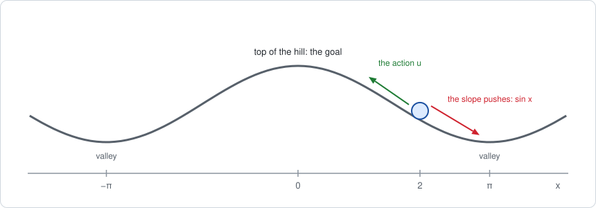
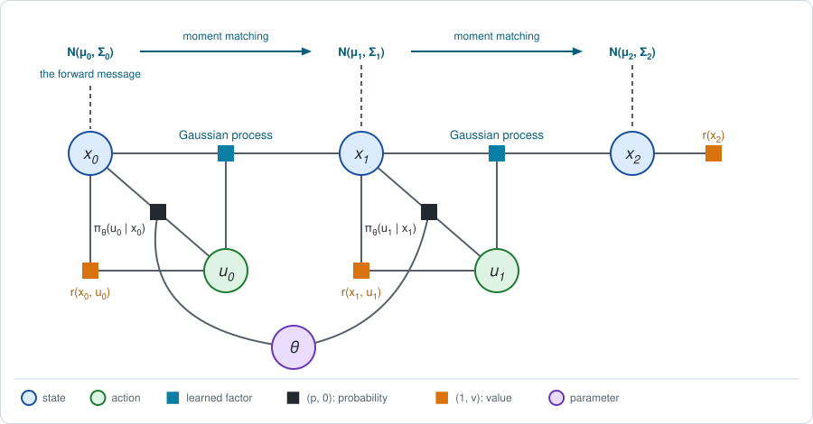

# Chapter 19: PILCO

:::{div}
:class: in-progress
**This book is a work in progress.** It is still being written and revised: its content is incomplete and may contain errors.
:::

[Chapter 18](chapter18.md) learned a dynamics factor of a fixed form,
$x' = F x + B u + w$, and then used its estimate as if it were exact. Both
choices are limiting. A robot's dynamics are rarely linear, and an estimate
used blindly is wrong in ways that the planner cannot see.

PILCO (Deisenroth and Rasmussen, 2011) removes both limits, and it does so
with very few transitions. It is the classic data-efficient method of
model-based RL. The short version:

- **The dynamics factor is a Gaussian process.** It has no fixed form. It
  predicts from the transitions observed near a query, and it reports its own
  uncertainty, which is large where there are no data.
- **Stage 1 computes only the forward message.** The distribution of the
  state at each step is kept Gaussian, $N(\mu_t, \Sigma_t)$, by *moment
  matching*: the mean and variance of the next state are computed exactly,
  and its shape is replaced by a Gaussian.
- **The expected return is then a closed-form function of the policy
  parameter**, and Stage 2 climbs it with its derivative.
- **The model's uncertainty counts as cost.** Where the model is unsure, the
  predicted state is spread out, and a quadratic reward penalizes spread. So
  the optimizer stays away from what the model does not know.

**Run the examples.** The code of this chapter's examples is in the companion
notebook [chapter19_examples.ipynb](chapter19_examples.ipynb), which runs
online:
[](https://colab.research.google.com/github/thduynguyen/gtsam/blob/feature/semiringfactor/gtsam/semiring/doc/chapter19_examples.ipynb)

## 1. The graph

### The problem: a robot on a hill

The line of Chapter 1 is flat. Put a hill on it, with its top at the origin.



- **State.** The position $x$, a real number.
- **Action.** How far the robot moves, $u$, a real number.
- **Dynamics.** The slope pushes the robot away from the top:
  $x' = x + u + \sin x + w$, where $w \sim N(0, 0.1)$ is wheel slip. The push
  $\sin x$ is zero at the top, grows on the slope, and is zero again at the
  bottom of the valleys, $x = \pm\pi$.
- **Rewards.** As on the line: $r(x, u) = -(x^2 + u^2)$ at each move, and a
  final reward $-x_4^2$. The robot should get to the top and stay there, with
  little effort.
- **Start.** $x_0 \sim N(2, 1)$: on the slope, most of the time.
- **Moves.** Four.
- **Policy.** $u = -K x$ at every move, with one parameter, $\theta = K$.

The terms of the problem:

| Term | Here |
|---|---|
| start $p(x_0)$ | the density $N(x_0;\; 2,\; 1)$ |
| policy $\pi_\theta(u \mid x)$ | the deterministic rule $u = -K x$ |
| dynamics $p(x' \mid x, u)$ | the density $N(x';\; x + u + \sin x,\; 0.1)$: **NOT** linear in $x$ |
| reward $r(x, u)$ | the quadratic $-(x^2 + u^2)$ |
| final reward $r(x_4)$ | the quadratic $-x_4^2$ |

**What the gain does.** Sampling many episodes on the real hill gives the
true expected return of a gain:

| gain $K$ | true $J$ | mean position after 4 moves |
|---|---|---|
| $0.5$ | $-20.73$ | $1.70$ |
| $1.0$ | $-13.76$ | $0.34$ |
| $0.989$, the best | $-13.76$ | |

With $K = 0.5$ the robot does not get up the hill. On average the position
obeys $x' = 0.5\, x + \sin x$, which has a resting point where
$0.5\, x = \sin x$, at $x \approx 1.9$: there the action and the slope cancel,
and the robot sits on the slope. A gain near 1 is needed to reach the top.

The learner does not know the term $\sin x$, or that the dynamics have this
form at all. It can run episodes on the real hill, which are expensive, and
it wants a good gain from as few of them as possible.

### The graph



The graph is the chain of Chapter 5: policy factors that depend on $\theta$,
reward factors, and dynamics factors. Two things are new. The dynamics
factors are learned, and they are not linear-Gaussian. And the quantity that
Stage 1 passes along the chain is the forward message alone.

## 2. The learned factor: a Gaussian process

**The answer first.** After seeing $M$ transitions, the model predicts the
change of position $\Delta x = x' - x$ at any input $z = (x, u)$ as a
Gaussian with a mean and a variance,

$$m(z) = k(z)^\top \xi, \qquad
v(z) = \sigma_f^2 - k(z)^\top \big(\Gamma + \Sigma_w I\big)^{-1} k(z),$$

where the pieces are built from the data as follows.

**The data.** Transition $i$ gives an input $z^{(i)} = (x^{(i)}, u^{(i)})$
and a target, the observed change $\Delta x^{(i)} = x'^{(i)} - x^{(i)}$.

**The kernel.** A Gaussian process rests on one assumption: inputs that are
close have similar outputs. "Close" is measured by a *kernel*, here the
squared exponential

$$k(z, z') = \sigma_f^2\, \exp\Big(-\tfrac{1}{2}\, (z - z')^\top \Lambda^{-1} (z - z')\Big).$$

It equals $\sigma_f^2$ when $z = z'$ and falls to zero as they move apart.
The diagonal matrix $\Lambda$ holds the squared *length scales*: how far, in
$x$ and in $u$, two inputs can be apart and still be considered close. The
number $\sigma_f^2$ is the variance of the function before any data are seen.

**The pieces of the prediction.**

| Symbol | Definition | What it is |
|---|---|---|
| $\Gamma$ | the $M \times M$ matrix with entries $\Gamma_{ij} = k(z^{(i)}, z^{(j)})$ | how close the data inputs are to each other |
| $k(z)$ | the vector with entries $k(z, z^{(i)})$ | how close the query is to each data input |
| $\xi$ | $\big(\Gamma + \Sigma_w I\big)^{-1}\, \Delta x$, with $\Delta x$ the vector of targets | one weight per transition |

So the predicted mean is a weighted sum of kernels centered on the data
inputs. The prediction of the next position is

$$p(x' \mid x, u) = N\big(x';\;\; x + m(z),\;\; v(z) + \Sigma_w\big).$$

**Its two variances** are the two kinds of uncertainty of Chapter 18,
Section 3:

- $v(z)$ is the uncertainty *about* the dynamics. Near the data,
  $k(z)$ is large and $v(z)$ is small. Far from all data, $k(z) \approx 0$,
  so $v(z) = \sigma_f^2$ and $m(z) = 0$: the model predicts no change and says
  that it does not know.
- $\Sigma_w$ is the noise *of* the dynamics.

*On the hill,* with 20 transitions from five episodes of random actions, the
model predicts the change of position along the line $u = -x$ as follows:

| input | model: $m(z) \pm \sqrt{v(z)}$ | true mean change, $u + \sin x$ |
|---|---|---|
| $x = 0$, $u = 0$ | $0.16 \pm 0.23$ | $0$ |
| $x = 1$, $u = -1$ | $-0.09 \pm 0.17$ | $-0.16$ |
| $x = 2$, $u = -2$ | $-0.83 \pm 0.59$ | $-1.09$ |
| $x = 3$, $u = -3$ | $-1.18 \pm 1.35$ | $-2.86$ |

At $x = 3$ the model is far off, and it knows: no random action of the data
was as large as $-3$ there, and its standard deviation is $1.35$.

:::{dropdown} Where do the length scales and variances come from?
The notebook fixes them: length scales $1.5$ in $x$ and $3$ in $u$,
$\sigma_f^2 = 4$, and the noise variance $\Sigma_w = 0.1$ taken as known.

PILCO estimates them from the data, by maximizing the probability that the
Gaussian process assigns to the observed targets, the *marginal likelihood*.
That is one more least-squares-like fit, of a handful of numbers, and it is
left out here to keep the notebook short.
:::

:::{dropdown} Is this a factor that the module can eliminate?
No. The factor $N(x';\; x + m(z),\; v(z) + \Sigma_w)$ is Gaussian in $x'$, but
its mean $m(z)$ and its variance $v(z)$ are nonlinear functions of $x$ and
$u$. The Gaussian family of the module needs a mean that is linear in the
other variables and a variance that does not depend on them. This chapter
therefore does Stage 1 in numpy, with the formulas of Section 3. The module
supplies the exact reference of Section 5, where the dynamics are linear.
:::

## 3. Stage 1: the forward message, by moment matching

**The sum over the actions** is the average under the policy, as in
Chapter 1. The policy is deterministic, so the average substitutes
$u = -K x$.

**Only the forward message is needed.** Chapter 3, Section 5, showed that the
expected return can be computed from either side: from the backward message,
or as the forward message times the reward. PILCO uses the second:

$$J(\theta) = \sum_{t=0}^{T-1} \mathbb{E}\big[r(x_t, u_t)\big] + \mathbb{E}\big[r(x_T)\big],
\qquad \text{each expectation under the forward message } d_t(x).$$

**The answer first.** If the forward message is a Gaussian,
$d_t(x) = N(x;\, \mu_t, \Sigma_t)$, then with $u = -K x$ every term is a
closed form, because $\mathbb{E}[x_t^2] = \mu_t^2 + \Sigma_t$:

$$J(\theta) = -\sum_{t=0}^{T-1} (1 + K^2)\, \big(\mu_t^2 + \Sigma_t\big) \;-\; \big(\mu_T^2 + \Sigma_T\big).$$

What remains is to carry $(\mu_t, \Sigma_t)$ from one step to the next.

### One step of the forward message

Suppose $x_t \sim N(\mu_t, \Sigma_t)$. The input of the dynamics factor is
$z = (x_t, u_t) = x_t\, (1, -K)$, which is Gaussian too:

$$z \sim N(\mu_z, \Sigma_z), \qquad
\mu_z = \mu_t \begin{pmatrix} 1 \\ -K \end{pmatrix}, \qquad
\Sigma_z = \Sigma_t \begin{pmatrix} 1 & -K \\ -K & K^2 \end{pmatrix}.$$

The next position is $x_{t+1} = x_t + \Delta x$, where $\Delta x$ is the
model's prediction at the uncertain input $z$. Its distribution is the
forward message one step later,

$$d_{t+1}(x') = \int N(z;\, \mu_z, \Sigma_z)\;\; p(x' \mid z)\; dz.$$

This is the elimination of $x_t$ and $u_t$, as in Chapter 1. With a
linear-Gaussian dynamics factor the result would be exactly Gaussian. With
the Gaussian process it is **NOT**: a Gaussian pushed through a nonlinear
function is no longer Gaussian.

**Moment matching** is the approximation that keeps the message simple:
compute the mean and the variance of $d_{t+1}$ *exactly*, and replace
$d_{t+1}$ by the Gaussian that has them.

$$\mu_{t+1} = \mu_t + \mathbb{E}[\Delta x],
\qquad
\Sigma_{t+1} = \Sigma_t + \operatorname{Var}[\Delta x] + 2\, \operatorname{Cov}[x_t, \Delta x].$$

The three moments on the right have closed forms for the squared-exponential
kernel.

**The mean.** Average the predicted mean $m(z) = k(z)^\top \xi$ over the
input. Only the kernels depend on $z$, so

$$\mathbb{E}[\Delta x] = \bar k^\top \xi, \qquad
\bar k_i = \mathbb{E}_z\big[k(z, z^{(i)})\big]
= \frac{\sigma_f^2}{\sqrt{\lvert \Sigma_z \Lambda^{-1} + I \rvert}}\;
\exp\Big(-\tfrac{1}{2}\, (z^{(i)} - \mu_z)^\top (\Sigma_z + \Lambda)^{-1} (z^{(i)} - \mu_z)\Big).$$

Compare $\bar k_i$ with the kernel itself. It is the same bell shape around
the data input $z^{(i)}$, evaluated at the mean $\mu_z$, but wider by the
uncertainty of the input, $\Sigma_z + \Lambda$ in place of $\Lambda$, and
lower by the factor in front.

:::{dropdown} Where does this formula come from?
The kernel, as a function of $z$, is an unnormalized Gaussian centered on
$z^{(i)}$ with covariance $\Lambda$. The expectation is the integral of the
product of two Gaussians in $z$, and such an integral is again a Gaussian, in
the difference of their centers, with the sum of their covariances:

$$\int N(z;\, \mu_z, \Sigma_z)\; N(z;\, z^{(i)}, \Lambda)\; dz = N\big(z^{(i)};\, \mu_z,\, \Sigma_z + \Lambda\big).$$

A SLAM reader knows this as the marginal of a measurement whose mean is
itself uncertain: the covariances add. Writing out the normalization
constants of the three Gaussians gives the factor
$\lvert \Sigma_z \Lambda^{-1} + I \rvert^{-1/2}$.
:::

**The variance.** By the law of total variance, the variance of the change is
the average of the model's own variance, plus the variance of the model's
mean over the input, plus the noise:

$$\operatorname{Var}[\Delta x] =
\underbrace{\mathbb{E}_z\big[v(z)\big]}_{\text{uncertainty about the dynamics}}
+ \underbrace{\operatorname{Var}_z\big[m(z)\big]}_{\text{spread of the input}}
+ \underbrace{\Sigma_w}_{\text{noise}}.$$

Both expectations involve products of two kernels, whose average is

$$\Xi_{ij} = \mathbb{E}_z\big[k(z, z^{(i)})\, k(z, z^{(j)})\big]
= \frac{\sigma_f^4}{\sqrt{\lvert 2\, \Sigma_z \Lambda^{-1} + I \rvert}}\;
e^{-\frac{1}{4} (z^{(i)} - z^{(j)})^\top \Lambda^{-1} (z^{(i)} - z^{(j)})}\;
e^{-\frac{1}{2} (\bar z_{ij} - \mu_z)^\top (\Sigma_z + \Lambda / 2)^{-1} (\bar z_{ij} - \mu_z)},$$

with $\bar z_{ij} = \tfrac{1}{2} (z^{(i)} + z^{(j)})$ the midpoint of the two
data inputs. In terms of $\Xi$,

$$\operatorname{Var}[\Delta x] = \sigma_f^2 - \operatorname{tr}\big((\Gamma + \Sigma_w I)^{-1}\, \Xi\big)
+ \xi^\top \Xi\, \xi - \big(\bar k^\top \xi\big)^2 + \Sigma_w.$$

**The covariance with the input.** The change depends on the position it
starts from, and that correlation matters for the variance of their sum:

$$\operatorname{Cov}[z, \Delta x] = \Sigma_z\, (\Sigma_z + \Lambda)^{-1} \sum_i \xi_i\, \bar k_i\, \big(z^{(i)} - \mu_z\big).$$

Its first entry is $\operatorname{Cov}[x_t, \Delta x]$.

**A check by sampling.** The formulas are easy to get wrong, so the notebook
checks them. It takes the input $x \sim N(2, 1)$ with $K = 0.5$, draws
400000 inputs, pushes each through the model, and compares the moments of the
results with the closed forms:

| | $\mathbb{E}[\Delta x]$ | $\operatorname{Var}[\Delta x]$ | $\operatorname{Cov}[x, \Delta x]$ |
|---|---|---|---|
| moment matching | $-0.0699$ | $0.6718$ | $-0.4225$ |
| sampling | $-0.0684$ | $0.6687$ | $-0.4202$ |

### What Stage 1 does and does not compute

| | In PILCO |
|---|---|
| sum over the actions | average under the deterministic policy: substitute $u = -K x$ |
| dynamics factor | a learned Gaussian process |
| forward message $d_t$ | a Gaussian $N(\mu_t, \Sigma_t)$, by moment matching |
| backward messages $Q_t$, $V_t$ | not computed |
| expected return | forward message times reward, in closed form |

Two things are approximated. The shape of the forward message is taken to be
Gaussian after every step. And the model's uncertainty $v(z)$ is drawn anew
at every step, where the truth is one unknown function for the whole
trajectory; this is the approximation that Chapter 18, Section 3, warned
about.

## 4. Stage 2: climbing a closed-form return

With Stage 1 in closed form, the predicted return is an explicit function of
the parameter:

$$\theta \;\longmapsto\; (\mu_0, \Sigma_0) \to (\mu_1, \Sigma_1) \to \dots \to (\mu_T, \Sigma_T) \;\longmapsto\; J(\theta).$$

Every arrow is a differentiable formula, so $\nabla_\theta J$ follows from
the chain rule, applied along the chain of forward messages. PILCO derives
these derivatives analytically and hands $J$ and $\nabla_\theta J$ to a
quasi-Newton optimizer, which runs to convergence on the current model.

This is a different route to the gradient than Chapter 5. There the gradient
was assembled from a forward message, a local derivative and a backward
message. Here the forward recursion itself is differentiated. The two are
related: applying the chain rule from the last step backward carries, for
each step, the derivative of the remaining return with respect to
$(\mu_t, \Sigma_t)$. That quantity does the job of the backward message.

The notebook has one parameter and lets the optimizer take the derivative by
finite differences.

**The loop.** Stage 1 and Stage 2 sit inside the loop of Chapter 18,
Section 5: collect, learn, improve, repeat.

1. **Collect.** Five episodes with random actions, then three episodes with
   the current policy after each round.
2. **Learn.** Fit the Gaussian process to all transitions so far.
3. **Stage 1 and Stage 2.** Maximize the predicted $J(K)$ over $K$.

*On the hill,* from one seeded run:

| round | transitions | gain $K$ | predicted $J$ | true $J$ |
|---|---|---|---|---|
| 0 | 20 | $0.823$ | $-22.96$ | $-14.62$ |
| 1 | 32 | $0.998$ | $-15.97$ | $-13.76$ |
| 2 | 44 | $1.010$ | $-16.60$ | $-13.77$ |
| 3 | 56 | $1.026$ | $-15.77$ | $-13.80$ |
| 4 | 68 | $0.996$ | $-15.13$ | $-13.76$ |
| best gain on the real hill | | $0.989$ | | $-13.76$ |

After 8 episodes, 32 transitions, the gain is within $0.01$ of the best one
and the true return matches it to two decimals. The "true $J$" column is
computed by sampling the real hill, for the reader; the learner never sees
it.

**The predicted return is pessimistic, and that is deliberate.** In round 0
the model promises $-22.96$ for a policy that really collects $-14.62$. The
reason is the first term of the variance in Section 3: where the model is
unsure, $v(z)$ is large, the predicted state is spread out, and the reward
$-x^2$ penalizes spread, since $\mathbb{E}[x^2] = \mu^2 + \Sigma$. The
optimizer therefore prefers policies whose outcome the model is *sure* about.
Compare with the certainty-equivalent controller of Chapter 18, which trusted
its model everywhere. As data arrive where the policy goes, the model's
uncertainty there shrinks and the prediction approaches the truth.

## 5. An exact special case: the line

For linear dynamics, a Gaussian state stays exactly Gaussian, so moment
matching is not an approximation. Stage 1 must then reproduce the exact
evaluation of Chapter 1.

Take the line, $x' = x + u + w$ with $w \sim N(0, 0.5)$, two moves,
$x_0 \sim N(2, 1)$, and the policy $u = -0.5\, x$ without jitter. The change
of position is $\Delta x = u + w$, linear in the input, and its three moments
are immediate. The same Stage 1 code, with these moments in place of the
Gaussian process, gives the forward messages

$$N(2,\; 1) \;\to\; N(1,\; 0.75) \;\to\; N(0.5,\; 0.6875),$$

since the position evolves as $x' = 0.5\, x + w$: the mean halves, and the
variance is $0.25\, \Sigma_t + 0.5$. The return is

$$J = -1.25 \cdot (2^2 + 1) - 1.25 \cdot (1^2 + 0.75) - (0.5^2 + 0.6875)
= -6.25 - 2.1875 - 0.9375 = -9.375,$$

which is the value obtained by elimination with the module, as quoted in
Chapter 18, Section 6.

The notebook checks both against the module. It builds this line as a
`SemiringFactorGraph`, with the policy as a hard-constraint factor, and
eliminates it. The expectation of the graph is $-9.375$. The forward messages
come from the same graph without its rewards: the mean and the second moment
of $x_t$ are the expectations of the "rewards" $x_t$ and $x_t^2$, and they
give the three Gaussians above.

With a Gaussian process learned from 300 transitions of the line in place of
the true linear model, the same code gives $J = -9.23$. The difference of
$0.14$ is the error of the learned model, not of moment matching.

## 6. Where moment matching errs

There are two sources of error, the model and the Gaussian shape. To see the
second alone, replace the model by the *true* hill. The moments of $\sin x$
under a Gaussian $x \sim N(\mu, \Sigma)$ have closed forms,

$$\mathbb{E}[\sin x] = e^{-\Sigma / 2} \sin \mu, \qquad
\mathbb{E}[\sin^2 x] = \tfrac{1}{2}\big(1 - e^{-2 \Sigma} \cos 2\mu\big), \qquad
\operatorname{Cov}[x, \sin x] = \Sigma\, e^{-\Sigma / 2} \cos \mu,$$

so each step of moment matching is exact in its mean and variance. The only
error left is the assumption that the state entering each step is Gaussian.

For the weak gain $K = 0.5$:

| step $t$ | 0 | 1 | 2 | 3 | 4 |
|---|---|---|---|---|---|
| mean, moment matching | $2.000$ | $1.552$ | $1.620$ | $1.700$ | $1.761$ |
| mean, real hill | $2.002$ | $1.552$ | $1.636$ | $1.679$ | $1.702$ |
| variance, moment matching | $1.000$ | $0.338$ | $0.231$ | $0.169$ | $0.137$ |
| variance, real hill | $0.998$ | $0.337$ | $0.350$ | $0.365$ | $0.384$ |

- **Step 1 is exact.** The start is Gaussian, so the matched mean and
  variance of $x_1$ are the true ones.
- **From step 2 on it drifts.** The true distribution of $x_1$ is no longer
  Gaussian: the hill has bent it. Moment matching treats it as Gaussian, and
  its predictions of the next steps go wrong. By step 4 it reports a variance
  of $0.137$ where the truth is $0.384$.

The reason is visible in the problem. With $K = 0.5$ the robot cannot hold
the top: near the origin $\sin x \approx x$, so the position obeys
$x' \approx 1.5\, x$ and moves away. A robot that starts on the right slope
settles near the resting point at $x \approx 1.9$. The few that start on the
left slope, about 2% of them since $x_0 \sim N(2, 1)$, settle near its mirror
image at $x \approx -1.9$. The true distribution has two clumps, far apart,
and their separation is most of its variance. A single Gaussian around the
mean cannot represent that.

The returns differ accordingly: $J = -20.31$ by moment matching against
$-20.73$ on the real hill. For the good gain $K = 1$ the state stays near the
top, where the hill is nearly linear, and the error is smaller: $-13.50$
against $-13.76$.

With the learned model both errors are present. For the final model and gain
of Section 4:

| step $t$ | 0 | 1 | 2 | 3 | 4 |
|---|---|---|---|---|---|
| mean, model | $2.000$ | $0.763$ | $0.608$ | $0.493$ | $0.376$ |
| mean, real hill | $2.002$ | $0.559$ | $0.468$ | $0.401$ | $0.347$ |
| variance, model | $1.000$ | $0.363$ | $0.341$ | $0.386$ | $0.481$ |
| variance, real hill | $0.998$ | $0.339$ | $0.322$ | $0.321$ | $0.327$ |

The model's variance is larger than the true one at every step. That excess
is its remaining uncertainty about the dynamics, and it is the reason the
predicted return of Section 4 is below the true one.

## 7. Implementation

Stage 1 is one short function. It takes the moments of the change of
position as a function, so the same code runs with the Gaussian process, with
the exact moments of the hill, and with the linear model of the line:

```python
def stage1(moments_of_change, gain, moves=MOVES, mean=START_MEAN,
           variance=START_VARIANCE):
    """Propagate N(mean, variance) and add up the expected rewards."""
    direction = np.array([1.0, -gain])            # z = x * (1, -K)
    total, messages = 0.0, [(mean, variance)]
    for t in range(moves):
        total -= (1 + gain ** 2) * (mean ** 2 + variance)   # E[x^2 + u^2]
        change_mean, change_variance, cross = moments_of_change(
            mean * direction, variance * np.outer(direction, direction))
        mean = mean + change_mean
        variance = variance + change_variance + 2 * cross[0]
        messages.append((mean, variance))
    return total - (mean ** 2 + variance), np.array(messages)
```

The loop around it:

```python
inputs, changes = collect(rng, 5)                  # random actions
gain = 0.0
for round_ in range(5):
    model = GaussianProcess(inputs, changes, LENGTHS, SIGNAL, NOISE)   # learn
    result = minimize(lambda g: -stage1(model.moments, g[0])[0], [gain],
                      method="BFGS")               # stage 2, around stage 1
    gain = float(result.x[0])
    new_inputs, new_changes = collect(rng, 3, gain=gain)               # collect
    inputs = np.vstack([inputs, new_inputs])
    changes = np.concatenate([changes, new_changes])
```

`GaussianProcess.moments(mean, covariance)` implements the three formulas of
Section 3 in about twenty lines of numpy. The whole notebook runs in a few
seconds.

The exact reference of Section 5 uses the module. With the helpers `gaussian`
and `reward`, which lift a Gaussian factor and a quadratic on one variable:

```python
def line(gain, rewards):
    """The two-move line under u = -gain * x, with the given reward factors."""
    graph = SemiringFactorGraph()
    graph.push_back(gaussian(X(0), I, np.array([2.0]),
                             noiseModel.Isotropic.Variance(1, 1.0)))
    for t in range(2):
        graph.push_back(gaussian(U(t), I, X(t), gain * I, zero,
                                 noiseModel.Constrained.All(1)))   # the policy
        graph.push_back(gaussian(X(t + 1), I, X(t), -I, U(t), -I, zero,
                                 noiseModel.Isotropic.Variance(1, 0.5)))
    for factor in rewards:
        graph.push_back(factor)
    return graph

line(0.5, penalties).expectation(backward)                  # J = -9.375
mean = line(0.5, [reward(X(1), 0.0, -1.0)]).expectation(backward)    # E[x1]
second = line(0.5, [reward(X(1), 2.0, 0.0)]).expectation(backward)   # E[x1^2]
```

## 8. What breaks

- **A forward message that is not Gaussian.** Section 6 showed the error for
  a state that spreads between two regions. If the state can go one of two
  ways, around an obstacle or over a ridge, a single Gaussian is a poor
  summary, and the predicted return can be badly off. Carrying the forward
  message as a set of sampled states avoids the assumption
  ([Chapter 21](chapter21.md)).
- **The cost of the model.** The Gaussian process inverts an $M \times M$
  matrix, and each moment-matching step builds the $M \times M$ matrix $\Xi$,
  for every state dimension. That limits PILCO to a few hundred transitions
  and a few tens of state dimensions. Neural-network models scale further and
  give up the closed forms ([Chapter 21](chapter21.md)).
- **The uncertainty about the dynamics is drawn anew at each step.** It
  should be one draw for the whole trajectory (Chapter 18, Section 3).
- **Closed forms restrict the policy and the reward.** The expectations of
  Section 3 are available for particular families: linear and
  radial-basis-function policies, quadratic and saturating rewards. A general
  policy network does not fit.
- **A deterministic policy explores only by accident.** The data come from
  the current policy, so the model is refined where that policy goes. Whether
  it should deliberately go where the model is unsure is the question of
  [Chapter 24](chapter24.md).
- **Fixed settings.** The length scales and variances were fixed here. With
  poor values the model is confidently wrong, and so is the return.

## 9. Framework card

| | PILCO |
|---|---|
| 1. Sum over the actions | average under $\pi_\theta$, a deterministic policy: substitution |
| 2. Dynamics factor | a learned model: a Gaussian process fitted to transitions |
| 3. Backward messages | not computed; the derivative is taken through the forward recursion |
| 4. Forward messages | a moment-matched Gaussian $N(\mu_t, \Sigma_t)$ |
| 5. Stage 2 update | gradient of the closed-form return, with a quasi-Newton optimizer; an outer loop collects data and refits the factor |

(chapter19-references)=
## 10. References

- M. P. Deisenroth and C. E. Rasmussen, "PILCO: a model-based and
  data-efficient approach to policy search", *ICML*, 2011.
- M. P. Deisenroth, D. Fox and C. E. Rasmussen, "Gaussian processes for
  data-efficient learning in robotics and control", *IEEE Transactions on
  Pattern Analysis and Machine Intelligence*, 2015. The method in full, with
  the derivatives and robot experiments.
- C. E. Rasmussen and C. K. I. Williams, *Gaussian Processes for Machine
  Learning*, MIT Press, 2006. Gaussian-process regression, kernels and the
  marginal likelihood.
- J. Quiñonero-Candela, A. Girard, J. Larsen and C. E. Rasmussen,
  "Propagation of uncertainty in Bayesian kernel models: application to
  multiple-step ahead forecasting", *ICASSP*, 2003. The moments of a
  Gaussian-process prediction at an uncertain input.
- M. P. Deisenroth, G. Neumann and J. Peters, "A survey on policy search for
  robotics", *Foundations and Trends in Robotics*, 2013. Model-based policy
  search in context.

---

Previous: [Chapter 18: Learning the dynamics factor](chapter18.md).
Next: [Chapter 20: Guided policy search](chapter20.md).
