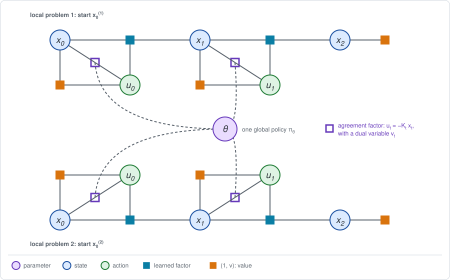

# Chapter 20: Guided policy search

[Chapter 19](chapter19.md) learned one model of the dynamics for the whole
state space and optimized one policy through it. For a robot with many
joints, both are hard: a global model needs data everywhere, and a policy
with many parameters is hard to optimize through a long chain.

Trajectory optimization ([Chapter 9](chapter09.md)) has the opposite profile.
From one start position it finds a good trajectory quickly, with a model that
only has to be right *near that trajectory*. But what it returns is valid
near that trajectory only. It is not a policy for every state.

**Guided policy search** (Levine and Koltun, 2013; Levine and Abbeel, 2014)
combines the two. Several local trajectory problems, one per start, do the
hard optimization. One global policy learns from them by plain supervised
learning. A constraint ties them together. The short version:

- **The graph has one copy of the chain per start**, each with its own local
  model, and one policy parameter $\theta$ shared by all copies.
- **Stage 1 is a trajectory problem per copy.** Each is a Gaussian factor
  graph, solved by elimination, with one extra factor per step that pulls the
  local action toward the policy's action.
- **Stage 2 is a regression.** The policy is fitted to the states and actions
  of the local solutions.
- **A dual variable on each extra factor** sets the price of disagreeing with
  the policy. It is raised until the local solutions are something the policy
  can reproduce. This alternation is the *alternating direction method of
  multipliers* (ADMM).

**Run the examples.** The code of this chapter's examples is in the companion
notebook [chapter20_examples.ipynb](chapter20_examples.ipynb), which runs
online:
[](https://colab.research.google.com/github/thduynguyen/gtsam/blob/feature/semiringfactor/gtsam/semiring/doc/chapter20_examples.ipynb)

## 1. The graph

**The example.** Take the line of Chapter 1, Section 8, with its two moves,
and three start positions,

$$x_0^{(1)} = 1, \qquad x_0^{(2)} = 2, \qquad x_0^{(3)} = 3.$$

Each start defines one **local problem**: find the best two moves from that
start. The superscript $(i)$ numbers the local problems.

**The local trajectory.** The line's dynamics are
$x' = F x + B u + w$ with $F = B = 1$. For a linear system with quadratic
rewards the best actions do not depend on the noise $w$
([Chapter 6](chapter06.md)), so each local problem plans for the mean
trajectory, $x' = F x + B u$. Its unknowns are the actions and the positions
they lead to:

$$\tau^{(i)} = \big(u_0^{(i)},\; x_1^{(i)},\; u_1^{(i)},\; x_2^{(i)}\big),
\qquad
R\big(\tau^{(i)}\big) = -\sum_{t=0}^{1} \Big(\big(x_t^{(i)}\big)^2 + \big(u_t^{(i)}\big)^2\Big) - \big(x_2^{(i)}\big)^2.$$

**The global policy.** One linear rule for all starts,

$$u = -K_t\, x, \qquad \theta = (K_0, K_1).$$

Section 3 also uses a smaller policy with a single gain,
$\theta = K$, for both moves.

**The graph.** Each local problem is a chain of its own. The policy parameter
$\theta$ is joined to every chain, through one new factor per step:



This is the graph of Chapter 4, Section 4, with one difference. There, the
shared parameter sat inside the policy factor of a single chain. Here it is
joined to several chains at once, by factors that *compare* each chain's
action with what the policy would do.

**The problem.** Find the local trajectories and the policy that maximize the
total return, subject to their agreeing:

$$\max_{\tau^{(1)}, \tau^{(2)}, \tau^{(3)},\, \theta}\;\; \sum_i R\big(\tau^{(i)}\big)
\qquad \text{subject to} \qquad
u_t^{(i)} = -K_t\, x_t^{(i)} \quad \text{for every } i \text{ and } t.$$

With the constraint enforced, every local trajectory is a rollout of the
policy, so this is ordinary policy optimization from the three starts. What
is new is how it is solved: the trajectories and the policy are optimized
*separately*, and the constraint is enforced gradually.

**The agreement factor.** Write the disagreement at one step as

$$\Delta u_t^{(i)} = u_t^{(i)} + K_t\, x_t^{(i)},$$

the local action minus the policy's action. The method replaces the hard
constraint $\Delta u_t^{(i)} = 0$ by two terms in the objective, a price and a
penalty:

$$\mathcal{L} = \sum_i \Big[ R\big(\tau^{(i)}\big) - \sum_t \Big(
\underbrace{\nu_t^{(i)}\, \Delta u_t^{(i)}}_{\text{price}}
+ \underbrace{\tfrac{\zeta}{2}\, \big(\Delta u_t^{(i)}\big)^2}_{\text{penalty}}
\Big) \Big].$$

- $\nu_t^{(i)}$ is the **dual variable** of the constraint at step $t$ of
  local problem $i$: the price per unit of disagreement. It can have either
  sign.
- $\zeta > 0$ is the weight of the penalty. It is fixed; the example uses
  $\zeta = 2$.

The two terms together are one quadratic in $\Delta u$. Completing the
square,

$$\nu\, \Delta u + \tfrac{\zeta}{2}\, \Delta u^2
= \tfrac{\zeta}{2}\, \Big(u + K_t\, x + \frac{\nu}{\zeta}\Big)^2 - \frac{\nu^2}{2 \zeta}.$$

For a SLAM reader this is a familiar object: a Gaussian factor on the pair
$(x_t, u_t)$, a "measurement" that says $u_t = -K_t\, x_t - \nu / \zeta$ with
variance $1 / \zeta$. That is the purple square of the figure. The dual
variable shifts what the factor asks for.

## 2. Stage 1: the local step

**What comes out.** With $\theta$ and the dual variables held fixed, each
local problem is solved on its own. The result is one trajectory per start:
the best compromise between collecting reward and staying close to the
policy.

**The factors of one local problem.**

| Factor | On | Form |
|---|---|---|
| start | $x_0$ | the hard constraint $x_0 = x_0^{(i)}$ |
| dynamics, at each step | $x_t, u_t, x_{t+1}$ | the hard constraint $x_{t+1} = F x_t + B u_t$ |
| reward, at each step | $x_t$ and $u_t$ | the quadratics $-x_t^2$ and $-u_t^2$ |
| final reward | $x_2$ | the quadratic $-x_2^2$ |
| agreement, at each step | $x_t, u_t$ | the quadratic $-\tfrac{\zeta}{2} \big(u_t + K_t x_t + \nu_t / \zeta\big)^2$ |

Every factor is a linear constraint or a quadratic. Maximizing their sum is a
linear least-squares problem, which is to say a `GaussianFactorGraph` in
GTSAM, solved by elimination. This is the max-sum elimination of
[Chapter 2](chapter02.md) in its Gaussian form, the one a SLAM optimizer
performs.

**The sum over the actions** is a maximum. The states are maximized over as
well, which in general is optimistic (Chapter 4, Section 2). Here it is
harmless: the local trajectory is the mean trajectory, its dynamics are a
hard constraint, and there is no luck to be optimistic about.

**Without the agreement factors**, each local problem returns the best
trajectory from its start:

| start $x_0$ | $u_0$ | $x_1$ | $u_1$ | $-u_0 / x_0$ | $-u_1 / x_1$ |
|---|---|---|---|---|---|
| 1 | $-0.6$ | $0.4$ | $-0.2$ | $0.6$ | $0.5$ |
| 2 | $-1.2$ | $0.8$ | $-0.4$ | $0.6$ | $0.5$ |
| 3 | $-1.8$ | $1.2$ | $-0.6$ | $0.6$ | $0.5$ |

The ratios are the Riccati gains of Chapter 6, $K_0 = 0.6$ and $K_1 = 0.5$,
as they must be.

**With the agreement factors**, the solution is pulled toward the current
policy, by an amount set by $\zeta$, and shifted by the dual variables.

:::{dropdown} How does this differ from the local step of the original method?
In the method of Levine and Abbeel (2014), the local step is the iLQR of
Chapter 9, and it returns more than a trajectory: a *controller* around the
trajectory, linear in the state, with Gaussian noise, valid nearby. The
agreement is then measured between two distributions over actions, the local
controller and the policy, by a KL divergence, and the dual variables act on
the expected actions.

This chapter keeps only the mean trajectory and the mean action. That is
enough to show the structure, the alternation and the role of the dual
variables, and it makes the local step a single linear solve.
:::

## 3. Stage 2: the global step, and the dual step

### The global step: a regression

**What comes out.** With the local trajectories held fixed, the best policy
parameter is the solution of a regression: the policy is fitted to the
actions that the local solutions took in the states that they visited.

Only the agreement terms of $\mathcal{L}$ depend on $\theta$. For a gain per
move, the terms of move $t$ are

$$\sum_i \tfrac{\zeta}{2}\, \Big(u_t^{(i)} + K_t\, x_t^{(i)} + \frac{\nu_t^{(i)}}{\zeta}\Big)^2,$$

a least-squares problem in the single unknown $K_t$, with the solution

$$K_t = -\,\frac{\sum_i x_t^{(i)}\, \big(u_t^{(i)} + \nu_t^{(i)} / \zeta\big)}{\sum_i \big(x_t^{(i)}\big)^2}.$$

This is supervised learning. The inputs are the positions $x_t^{(i)}$ of the
local trajectories, and the labels are their actions, shifted by the dual
variables. For a policy with a single gain the sums run over both moves. For
a neural-network policy the same step is: train the network on the pairs
$(x_t^{(i)}, u_t^{(i)})$. No return, no gradient through the dynamics and no
value function is involved. That is the appeal of the method: the hard
optimization happens in the local problems, where it is easy, and the policy
only has to imitate.

### The dual step: raising the price

After the global step some disagreement is left. The dual variables are moved
in its direction:

$$\nu_t^{(i)} \leftarrow \nu_t^{(i)} + \zeta\, \Delta u_t^{(i)}.$$

Where the local action exceeds the policy's action, the price of exceeding it
goes up, and the next local step will exceed it less. The prices keep
changing until the disagreement is zero.

### The alternation

1. **Local step** (Stage 1): for each start, solve the local problem, with
   $\theta$ and $\nu$ fixed.
2. **Global step** (Stage 2): fit $\theta$ to the local solutions, by
   regression.
3. **Dual step**: update $\nu$ from the remaining disagreement.
4. Repeat.

This is ADMM (Boyd et al., 2011): alternate between two blocks of variables
that a constraint ties together, and adjust the price of the constraint
between rounds.

### Example: a policy that cannot follow the local solutions

Take the policy with a single gain for both moves, $u = -K x$. The free local
solutions use $0.6$ at the first move and $0.5$ at the second. No single gain
reproduces that, so the local solutions and the policy cannot agree unless
the local solutions change. Starting from $K = 0$ and $\nu = 0$:

| iteration | gain $K$ | largest disagreement $\lvert \Delta u \rvert$ |
|---|---|---|
| 0 | $0.4268$ | $0.153$ |
| 1 | $0.5409$ | $0.039$ |
| 2 | $0.5754$ | $0.015$ |
| 5 | $0.5900$ | $0.0020$ |
| 10 | $0.5905$ | $0.0003$ |
| 20 | $0.5905$ | $0.00001$ |

The disagreement is driven to zero and the gain settles at $K = 0.5905$. A
direct search over the gain, evaluating the total cost of the three rollouts
for each candidate, finds the same value: $0.5905$ is the best single gain
for these starts.

At the end the local trajectories are rollouts of the policy:

| start $x_0$ | $u_0$ | $x_1$ | $u_1$ | $\nu_0$ | $\nu_1$ |
|---|---|---|---|---|---|
| 1 | $-0.5905$ | $0.4095$ | $-0.2418$ | $-0.061$ | $0.148$ |
| 2 | $-1.1811$ | $0.8189$ | $-0.4836$ | $-0.121$ | $0.297$ |
| 3 | $-1.7716$ | $1.2284$ | $-0.7254$ | $-0.182$ | $0.445$ |

**What the dual variables say.** At the end, each $\nu_t^{(i)}$ is the rate
at which the local return would grow if that one action were allowed to
deviate from the policy. At the first move the prices are negative: the local
problem would like a *more* negative action, a gain of $0.6$ where the
policy gives $0.5905$. At the second move they are positive: it would like a
less negative action, a gain of $0.5$. The dual variables record exactly
where, and by how much, the policy class is holding the trajectories back.

The cost of that restriction is small here. The three free local solutions
have a total cost of $22.40$, and the three rollouts of the single-gain
policy $22.44$.

**In the vocabulary of the framework**, Stage 2 fits the policy factor to
what Stage 1 produced, as the M-step of an EM method does
([Chapter 17](chapter17.md)). The difference is what it is fitted to: there,
a reweighted version of the policy's own conditional; here, the solutions of
separate trajectory problems.

## 4. An exact special case

For a linear system, and a policy that can represent the best local
solutions, the method must return the best policy. Take the policy with a
gain per move. From $K = (0, 0)$:

| iteration | $K_0$ | $K_1$ |
|---|---|---|
| 0 | $0.4545$ | $0.3333$ |
| 1 | $0.5608$ | $0.4444$ |
| 2 | $0.5890$ | $0.4815$ |
| 5 | $0.5997$ | $0.4993$ |
| 10 | $0.6000$ | $0.5000$ |

The gains converge to the Riccati gains $K_0 = 0.6$, $K_1 = 0.5$ of
Chapter 6. The notebook asserts it to six decimals.

In this case the disagreement is zero at *every* iteration, and the dual
variables never leave zero. The reason is that the three local solutions of a
linear problem are multiples of each other, so one gain per move fits them
exactly, whatever they are. The iterations are still needed: each local step
is pulled toward the previous policy by the penalty, and the first policy was
$K = 0$. The method here acts as a damped iteration toward the fixed point.

**On the real, noisy line**, with $x_0 \sim N(2, 1)$ and wheel slip of
variance $0.5$, the policies found are worth:

| Policy | $J$ |
|---|---|
| a gain per move, $K = (0.6,\; 0.5)$ | $-9.25$, the best return $J^*$ |
| one gain, $K = 0.5905$ | $-9.273$ |
| the policy of Chapter 1 without jitter, $K = 0.5$ | $-9.375$ |

## 5. Local models fitted to rollouts

So far the local step used the true $F = B = 1$. Guided policy search does
not assume that the dynamics are known. Each local problem learns its own
model, from its own data.

**The local loop.** At every iteration, each local problem

1. runs a few rollouts on the real system, with its current planned actions
   plus some exploration noise;
2. fits a linear model $x' = \hat F x + \hat B u$ to its transitions, by the
   least squares of [Chapter 18](chapter18.md);
3. solves the local step of Section 2 with that model.

**Why local models.** A nonlinear system is close to linear near one
trajectory. A linear model fitted to rollouts near that trajectory is
therefore accurate where the local problem needs it, and it takes few
transitions to fit, because it has few parameters. No model of the whole
state space is ever built. The original method fits a separate linear model
at every time step, since a nonlinear system looks different along the
trajectory.

*On the line,* the system is linear, so every local model estimates the same
$F$ and $B$. With five rollouts per iteration, exploration noise of standard
deviation $0.5$, and 30 iterations, from one seeded run:

| local problem | fitted $\hat F$ | fitted $\hat B$ |
|---|---|---|
| start 1 | $0.922$ | $0.957$ |
| start 2 | $1.033$ | $1.079$ |
| start 3 | $1.035$ | $1.080$ |

The gains come out as $K_0 = 0.605$ and $K_1 = 0.513$, and the policy
collects $J = -9.2507$ on the real line, against the best $J^* = -9.25$. As
in Chapter 18, a model with errors of several percent costs almost nothing in
return, because the loss is quadratic in the error.

**The whole method, as loops.**

| Loop | What it does | Chapter |
|---|---|---|
| per local problem: collect rollouts near the trajectory, fit a local linear model | learns the dynamics factor, locally | 18 |
| local step | Stage 1: trajectory optimization on the local model | 9 |
| global step | Stage 2: supervised fit of the policy | this chapter |
| dual step | prices the disagreement | this chapter |

## 6. Implementation

The local step is a Gaussian factor graph, in plain GTSAM. The noise model
`penalty` gives a factor the error $z^2$, and `hard` is a constraint:

```python
hard = noiseModel.Constrained.All(1)
penalty = noiseModel.Isotropic.Sigma(1, 1 / np.sqrt(2))   # error z^2

def local_step(start, gains, duals, weight, F=1.0, B=1.0):
    graph = GaussianFactorGraph()
    graph.add(JacobianFactor(X(0), I, np.array([start]), hard))
    for t in range(MOVES):
        # Dynamics of the mean trajectory: x' - F x - B u = 0.
        graph.add(JacobianFactor(X(t + 1), I, X(t), -F * I, U(t), -B * I,
                                 zero, hard))
        graph.add(JacobianFactor(X(t), I, zero, penalty))   # reward -x^2
        graph.add(JacobianFactor(U(t), I, zero, penalty))   # reward -u^2
        # Agreement: (weight / 2) (u + K x + nu / weight)^2.
        graph.add(JacobianFactor(
            U(t), I, X(t), gains[t] * I, np.array([-duals[t] / weight]),
            noiseModel.Isotropic.Sigma(1, 1 / np.sqrt(weight))))
    graph.add(JacobianFactor(X(MOVES), I, zero, penalty))   # reward -x_2^2
    solution = graph.optimize()
    ...
```

The agreement factor is the one line that distinguishes this graph from a
trajectory optimization: its measurement is $-\nu / \zeta$, its Jacobians are
$1$ on $u_t$ and $K_t$ on $x_t$, and its noise variance is $1 / \zeta$.

The alternation, for a gain per move:

```python
gains, duals = np.zeros(MOVES), np.zeros((len(STARTS), MOVES))
for k in range(iterations):
    # Local step (Stage 1): one trajectory problem per start.
    positions, actions = zip(*[local_step(start, gains, duals[i], weight)
                               for i, start in enumerate(STARTS)])
    positions, actions = np.array(positions), np.array(actions)
    # Global step (Stage 2): fit the policy to the local actions.
    targets = actions + duals / weight
    gains = -(positions * targets).sum(axis=0) / (positions ** 2).sum(axis=0)
    # Dual step: raise the price of the remaining disagreement.
    duals = duals + weight * (actions + gains * positions)
```

## 7. What breaks

- **No guarantee of convergence.** ADMM is guaranteed to converge when the
  problem is convex. Here the constraint $u = -K x$ multiplies two unknowns,
  $K$ and $x$, and with a neural-network policy it is far from convex. The
  alternation converged on the line; in general it is a heuristic that works
  well in practice.
- **Local solutions that the policy cannot imitate.** If the policy class is
  too small, the prices grow until the trajectories give in, and the result
  is the best the class can do, as in Section 3. If the local solutions
  differ in ways the policy cannot tell apart from its input, for example two
  starts that look the same to the policy but need different actions, no
  agreement exists.
- **Local models are local.** A model fitted near one trajectory is wrong far
  from it. If a local step moves the trajectory far, it plans with a model
  that no longer applies. The original method bounds how much each local
  controller may change per iteration, by a KL divergence, which is the trust
  region of [Chapter 14](chapter14.md) applied to a trajectory.
- **Coverage.** The policy is trained on the states near the local
  trajectories. From a start that none of them resembles, it is
  extrapolating. More local problems cover more of the state space, at the
  cost of more rollouts.
- **The local step sees the state.** The trajectory problems use the full
  state. The policy may be given less, such as camera images (Levine et al.,
  2016). That is a strength of the method, since the hard optimization is
  done with the state while the policy learns from observations, but the
  policy must be able to infer from its observations what the local solutions
  knew. Observations are the subject of [Chapter 22](chapter22.md).

## 8. Framework card

| | Guided policy search |
|---|---|
| 1. Sum over the actions | maximum, in each local trajectory problem (the original uses a soft maximum, which gives a stochastic local controller) |
| 2. Dynamics factor | learned models: a linear model per local problem, fitted to rollouts near its trajectory |
| 3. Backward messages | a local quadratic, exact on the local model (iLQR) |
| 4. Forward messages | the local trajectories, one per start |
| 5. Stage 2 update | a supervised fit of $\pi_\theta$ to the local actions, coordinated with the local problems by dual variables (ADMM) |

(chapter20-references)=
## 9. References

- S. Levine and V. Koltun, "Guided policy search", *ICML*, 2013. Trajectory
  optimization as a guide for training a policy.
- S. Levine and P. Abbeel, "Learning neural network policies with guided
  policy search under unknown dynamics", *NeurIPS*, 2014. Local linear models
  fitted to rollouts, and a bound on the change of each local controller.
- S. Levine, C. Finn, T. Darrell and P. Abbeel, "End-to-end training of deep
  visuomotor policies", *Journal of Machine Learning Research*, 2016. The
  method with a policy that takes camera images, and the alternation with
  dual variables.
- I. Mordatch and E. Todorov, "Combining the benefits of function
  approximation and trajectory optimization", *Robotics: Science and Systems*,
  2014. ADMM between trajectory optimization and policy regression.
- W. Montgomery and S. Levine, "Guided policy search via approximate mirror
  descent", *NeurIPS*, 2016. A simpler variant, and its relation to mirror
  descent.
- S. Boyd, N. Parikh, E. Chu, B. Peleato and J. Eckstein, "Distributed
  optimization and statistical learning via the alternating direction method
  of multipliers", *Foundations and Trends in Machine Learning*, 2011.

---

Previous: [Chapter 19: PILCO](chapter19.md).
Next: [Chapter 21: Planning in learned models](chapter21.md).
