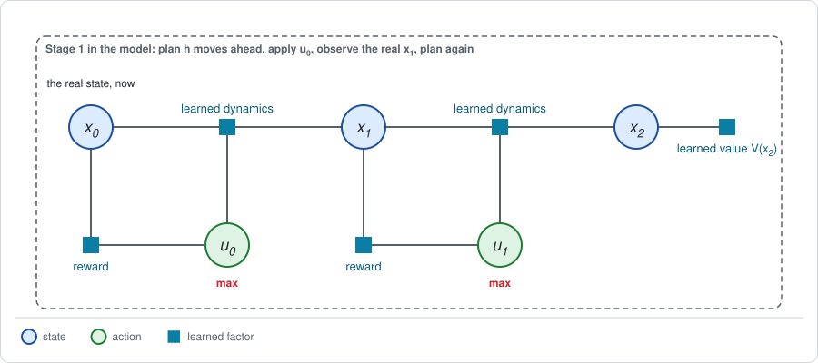
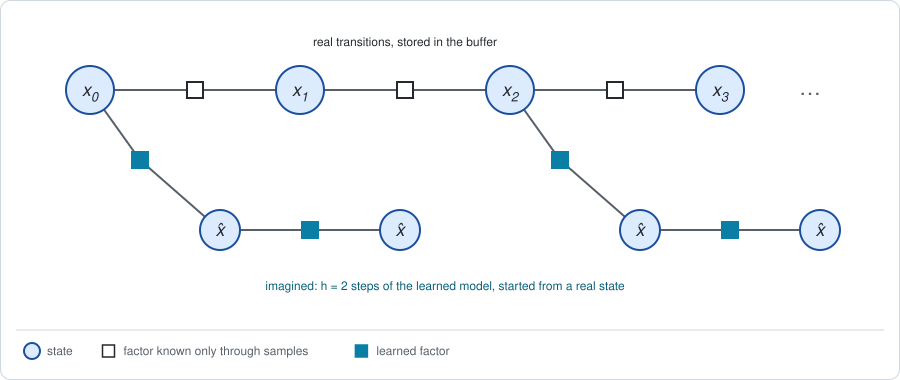

# Chapter 21: Planning in learned models

:::{div}
:class: in-progress
**This book is a work in progress.** It is still being written and revised: its content is incomplete and may contain errors.
:::

Chapters [18](chapter18.md) to [20](chapter20.md) learned small dynamics
factors: a linear model, a Gaussian process, a set of local linear models.
The model-based methods that scale to camera images and to robots with many
joints learn the factor as a neural network, and then run Stage 1 inside it.

This chapter is about what those methods share. It takes four well-known
systems, PETS, MBPO, Dreamer and TD-MPC2, and maps each onto the framework.
One of them, PETS, is small enough to run on the line. Dreamer and TD-MPC2
are described and mapped, **NOT** reimplemented. The short version:

- **Errors compound.** A learned factor is applied at every step, and the
  error of each step is the input of the next. The error of the forward
  message grows with the number of model steps, and the error of the return
  with the square of the horizon.
- **Three remedies recur.** Roll the model for a few steps only, starting
  from real states. Close the short chain with a learned value. Use an
  ensemble of models.
- **A planner exploits its model.** The plan that one model rates highest is
  rated too high. Averaging over an ensemble removes that optimism.
- **Stage 1 in the model takes three forms**: plan with it, generate data
  with it, or differentiate through it.

**Run the examples.** The code of this chapter's examples is in the companion
notebook [chapter21_examples.ipynb](chapter21_examples.ipynb), which runs
online:
[](https://colab.research.google.com/github/thduynguyen/gtsam/blob/feature/semiringfactor/gtsam/semiring/doc/chapter21_examples.ipynb)

## 1. The graph

The graph is the decision graph of [Chapter 4](chapter04.md), cut to a short
horizon, in which several factors are learned.



| Factor | Learned from | Its parameters |
|---|---|---|
| dynamics $\hat p(x' \mid x, u)$ | observed transitions, as in Chapter 18 | $\theta_p$ |
| reward $\hat r(x, u)$ | observed rewards, when the reward is not given as a formula | $\theta_r$ |
| value $V(x)$ at the end of the short chain | the bootstrapping of [Chapter 12](chapter12.md) | $\theta_V$ |

A hat marks a learned factor and everything computed with it: $\hat p$ is the
learned dynamics, $\hat d_t$ the forward message it predicts, $\hat J$ the
return it predicts.

Two of the four systems add one more learned piece. Dreamer and TD-MPC2 do
not use the robot's state as the variable $x$. They learn a function, an
*encoder*, from the observation (a camera image, joint readings) to a vector
of numbers, the *latent state*, and the chain of the figure is a chain of
latent states. The graph is the same; its variables are learned along with
its factors.

**The outer loop** is that of Chapter 18, Section 5: collect transitions with
the current behavior, refit the factors, run Stage 1 and Stage 2 in the
model, repeat.

## 2. The core problem: errors compound

**The answer first.** Let $D_p$ be the largest error of the learned dynamics
over one step. Then, for any fixed policy:

$$\underbrace{\sum_s \big\lvert \hat d_h(s) - d_h(s) \big\rvert \;\le\; h\, D_p}_{\text{forward message, after } h \text{ model steps}}
\qquad\qquad
\underbrace{\big\lvert \hat J - J \big\rvert \;\le\; \frac{\gamma}{(1 - \gamma)^2}\; r_{\max}\, D_p}_{\text{discounted return}}.$$

The error of the forward message can grow in proportion to the number of
steps the model is rolled. The error of the return can grow with the *square*
of the horizon $1 / (1 - \gamma)$.

**The one-step error.** For a discrete problem, measure the error of the
learned dynamics table by the largest total difference of a row:

$$D_p = \max_{s, a} \sum_{s'} \big\lvert \hat p(s' \mid s, a) - p(s' \mid s, a) \big\rvert.$$

**The forward message.** With the state-to-state table $P_\pi$ of Chapter 3,
Section 3, the forward message advances by
$d_{h+1}(s') = \sum_s d_h(s)\, P_\pi(s, s')$, and the model's by the same rule
with $\hat P_\pi$. Subtract the two, and add and subtract
$\sum_s d_h(s)\, \hat P_\pi(s, s')$:

$$\hat d_{h+1}(s') - d_{h+1}(s')
= \underbrace{\sum_s \big(\hat d_h(s) - d_h(s)\big)\, \hat P_\pi(s, s')}_{\text{the error so far, carried one step}}
\;+\; \underbrace{\sum_s d_h(s)\, \big(\hat P_\pi(s, s') - P_\pi(s, s')\big)}_{\text{the new error of this step}}.$$

Sum the absolute values over $s'$. The first term is at most the previous
error, because every row of $\hat P_\pi$ sums to one. The second is at most
$D_p$, because $d_h$ sums to one and every row differs by at most $D_p$. So
each step adds at most $D_p$ to the error, and after $h$ steps the error is
at most $h\, D_p$.

**The return.** By Chapter 3, Section 5, the return is the forward message
times the reward, summed over the steps:
$J = \sum_t \gamma^t \sum_s d_t(s)\, r_\pi(s)$. With no reward larger than
$r_{\max}$ in size,

$$\big\lvert \hat J - J \big\rvert
\le \sum_{t=0}^{\infty} \gamma^t\, r_{\max} \sum_s \big\lvert \hat d_t(s) - d_t(s) \big\rvert
\le r_{\max}\, D_p \sum_{t=0}^{\infty} t\, \gamma^t
= \frac{\gamma}{(1 - \gamma)^2}\; r_{\max}\, D_p.$$

One factor $1 / (1 - \gamma)$ counts the steps at which reward is collected,
and the other counts the steps over which the error has built up before each
of them.

*On the endless track of Chapter 3,* the notebook estimates the dynamics
table from 20 sampled transitions for every cell and move, which gives
$D_p = 0.5$, and evaluates the coin-flip policy exactly in both tables:

| discount $\gamma$ | horizon $1 / (1 - \gamma)$ | true $J$ | model $\hat J$ | error | bound |
|---|---|---|---|---|---|
| $0.5$ | 2 | $-0.532$ | $-0.495$ | $0.038$ | $2$ |
| $0.9$ | 10 | $0.438$ | $1.566$ | $1.127$ | $90$ |
| $0.99$ | 100 | $15.296$ | $32.060$ | $16.764$ | $9900$ |

The bound is a worst case and far from tight here. The trend is what
matters. The model is the same in all three rows; only the horizon changes.
From the first row to the second the horizon grows five times and the error
thirty times. From the second to the third the horizon grows ten times and
the error fifteen times.

*On the line,* take the model learned from 20 transitions in Chapter 18,
$\hat F = 1.081$ and $\hat B = 0.839$ where the truth is $1$ and $1$. Start at
$x_0 = 2$ and apply the same action $u = -0.2$ at every step. The true mean
position after $h$ steps is $2 - 0.2\, h$. The model's prediction is rolled
forward, each step feeding the next:

| model steps $h$ | 1 | 2 | 3 | 5 | 8 | 10 |
|---|---|---|---|---|---|---|
| true mean position | $1.80$ | $1.60$ | $1.40$ | $1.00$ | $0.40$ | $0.00$ |
| model's prediction | $1.993$ | $1.986$ | $1.979$ | $1.961$ | $1.930$ | $1.904$ |
| error | $0.193$ | $0.386$ | $0.579$ | $0.961$ | $1.530$ | $1.904$ |
| spread of an ensemble of 5 | $0.103$ | $0.210$ | $0.322$ | $0.563$ | $0.983$ | $1.318$ |

The error of one step is $(\hat F - 1) \cdot 2 + (\hat B - 1) \cdot (-0.2) = 0.193$,
small against the wheel slip. After ten steps it is $1.9$: the model predicts
that the robot has hardly moved, while in truth it has reached the origin.

The last row belongs to Section 4. An ensemble of five models, drawn from the
estimate and its covariance as in Chapter 18, Section 3, is rolled the same
way. The spread of its predictions grows with $h$ at the same rate as the
error. The ensemble does not know the error, but it knows how fast it could
be growing.

## 3. Stage 1 in a learned model

There are three ways to use a learned factor in Stage 1. The four systems
differ mainly in which they choose.

| Way | What is done in the model | The sum over the actions | Systems |
|---|---|---|---|
| **plan** | from the real current state, search for the best sequence of the next $h$ actions; apply the first; repeat at the next step | a sampled maximum or soft maximum ([Chapter 10](chapter10.md)) | PETS, TD-MPC2 |
| **generate data** | roll the policy for a few steps from real states; hand the imagined transitions to a model-free learner of Part III | whatever that learner uses | MBPO |
| **differentiate** | roll the policy for a few steps; take the derivative of the predicted return through the model, into the policy | average under the policy | Dreamer |

**Plan.** This is the receding horizon of Chapter 5, Section 6. No policy is
learned. The planner *is* the policy, and it does its work at decision time.
The forward message is a set of sampled action sequences with the states the
model predicts for them, and there is no backward message beyond the returns
of those samples.

**Generate data.** The model is used as a simulator, to multiply the data of
a model-free method. The messages are those of the model-free learner; the
model only supplies more transitions to compute them from.

**Differentiate.** A neural-network model is a differentiable function, so
the predicted return of a rollout is a differentiable function of the policy
parameters. PILCO ([Chapter 19](chapter19.md)) is of this kind: it took the
derivative of a closed-form return through a Gaussian-process model. With a
neural network there is no closed form, and sampled rollouts take the place
of moment matching.

### Two remedies for compounding error

Section 2 says that the error of a model rollout grows with its length. All
four systems therefore keep model rollouts short, and they deal with the rest
of the horizon in one of two ways.

**Start short rollouts from real states.** The transitions collected on the
real system are stored in a buffer ([Chapter 15](chapter15.md)). Their states
are samples of the *real* forward message at every step of an episode. A
model rollout of $h$ steps that starts from such a state carries the error of
$h$ model steps, however late in the episode that state occurred:

$$\text{error at step } t: \qquad
\underbrace{t\, D_p}_{\text{model rolled from the start}}
\quad\text{against}\quad
\underbrace{h\, D_p}_{\text{model rolled } h \text{ steps from a real state at step } t - h}.$$



On the line, predict the mean position at step 10 again, rolling the model
only for the last $h$ steps, from the real mean position at step $10 - h$:

| model steps $h$ | starts from the real position | error of the prediction at step 10 |
|---|---|---|
| 10 | $2.0$, at step 0 | $1.904$ |
| 3 | $0.6$, at step 7 | $0.212$ |
| 1 | $0.2$, at step 9 | $0.048$ |

**Close the short chain with a learned value.** A rollout of $h$ steps sees
only $h$ rewards. The rest of the return is summarized by a value factor at
its end, as in the figure of Section 1:

$$\hat J\big(x_0, u_0, \dots, u_{h-1}\big) = \sum_{t=0}^{h-1} \gamma^t\, \hat r(x_t, u_t) \;+\; \gamma^h\, V(x_h).$$

The value $V$ is a learned backward message (Chapters
[12](chapter12.md) and [13](chapter13.md)). It stands for the whole chain
beyond step $h$, so the model never has to be rolled there. The price is that
the plan is now only as good as that learned value.

## 4. The planner exploits the model

Section 2 concerned a fixed policy. Planning adds a second problem, and it
has nothing to do with the horizon.

**The mechanism.** The planner searches for the plan with the highest
predicted return. The prediction of each plan has an error, sometimes too
high, sometimes too low. The search prefers the plans whose error is on the
high side. So the predicted return of the *chosen* plan is biased upward,
even if the prediction of every single plan were unbiased:

$$\mathbb{E}\Big[\max_{\text{plan}} \hat J(\text{plan})\Big] \;\ge\; \max_{\text{plan}}\, \mathbb{E}\big[\hat J(\text{plan})\big].$$

This is the inequality of Chapter 4, Section 2, with the roles changed. There,
a maximum taken inside an average was optimistic about luck. Here, the
maximum is taken over plans and the average over the errors of the model:
the planner is optimistic about its model.

**On the line.** For each of 1000 independent data sets of $M$ transitions,
fit a model, plan in it, and record two numbers: the return that the model
promises for its own plan, and the return that the plan collects on the real
line. The best possible return is $J^* = -9.25$. The medians:

| $M$ | one model: promised | one model: true | ensemble: promised | ensemble: true |
|---|---|---|---|---|
| 6 | $-9.15$ | $-9.38$ | $-9.92$ | $-9.47$ |
| 10 | $-9.12$ | $-9.31$ | $-9.44$ | $-9.32$ |
| 20 | $-9.22$ | $-9.28$ | $-9.33$ | $-9.28$ |
| 50 | $-9.25$ | $-9.26$ | $-9.29$ | $-9.26$ |

Read the first two columns. With few data, a single model promises *more*
than is possible, $-9.15$ against a best of $-9.25$, and its plan delivers
less, $-9.38$. The promise is on the wrong side of the truth.

**An ensemble.** Fit $E = 5$ models, each to a different resampling of the
same transitions, and let the planner maximize the *average* of the returns
that the members predict:

$$\max_{\text{plan}}\; \frac{1}{E} \sum_{i=1}^{E} \hat J^{(i)}(\text{plan}).$$

A plan can no longer profit from the error of one member, because the other
members do not share it. Where the members disagree about the outcome of a
plan, their average treats the disagreement as spread, and a quadratic reward
penalizes spread, as in Chapter 19. The last two columns show the effect: the
ensemble's promise is now *below* what its plan delivers.

Two honest observations about this table.

- **On the line the ensemble does not find better plans.** Its true return is
  the same as that of the single model, or slightly worse with 6 transitions.
  Chapter 18, Section 4, explains why: for a linear system the plan of the
  single least-squares model is already near the best, with a loss that is
  quadratic in the model error. What the ensemble improves here is the
  *prediction*, which stops being optimistic.
- **With neural-network models the stakes are higher.** A network can be
  wildly wrong away from its data, and a planner will find those places. The
  disagreement of an ensemble is then the only signal of where they are. Both
  PETS and MBPO use ensembles for this reason.

## 5. Stage 2, and the four systems on the framework

Planning in a model needs no Stage 2: no policy is stored, and the model
itself is the only thing that learns. The other two ways of Section 3 keep a
policy, and update it with a Stage 2 from Parts II and III, fed by messages
computed in the model.

| | PETS | MBPO | Dreamer | TD-MPC2 |
|---|---|---|---|---|
| learned factors | dynamics: an ensemble of networks, each predicting a Gaussian | dynamics and reward: an ensemble of the same kind | an encoder from images; latent dynamics; reward; a value | an encoder; latent dynamics; reward; an action value; a policy |
| the variable $x$ | the robot's state | the robot's state | a learned latent state | a learned latent state |
| Stage 1 in the model | plan: CEM over action sequences, in a receding horizon | generate data: short rollouts from real states in the buffer | differentiate: imagined rollouts of the policy, in latent space | plan: a sampled soft maximum over action sequences in latent space, in a receding horizon |
| forward messages | particles, each rolled through a member of the ensemble | the buffer of real states, extended by a few model steps | particles in latent space, started from the latent states of real sequences | particles in latent space, some proposed by the learned policy |
| backward messages | none: the returns of the sampled sequences | a learned soft action value (the critic of [Chapter 17](chapter17.md)) | a learned value, trained on the imagined rollouts | a learned action value at the end of the short horizon |
| Stage 2 | none: the planner is the policy | the policy update of SAC ([Chapter 17](chapter17.md)) | the gradient of the predicted value, taken through the model into the policy | the policy is trained to maximize the learned action value; the planner acts |
| against compounding error | an ensemble; replanning at every step | rollouts of a few steps from real states; an ensemble | a short imagined horizon, closed by the learned value | a very short horizon, closed by the learned action value |

Three remarks on the table.

- **Dyna.** Using a learned model to generate data for a model-free learner
  is an old idea, Dyna (Sutton, 1991). MBPO is its modern form; its
  contribution is the analysis of how short the rollouts must be.
- **The latent state is a forward message.** Dreamer's encoder summarizes
  the images seen so far in one vector. A summary of past observations that
  suffices to predict the future is what [Chapter 22](chapter22.md) calls the
  belief. Dreamer and TD-MPC2 learn it.
- **TD-MPC2 learns its model for control, not for prediction.** It has no
  decoder that reconstructs observations. Its latent dynamics are trained so
  that predicted latent states, rewards and values are consistent with what
  was observed. The model is asked to be right about what matters for the
  return, and about nothing else.

## 6. An exact special case

Planning in the *true* model must return the best policy. For the line, with
linear models and quadratic rewards, the best first action of a plan is
linear in the position, $u = -K_t\, x$, and its gain has a closed form (the
notebook's `planner_gains`). With the true model $F = B = 1$ it gives

$$K_0 = 0.6, \qquad K_1 = 0.5, \qquad J = -9.25,$$

the Riccati gains and the best return of [Chapter 6](chapter06.md). The CEM
planner of the next section, run on the true model, applies the same gains to
three decimals. And the exact evaluation used for the track in Section 2
returns $J = 0.4385$ for the coin flip in the true table, the value of
Chapter 3. The notebook asserts all three.

## 7. Implementation: a small PETS on the line

PETS has three parts: an ensemble of learned models, a sampling planner, and
a receding horizon. On the line:

- **The ensemble.** Five linear models $(\hat F, \hat B)$, each fitted by
  least squares to a resampling, with replacement, of the same 10
  transitions.
- **The planner.** The cross-entropy method of Chapter 10: sample action
  sequences from a Gaussian, score each by the average of the returns that
  the members predict, refit the Gaussian to the best tenth, and repeat.
- **The receding horizon.** At the first move, plan two moves ahead and apply
  the first action. Observe the real next position. Plan the one remaining
  move from there.

```python
def cem(rng, positions, models, horizon, population=200, elites=20,
        iterations=6):
    """For each position, the first action of the best sampled plan."""
    count = len(positions)
    mean, std = np.zeros((count, horizon)), np.full((count, horizon), 2.0)
    for _ in range(iterations):
        plans = mean[:, None, :] + std[:, None, :] * rng.normal(
            size=(count, population, horizon))
        score = np.zeros((count, population))
        for F, B in np.atleast_2d(models):       # average over the members
            x = np.repeat(positions[:, None], population, axis=1)
            total = np.zeros((count, population))
            for t in range(horizon):
                total -= x ** 2 + plans[:, :, t] ** 2
                x = F * x + B * plans[:, :, t]    # one step of the model
            score += (total - x ** 2) / len(np.atleast_2d(models))
        best = np.argsort(-score, axis=1)[:, :elites]
        chosen = np.take_along_axis(plans, best[:, :, None], axis=1)
        mean, std = chosen.mean(axis=1), chosen.std(axis=1) + 1e-6
    return mean[:, 0]
```

The planner handles all episodes at once, one row per episode. On the real
line:

```python
x = 2.0 + rng.normal(size=episodes)               # real start positions
for t in range(2):
    u = cem(rng, x, models, horizon=2 - t)        # plan in the model
    total -= x ** 2 + u ** 2
    x = x + u + np.sqrt(0.5) * rng.normal(size=episodes)   # the real line
```

**The result,** for one seeded data set of 10 transitions:

| Planner's model | gains applied | true $J$, exact | true $J$, sampled with CEM |
|---|---|---|---|
| the true model | $0.600$, $0.500$ | $-9.250$ | $-9.121$ |
| one learned model | $0.585$, $0.500$ | $-9.253$ | $-9.123$ |
| ensemble of 5 | $0.574$, $0.495$ | $-9.259$ | $-9.128$ |

The column "exact" evaluates the planner's gains on the real line in closed
form. The column "sampled" is the average return of 10000 real episodes
controlled by CEM. Its level carries the sampling error of those episodes.
Its differences between rows do not, because all rows use the same random
numbers, and they match the differences of the exact column.

With 10 transitions, both learned planners are within $0.01$ of the best
return. This data set happens to give a good model; the table of Section 4
shows the spread over many data sets.

**What the real PETS adds.** Each member of its ensemble is a neural network
that predicts a mean and a variance for the next state, so the noise of the
dynamics is modelled as well as the uncertainty about them (Chapter 18,
Section 3). The planner propagates particles, each through one member, and
samples the noise. For the linear models of this example the noise adds the
same constant to the return of every plan, so rolling the means is enough.

## 8. What breaks

- **A model trained to predict is not a model trained to control.** The fit
  minimizes prediction error everywhere the data are. The planner cares about
  the few places where a prediction error changes which plan wins. The two
  objectives differ, and a better predictor is not always a better model for
  planning. TD-MPC2's training on rewards and values is one answer.
- **Planning costs at decision time.** PETS and TD-MPC2 run a sampling search
  at every control step. A policy network answers in one evaluation. Fast
  robots may not have the time to plan.
- **A learned value closes the chain, and brings its own errors.** The short
  horizon of Section 3 trades model error for the error of a bootstrapped
  value, with the convergence problems of Chapters [12](chapter12.md) and
  [15](chapter15.md).
- **The model goes stale.** As the policy improves it visits states the model
  has not seen. Every system retrains its model continually, inside the outer
  loop of Chapter 18.
- **An ensemble is a crude measure of what is not known.** Five networks that
  agree may all be wrong in the same way. The disagreement is a lower bound
  on the uncertainty about the dynamics, not a measurement of it.
- **A latent state need not hold what matters.** An encoder trained to
  reconstruct images spends its capacity on what fills the image, which may
  not be what determines the reward.
- **Where to collect data.** All four systems collect data with their current
  behavior plus noise. Whether to go where the model is unsure is the subject
  of [Chapter 24](chapter24.md).

## 9. Framework card

| | PETS | MBPO | Dreamer | TD-MPC2 |
|---|---|---|---|---|
| 1. Sum over the actions | maximum, sampled (CEM) | soft maximum (as SAC) | average under $\pi_\theta$ | soft maximum, sampled (MPPI) |
| 2. Dynamics factor | a learned model: an ensemble of networks | a learned model: an ensemble of networks | a learned model in a learned latent space | a learned model in a learned latent space |
| 3. Backward messages | none: returns of sampled action sequences over a short horizon | a learned critic, trained on real and imagined transitions | a learned critic, trained on imagined rollouts | a learned critic, closing a short horizon |
| 4. Forward messages | particles through the ensemble, from the real current state | a replay buffer of real states, extended by short model rollouts | particles in latent space, from the latent states of real sequences | particles in latent space, from the real current state |
| 5. Stage 2 update | none; receding horizon | gradient (the policy update of SAC) | gradient of the predicted value through the model | gradient on the learned critic, for a policy that guides the planner; receding horizon |

(chapter21-references)=
## 10. References

- K. Chua, R. Calandra, R. McAllister and S. Levine, "Deep reinforcement
  learning in a handful of trials using probabilistic dynamics models",
  *NeurIPS*, 2018. PETS.
- M. Janner, J. Fu, M. Zhang and S. Levine, "When to trust your model:
  model-based policy optimization", *NeurIPS*, 2019. MBPO, and how the
  rollout length should depend on the model error.
- D. Hafner, T. Lillicrap, J. Ba and M. Norouzi, "Dream to control: learning
  behaviors by latent imagination", *ICLR*, 2020. Dreamer.
- N. Hansen, X. Wang and H. Su, "Temporal difference learning for model
  predictive control", *ICML*, 2022; N. Hansen, H. Su and X. Wang, "TD-MPC2:
  scalable, robust world models for continuous control", *ICLR*, 2024.
- R. S. Sutton, "Dyna, an integrated architecture for learning, planning, and
  reacting", *SIGART Bulletin*, 1991. A learned model as a source of data for
  a model-free learner.
- M. Kearns and S. Singh, "Near-optimal reinforcement learning in polynomial
  time", *Machine Learning*, 2002. The bound on the error of the return in
  terms of the one-step error of the model.
- A. Nagabandi, G. Kahn, R. S. Fearing and S. Levine, "Neural network
  dynamics for model-based deep reinforcement learning with model-free
  fine-tuning", *ICRA*, 2018. Neural-network models with sampling-based
  planning in a receding horizon, on robots.

---

Previous: [Chapter 20: Guided policy search](chapter20.md).
Next: [Chapter 22: Partial observability](chapter22.md).
