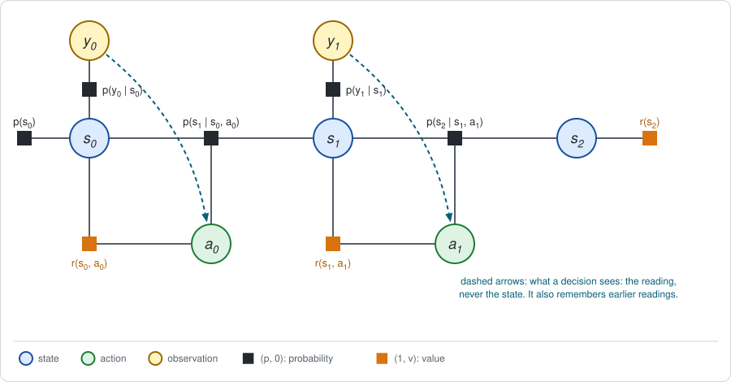
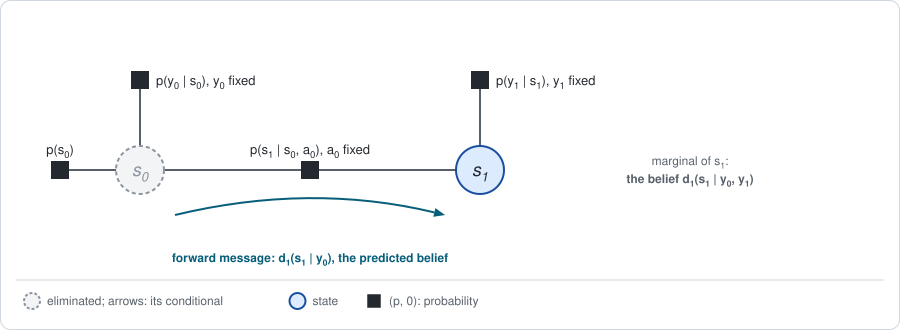

# Chapter 22: Partial observability

:::{div}
:class: in-progress
**This book is a work in progress.** It is still being written and revised: its content is incomplete and may contain errors.
:::

Every chapter so far let the agent see the state: the action $a_t$ was chosen
knowing $s_t$. A real robot does not see its state. It has sensors, and the
sensors are noisy. This chapter adds them to the graph and asks what is left
of the two-stage framework of [Chapter 5](chapter05.md).

A SLAM reader is at home with half of this chapter: estimating a hidden state
from noisy measurements is exactly what a factor graph is for. The other half
is new: *deciding* on the basis of that estimate.

The short version:

- **The sensor is one more factor**, $p(y_t \mid s_t)$, joining the hidden
  state to an observation. Problems of this kind are called *partially
  observable* MDPs, POMDPs.
- **The belief is a forward message.** What the agent knows about the state is
  the marginal of $s_t$ given the readings so far, computed by forward
  elimination. It is the filter of a hidden Markov model, and the Kalman
  filter in the Gaussian case.
- **The backward pass of Chapter 4 breaks.** A decision may depend only on
  the readings, so the state must be summed out *before* the maximum over the
  action. The buckets no longer separate, and the value becomes a function of
  the whole belief.
- **The linear-Gaussian case is the exception.** There the belief is a
  Gaussian, only its mean matters for the decision, and the forward and
  backward passes separate again. This is the separation principle.
- **What still maps onto the framework**: evaluating a fixed policy, and the
  policy gradient. **What does not**: the one-pass maximum, and any value
  function stored as a table over states.

**Run the examples.** The code of this chapter's examples is in the companion
notebook [chapter22_examples.ipynb](chapter22_examples.ipynb), which runs
online:
[](https://colab.research.google.com/github/thduynguyen/gtsam/blob/feature/semiringfactor/gtsam/semiring/doc/chapter22_examples.ipynb)

## 1. The graph: hidden states and sensor factors

**One new variable and one new factor.** At each step the agent receives an
*observation* $y_t$, also called a reading. It is produced from the state by
the **sensor factor**

$$p(y_t \mid s_t).$$

This is the measurement factor of SLAM. The decision graph of
[Chapter 4](chapter04.md) with sensors attached:



**What a decision may depend on.** The agent chooses $a_t$ knowing the
readings $y_0, \dots, y_t$ and its own earlier actions, and **NOT** the
states. Chapter 4, Section 1, stressed that what a decision may depend on is
part of the problem statement. Here that part has changed, and it is the only
thing that has changed.

**The example: the lost robot.** Take the track of Chapter 1, Section 7, with
its three cells, its two moves and its slippery dynamics, and change three
things so that knowing the cell matters.

- **Start.** The robot is in cell 0 or in cell 2, with probability 0.5 each.
  It does not know which: it may already be at the charger.
- **Rewards.** Moving Right costs 3 (it was 1). Moving Left is free, and the
  robot gets $+10$ if it is in cell 2 after the two moves, as before.
- **Sensor.** Before each move the robot reads its cell. The reading is
  correct with probability 0.7, and otherwise it is a neighbouring cell.

Sensor, $p(y \mid s)$:

| $s$ | $y = 0$ | $y = 1$ | $y = 2$ |
|---|---|---|---|
| cell 0 | 0.7 | 0.3 | 0 |
| cell 1 | 0.15 | 0.7 | 0.15 |
| cell 2 | 0 | 0.3 | 0.7 |

The order of events is: reading $y_0$, move $a_0$, reading $y_1$, move $a_1$,
final reward.

**The answer first.** Four agents on the same problem, with more and more
knowledge of the state:

| Agent | What its moves depend on | Expected return $J$ |
|---|---|---|
| blind | nothing | $2.2$ |
| QMDP (Section 5) | the readings, with a shortcut | $2.615$ |
| best use of the sensor (Section 4) | the readings | $2.69$ |
| fully observed (Chapter 4) | the cell itself | $3.2$ |

The sensor is worth $2.69 - 2.2 = 0.49$, and not seeing the cell exactly costs
$3.2 - 2.69 = 0.51$.

:::{dropdown} On the original track of Chapter 1, this sensor is worth nothing
On the track of Chapter 1 the best fully observed policy has $J^* = 6.1$
(Chapter 4), and moving Right twice without looking has $J = 6$. The two
differ in one situation only: in cell 0 at the last move, where Left saves
the cost 1 of a useless move.

With the sensor above, the best policy that uses the readings also has
$J = 6$: the sensor does not help at all. Left is the better last move only if
the belief over the cell, written $d^y$ for short, satisfies

$$\sum_s d^y(s)\, \big(Q^*_1(s, L) - Q^*_1(s, R)\big) = 1 \cdot d^y(0) - 7 \cdot d^y(1) - 7 \cdot d^y(2) > 0
\quad\Longleftrightarrow\quad d^y(0) > \tfrac{7}{8},$$

and after a first move Right no reading makes the belief in cell 0 exceed
$0.53$. A measurement has value only if it can change a decision. The lost
robot was designed so that it can.
:::

## 2. Stage 1, forward: the belief is a forward message

**The answer first.** Everything the agent knows about the state at step $t$
is the conditional distribution of $s_t$ given the readings so far. This book
writes it as the forward message of Chapter 3 with the readings added,

$$d_t(s \mid y_{0:t}) = p(s_t = s \mid y_0, \dots, y_t,\; a_0, \dots, a_{t-1}),$$

and the literature calls it the **belief**, usually written $b_t$. It is
computed forward in time, by two steps per move.

**Update: multiply by the sensor factor and normalize.** When the reading
$y_t$ arrives,

$$d_t(s \mid y_{0:t}) = \frac{p(y_t \mid s)\; d_t(s \mid y_{0:t-1})}
{\sum_{s''} p(y_t \mid s'')\; d_t(s'' \mid y_{0:t-1})}.$$

**Predict: push through the dynamics.** When the action $a_t$ is taken,

$$d_{t+1}(s' \mid y_{0:t}) = \sum_s d_t(s \mid y_{0:t})\; p(s' \mid s, a_t).$$

The recursion starts from the prior, $d_0(s \mid \text{nothing}) = p(s_0 = s)$.

**This is elimination.** The readings and the past actions are known, so
their variables are fixed, and each sensor factor becomes a table on its
state alone. What is left is a chain of states, and eliminating them forward
in time passes one message from each state to the next:



| Filtering | Elimination on the factor graph |
|---|---|
| predict | eliminate $s_t$: the new factor on $s_{t+1}$ is the forward message |
| update | multiply that message with the sensor factor of $s_{t+1}$ |
| the belief | the marginal of $s_{t+1}$, normalized |
| the probability of the readings | the constant left when the last state is eliminated |

For discrete states this is the forward algorithm of hidden Markov models.
For linear-Gaussian models it is the Kalman filter, as Chapter 6 shows. A
SLAM reader would call both *filtering*: a fixed-lag smoother with lag zero.

**On the lost robot.** The first reading:

| reading $y_0$ | its probability | belief over cells 0, 1, 2 |
|---|---|---|
| 0 | $0.35$ | $(1,\; 0,\; 0)$ |
| 1 | $0.30$ | $(0.5,\; 0,\; 0.5)$ |
| 2 | $0.35$ | $(0,\; 0,\; 1)$ |

A reading of 0 or 2 settles where the robot is, because the robot starts in
cell 0 or 2 and the sensor never confuses those two. A reading of 1 is an
error either way, and leaves the robot as uncertain as before.

Take that case, and suppose the robot moves Right. Predicting through the
dynamics gives the belief $(0.1,\; 0.4,\; 0.5)$. The second reading updates
it:

| reading $y_1$ | its probability | belief over cells 0, 1, 2 |
|---|---|---|
| 0 | $0.13$ | $(0.538,\; 0.462,\; 0)$ |
| 1 | $0.46$ | $(0.065,\; 0.609,\; 0.326)$ |
| 2 | $0.41$ | $(0,\; 0.146,\; 0.854)$ |

The notebook computes the same beliefs with the module, as the marginal of
$s_1$ in a `SemiringFactorGraph` of four probability factors.

:::{dropdown} Here the probability channel does real work
In Chapters 1 to 5 the probability channel of every new factor was 1, because
every probability factor was a normalized conditional and the graph was
eliminated backward in time. Chapter 1, Section 4, noted that this is a
property of those graphs, not of elimination.

A sensor factor with its reading fixed is not normalized over the state: it
is a likelihood. The factors that elimination produces then have probability
channels different from 1, and they carry the information that the readings
give about the state, exactly as in a SLAM graph. If reward factors are added,
the value channel at the root is the expected return *given the readings*:

$$\phi = \Big(p(y_{0:t}),\;\; \mathbb{E}[R \mid y_{0:t}]\Big).$$

The pair $(p, v)$ was built to keep the two apart, and partial observability
is where that matters.
:::

## 3. Why the backward pass no longer works

**The ordering rule.** Chapter 4, Section 2, gave the rule for mixing
averages and maxima: *a variable is eliminated before every decision that is
made without knowing it*.

With full observation, $s_t$ was known when $a_t$ was chosen, so the maximum
over $a_t$ came first, with $s_t$ still in the graph, and it was taken
separately for every value of $s_t$:

$$V^*_t(s) = \max_a Q^*_t(s, a) \qquad \text{one maximum per state.}$$

Now $s_t$ is **NOT** known when $a_t$ is chosen. By the rule, every state
must be summed out before the actions. For the two-move problem the order is
forced to be

$$J^* = \sum_{y_0} \max_{a_0} \sum_{y_1} \max_{a_1}\;
\underbrace{\sum_{s_0, s_1, s_2}
p(s_0)\, p(y_0 \mid s_0)\, p(s_1 \mid s_0, a_0)\, p(y_1 \mid s_1)\, p(s_2 \mid s_1, a_1)\; R(\tau)}_{\text{a table on } (y_0,\, a_0,\, y_1,\, a_1)}.$$

Read from the inside: first all states, then the last action, then the
reading before it, then the first action, then the first reading. Each
reading is eliminated after the action that follows it, because that action
is chosen knowing it.

**The cost.** The states were what kept the buckets small: in Chapter 4 each
bucket held one state, its action and its next state. Summing the states out
first joins everything they touched. The table under the brace has one entry
for every *history* of readings and actions, and its size grows exponentially
with the number of steps:

| | Fully observed (Chapter 4) | Partially observed |
|---|---|---|
| the maximum over $a_t$ is taken | once per state $s_t$ | once per history $(y_0, a_0, \dots, y_t)$ |
| the largest table | states $\times$ actions | all histories |
| for 3 cells, 2 actions, $T$ moves | 6 entries | $(3 \cdot 2)^T$ entries |

**The belief summarizes the history.** Two histories that lead to the same
belief are equivalent for everything that follows, because the future depends
on the past only through the state, and the belief is all that is known about
the state. So the value can be written as a function of the belief,
$V_t(d^y)$, where $d^y$ is short for the belief $d_t(\cdot \mid y_{0:t})$. It satisfies a Bellman
equation of its own:

$$V_t(d^y) = \max_a \Big[\sum_s d^y(s)\, r(s, a)
+ \sum_{y'} p(y' \mid d^y, a)\; V_{t+1}\big(d^y_{a, y'}\big)\Big].$$

Here $d^y_{a, y'}$ is the belief after taking $a$ and reading $y'$, by the two
steps of Section 2, and $p(y' \mid d^y, a)$ is the normalizer of the update.
This is an MDP whose *state is the belief*. It is exact, and it is hard for a
plain reason: the belief is a vector of probabilities, a continuous variable,
so $V_t$ is not a table.

## 4. The lost robot, solved exactly

With two moves the belief equation can be evaluated directly.

**The last move.** After the last move only the final reward remains, so the
action values $Q^*_1(s, a)$ of the fully observed problem are the right ones.
For the lost robot they are

| cell | $Q^*_1(s, L)$ | $Q^*_1(s, R)$ |
|---|---|---|
| 0 | $0$ | $-3$ |
| 1 | $0$ | $5$ |
| 2 | $2$ | $7$ |

The robot does not know $s$, so it averages them over its belief and takes
the better action:

$$V_1(d^y) = \max_a \sum_s d^y(s)\, Q^*_1(s, a).$$

Right is the better last move when

$$\sum_s d^y(s)\, \big(Q^*_1(s, R) - Q^*_1(s, L)\big) = -3\, d^y(0) + 5\, d^y(1) + 5\, d^y(2) > 0
\quad\Longleftrightarrow\quad d^y(0) < \tfrac{5}{8}.$$

One maximum is taken for the whole belief. The robot cannot move Right "in
cells 1 and 2" and Left "in cell 0": it does not know which applies.

**The first move.** For each first reading, each first move is worth its
expected reward now plus the average, over the second reading, of $V_1$ at
the belief that reading leads to:

| reading $y_0$ | belief | value of Left | value of Right | best first move |
|---|---|---|---|---|
| 0 | $(1,\; 0,\; 0)$ | $0$ | $0.4$ | Right |
| 1 | $(0.5,\; 0,\; 0.5)$ | $1.95$ | $2.2$ | Right |
| 2 | $(0,\; 0,\; 1)$ | $5.4$ | $4.0$ | Left |

Averaging over the first reading:

$$J = 0.35 \cdot 0.4 + 0.30 \cdot 2.2 + 0.35 \cdot 5.4 = 2.69.$$

In cell 2 the robot is at the charger with two moves to go. Holding position
against the wall costs 3 per move, so it is better to drift Left for free and
come back at the last move.

**The exact test.** The notebook checks this number by brute force. A
deterministic policy that sees only the readings is a table for the first
move, one entry per $y_0$, and a table for the last move, one entry per pair
$(y_0, y_1)$. There are $2^3 \cdot 2^9 = 4096$ such policies. Evaluating each
by summing over all states and readings, the best has $J = 2.69$.

Two more checks tie the chapter to Chapter 4. With the rewards and the start
of the original track, the fully observed pass gives $6.1$ and the blind
policy $6$, the numbers found there.

## 5. QMDP: a shortcut, and where it errs

Solving the belief equation is expensive. A popular shortcut reuses the
fully observed solution (Littman, Cassandra and Kaelbling, 1995).

**The method.** Compute $Q^*_t(s, a)$ by the backward pass of Chapter 4, as
if the state were visible. At run time, track the belief $d^y$ and take

$$a = \arg\max_a \sum_s d^y(s)\, Q^*_t(s, a).$$

In the terms of the framework: the backward message comes from the fully
observed graph, the forward message is the belief, and one maximum combines
them.

**What it assumes.** $Q^*_t(s, a)$ is the value of taking $a$ in $s$ and
acting optimally afterwards *with the state visible*. So QMDP assumes that
all uncertainty about the state disappears after the current move. It swaps a
sum and a maximum, and by the inequality of Chapter 4, Section 2, its values
are too high:

$$\sum_s d^y(s)\, Q^*_t(s, a) \;\ge\; \text{the true value of } a \text{ at belief } d^y.$$

At the last move there is nothing afterwards, so QMDP is exact there. At
earlier moves it can pick the wrong action.

**On the lost robot.** For the first move:

| reading $y_0$ | QMDP value of Left, Right | true value of Left, Right | QMDP picks | best |
|---|---|---|---|---|
| 0 | $0$, $1$ | $0$, $0.4$ | Right | Right |
| 1 | $2.7$, $2.5$ | $1.95$, $2.2$ | **Left** | Right |
| 2 | $5.4$, $4.0$ | $5.4$, $4.0$ | Left | Left |

When the reading is ambiguous, QMDP values Left at $2.7$, because it expects
to know after the move whether to go Right at the end. In truth the second
reading leaves doubt, and Left is worth only $1.95$. The expected return of
QMDP is $0.35 \cdot 0.4 + 0.30 \cdot 1.95 + 0.35 \cdot 5.4 = 2.615$, below the
$2.69$ of the best policy.

QMDP has a second, more serious blind spot. Since it assumes the state will
be revealed anyway, it never chooses an action *in order to* find out where
it is. Problems in which looking is an action are the subject of
[Chapter 24](chapter24.md).

## 6. The linear-Gaussian case: the separation principle

Chapter 6 treats the line of Chapter 1 with a noisy position sensor and shows
that the best policy is the Riccati gain applied to the Kalman estimate. In
the terms of this chapter that result says: **for linear-Gaussian problems
with quadratic rewards, QMDP is exact.**

**The problem.** The line of Chapter 1, Section 8, where the robot reads its
position before each move with Gaussian noise:

$$y_t = x_t + n_t, \qquad n_t \sim N(0, \Sigma_y), \qquad \Sigma_y = 0.5.$$

**The belief** is a Gaussian, $N(\hat x_t, \Sigma_{t \mid t})$, with a mean
$\hat x_t$ and a variance $\Sigma_{t \mid t}$ given by the Kalman filter.

**Why the two passes separate.** Two facts, each with a formula.

*Only the mean matters for the decision.* Chapter 6 writes the fully observed
action value as a quadratic that is largest at $u = -K_t x$,

$$Q_t(x, u) = V_t(x) - H_{uu}\, (u + K_t\, x)^2.$$

Averaging the last term over the belief uses
$\mathbb{E}[z^2] = \mu^2 + \sigma^2$ from Chapter 1:

$$\mathbb{E}\big[(u + K_t\, x)^2 \mid y_{0:t}\big]
= (u + K_t\, \hat x_t)^2 + K_t^2\, \Sigma_{t \mid t}.$$

The action appears only in the first term, so the best action is
$u = -K_t\, \hat x_t$: the fully observed gain applied to the mean of the
belief. The variance contributes a constant, a price for not knowing $x$.

*No action changes the variance.* In a linear-Gaussian model the variance of
the belief follows a recursion that does not involve the actions or the
readings:

$$\Sigma_{t \mid t} = \frac{\Sigma_{t \mid t-1}\, \Sigma_y}{\Sigma_{t \mid t-1} + \Sigma_y},
\qquad
\Sigma_{t+1 \mid t} = F\, \Sigma_{t \mid t}\, F^\top + \Sigma_w.$$

So no action can buy information, and the price above is the same for every
policy. This is the fact that fails in general, and in the lost robot.

**The result.** The expected return is the fully observed one minus the
prices of the two moves:

$$J = J^*_{\text{full}} - \sum_t H_{uu, t}\, K_t^2\, \Sigma_{t \mid t}.$$

*On the line,* with the Riccati gains $K_0 = 0.6$ and $K_1 = 0.5$ of the fully
observed problem, $H_{uu, 0} = 2.5$ and $H_{uu, 1} = 2$:

| step | variance of the belief $\Sigma_{t \mid t}$ | price $H_{uu, t}\, K_t^2\, \Sigma_{t \mid t}$ |
|---|---|---|
| 0 | $\frac{1 \cdot 0.5}{1 + 0.5} = 0.333$ | $2.5 \cdot 0.36 \cdot 0.333 = 0.300$ |
| 1 | $\frac{0.833 \cdot 0.5}{0.833 + 0.5} = 0.3125$ | $2 \cdot 0.25 \cdot 0.3125 = 0.156$ |

$$J = -9.25 - 0.456 = -9.706.$$

A simulation of 400,000 episodes with a fixed seed gives $-9.714 \pm 0.012$.

| | Lost robot | Line with a noisy sensor |
|---|---|---|
| the belief | a vector of probabilities | a Gaussian: mean and variance |
| what the best action depends on | the whole belief | the mean only |
| can an action change the uncertainty? | yes, through where it leads | no |
| QMDP | $2.615$, below the best $2.69$ | exact |

## 7. Implementation

The filter and the exact belief pass, from the notebook:

```python
def update(predicted, y):
    """One step of the filter: multiply by the sensor factor, normalize."""
    joint = predicted * sensor[:, y]
    total = joint.sum()
    return total, joint / total if total > 0 else joint

for y0 in range(3):
    p_y0, belief0 = update(prior, y0)                # belief after y0
    for a0 in [L, R]:
        total = belief0 @ move_reward[:, a0]         # expected reward now
        predicted = belief0 @ dynamics[:, a0, :]     # predict
        for y1 in range(3):
            p_y1, belief1 = update(predicted, y1)    # belief after y1
            total += p_y1 * (belief1 @ Q1).max()     # one max per belief
```

The belief with the module. The readings and the action are fixed, so every
factor is a table on states only:

```python
graph = SemiringFactorGraph()
graph.push_back(probability([state(0)], prior))
graph.push_back(probability([state(0)], sensor[:, y0]))          # y0 fixed
graph.push_back(probability([state(0), state(1)], dynamics[:, a0, :]))
graph.push_back(probability([state(1)], sensor[:, y1]))          # y1 fixed
marginal = graph.eliminateMultifrontal().marginalFactor(S(1))
belief = table(marginal.probability(), [state(1)])
belief / belief.sum()
```

## 8. What breaks, and what still maps

**What breaks.**

- **The one-pass maximum.** The table that the maximum is taken over has one
  entry per history. Exact solutions exist only for small problems. The
  value as a function of the belief is piecewise linear and convex
  (Smallwood and Sondik, 1973), and practical solvers approximate it at a set
  of sampled beliefs (Pineau, Gordon and Thrun, 2003).
- **Greedy improvement per state.** Policy iteration and Q-learning
  (Chapters 4 and 15) improve the policy separately in every state. With
  hidden states there is no "in every state": the improvement would have to
  be taken per belief.
- **A value table over states.** A critic $V(s)$ or $Q(s, a)$ is a function
  of something the agent cannot see. It can still be *learned* when the
  state is available during training, for example in a simulator, and used
  only to train a policy that sees the readings. Chapter 26 returns to this.
- **Acting to gain information.** In the lost robot no action changes the
  sensor. When an action does, such as looking before moving, shortcuts like
  QMDP fail entirely ([Chapter 24](chapter24.md)).

**What still maps onto the two stages.**

- **Evaluating a fixed policy.** If the policy is a given function of the
  readings, $\pi_\theta(a_t \mid y_{0:t})$, it is an ordinary probability
  factor, every variable is a chance node, and Stage 1 is the exact
  elimination of Chapter 1 on a larger graph. The brute-force check of
  Section 4 is that elimination, done 4096 times.
- **The policy gradient.** The derivation of Chapter 5, Section 3, used only
  the fact that the policy factors are the only factors that depend on
  $\theta$. That still holds, so the gradient is still the expected product
  of the score and the return. This is why sampling-based policy-gradient
  methods (Chapters 11 and 14) are the usual choice for robots with partial
  observations: they never need the maximum.
- **A learned belief.** A policy cannot take the whole history as input. In
  practice it takes a fixed-size summary: the last few readings, or the state
  of a recurrent network updated at every step. Such a network is a *learned
  forward message*: it plays the role of the filter of Section 2 without
  being one. Chapter 21 meets it as the latent state of a learned model.

## 9. Framework card

| | Exact belief pass | QMDP | LQG |
|---|---|---|---|
| 1. Sum over the actions | maximum, one per belief | maximum, one per belief | maximum, solved in closed form |
| 2. Dynamics factor | closed form (tables), plus a sensor factor | the same | closed form (linear-Gaussian), plus a sensor factor |
| 3. Backward messages | exact, as a function of the belief; exponential in the horizon | exact for the *fully observed* problem | exact: a quadratic (the Riccati recursion) |
| 4. Forward messages | the belief $d_t(s \mid y_{0:t})$, by exact filtering | the same | the belief, by the Kalman filter |
| 5. Stage 2 update | none: the policy is read from the conditionals, per belief | none | none |

(chapter22-references)=
## 10. References

- K. J. Åström, "Optimal control of Markov processes with incomplete state
  information", *Journal of Mathematical Analysis and Applications*, 1965.
  The belief as a sufficient statistic.
- R. D. Smallwood and E. J. Sondik, "The optimal control of partially
  observable Markov processes over a finite horizon", *Operations Research*,
  1973. The value as a piecewise linear, convex function of the belief.
- L. P. Kaelbling, M. L. Littman and A. R. Cassandra, "Planning and acting in
  partially observable stochastic domains", *Artificial Intelligence*, 1998.
  The standard introduction to POMDPs.
- M. L. Littman, A. R. Cassandra and L. P. Kaelbling, "Learning policies for
  partially observable environments: scaling up", *ICML*, 1995. QMDP.
- J. Pineau, G. Gordon and S. Thrun, "Point-based value iteration: an anytime
  algorithm for POMDPs", *IJCAI*, 2003.
- L. R. Rabiner, "A tutorial on hidden Markov models and selected
  applications in speech recognition", *Proceedings of the IEEE*, 1989. The
  forward algorithm.
- R. E. Kalman, "A new approach to linear filtering and prediction problems",
  *Journal of Basic Engineering*, 1960.
- W. M. Wonham, "On the separation theorem of stochastic control", *SIAM
  Journal on Control*, 1968.
- S. Thrun, W. Burgard and D. Fox, *Probabilistic Robotics*, MIT Press, 2005.
  Filtering, and POMDPs for robots.

---

Previous: [Chapter 21: Planning in learned models](chapter21.md).
Next: [Chapter 23: Inverse problems](chapter23.md).
