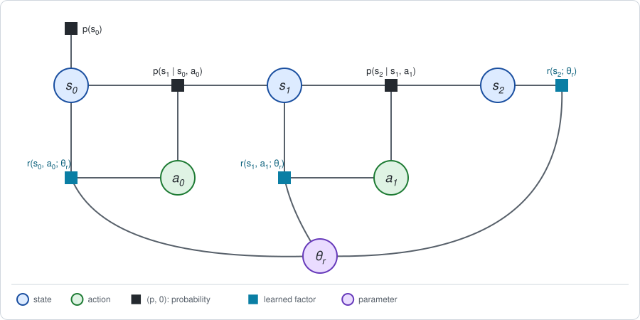
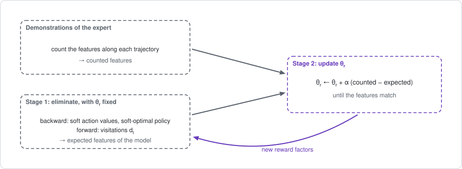

# Chapter 23: Inverse problems

In every chapter so far the rewards were given and the policy was the
unknown. This chapter turns the problem around. The **behavior** is given, as
a set of recorded trajectories of an expert, and the **rewards** are the
unknown: which reward factors would make an agent act like this?

This is called *inverse reinforcement learning* (IRL), or inverse optimal
control. For a SLAM reader it is the most familiar problem in the book:
learning the parameters of the factors of a graph from data.

Unlike the other chapters of this part, this one maps onto the two-stage
framework of [Chapter 5](chapter05.md) without strain. Only the roles change:
the parameter that Stage 2 updates belongs to the reward factors instead of
the policy factors. The short version:

- **The reward factors get parameters** $\theta_r$, and the policy factors
  disappear from the graph.
- **The expert is modeled as soft-optimal**: at each action it takes the soft
  maximum of [Chapter 2](chapter02.md), and at each state the average. This
  is the method of *maximum entropy* (Ziebart et al., 2008).
- **Stage 1** is one soft backward pass and one forward pass, with
  $\theta_r$ fixed.
- **Stage 2** is a gradient step, and the gradient is a difference: what the
  expert did, counted, minus what the model expects to do.
- **The answer is not unique.** Different rewards produce the same behavior,
  and no amount of data can tell them apart.

**Run the examples.** The code of this chapter's examples is in the companion
notebook [chapter23_examples.ipynb](chapter23_examples.ipynb), which runs
online:
[](https://colab.research.google.com/github/thduynguyen/gtsam/blob/feature/semiringfactor/gtsam/semiring/doc/chapter23_examples.ipynb)

## 1. The graph: reward factors with parameters

**The data.** An expert robot is watched on the track of Chapter 1,
Section 7. Each recording is one trajectory: the cells it was in and the
moves it made, $\tau^{(i)} = (s_0, a_0, s_1, a_1, s_2)$, for $i = 1, \dots, M$.
The rewards the expert was working for are **NOT** recorded.

**The unknown.** The dynamics of the track are known. The reward tables are
not. Give them parameters:

$$r(s, a;\, \theta_r) = \begin{cases} \theta_R & a = R \\ 0 & a = L \end{cases},
\qquad
r(s_2;\, \theta_r) = \theta_{s_2},
\qquad
\theta_r = (\theta_R,\; \theta_0,\; \theta_1,\; \theta_2).$$

$\theta_R$ is the reward of a move Right, and $\theta_0, \theta_1, \theta_2$
are the final rewards of the three cells. The expert's true parameters are
those of Chapter 1: $\theta_r = (-1,\; 0,\; 0,\; 10)$.



The policy factors are absent, as in [Chapter 4](chapter04.md): the policy
will come out of the elimination. The reward factors are drawn as learned
factors, and one parameter node joins them all.

**Features.** With this choice the return of a trajectory is linear in the
parameters. Collect what the parameters multiply into a vector of *features*
of the trajectory,

$$\chi(\tau) = \big(\text{number of moves Right},\;\; \mathbf{1}[s_2 = 0],\;\; \mathbf{1}[s_2 = 1],\;\; \mathbf{1}[s_2 = 2]\big),
\qquad
R(\tau) = \theta_r^\top\, \chi(\tau).$$

For example, the trajectory that starts in cell 1 and moves Right twice into
cell 2 has $\chi = (2, 0, 0, 1)$ and, with the true parameters,
$R = -2 + 10 = 8$.

**A model of the expert is needed.** Rewards alone do not say how likely a
recorded move is. Assuming a perfectly optimal expert does not work: every
move that deviates from the best one would have probability zero, and the
reward "zero everywhere" would explain any behavior, since under it every
policy is optimal. The maximum-entropy approach assumes instead that the
expert is **soft-optimal**: it prefers better actions, and how strongly is set
by a temperature $\eta$.

**The answer first.** From the expert's exact behavior, the method of this
chapter recovers

$$\theta_r = (-1,\;\; -3.33,\;\; -3.33,\;\; 6.67),
\qquad \text{against the true} \quad (-1,\;\; 0,\;\; 0,\;\; 10).$$

The cost of a move is exact. The final rewards are exact *up to a constant*:
cell 2 is worth 10 more than the other two cells, as it should be. The
constant cannot be recovered, by anyone, as Section 4 shows.

## 2. Stage 1: the model of the expert, by soft elimination

Fix the reward parameters $\theta_r$. Stage 1 computes how a soft-optimal
agent with these rewards behaves.

### Backward: soft values and the policy

Eliminate backward in time. The next state is eliminated by average, because
the expert does not choose how the dynamics turn out. The action is
eliminated by the **soft maximum** of Chapter 2, Section 2, with the coin
flip $\pi_0(a \mid s) = 0.5$ as the base policy:

$$Q_t(s, a) = r(s, a;\, \theta_r) + \sum_{s'} p(s' \mid s, a)\, V_{t+1}(s'),
\qquad
V_t(s) = \eta \log \sum_a \pi_0(a \mid s)\, e^{Q_t(s, a) / \eta}.$$

The recursion starts from the final reward, $V_2(s) = r(s;\, \theta_r)$.

The model of the expert's policy is the conditional that this elimination
leaves on the action, in its tilted form (Chapter 2, Section 5):

$$\pi_{\theta_r, t}(a \mid s) = \pi_0(a \mid s)\; e^{\left(Q_t(s, a) - V_t(s)\right) / \eta}.$$

It is a normalized distribution over the actions, by the normalization
invariant of Chapter 2. Actions with a higher value are more probable. As
$\eta \to 0$ it puts all its weight on the best action, and as
$\eta \to \infty$ it becomes the coin flip.

*The expert.* The demonstrations of this chapter come from this model with
the true rewards and $\eta = 3$:

| cell | $\pi(R \mid s)$ at the first move | $\pi(R \mid s)$ at the last move |
|---|---|---|
| 0 | $0.764$ | $0.417$ |
| 1 | $0.847$ | $0.912$ |
| 2 | $0.550$ | $0.912$ |

It mostly moves Right, except in cell 0 at the last move, where the charger
is out of reach. Compare with the best policy of Chapter 4, which makes the
same choices with probability one.

### Forward: expected features

The forward messages of Chapter 3, Section 5, give the probability of every
state and action under the model:

$$d_0(s) = p(s_0 = s), \qquad
d_{t+1}(s') = \sum_{s, a} d_t(s)\; \pi_{\theta_r, t}(a \mid s)\; p(s' \mid s, a).$$

From them, the **expected features** of the model:

$$\mathbb{E}_{\theta_r}[\chi] = \Big(\sum_t \sum_s d_t(s)\, \pi_{\theta_r, t}(R \mid s),\;\;
d_2(0),\;\; d_2(1),\;\; d_2(2)\Big).$$

For the expert, $\mathbb{E}[\chi] = (1.591,\; 0.199,\; 0.190,\; 0.611)$: it
moves Right $1.59$ times per episode on average and ends at the charger in
$61\%$ of the episodes.

## 3. Stage 2: the gradient is a difference of features

**What is maximized.** The parameters are fitted by maximum likelihood: find
the $\theta_r$ under which the model gives the highest probability to the
recorded choices. Per demonstration, the log-likelihood is

$$\mathcal{L}(\theta_r) = \frac{1}{M} \sum_{i=1}^{M} \sum_t \log \pi_{\theta_r, t}\big(a_t^{(i)} \mid s_t^{(i)}\big).$$

Only the policy appears. The dynamics factors also contribute to the
probability of a trajectory, but they do not depend on $\theta_r$.

**The answer first.** Its gradient is

$$\nabla_{\theta_r} \mathcal{L} = \frac{1}{\eta}\, \Big(\hat\chi - \mathbb{E}_{\theta_r}[\chi]\Big),
\qquad
\hat\chi = \frac{1}{M} \sum_{i=1}^{M} \chi\big(\tau^{(i)}\big).$$

$\hat\chi$ is the average of the features *counted* in the demonstrations.
$\mathbb{E}_{\theta_r}[\chi]$ is what the model *expects*, from Stage 1.

In words: if the expert moves Right more often than the model does, raise the
reward of moving Right. If the expert ends in cell 2 more often than the
model does, raise the final reward of cell 2. Stop when the model does
everything as often as the expert.



:::{dropdown} Derivation of the gradient
Write $\bar\chi_t(s, a)$ for the features the model expects to collect from
step $t$ on, given $s_t = s$ and $a_t = a$, and $\bar\chi_t(s)$ for the same
given only $s_t = s$.

*Step 1: the gradient of the soft values.* The gradient of the soft maximum
is the average under the tilted policy:

$$\nabla V_t(s) = \frac{\sum_a \pi_0(a \mid s)\, e^{Q_t / \eta}\; \nabla Q_t(s, a)}{\sum_a \pi_0(a \mid s)\, e^{Q_t / \eta}}
= \sum_a \pi_{\theta_r, t}(a \mid s)\; \nabla Q_t(s, a).$$

And $Q_t$ is a reward, which is linear in $\theta_r$, plus an average of
$V_{t+1}$. So the gradients satisfy the Bellman backup of Chapter 1 with the
features in the place of the rewards, and the model's policy in the place of
the given one:

$$\nabla Q_t(s, a) = \bar\chi_t(s, a), \qquad \nabla V_t(s) = \bar\chi_t(s).$$

*Step 2: the gradient of one log-probability.* From
$\log \pi_{\theta_r, t} = \log \pi_0 + (Q_t - V_t) / \eta$,

$$\nabla \log \pi_{\theta_r, t}(a \mid s) = \frac{1}{\eta}\, \big(\bar\chi_t(s, a) - \bar\chi_t(s)\big).$$

*Step 3: add along a demonstration.* By the Bellman backup,
$\bar\chi_t(s_t, a_t)$ is the feature of step $t$ plus the average of
$\bar\chi_{t+1}(s_{t+1})$ over the next state. The demonstrations were
produced with the same dynamics, so on average over the demonstrations the
average over the next state can be replaced by the next state that occurred.
The sum over $t$ then telescopes:

$$\sum_t \big(\bar\chi_t(s_t, a_t) - \bar\chi_t(s_t)\big)
\;\;\longrightarrow\;\;
\underbrace{\sum_t \chi_t}_{\text{features counted}} \;-\; \underbrace{\bar\chi_0(s_0)}_{\text{features expected from the start}}.$$

Averaging over the demonstrations, the first term is $\hat\chi$ and the
second is $\mathbb{E}_{\theta_r}[\chi]$.
:::

**The same identity as in factor-graph learning.** Chapter 5, Section 3,
noted that the derivative of a log-normalizer with respect to a factor
parameter is an expectation of a local quantity under a marginal. Maximum
likelihood then sets *counted statistics equal to expected statistics*. That
is what happens here, with the marginals $d_t(s)\, \pi_{\theta_r, t}(a \mid s)$
supplied by one backward and one forward pass.

**A check.** At an arbitrary $\theta_r = (0.5,\; 1,\; -1,\; 2)$, the formula
and finite differences of $\mathcal{L}$ both give
$(0.147,\; -0.064,\; -0.023,\; 0.087)$.

**The update** is gradient ascent, with a step size $\alpha$ that absorbs
the factor $1 / \eta$:

$$\theta_r \leftarrow \theta_r + \alpha\, \big(\hat\chi - \mathbb{E}_{\theta_r}[\chi]\big).$$

*On the track,* using the expert's exact expected features as $\hat\chi$ (the
limit of infinitely many demonstrations) and starting from $\theta_r = 0$:

| | start, $\theta_r = 0$ | after the ascent | expert |
|---|---|---|---|
| log-likelihood $\mathcal{L}$ | $-1.386$ | $-0.884$ | $-0.884$ |
| expected moves Right | $1$ | $1.591$ | $1.591$ |
| $d_2(0)$, $d_2(1)$, $d_2(2)$ | | $0.199$, $0.190$, $0.611$ | $0.199$, $0.190$, $0.611$ |
| $\pi(R \mid s)$ at the first move | $0.5$, $0.5$, $0.5$ | $0.764$, $0.847$, $0.550$ | $0.764$, $0.847$, $0.550$ |
| $\pi(R \mid s)$ at the last move | $0.5$, $0.5$, $0.5$ | $0.417$, $0.912$, $0.912$ | $0.417$, $0.912$, $0.912$ |

With zero rewards the model is the coin flip, and $\mathcal{L} = 2 \log 0.5 = -1.386$.
After the ascent the features match, the policy is the expert's policy at
both moves, and the log-likelihood has reached the value the expert's own
policy has.

## 4. Exact tests, and what is identified

**Tests.** The notebook checks three exact facts.

| Fact | Check |
|---|---|
| the gradient formula | equal to finite differences of $\mathcal{L}$ |
| at the true $\theta_r$ the model is the expert | the gradient is zero there |
| the fitted model reproduces the expert | features and policies agree to 6 digits |

**The rewards are recovered up to a constant.**

| | $\theta_R$ | $\theta_0$ | $\theta_1$ | $\theta_2$ |
|---|---|---|---|---|
| true | $-1$ | $0$ | $0$ | $10$ |
| recovered | $-1.000$ | $-3.333$ | $-3.333$ | $6.667$ |
| recovered minus true | $0$ | $-3.333$ | $-3.333$ | $-3.333$ |

Exactly one of the three final indicators is 1 on every trajectory, so their
sum is the same for the expert and for any model:

$$\hat\chi_0 + \hat\chi_1 + \hat\chi_2 = 1 = d_2(0) + d_2(1) + d_2(2).$$

The gradient therefore has no component along $(0, 1, 1, 1)$. Adding a
constant to all final rewards changes no decision, the data cannot reveal it,
and the ascent leaves that direction where it started, at
$\theta_0 + \theta_1 + \theta_2 = 0$.

**Shaping: a larger family of equivalent rewards.** The constant is the
simplest case of a general fact (Ng, Harada and Russell, 1999). Take any
function $\Phi(s)$ of the state, and change the rewards to

$$r'(s, a) = r(s, a) + \sum_{s'} p(s' \mid s, a)\, \Phi(s') - \Phi(s),
\qquad
r'(s_T) = r(s_T) - \Phi(s_T).$$

Every action value then shifts by an amount that does not depend on the
action, $Q'_t(s, a) = Q_t(s, a) - \Phi(s)$, so the policy is unchanged. The
notebook verifies it for $\Phi = (3, -2, 5)$: the soft-optimal policy of the
shaped rewards equals the expert's at both moves.

**What the data do identify.** The policy model of Section 2 can be read
backward:

$$\eta\, \log \frac{\pi_t(a \mid s)}{\pi_0(a \mid s)} = Q_t(s, a) - V_t(s).$$

Demonstrations identify the right-hand side, the *soft advantage*: the value
channel of the conditional on the action. They do not identify the reward
factors that produced it. In the terms of Chapter 2, behavior reveals the
**conditionals** of the eliminated graph, and many sets of factors eliminate
to the same conditionals.

## 5. A finite number of demonstrations

With a finite set of recordings the counted features are noisy, and so are
the recovered rewards. From 500 demonstrations sampled with a fixed seed:

| | moves Right | $d_2(0)$ | $d_2(1)$ | $d_2(2)$ |
|---|---|---|---|---|
| expected, expert | $1.591$ | $0.199$ | $0.190$ | $0.611$ |
| counted, 500 demonstrations | $1.552$ | $0.216$ | $0.182$ | $0.602$ |

| | $\theta_R$ | $\theta_1 - \theta_0$ | $\theta_2 - \theta_0$ | $\pi(R \mid s)$ at the last move |
|---|---|---|---|---|
| true | $-1$ | $0$ | $10$ | $0.417$, $0.912$, $0.912$ |
| from 500 demonstrations | $-2.38$ | $0.89$ | $12.57$ | $0.364$, $0.928$, $0.911$ |

The counted features are within a few percent of the expected ones, and the
fitted policy is close to the expert's. The fitted *rewards* are much further
off: the cost of a move is estimated at $2.38$ in place of $1$. A reward is a
sensitive function of the behavior it explains. This is the usual situation
in IRL: the learned reward should be trusted for the behavior it produces,
not for its numbers.

## 6. Keeping the dynamics fixed

Section 2 took the soft maximum at the actions and the plain average at the
states. The first maximum-entropy formulation (Ziebart et al., 2008) was
stated differently: the probability of a trajectory is proportional to
$e^{R(\tau) / \eta}$. For deterministic dynamics the two agree. For stochastic
dynamics, weighting whole trajectories by $e^{R / \eta}$ applies the tilt to
the **states** as well, which is the optimism that Chapters 2 and 8 warn
about: the model then believes the expert can count on lucky outcomes.

*On the track,* take the move Left from the charger at the last move. It
leaves the charger with probability 0.8 and stays, by slipping, with
probability 0.2:

| How the next state is eliminated | Value of moving Left from the charger |
|---|---|
| by average (this chapter) | $0.8 \cdot 0 + 0.2 \cdot 10 = 2$ |
| by soft maximum, $\eta = 3$ | $3 \log\big(0.8\, e^{0} + 0.2\, e^{10/3}\big) = 5.57$ |

A model that values this move at $5.57$ would need different rewards to
explain why the expert so rarely makes it. The formulation that keeps the
dynamics fixed, and tilts only what the agent controls, is the principle of
maximum *causal* entropy (Ziebart, Bagnell and Dey, 2010). It is the one used
here.

## 7. Implementation

The two passes of Stage 1 and the update of Stage 2, from the notebook:

```python
def backward(theta):
    """Soft action values and the soft-optimal policy of each move."""
    move_reward, V = rewards(theta)          # the reward tables, V_2 = r(s2)
    policies = {}
    for t in [1, 0]:
        Q = move_reward + dynamics @ V       # average over the next state
        V = eta * np.log((base_policy * np.exp(Q / eta)).sum(axis=1))
        policies[t] = base_policy * np.exp((Q - V[:, None]) / eta)
    return policies

def features(policies):
    """Expected features: [number of moves Right, last cell is 0, 1, 2]."""
    d, moves_right = prior, 0.0
    for t in range(2):
        pairs = d[:, None] * policies[t]     # d_t(s) pi_t(a | s)
        moves_right += pairs[:, R].sum()
        d = np.einsum("sa,sat->t", pairs, dynamics)
    return np.concatenate([[moves_right], d])

theta = np.zeros(4)
for k in range(20000):
    theta = theta + 2.0 * (counted - features(backward(theta)))
```

The backward pass is the elimination routine of Chapter 2 with the tilted
semiring at the actions and the expectation semiring at the states. The
module implements the expectation semiring only, so this chapter runs in
numpy.

## 8. What breaks

- **Every gradient step solves a control problem.** Stage 1 is a full
  backward and forward pass for the current rewards. On the track that is a
  few table operations. For a robot it is a reinforcement-learning problem in
  the inner loop. Practical methods replace the exact passes by samples
  (Finn, Levine and Abbeel, 2016) or learn a classifier that tells the
  expert's trajectories from the model's (Ho and Ermon, 2016; Fu, Luo and
  Levine, 2018).
- **The reward is not unique.** Section 4 showed two families of equivalent
  rewards. A reward learned in one environment may therefore produce the
  wrong behavior in another: shaping terms that cancel under one set of
  dynamics do not cancel under different dynamics.
- **The expert may not fit the model.** The method assumes a soft-optimal
  expert with a known temperature and known dynamics. A systematic habit of
  the expert that the features cannot express is explained away by distorted
  rewards.
- **The features must be chosen.** The reward was linear in four hand-picked
  features. With a neural network as the reward the gradient keeps its form,
  counted minus expected, with the derivative of the network in the place of
  the features; the ambiguity grows with the number of parameters.

## 9. Framework card

| | Maximum (causal) entropy IRL |
|---|---|
| 1. Sum over the actions | soft maximum, with temperature $\eta$ |
| 2. Dynamics factor | closed form (tables), kept fixed |
| 3. Backward messages | exact: soft $Q_t$ and $V_t$ |
| 4. Forward messages | exact: $d_t$, for the expected features |
| 5. Stage 2 update | gradient on the parameters $\theta_r$ of the reward factors: counted minus expected features |

The policy has no parameters of its own here: it is read from the
conditionals, as in Chapter 4.

(chapter23-references)=
## 10. References

- R. E. Kalman, "When is a linear control system optimal?", *Journal of Basic
  Engineering*, 1964. The inverse problem of optimal control.
- A. Y. Ng and S. Russell, "Algorithms for inverse reinforcement learning",
  *ICML*, 2000.
- P. Abbeel and A. Y. Ng, "Apprenticeship learning via inverse reinforcement
  learning", *ICML*, 2004. Matching feature expectations.
- B. D. Ziebart, A. Maas, J. A. Bagnell and A. K. Dey, "Maximum entropy
  inverse reinforcement learning", *AAAI*, 2008.
- B. D. Ziebart, J. A. Bagnell and A. K. Dey, "Modeling interaction via the
  principle of maximum causal entropy", *ICML*, 2010. The formulation with
  the dynamics kept fixed.
- A. Y. Ng, D. Harada and S. Russell, "Policy invariance under reward
  transformations: theory and application to reward shaping", *ICML*, 1999.
- C. Finn, S. Levine and P. Abbeel, "Guided cost learning: deep inverse
  optimal control via policy optimization", *ICML*, 2016.
- J. Ho and S. Ermon, "Generative adversarial imitation learning", *NeurIPS*,
  2016.
- J. Fu, K. Luo and S. Levine, "Learning robust rewards with adversarial
  inverse reinforcement learning", *ICLR*, 2018.

---

Previous: [Chapter 22: Partial observability](chapter22.md).
Next: [Chapter 24: Exploration and dual control](chapter24.md).
