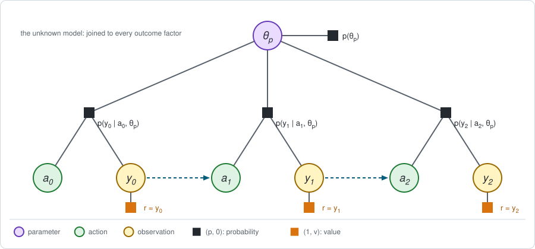
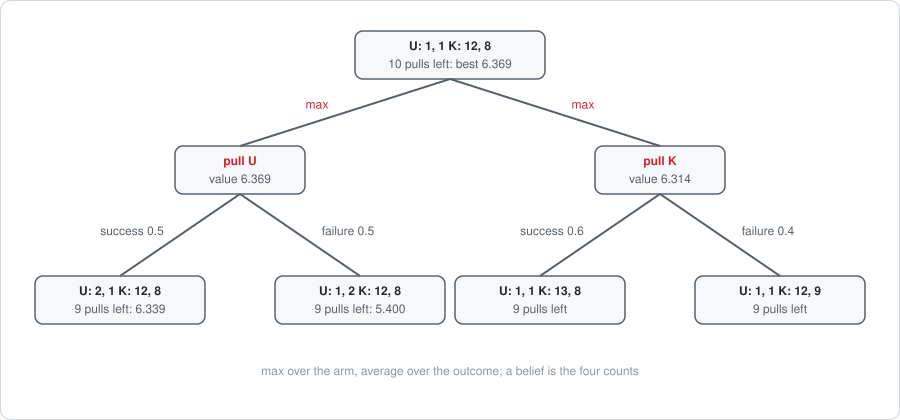

# Chapter 24: Exploration and dual control

Part III of this book estimates messages from samples, and Part IV learns the
dynamics factor from data. Both take for granted that the samples are there.
This chapter is about the question they skip: **which samples to collect.**

An agent that does not know its model has to try things to find out. But
trying an action it knows little about costs reward now, and what it learns
pays off only later. Balancing the two is called the trade-off between
*exploration* and *exploitation*, and in control theory *dual control*.

This is the chapter of the book where the framework strains most. The short
version:

- **An unknown model is a hidden variable** joined to every dynamics factor.
  By the ordering rule of [Chapter 4](chapter04.md) it must be eliminated
  first, and that couples all time steps.
- **The exact solution is still an elimination**, on a graph whose state is
  the agent's *belief about the model*. For the smallest example it can be
  carried out, and this chapter does so.
- **In general that graph is exponentially large.** Exploring well is then
  not one more elimination on the graph of [Chapter 5](chapter05.md): it is a
  different, much larger problem.
- **Practical exploration methods are heuristics** for that larger problem.
  Each changes one factor of the ordinary graph and leaves the rest of the
  two-stage machinery alone. Each can be *evaluated* exactly by elimination,
  and none is optimal.

**Run the examples.** The code of this chapter's examples is in the companion
notebook [chapter24_examples.ipynb](chapter24_examples.ipynb), which runs
online:
[](https://colab.research.google.com/github/thduynguyen/gtsam/blob/feature/semiringfactor/gtsam/semiring/doc/chapter24_examples.ipynb)

## 1. The graph: an unknown model is a hidden variable

**The example: two ways to dock.** A robot has two ways of docking at its
charger, called U and K. Each attempt either succeeds, with reward 1, or
fails, with reward 0. The robot will make $T = 10$ attempts and wants as many
successes as possible. There is no state: every attempt starts from the same
situation. A problem of this kind is called a *bandit*, and the choices its
*arms*.

- **Arm K, known fairly well.** It has been tried 18 times before: 11
  successes and 7 failures.
- **Arm U, unknown.** It has never been tried.

Each arm $a$ has a success probability $\theta_a$, and the two together are
the parameters of the model, $\theta_p = (\theta_U, \theta_K)$. The robot
does **NOT** know them.

**The graph.** Each attempt has an action $a_t$, the arm, and an observed
outcome $y_t \in \{0, 1\}$, joined by an outcome factor

$$p(y_t = 1 \mid a_t, \theta_p) = \theta_{a_t}.$$

This factor plays the role of the dynamics factor: it is the part of the
model the agent does not control. The unknown parameters are one more
variable, with a prior, joined to **every** outcome factor:



Compare with the parameter $\theta$ of the policy in Chapter 4, Section 4,
which was also joined to every step. That one was a *decision*: the agent
chooses it. This one is a *chance* variable that the agent never observes
directly. It is a hidden state that happens not to change over time, and the
problem is a special case of the partially observed problems of
[Chapter 22](chapter22.md).

**The belief.** What the robot knows about one arm is summarized by two
counts, its successes $\nu^+_a$ and its failures $\nu^-_a$, each started at 1
so that an untried arm is "anything between 0 and 1, equally likely". With
these counts, the probability that the next attempt with arm $a$ succeeds is

$$\bar\theta_a = \frac{\nu^+_a}{\nu^+_a + \nu^-_a}.$$

At the start, $\bar\theta_U = 1 / 2 = 0.5$ and
$\bar\theta_K = 12 / 20 = 0.6$. After each attempt one count goes up by one.
The four counts $\nu = (\nu^+_U, \nu^-_U, \nu^+_K, \nu^-_K)$ are the
**belief** of the robot about its model.

:::{dropdown} Where the counts come from: the Beta distribution
The belief about a success probability $\theta_a$ is a distribution over the
interval from 0 to 1. With counts $\nu^+$ and $\nu^-$ it is the Beta
distribution,

$$p(\theta_a \mid \nu^+, \nu^-) \propto \theta_a^{\,\nu^+ - 1}\, (1 - \theta_a)^{\,\nu^- - 1}.$$

With $\nu^+ = \nu^- = 1$ it is uniform. Observing a success multiplies it by
the outcome factor $\theta_a$, which raises the exponent of $\theta_a$ by
one; observing a failure multiplies it by $1 - \theta_a$. So the update of
Chapter 22, "multiply by the sensor factor and normalize", only moves a
count. The probability of a success, with $\theta_a$ averaged out, is the
mean of this distribution, $\nu^+ / (\nu^+ + \nu^-)$.
:::

**The answer first.** The expected number of successes in 10 attempts:

| How the robot chooses | Expected successes |
|---|---|
| always the arm that looks best now (greedy) | $6.03$ |
| Thompson sampling (Section 3) | $6.05$ |
| **the best possible** (Section 2) | $6.37$ |
| if it were told $\theta_p$ (not achievable) | $6.85$ |

The best possible policy begins with the arm that looks *worse*: arm U, with
a success probability of $0.5$ against $0.6$.

## 2. The exact solution: elimination over beliefs

**The order of elimination.** Chapter 4, Section 2, gave the rule: *a
variable is eliminated before every decision that is made without knowing
it*. The parameters $\theta_p$ are never known, at any decision. So they are
eliminated **first**, before all actions and outcomes.

Eliminating $\theta_p$ multiplies all the factors it touches, which is every
outcome factor, and sums it out. The new factor joins all actions and all
outcomes of the whole episode. The chain structure, which kept every bucket
small in Chapters 1 to 5, is gone after the first elimination.

What saves this example is that the new factor depends on the history only
through the four counts. The rest of the elimination can be organized by
belief instead of by history.

**The backward pass on beliefs.** Write $V^{(k)}(\nu)$ for the expected
number of future successes with $k$ attempts left and belief $\nu$, and
$\nu_{a, y}$ for the belief after arm $a$ gave outcome $y$, which is $\nu$
with one count increased. Then, as in every chapter since Chapter 4,
the outcome is eliminated by average and the action by maximum:

$$Q^{(k)}(\nu, a) = \bar\theta_a\, \Big(1 + V^{(k-1)}\big(\nu_{a, 1}\big)\Big)
+ (1 - \bar\theta_a)\; V^{(k-1)}\big(\nu_{a, 0}\big),$$

$$V^{(k)}(\nu) = \max_a Q^{(k)}(\nu, a), \qquad V^{(0)}(\nu) = 0.$$

The only new element is *where the next value is taken*: at a different
belief for a success than for a failure. That is how the value of what the
robot will learn enters the computation.



**On the example**, for the first attempt of 10:

$$Q^{(10)}(\nu, U) = 0.5 \cdot (1 + 6.339) + 0.5 \cdot 5.400 = 6.369,
\qquad
Q^{(10)}(\nu, K) = 6.314.$$

Arm U is the better first choice, although its attempt itself is expected to
pay $0.5$ against $0.6$. If it succeeds, the robot believes it succeeds two
times out of three, and the remaining 9 attempts are worth $6.339$. If it
fails, the robot returns to arm K for good, and they are worth
$9 \cdot 0.6 = 5.4$. The gap,

$$Q^{(10)}(\nu, U) - Q^{(10)}(\nu, K) = 0.056,$$

is the net **value of the information** that one attempt with U buys, after
paying for the lower immediate payoff.

**It depends on the time left.** Information is worth something only if
there is time to use it:

| attempts left | value of U first | value of K first | best first arm |
|---|---|---|---|
| 1 | $0.500$ | $0.600$ | K |
| 2 | $1.133$ | $1.200$ | K |
| 5 | $3.087$ | $3.038$ | U |
| 10 | $6.369$ | $6.314$ | U |
| 20 | $12.998$ | $12.937$ | U |

**The upper bound.** If the robot were told $\theta_p$, it would use the
better arm every time, for $10 \cdot \mathbb{E}[\max(\theta_U, \theta_K)] = 6.85$
successes on average. The best achievable, $6.37$, is below that: the
difference is the price of having to find out.

**The size of the graph.** With counts as the belief, the number of distinct
beliefs after at most $T$ attempts is $\binom{T + 4}{4}$, against
$(4^{T+1} - 1) / 3$ histories of at most $T$ attempts:

| attempts $T$ | beliefs | histories |
|---|---|---|
| 5 | $126$ | about $1.4 \cdot 10^3$ |
| 10 | $1001$ | about $1.4 \cdot 10^6$ |
| 20 | $10626$ | about $1.5 \cdot 10^{12}$ |

For a bandit this is manageable. For an MDP with unknown dynamics the belief
holds a count for every triple $(s, a, s')$, and the state of the problem
becomes the pair (state, belief). This is the *Bayes-adaptive MDP* (Duff,
2002). Its exact solution is the same elimination, on a graph whose number
of nodes grows exponentially with the horizon. For continuous states and a
neural-network model, the belief is a distribution over the weights of the
network, and the exact solution is out of reach.

:::{dropdown} One case where the exact solution stays small: the Gittins index
For bandits with independent arms, a discount and no fixed horizon, the best
policy has a remarkable form (Gittins, 1979): compute one number per arm,
its *index*, from that arm's belief alone, and pull the arm with the largest
index. The arms decouple. This does not extend to MDPs, where an action
changes the state as well as the belief.
:::

## 3. Heuristics, each evaluated exactly

Since the exact solution does not scale, practice uses simple rules. Each is
a *policy*: a probability of choosing each arm as a function of the belief,
$\pi(a \mid \nu)$. With the policy fixed, its expected number of successes
is the policy evaluation of Chapter 1, by average instead of maximum, on the
same tree of beliefs:

$$V^{(k)}_\pi(\nu) = \sum_a \pi(a \mid \nu)\; Q^{(k)}_\pi(\nu, a).$$

So every rule below can be scored exactly, with no simulation.

**Greedy.** Choose the arm with the higher predicted success probability,

$$a = \arg\max_a \bar\theta_a.$$

It never tries an arm to learn about it. On the example it starts with K and
moves to U only if K fails often enough for its estimate to fall to $0.5$.

**Epsilon-greedy.** With probability $0.9$ act greedily, and with
probability $0.1$ choose an arm at random. It explores blindly: it does not
ask which arm is worth learning about.

**UCB** (Auer, Cesa-Bianchi and Fischer, 2002). Add to each estimate a bonus
that is large for an arm with few attempts, and choose the arm with the
largest sum:

$$a = \arg\max_a \Big[\bar\theta_a + \sqrt{\frac{2 \log N}{N_a}}\Big],
\qquad N_a = \nu^+_a + \nu^-_a, \quad N = N_U + N_K.$$

This is *optimism*: act as if every arm were as good as it could plausibly
be.

**Thompson sampling** (Thompson, 1933). Draw a value of each $\theta_a$ from
the belief, and choose the arm whose drawn value is larger. Averaged over
the draw, each arm is chosen with the probability that it is the better one:

$$\pi(U \mid \nu) = P(\theta_U > \theta_K \mid \nu).$$

At the start this is $0.4$: the robot tries the unknown arm 4 times out of
10.

**The scores.**

| attempts | greedy | epsilon-greedy | UCB | Thompson sampling | best possible |
|---|---|---|---|---|---|
| 5 | $3.000$ | $2.994$ | $2.500$ | $2.930$ | $3.087$ |
| 10 | $6.028$ | $6.054$ | $5.523$ | $6.046$ | $6.369$ |
| 20 | $12.172$ | $12.327$ | $11.919$ | $12.474$ | $12.998$ |

Three things to read from this table.

- **No heuristic reaches the best possible.** The gap is about $5\%$ at 10
  attempts.
- **The ranking depends on the horizon.** With 5 attempts, plain greedy is
  the best of the heuristics: there is little time to profit from what is
  learned. With 20, Thompson sampling leads and greedy is next to last.
- **UCB explores too much here.** Its bonus is designed for guarantees over
  very long runs. Over 5 to 20 attempts it keeps pulling the unknown arm
  long after the exact solution has given up on it.

The exact solution makes this trade-off correctly at every belief, because
it knows how many attempts are left. The heuristics do not use that
knowledge.

## 4. An exact special case: nothing to learn

If both arms are known almost exactly, exploring cannot pay, and the best
policy must be the greedy one. With counts $(5000, 5000)$ for U and
$(6000, 4000)$ for K, the success probabilities are $0.5$ and $0.6$ with
negligible uncertainty, and the notebook finds

$$V^{(10)}_{\text{best}} = V^{(10)}_{\text{greedy}} = 6.0 = 10 \cdot 0.6.$$

A second check: Thompson sampling simulated for 40,000 episodes with a fixed
seed, drawing the true $\theta_p$ from the starting belief each time, gives
$6.054$, against the exact $6.046$.

## 5. Dual control: actions that buy information

The same trade-off appears in continuous control, where it was first
described, as *dual control* (Feldbaum, 1960): an action has two effects, it
steers the state and it probes the system.

**The smallest continuous example.** The line of Chapter 1, Section 8, with
an unknown actuator gain:

$$x' = x + \theta_p\, u + w, \qquad w \sim N(0, \Sigma_w),$$

where the belief about the gain is a Gaussian with variance $\sigma^2$.
After one move the robot observes how far it went, $x' - x$, which is a
noisy measurement of $\theta_p\, u$. Combining it with the belief, as in a
Kalman update, gives the new variance

$$\frac{1}{\sigma'^2} = \frac{1}{\sigma^2} + \frac{u^2}{\Sigma_w}.$$

With $\sigma^2 = 1$ and $\Sigma_w = 0.5$:

| move $u$ | $0$ | $0.5$ | $1$ | $2$ |
|---|---|---|---|---|
| variance of the gain after the move | $1$ | $0.667$ | $0.333$ | $0.111$ |

A larger move teaches more. A robot that does not move learns nothing.

**Why this breaks the separation principle.** Chapter 22, Section 6, showed
that the linear-Gaussian problem with a noisy sensor separates into a filter
and a controller, for two reasons. One of them was that *no action changes
the variance of the belief*. Here the action appears in the variance of the
belief, as $u^2$. The best action now has to weigh the usual quadratic cost
against the information it buys, and the problem no longer separates.

| | Noisy sensor (Chapter 22) | Unknown model (this chapter) |
|---|---|---|
| what is hidden | the state | parameters of the dynamics factor |
| does the action change the uncertainty? | no | yes |
| filter and controller | separate | coupled |
| acting on the mean of the belief | optimal | a heuristic, called *certainty equivalence*; it never probes |

## 6. Practical exploration, mapped onto the graph

Every method used in practice keeps the ordinary graph of Chapter 5, with
the model treated as known or learned, and changes **one factor** to make
the agent try more things. None of them eliminates $\theta_p$.

| Method | What it changes | Used in |
|---|---|---|
| noise on the action (epsilon-greedy, Gaussian noise) | the policy factor: mixed with a random choice | Chapters 15 and 16 |
| entropy bonus | the sum over the actions: a soft maximum, which keeps every action probable | Chapters 8 and 17 |
| optimism (UCB, optimistic initial values) | the reward factor: a bonus that shrinks as a state or action is tried more | bandits, tabular RL |
| novelty and curiosity bonuses | the reward factor: a bonus where a learned model predicts poorly | deep RL with sparse rewards |
| posterior sampling (Thompson sampling, ensembles, noise on the parameters) | the model: draw one from the belief, then run both stages as if it were true | Chapters 18 and 21 |

Each replaces the intractable question "what is this information worth?" by
a proxy: randomness, uncertainty, or novelty. The table of Section 3 shows
what that costs in the one case where the right answer is known.

## 7. Implementation

A belief is a tuple of four counts, and the exact solution is a recursion
with a cache, from the notebook:

```python
def mean(belief, arm):
    """Probability that the next pull of an arm succeeds, given the belief."""
    successes, failures = belief[2 * arm], belief[2 * arm + 1]
    return successes / (successes + failures)

def pull(belief, pulls_left, arm, value):
    """Value of pulling an arm now, then continuing with `value`."""
    p = mean(belief, arm)                    # average over the outcome
    return (p * (1 + value(after(belief, arm, True), pulls_left - 1)) +
            (1 - p) * value(after(belief, arm, False), pulls_left - 1))

@lru_cache(maxsize=None)
def best(belief, pulls_left):
    """Expected number of successes of the best policy."""
    if pulls_left == 0:
        return 0.0
    return max(pull(belief, pulls_left, arm, best) for arm in (U, K))
```

Evaluating a heuristic replaces the `max` by an average under its policy:

```python
def value(belief, pulls_left):
    probabilities = policy(belief, pulls_left)       # pi(arm | belief)
    return sum(probabilities[arm] * pull(belief, pulls_left, arm, value)
               for arm in (U, K))
```

The cache is what turns the tree of histories into the much smaller graph
of beliefs: two histories with the same counts share one entry.

## 8. What breaks, and what still maps

**What breaks.**

- **Exploring is not an elimination on the graph of Chapter 5.** There, the
  model was fixed and the parameter being optimized was the policy. Here the
  model is uncertain, and what the agent will know later depends on what it
  does now. The graph on which the exact answer is an elimination has the
  belief in its state, and it is exponentially larger.
- **The messages of Stage 1 assume the data are given.** A forward message
  made of samples (Part III) describes where the *current* policy goes. It
  says nothing about what lies where the policy has never been.
- **Certainty equivalence.** Treating a learned model as the truth, as
  Part IV does when it plans in the model, ignores both the risk of being
  wrong and the value of finding out.

**What still maps.**

- **Evaluating any exploration rule** is Stage 1 with the expectation
  semiring, on the belief graph. Section 3 did this exactly.
- **The exact solution** is the backward pass of Chapter 4 on the same
  graph. When the belief is a few counts, it is feasible.
- **The heuristics** fit the two stages unchanged, since each only alters a
  policy factor, a reward factor, the sum over the actions, or the model
  handed to Stage 1.

## 9. Framework card

| | Exact (Bayes-adaptive) | Thompson sampling | Bonus-based (UCB, novelty) |
|---|---|---|---|
| 1. Sum over the actions | maximum, one per belief | maximum, for the sampled model | maximum, with a bonus added to the reward |
| 2. Dynamics factor | unknown: its parameters $\theta_p$ are summed out under the belief | one model drawn from the belief | the current estimate |
| 3. Backward messages | exact, as a function of the belief | exact or approximate, for the sampled model | as in the underlying method |
| 4. Forward messages | the belief about the model, updated after every outcome | the same, used only to draw the model | counts or prediction errors, to set the bonus |
| 5. Stage 2 update | none: the policy is read from the conditionals, per belief | none, or that of the underlying method | that of the underlying method |

(chapter24-references)=
## 10. References

- W. R. Thompson, "On the likelihood that one unknown probability exceeds
  another in view of the evidence of two samples", *Biometrika*, 1933.
- A. A. Feldbaum, "Dual control theory", *Automation and Remote Control*,
  1960. The two roles of a control action.
- Y. Bar-Shalom and E. Tse, "Dual effect, certainty equivalence, and
  separation in stochastic control", *IEEE Transactions on Automatic
  Control*, 1974.
- J. C. Gittins, "Bandit processes and dynamic allocation indices", *Journal
  of the Royal Statistical Society, Series B*, 1979.
- P. Auer, N. Cesa-Bianchi and P. Fischer, "Finite-time analysis of the
  multiarmed bandit problem", *Machine Learning*, 2002. UCB.
- M. O. Duff, *Optimal Learning: Computational Procedures for Bayes-Adaptive
  Markov Decision Processes*, PhD thesis, University of Massachusetts
  Amherst, 2002.
- I. Osband, D. Russo and B. Van Roy, "(More) efficient reinforcement
  learning via posterior sampling", *NeurIPS*, 2013.
- M. G. Bellemare, S. Srinivasan, G. Ostrovski, T. Schaul, D. Saxton and
  R. Munos, "Unifying count-based exploration and intrinsic motivation",
  *NeurIPS*, 2016.
- D. Pathak, P. Agrawal, A. A. Efros and T. Darrell, "Curiosity-driven
  exploration by self-supervised prediction", *ICML*, 2017.
- T. Lattimore and C. Szepesvári, *Bandit Algorithms*, Cambridge University
  Press, 2020.

---

Previous: [Chapter 23: Inverse problems](chapter23.md).
Next: [Chapter 25: Distributional RL](chapter25.md).
