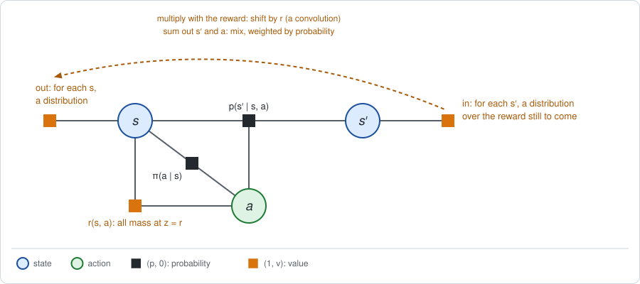

# Chapter 25: Distributional RL

:::{div}
:class: in-progress
**This book is a work in progress.** It is still being written and revised: its content is incomplete and may contain errors.
:::

Every value in this book so far has been an *average*: $V(s)$ is the average
return from a state, and $J$ the average return of a policy. An average hides
a lot. A robot that reaches its charger in one episode out of four and
wanders in the other three can have the same average as a robot that always
does moderately well.

*Distributional* RL carries the whole distribution of the return through the
computation. In the terms of this book that is a change of semiring, to one
with richer entries than any in [Chapter 2](chapter02.md). The short version:

- **The graph does not change.** Only the entries of the factors do: an entry
  holds a whole distribution over the reward accumulated so far.
- **The product is a convolution** and the sum is a mixture. This is a
  semiring, and the elimination routine of Chapter 2 runs on it unchanged.
- **Every semiring of Chapter 2 is a summary of this one.** The expectation
  semiring keeps the mean, the tilted semiring one exponential moment, and
  max-sum the largest value.
- **It has no division.** A distribution cannot in general be "divided out"
  of another. So this semiring passes messages, and it does **NOT** produce
  conditionals with a surprise.
- **Discounting does not fit the product.** With a discount, and with
  continuous returns, the distribution has to be approximated on a grid or
  by quantiles. That is what the algorithms C51 and QR-DQN do, from samples.

**Run the examples.** The code of this chapter's examples is in the companion
notebook [chapter25_examples.ipynb](chapter25_examples.ipynb), which runs
online:
[](https://colab.research.google.com/github/thduynguyen/gtsam/blob/feature/semiringfactor/gtsam/semiring/doc/chapter25_examples.ipynb)

## 1. The graph, and what the mean hides

**The graph** is the one of Chapter 1: states, actions, and the prior,
dynamics, policy and reward factors. Nothing is added to it.

**The example** is the track of Chapter 1, Section 7, with the coin-flip
policy. Its expected return is $J = 1.4$.

**The answer first.** The distribution of the return of that policy:

| return $R$ | $-2$ | $-1$ | $0$ | $8$ | $9$ |
|---|---|---|---|---|---|
| probability | $0.05$ | $0.46$ | $0.25$ | $0.20$ | $0.04$ |

The robot never collects $1.4$. In $76\%$ of the episodes it collects nothing
or loses a little, and in $24\%$ it reaches the charger and collects 8 or 9.
The mean is $-2 \cdot 0.05 - 1 \cdot 0.46 + 8 \cdot 0.20 + 9 \cdot 0.04 = 1.4$.

Questions that the mean cannot answer, and the distribution can:

| Question | Answer |
|---|---|
| How likely is the robot to end at the charger? | $P(R \ge 8) = 0.24$ |
| How spread out is the return? | standard deviation $3.84$ |
| How bad is a bad episode: what is the average of the worst quarter? | $-1.2$ |

The rest of the chapter shows how elimination computes the table above.

## 2. The convolution semiring

**The entry.** In the expectation semiring an entry is a pair $(p, v)$: the
probability of an outcome and the *average* reward accumulated on it. Replace
the average by the whole distribution. For every possible value $z$ of the
accumulated reward, an entry holds

$$h(z) = p \cdot P(\text{reward so far} = z).$$

It is the stored form of Chapter 1, Section 5, with a distribution in the
place of a number: the masses $h(z)$ sum to the probability $p$ of the
outcome, as $w$ was the value times $p$. On the track the accumulated reward
is an integer between $-2$ and $10$, so an entry is 13 numbers.

**The rules.**

| | |
|---|---|
| entry | masses $h(z)$, one per value $z$ of the accumulated reward |
| product | $(h_1 \otimes h_2)(z) = \sum_{z_1 + z_2 = z} h_1(z_1)\, h_2(z_2)$: a convolution |
| sum | $(h_1 \oplus h_2)(z) = h_1(z) + h_2(z)$ |
| zero, one | no mass anywhere; mass 1 at $z = 0$ |
| a probability table $f$ becomes | mass $f$ at $z = 0$: probability $f$, no reward |
| a reward table $r$ becomes | mass 1 at $z = r$: probability one, reward $r$ |

Each rule is the one of the expectation semiring, said for distributions.

- *Product.* Multiplying two factors multiplies their probabilities and
  **adds their rewards**. The distribution of a sum of two independent
  amounts is the convolution of their distributions: every way of splitting
  $z$ into $z_1 + z_2$ contributes.
- *Sum.* Merging two exclusive outcomes of the eliminated variable adds
  their masses. The result is a *mixture* of the two distributions, each
  weighted by the probability of its outcome, because the masses already
  contain that probability.

**Why this is a semiring.** Write an entry as a polynomial in a symbol $x$,
with the masses as coefficients:

$$h \;\longleftrightarrow\; \sum_z h(z)\, x^z.$$

Multiplying two polynomials convolves their coefficients, since
$x^{z_1} x^{z_2} = x^{z_1 + z_2}$, and adding them adds their coefficients.
So the two rules are the ordinary product and sum of polynomials, and the
laws elimination needs (Chapter 2, Section 3) hold because they hold for
polynomials.

**On the track.** The `gtsam/semiring` module has no rule for entries that
are whole distributions. So the notebook eliminates the track with a short
routine in numpy that takes these four functions as its semiring, in the
order of Chapter 1. What is left at the root is the table of Section 1. Two
checks give the same five numbers: the table of all 24 possible
trajectories, and the module itself, on a graph in which the accumulated
reward is one more variable (Section 6).

## 3. The other semirings are summaries of this one

**The answer first.** Each semiring of Chapter 2 keeps a few numbers computed
from $h$, and its rules are what the convolution rules become for those
numbers.

| Keep from $h$ | The semiring | On the track |
|---|---|---|
| the total mass $\sum_z h(z)$ | sum-product | $1$ |
| the total mass, and the first moment $\sum_z z\, h(z)$ | expectation, $(p, w)$ | $(1,\; 1.4)$ |
| the total mass, and one exponential moment $\sum_z e^{\kappa z}\, h(z)$ | tilted, $(p, m)$ | for $\kappa = 0.5$: tilted mean $5.43$ |
| the largest $z$ with $h(z) > 0$ | max-sum | $9$ |
| the total mass and the first two moments | a second-moment semiring | variance $14.74$ |

**Why the rules carry over.** Take the first moment. For a product,

$$\sum_z z\, (h_1 \otimes h_2)(z) = \sum_{z_1, z_2} (z_1 + z_2)\, h_1(z_1)\, h_2(z_2)
= p_1\, w_2 + p_2\, w_1,$$

with $p_i = \sum_z h_i(z)$ and $w_i = \sum_z z\, h_i(z)$. This is the product
rule of the expectation semiring, derived in Chapter 1 from the meaning of
the pair and here from a convolution. For a sum, the first moment of
$h_1 + h_2$ is $w_1 + w_2$. So computing with the pair $(p, w)$ gives the same
result as computing with the whole distribution and taking its mean at the
end.

The same argument with $e^{\kappa z}$ in the place of $z$ gives the tilted
semiring, because $e^{\kappa (z_1 + z_2)} = e^{\kappa z_1}\, e^{\kappa z_2}$:

$$\sum_z e^{\kappa z}\, (h_1 \otimes h_2)(z) = m_1\, m_2.$$

**One function holds them all.** Define, for a distribution $h$,

$$m(\kappa) = \sum_z h(z)\, e^{\kappa z}.$$

This is the polynomial above evaluated at $x = e^\kappa$.

| What is kept | In terms of $m(\kappa)$ |
|---|---|
| the tilted semiring with tilt $\kappa$ | the value of $m$ at one point $\kappa$ |
| the probability $p$ | $m(0)$ |
| the weighted value $w$ of the expectation semiring | the slope $m'(0)$ |
| the second moment | the curvature $m''(0)$ |
| the convolution semiring | the whole function |

The dual number $p + w\,\varepsilon$ of Chapter 1 is the value and the slope
of $m$ at zero. Chapter 2 noted that the expectation semiring is the
derivative of the tilted one at $\kappa = 0$; this is why.

**Checks on the track.** From the distribution of Section 1, the tilted mean
$\frac{1}{\kappa} \log m(\kappa)$ is $-0.277$ for $\kappa = -0.5$, $5.425$ for
$\kappa = 0.5$ and $7.649$ for $\kappa = 2$: the numbers that the tilted
semiring computed directly in Chapter 2.

**The variance from three numbers.** If only the variance is wanted, the
whole distribution is not needed. Keep the mass, the first moment and the
second moment $\omega = \sum_z z^2\, h(z)$. The product rule follows from
$(z_1 + z_2)^2 = z_1^2 + 2 z_1 z_2 + z_2^2$:

$$(p_1, w_1, \omega_1) \otimes (p_2, w_2, \omega_2) = \big(p_1 p_2,\;\; p_1 w_2 + p_2 w_1,\;\;
p_1\, \omega_2 + 2\, w_1 w_2 + p_2\, \omega_1\big).$$

This is the second-order semiring of [Chapter 5](chapter05.md), Section 4,
with the return in the place of the score. On the track it leaves
$(p, w, \omega) = (1,\; 1.4,\; 16.7)$ at the root, so the variance is
$16.7 - 1.4^2 = 14.74$ and the standard deviation $3.84$.

**Risk measures.** With the distribution in hand, any measure of risk can be
read from it. Two common ones are the tilted mean of Chapter 2 and the
*conditional value at risk*, the average of the worst fraction of the
outcomes:

| Average of the worst... | all | half | quarter | tenth |
|---|---|---|---|---|
| return | $1.4$ | $-1.1$ | $-1.2$ | $-1.5$ |

## 4. Value factors that hold distributions

**The backward message.** In Chapter 1 the factor that elimination passes
backward on a state held $(1, V_t(s))$. Now it holds, for each state, the
distribution of the reward still to come. Stopping the elimination of the
track before $s_1$ shows it, with one move left:

| cell $s_1$ | distribution of the reward still to come | its mean |
|---|---|---|
| 0 | $-1$ with probability $0.5$, $0$ with $0.5$ | $-0.5$ |
| 1 | $-1$ with $0.1$, $0$ with $0.5$, $9$ with $0.4$ | $3.5$ |
| 2 | $0$ with $0.4$, $9$ with $0.5$, $10$ with $0.1$ | $5.5$ |

The means are the values $V_1 = (-0.5,\; 3.5,\; 5.5)$ of Chapter 1.



**The distributional Bellman equation.** Write $h_t(s, z)$ for the
probability that the reward from step $t$ on is $z$, given $s_t = s$. One
step of elimination, of the next state and of the action, is

$$h_t(s, z) = \sum_a \pi(a \mid s) \sum_{s'} p(s' \mid s, a)\; h_{t+1}\big(s',\; z - r(s, a)\big).$$

The reward $r(s, a)$ **shifts** the distribution of the next state, and the
sums over $a$ and $s'$ **mix** the shifted distributions. Multiplying both
sides by $z$ and summing over $z$ gives back the Bellman backup of Chapter 1
for the mean.

**There is no division.** The other semirings produced a conditional
$c = \psi \oslash \phi$ for every variable, whose value channel was a
surprise. Here the division would have to undo a convolution, and that is
not possible in general.

:::{dropdown} A two-outcome example of why the division fails
Let the eliminated variable have two outcomes with probability $\tfrac{1}{2}$
each, the first with reward $0$ and the second with reward $1$. As
polynomials,

$$\psi_1 = \tfrac{1}{2}, \qquad \psi_2 = \tfrac{1}{2}\, x, \qquad
\phi = \psi_1 + \psi_2 = \tfrac{1}{2}\,(1 + x).$$

A conditional for the first outcome would be a $c_1$ with
$c_1 \cdot \phi = \psi_1$, that is, $c_1 = 1 / (1 + x)$. That is not a
polynomial. As a series it is $1 - x + x^2 - \dots$, with infinitely many
terms and negative masses: not a distribution.

In the expectation semiring the same division worked because only the mean
was kept, and means subtract: $v - \bar v$. Distributions do not subtract.
:::

So this semiring supports message passing, and it does **NOT** support the
Bayes net of surprises of Chapter 1. Advantages and TD residuals remain
statements about means.

## 5. Discounting, and the algorithms C51 and QR-DQN

### Why the endless case is harder

On the endless track of [Chapter 3](chapter03.md) the return is discounted,
and the equation of Section 4 becomes

$$\text{return from } s \;=\; r(s, a) + \gamma \cdot \big(\text{return from } s'\big).$$

The discount **shrinks** the distribution of the next state by $\gamma$
before the reward shifts it. Two things go wrong for the semiring.

- *Shrinking is not a product.* The convolution adds rewards; it has no
  operation that scales them. And the shrunk values $\gamma z$ leave any
  fixed grid of values.
- *The termination trick changes the distribution.* Chapter 3 replaced the
  discount by an episode that ends with probability $1 - \gamma$ after each
  step. That keeps the mean, and it fits the semiring. But the undiscounted
  return of an episode that ends at random is a different random quantity
  from the discounted return of an endless one.

*On the endless track,* from cell 1 under the coin flip, simulated with a
fixed seed:

| | mean | standard deviation |
|---|---|---|
| discounted return of an endless episode | $1.05$ | $2.40$ |
| undiscounted return of an episode that ends at random | $1.12$ | $4.03$ |
| exact mean, Chapter 3 | $1.10$ | |

The means agree, within sampling error. The spreads do not. The equivalence
of Chapter 3 is an equivalence of expected values only. Distributional RL
means the first row.

### C51: a fixed grid, and a projection

C51 (Bellemare, Dabney and Munos, 2017) stores, for each state, 51
probabilities on a fixed grid of return values $z_1 < \dots < z_{51}$. One
backup:

1. take the grid distribution of the next state $s'$;
2. move each grid value to $r(s, a) + \gamma\, z_j$, which is usually
   between two grid values;
3. **project**: split its probability between the two neighbouring grid
   values, in proportion to how close it is to each.

The split in step 3 is chosen so that the mean is preserved: a mass at a
point between $z_j$ and $z_{j+1}$ puts the fraction

$$\frac{z_{j+1} - (r + \gamma z)}{z_{j+1} - z_j} \text{ on } z_j
\quad\text{and the rest on } z_{j+1}.$$

*On the endless track,* with a grid from $-10$ to $20$ and the backup
averaged exactly over actions and next states:

| | cell 0 | cell 1 | cell 2 |
|---|---|---|---|
| mean of the grid distribution | $-0.225$ | $1.102$ | $4.123$ |
| $V$ of Chapter 3 | $-0.225$ | $1.102$ | $4.123$ |
| standard deviation of the grid distribution | $2.05$ | $2.48$ | $2.41$ |

The means are exact. The spread is slightly too large: $2.48$ for cell 1
against $2.40$ in the simulation, because each projection smears a little
mass over neighbouring grid values. The quantiles from cell 1 agree with the
simulation to within a grid step:

| quantile | $10\%$ | $50\%$ | $90\%$ |
|---|---|---|---|
| grid | $-2.20$ | $0.80$ | $4.40$ |
| simulation | $-1.95$ | $0.87$ | $4.36$ |

**The sampled version.** The algorithm proper does not average over actions
and next states. It takes one sampled transition $(s, a, s')$ at a time and
moves the stored distribution of $s$ a small step toward the projected
target, exactly as temporal-difference learning does for the mean
(Chapter 12). On the endless track, 60,000 sampled transitions with a fixed
seed give means $(-0.24,\; 0.93,\; 3.87)$, close to the exact
$(-0.22,\; 1.10,\; 4.12)$. In C51 the 51 probabilities are the output of a
neural network, and the step is a gradient step on the cross-entropy to the
target.

### QR-DQN: fixed probabilities, learned values

C51 fixes the values and learns the probabilities. QR-DQN (Dabney, Rowland,
Bellemare and Munos, 2018) does the opposite: it fixes equally spaced
probability levels and learns the return value at each, that is, the
*quantiles* of the distribution. The quantiles are trained by quantile
regression, a loss whose minimum is the quantile. No grid has to be chosen
in advance and no projection is needed.

| | Exact convolution (Section 2) | C51 | QR-DQN |
|---|---|---|---|
| what is stored per state | a mass for every possible return | probabilities on a fixed grid of values | values at fixed probability levels |
| the backup | exact convolution and mixture | shift, shrink, project onto the grid | shift, shrink, regress the quantiles |
| handles a discount | no | yes | yes |
| source of the backup | all next states, exactly | sampled transitions | sampled transitions |
| mean preserved | yes | yes, by the projection | approximately |

**For control**, both algorithms choose the action by the *mean* of its
distribution, as Q-learning does (Chapter 15). The distribution changes what
is learned, not how the action is chosen, unless a risk measure is used in
the place of the mean.

## 6. Implementation

The convolution semiring, as the four functions that the notebook's numpy
elimination routine takes. An entry is a tuple of 13 arrays, one per value
of $z$:

```python
Z = np.arange(-2, 11)  # the possible accumulated rewards

class Convolution:
    """Entries h(z): probability mass at every accumulated reward z."""

    @staticmethod
    def probability(p):   # probability p, no reward: all the mass at z = 0
        return tuple(p if z == 0 else np.zeros_like(p) for z in Z)

    @staticmethod
    def reward(r):        # probability one, reward r: all the mass at z = r
        return tuple((r == z).astype(float) for z in Z)

    @staticmethod
    def times(a, b):      # rewards add: the masses are convolved
        result = []
        for z in Z:
            total = 0.0
            for i, z1 in enumerate(Z):
                z2 = z - z1
                if Z[0] <= z2 <= Z[-1]:
                    total = total + a[i] * b[z2 - Z[0]]
            result.append(total)
        return tuple(result)

    @staticmethod
    def plus(a, axis):    # exclusive outcomes: the masses are added
        return tuple(channel.sum(axis) for channel in a)

distribution = eliminate(Convolution, terms, order)
```

**The same distribution from the module.** The module cannot hold an entry
$h(z)$, but it can hold a variable. Add one variable per step for the reward
accumulated so far, `C(t)` in the code, with the 13 values of $z$. Replace
each reward factor by a probability factor that is 1 when the accumulated
reward after the step is the one before plus $r$, and 0 otherwise. The graph
then has probabilities only. Eliminating everything except the last of the
new variables leaves its marginal, which is the distribution of the return:

```python
count = lambda t: (C(t), len(Z))

def adds(reward):
    """The factor on (c, ..., c') that is 1 when c' = c + reward(...)."""
    after = Z[:, None] + np.ravel(reward)[None, :]
    return (after[:, :, None] == Z).reshape(
        (len(Z),) + np.shape(reward) + (len(Z),)).astype(float)

counted = SemiringFactorGraph()
counted.push_back(probability([state(0)], prior))
counted.push_back(probability([count(0)], Z == 0))  # nothing accumulated yet
for t in range(2):
    keys = [state(t), action(t)]
    counted.push_back(probability(keys, policy))
    counted.push_back(probability(keys + [state(t + 1)], dynamics))
    counted.push_back(probability([count(t)] + keys + [count(t + 1)],
                                  adds(move_reward)))
counted.push_back(probability([count(2), state(2), count(3)],
                              adds(final_reward)))
_, remaining = counted.eliminatePartialSequential(
    ordering(S(0), A(0), C(0), S(1), A(1), C(1), S(2), C(2)))
marginal = table(remaining.product().probability(), [count(3)])
```

The two computations are the same sums in a different arrangement: the
masses $h(z)$ of an entry are the dependence of a factor on the new
variable. The convolution semiring keeps that variable out of the graph, and
the graph with the new variable needs no new semiring.

**The summaries, on the module.** The mean, the tilted means and the best
return of Section 3 are eliminations of the track with the module's rules,
and the notebook compares each with the number read from the distribution:

```python
graph.expectation(backward)                                         # 1.4
graph.expectation(backward, everywhere(SemiringSum.Tilted(0.5)))    # 5.43
graph.expectation(backward, everywhere(SemiringSum.Maximum()))      # 9
```

The second-moment semiring has three numbers per entry, which the module
does not have either, and runs in the numpy routine.

**The projection of C51**, and the backup as factor operations. The position
on the grid is again one more variable. The projection becomes a factor on
(cell, action, next grid value, grid value), and one backup is a product of
factors and a sum over the action, the next cell and the next grid value:

```python
def project(values, probabilities):
    """Put the masses at `values` onto the grid, splitting between neighbours."""
    position = (np.clip(values, atoms[0], atoms[-1]) - atoms[0]) / spacing
    lower = np.floor(position).astype(int)
    upper = np.minimum(lower + 1, len(atoms) - 1)
    weight_upper = position - lower
    result = np.zeros(len(atoms))
    np.add.at(result, lower, probabilities * (1 - weight_upper))
    np.add.at(result, upper, probabilities * weight_upper)
    return result

# The projection as a factor: where a unit mass at each next grid value lands.
projection = np.array([[[project(reward[s, a] + gamma * atoms[j:j + 1],
                                 np.ones(1)) for j in range(len(atoms))]
                        for a in range(2)] for s in range(3)])
# The action can be summed out once, before the sweeps.
operator = (policy_factor * step * probability(
    [cell, move, next_atom, atom], projection)).sum(ordering(A(0)))

for sweep in range(300):
    bucket = operator * probability([next_cell, next_atom], categorical)
    categorical = table(bucket.sum(ordering(S(1), C(1))).probability(),
                        [cell, atom])
```

The simulations and the sampled version of Section 5 are numpy.

## 7. Exact tests

| Quantity | Computed by | Checked against |
|---|---|---|
| the distribution of the return on the track | elimination with the convolution semiring, in numpy | the table of the 24 trajectories, and the module's marginal of the accumulated reward |
| its mean, $1.4$ | the first moment of the distribution | the module, with the average at every variable |
| tilted means for $\kappa = -0.5,\; 0.5,\; 2$ | $\frac{1}{\kappa} \log m(\kappa)$ from the distribution | the module, with the tilted rule at every variable |
| the largest return, $9$ | the largest $z$ with $h(z) > 0$ | the module, with the maximum at every variable |
| the variance, $14.74$ | the second-moment semiring, in numpy | the distribution |
| the value factor on $s_1$ | partial elimination with the convolution semiring | its means are the module's $V_1 = (-0.5,\; 3.5,\; 5.5)$ |
| the grid distributions on the endless track | the projected backup, as factor operations of the module | their means are the module's $V$ of Chapter 3 |

## 8. What breaks, and what still maps

**What breaks.**

- **The size of an entry.** An entry holds one number per possible return.
  On the track that is 13. For real-valued rewards it is infinite, and the
  distribution has to be approximated by a grid or by quantiles.
- **No conditionals.** Without division there is no Bayes net and no
  surprise. Everything in this book that uses the advantage as a conditional,
  from the policy gradient of Chapter 5 on, is a statement about means.
- **The discount.** Shrinking returns is outside the semiring, and the
  termination view of Chapter 3 changes the distribution.
- **Approximation error accumulates.** The projection of C51 spreads mass at
  every backup, and the spread feeds into the next backup.
- **Weaker guarantees for control.** For evaluating a fixed policy the
  distributional backup converges. With a maximum over the actions the means
  still converge, but the distributions need not settle when two actions
  have nearly equal means.

**What still maps.**

- **The two stages are unchanged.** Distributional RL replaces the backward
  message of Stage 1 by a richer one. The dynamics factor, the forward
  message and the Stage 2 update are those of the underlying algorithm.
- **Evaluation of a policy with a finite horizon and discrete rewards** is
  exact elimination, as in Section 2.

## 9. Framework card

| | Exact convolution | C51 | QR-DQN |
|---|---|---|---|
| 1. Sum over the actions | average under $\pi$ (evaluation) | maximum of the mean | maximum of the mean |
| 2. Dynamics factor | closed form (tables) | real or simulated transitions | real or simulated transitions |
| 3. Backward messages | exact: a distribution of the return per state | learned, bootstrapped: probabilities on a fixed grid | learned, bootstrapped: quantiles |
| 4. Forward messages | not needed | a replay buffer | a replay buffer |
| 5. Stage 2 update | none | greedy with respect to the mean | greedy with respect to the mean |

(chapter25-references)=
## 10. References

- M. J. Sobel, "The variance of discounted Markov decision processes",
  *Journal of Applied Probability*, 1982. A Bellman equation for the second
  moment.
- T. Morimura, M. Sugiyama, H. Kashima, H. Hachiya and T. Tanaka,
  "Nonparametric return distribution approximation for reinforcement
  learning", *ICML*, 2010.
- M. G. Bellemare, W. Dabney and R. Munos, "A distributional perspective on
  reinforcement learning", *ICML*, 2017. The distributional Bellman operator,
  and C51.
- W. Dabney, M. Rowland, M. G. Bellemare and R. Munos, "Distributional
  reinforcement learning with quantile regression", *AAAI*, 2018. QR-DQN.
- M. G. Bellemare, W. Dabney and M. Rowland, *Distributional Reinforcement
  Learning*, MIT Press, 2023.
- R. T. Rockafellar and S. Uryasev, "Optimization of conditional
  value-at-risk", *Journal of Risk*, 2000.
- Z. Li and J. Eisner, "First- and second-order expectation semirings with
  applications to minimum-risk training on translation forests", *EMNLP*,
  2009. Variances by a second-order semiring.

---

Previous: [Chapter 24: Exploration and dual control](chapter24.md).
Next: [Chapter 26: Robotics case studies](chapter26.md).
