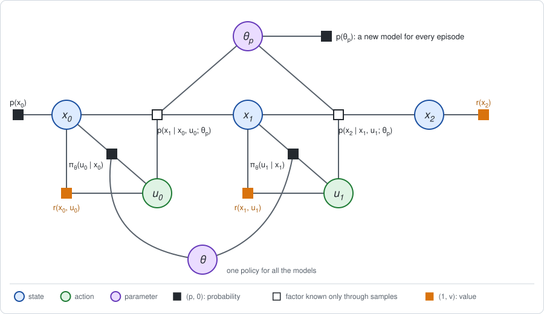

# Chapter 26: Robotics case studies

:::{div}
:class: in-progress
**This book is a work in progress.** It is still being written and revised: its content is incomplete and may contain errors.
:::

The chapters before this one took algorithms apart. This last chapter looks
at how they are put to work on robots. It introduces no new algorithm. It
takes four ways in which reinforcement learning is used in robotics today
and reads each as a set of choices along the five axes of
[Chapter 5](chapter05.md), Section 6, with the reason for each choice.

The short version:

- **PPO in simulation, for legged locomotion.** Samples are cheap, so the
  simplest on-policy method is used with enormous batches, and the effort
  goes into making the simulated dynamics factor cover the real one.
- **SAC and TD3 on hardware.** Samples are expensive, so every transition is
  stored and reused many times.
- **Model predictive control with learned components.** A model is used
  online, at every step, and learning supplies the parts that are hard to
  model: the dynamics, or the value beyond the horizon.
- **Residual RL.** A conventional controller does most of the work, and the
  learned policy is a correction on top of it.

In all four, two practical facts decide the choices: what a sample costs,
and how good the available model is.

**Run the examples.** The code of this chapter's examples is in the companion
notebook [chapter26_examples.ipynb](chapter26_examples.ipynb), which runs
online:
[](https://colab.research.google.com/github/thduynguyen/gtsam/blob/feature/semiringfactor/gtsam/semiring/doc/chapter26_examples.ipynb)

## 1. How to read a robot-learning system

Any system that learns a controller answers the five questions of Chapter 5.

| Axis | The question to ask of the system |
|---|---|
| 1. Sum over the actions | Does it evaluate its own policy (average), or look for the best action (maximum, soft maximum)? |
| 2. Dynamics factor | Where do transitions come from: a model in closed form, a simulator, the real robot, a learned model? |
| 3. Backward messages | How are values obtained: exactly, from returns of rollouts, by bootstrapping, from a learned critic? |
| 4. Forward messages | Which states are the values and gradients averaged over: fresh rollouts of the current policy, or a store of old transitions? |
| 5. Stage 2 update | How does the policy change: a gradient step, a trust-region step, a re-plan at every control step? |

The answers are rarely free. They follow from two properties of the problem:

| | Samples are cheap | Samples are expensive |
|---|---|---|
| **a good simulator or model exists** | on-policy policy gradient in simulation (Section 2) | use the model online: MPC (Section 4); or start from a controller designed on the model (Section 5) |
| **no adequate model** | (rare for robots) | off-policy learning on hardware, reusing every transition (Section 3) |

## 2. Case 1: PPO for legged locomotion, from simulation to reality

**The problem.** A legged robot has to walk over varied terrain. Its dynamics
involve intermittent contacts, which are hard to handle with the exact or
linearized messages of Part II. Physics simulators handle them, at a cost
per sample that has fallen sharply: thousands of copies of a robot can be
simulated in parallel on one graphics processor (Makoviychuk et al., 2021;
Rudin et al., 2022).

**The graph.** The policy factors share one parameter $\theta$, as in
Chapter 5. The dynamics factors are known only through the simulator. And
the simulator itself has parameters $\theta_p$, such as masses, friction and
motor strength, which are drawn anew for every episode:



**The choices, and why.**

| Axis | Choice | Reason |
|---|---|---|
| 1. Sum over the actions | average under $\pi_\theta$ | a policy gradient needs no maximum over continuous actions |
| 2. Dynamics factor | simulator samples, with randomized parameters | contacts are simulated, not modeled in closed form |
| 3. Backward messages | a learned critic $V$, mixed with returns of rollouts (GAE, Chapters 12 and 13) | lower variance than returns alone |
| 4. Forward messages | particles: fresh rollouts of the current policy in thousands of parallel simulations | samples are cheap, so nothing old needs to be reused |
| 5. Stage 2 update | the clipped trust-region step of PPO (Chapter 14), several passes over each batch | stable with very large batches, and simple to run in parallel |

A method that reuses old data, as in Section 3, would need fewer samples.
Here that is beside the point: the binding cost is wall-clock time, and
on-policy data with huge batches give low-noise messages for the current
policy at every iteration.

**The real difficulty: the dynamics factor of training is not the real
one.** A policy trained in simulation is evaluated on a graph whose dynamics
factors differ from those of the robot. This is the *sim-to-real gap*, and
the remedies are changes to the graph.

- **Domain randomization** (Tobin et al., 2017; Peng et al., 2018). Make
  $\theta_p$ a chance variable with a broad prior, as in the figure, and
  maximize the return averaged over it:

  $$J(\theta) = \sum_{\theta_p} p(\theta_p)\; J(\theta;\, \theta_p).$$

  The policy has to work for every model in the range, in the hope that the
  real robot is one of them.
- **A learned piece of the model** (Hwangbo et al., 2019). Fit the part of
  the dynamics that the simulator gets wrong, the actuators, from data of
  the real robot, as in Chapter 18, and put it into the simulator.
- **A policy with memory** (Lee et al., 2020; Kumar et al., 2021). With
  $\theta_p$ random and not observed, the problem is partially observed
  ([Chapter 22](chapter22.md)). A policy that sees a history of readings
  can adapt to the model it is in. The history plays the role of a learned
  belief about $\theta_p$.
- **A critic that sees more than the policy.** In simulation the true state
  and $\theta_p$ are available. The critic may use them, since it is needed
  only during training, while the policy uses only what the real robot will
  measure.

**An illustration on the line.** Take the line of Chapter 1, Section 8, with
an actuator gain $B$ in the dynamics, $x' = x + B u + w$, and a policy with
one gain per move, $u_t = -K_t\, x_t$. Chapter 1 had $B = 1$. Suppose the
real gain is uncertain: $0.5$, $1$ or $1.5$, equally likely. Compare the
gains designed for $B = 1$ alone, which are the Riccati gains
$(0.6,\; 0.5)$ of Chapter 6, with gains trained on the average over the
three models, which come out as $(0.553,\; 0.448)$:

| real $B$ | designed for $B = 1$ | trained on the three models | best for this $B$ |
|---|---|---|---|
| $0.5$ | $-12.647$ | $-12.649$ | $-12.607$ |
| $1$ | $-9.250$ | $-9.286$ | $-9.250$ |
| $1.5$ | $-8.022$ | $-7.874$ | $-7.812$ |
| average | $-9.973$ | $-9.936$ | |

The randomized policy is better on average, and noticeably better where the
nominal design is worst relative to the best, at $B = 1.5$. It pays for that
at the nominal model. Its gains are smaller: a policy that must work for
every model is more cautious than one tuned to a single model. On the line
the differences are small, because a linear system tolerates errors in the
gain. A walking robot does not, which is why the method matters there.

## 3. Case 2: SAC and TD3 on hardware

**The problem.** There is no adequate simulator, or the last part of the
learning has to happen on the robot. Every sample now costs robot time,
wear and supervision. The on-policy recipe of Section 2, which throws its
data away after each update, is out of the question.

**The choices, and why.**

| Axis | Choice | Reason |
|---|---|---|
| 1. Sum over the actions | soft maximum (SAC), or maximum by a gradient step on the action (TD3) | learns about the best policy, not only about the one that collected the data |
| 2. Dynamics factor | real transitions | no model is trusted |
| 3. Backward messages | a learned critic $Q$, bootstrapped (Chapters 15 to 17) | can be trained from single transitions, in any order |
| 4. Forward messages | a replay buffer: a store of old transitions | each costly transition is reused for many updates |
| 5. Stage 2 update | a gradient step on the policy through the critic | cheap, and repeated many times per real sample |

The key number in such a system is how many gradient updates are made per
real transition. Raising it squeezes more out of each sample, and it makes
the stored messages staler relative to the current policy, which is the
instability discussed in Chapter 12.

Two features of these algorithms matter on hardware. Both keep two critics
and use the smaller of their values, which counters the tendency of a
maximum over a noisy estimate to overestimate (Fujimoto et al., 2018). And
SAC's soft maximum keeps the policy random to a degree set by a temperature,
which explores without hand-tuned noise ([Chapter 24](chapter24.md)) and
tends to give policies that tolerate disturbances. With these ingredients a
quadruped has been trained to walk directly on hardware in a few hours of
robot time (Haarnoja et al., 2019).

**What it costs.** The robot has to act while it is still bad at the task,
which raises questions of safety and of resetting the robot after a failure
that the framework does not address.

## 4. Case 3: model predictive control with learned components

**The problem.** A model is available and fast enough to be used *while the
robot runs*. Model predictive control (MPC) is the wrapper of Chapter 5,
Section 6: at every control step, run both stages on a short horizon
starting from the current state, apply the first action, and repeat
(Chapters 9 and 10).

**Where learning enters.** MPC has three places where a learned component
can replace a hand-made one.

| Component | Learned version | Chapter |
|---|---|---|
| the dynamics factor | a model fitted to data of the robot, often an ensemble | 18, 21 |
| the value at the end of the horizon | a learned critic, which stands for everything beyond the horizon | 13, 21 |
| the starting guess, or the distribution that action sequences are sampled from | a learned policy | 10, 21 |

**The choices, and why.**

| Axis | Choice | Reason |
|---|---|---|
| 1. Sum over the actions | maximum or soft maximum, by sampling (CEM, MPPI) or by a local quadratic (iLQR) | the plan is for this state only, so a full policy is not needed |
| 2. Dynamics factor | a learned model, or a known model with learned parts | the model is queried thousands of times per control step |
| 3. Backward messages | short rollouts in the model, closed by a learned critic at the end of the horizon | a short horizon is cheap; the critic makes it far-sighted |
| 4. Forward messages | a single point: the current state estimate | re-planning from the measured state replaces a distribution over states |
| 5. Stage 2 update | re-plan at every control step | feedback comes from re-planning, not from a stored policy |

**For a SLAM reader**, MPC is to control what a fixed-lag smoother is to
estimation. Both solve a problem on a sliding window at every step. The
smoother summarizes the *past* beyond the window by a prior factor from
marginalization. MPC summarizes the *future* beyond the window by a value
factor at the end of the horizon. One is a forward message and the other a
backward message.

**What it costs.** The computation happens online, at the control rate. And
a maximum taken inside a learned model finds the model's errors: plans drift
toward regions where the model is wrong in an optimistic direction
(Chapters 9 and 21).

## 5. Case 4: residual RL

**The problem.** A conventional controller exists and works tolerably. It
was designed on a model that misses something: friction, contact, a weaker
motor. Learning a controller from nothing would throw that design away.

**The idea** (Johannink et al., 2019; Silver et al., 2018). Keep the
controller, and learn only a correction that is added to its output:

$$u = \underbrace{u_{\text{nominal}}(x)}_{\text{fixed}} + \underbrace{u_\theta(x)}_{\text{learned}}.$$

On the graph only the policy factor changes: it has a fixed part and a part
with parameters $\theta$. With the correction started at zero, the robot
begins with the performance of the nominal controller, not with that of a
random policy. Any Stage 1 and Stage 2 of the earlier chapters can train the
correction.

**An illustration on the line.** The real robot has a weaker actuator than
the model said: $B = 0.5$ where the design assumed $B = 1$. The nominal
controller uses the gains $(0.6,\; 0.5)$. On the real system:

| Policy | $J$ on the real system |
|---|---|
| no controller, $u = 0$ | $-16.500$ |
| nominal controller, designed for $B = 1$ | $-12.647$ |
| best gains for $B = 0.5$, by the Riccati recursion | $-12.607$ |

Learn a correction to the two gains by gradient ascent on the real system,
with exact messages, and compare with learning both gains from zero with the
same step size:

| iteration | $J$, residual on the nominal controller | $J$, learned from zero |
|---|---|---|
| 0 | $-12.647$ | $-16.500$ |
| 1 | $-12.635$ | $-14.368$ |
| 2 | $-12.627$ | $-13.463$ |
| 5 | $-12.614$ | $-12.735$ |
| 10 | $-12.609$ | $-12.619$ |
| 20 | $-12.607$ | $-12.607$ |

Both reach the best gains, $(0.621,\; 0.400)$; the learned correction is
$(+0.021,\; -0.100)$. The residual policy comes within $0.01$ of the best
return after 5 iterations, against 11 from zero. More important on a real
robot is the first row: the residual policy starts at the performance of
the nominal controller, while the policy learned from zero starts with no
control at all.

**What it costs.** The correction can only express what an addition to the
nominal action can express. And a nominal controller with feedback reacts to
the correction as to a disturbance, so the two can work against each other.

## 6. Framework cards

| | PPO, simulation to reality | SAC / TD3 on hardware | MPC with learned components | Residual RL |
|---|---|---|---|---|
| 1. Sum over the actions | average under $\pi_\theta$ | soft maximum (SAC); maximum by gradient (TD3) | maximum or soft maximum, sampled or local quadratic | that of the method that trains the correction |
| 2. Dynamics factor | simulator samples, parameters randomized | real transitions | learned model, or known model with learned parts | real or simulated transitions |
| 3. Backward messages | learned critic $V$ with GAE | learned critic $Q$, bootstrapped, two copies | short rollouts in the model, plus a learned critic at the horizon | as in the training method |
| 4. Forward messages | particles from fresh rollouts, in parallel | replay buffer | a point: the current state | as in the training method |
| 5. Stage 2 update | clipped trust-region steps (PPO) | gradient through the critic | re-plan at every control step (receding horizon) | as in the training method, on the correction only |

## 7. Exact checks

The two illustrations use closed-form evaluations of a linear policy on the
line, by the backward recursion of Chapter 6. The notebook checks them
against the numbers of earlier chapters and against the module.

| Check | Result |
|---|---|
| Riccati gains for $B = 1$ and their return | $(0.6,\; 0.5)$ and $J^* = -9.25$, as in Chapter 6 |
| the gains $(0.5,\; 0.5)$ for $B = 1$ | $J = -9.375$, as in Chapter 6 |
| the recursion against a `SemiringFactorGraph` of Gaussian factors, for $B = 0.5$ and $B = 1$ | equal |
| the residual correction converges to | the Riccati gains for $B = 0.5$ |

## 8. Implementation

The evaluation of a linear policy for a given actuator gain, and its check
with the module, in which the policy is a hard constraint $u + K x = 0$:

```python
def evaluate(gains, B):
    """Expected return of u_t = -K_t x_t on the line with actuator gain B."""
    P, beta = 1.0, 0.0                      # V_2(x) = -x^2
    for K in reversed(gains):
        beta = beta + P * sigma_w           # the cost of the noise
        P = 1 + K ** 2 + (1 - B * K) ** 2 * P
    return -(P * (mean0 ** 2 + variance0) + beta)

graph = SemiringFactorGraph()
graph.push_back(gaussian(X(0), I, np.array([mean0]),
                         noiseModel.Isotropic.Variance(1, variance0)))
for t, K in enumerate(gains):
    graph.push_back(gaussian(U(t), I, X(t), K * I, zero,
                             noiseModel.Constrained.All(1)))        # policy
    graph.push_back(gaussian(X(t + 1), I, X(t), -I, U(t), -B * I, zero,
                             noiseModel.Isotropic.Variance(1, sigma_w)))
    graph.push_back(penalty(X(t)))
    graph.push_back(penalty(U(t)))
graph.push_back(penalty(X(2)))
graph.expectation()                         # equals evaluate(gains, B)
```

Domain randomization is the average of `evaluate` over the models, and
residual learning is gradient ascent on `evaluate(nominal + correction, 0.5)`.

## 9. What the framework does not cover

The five axes describe how a system computes and uses its messages. Much of
what makes a robot-learning system work lies outside them.

- **The reward.** All four cases assume the reward factors are given. In
  practice they are designed by hand and adjusted many times.
  [Chapter 23](chapter23.md) showed how much freedom there is in rewards
  that lead to the same behavior, and how sensitive a reward is.
- **Safety.** Nothing in the expectation of a return prevents a single bad
  episode. Constraints, and the risk measures of Chapters 8 and 25, address
  part of this.
- **What the policy observes.** Choosing the readings and the amount of
  history the policy receives decides how well it can cope with hidden state
  (Chapter 22).
- **Exploration.** On hardware it is limited by safety. In simulation it is
  mostly noise on the actions, which Chapter 24 showed to be a heuristic.
- **The gap between two graphs.** Training evaluates the policy on one
  graph and the robot runs on another. Domain randomization, learned
  actuator models and residual learning are all ways of dealing with a
  wrong dynamics factor, and none removes it.

The illustrations of this chapter are on a two-move linear problem and show
mechanisms only. The descriptions of the robotic systems summarize the
published work listed below.

(chapter26-references)=
## 10. References

- J. Kober, J. A. Bagnell and J. Peters, "Reinforcement learning in robotics:
  a survey", *International Journal of Robotics Research*, 2013.
- J. Schulman, F. Wolski, P. Dhariwal, A. Radford and O. Klimov, "Proximal
  policy optimization algorithms", arXiv preprint, 2017.
- J. Tobin, R. Fong, A. Ray, J. Schneider, W. Zaremba and P. Abbeel, "Domain
  randomization for transferring deep neural networks from simulation to the
  real world", *IROS*, 2017.
- X. B. Peng, M. Andrychowicz, W. Zaremba and P. Abbeel, "Sim-to-real
  transfer of robotic control with dynamics randomization", *ICRA*, 2018.
- J. Hwangbo, J. Lee, A. Dosovitskiy, D. Bellicoso, V. Tsounis, V. Koltun and
  M. Hutter, "Learning agile and dynamic motor skills for legged robots",
  *Science Robotics*, 2019.
- J. Lee, J. Hwangbo, L. Wellhausen, V. Koltun and M. Hutter, "Learning
  quadrupedal locomotion over challenging terrain", *Science Robotics*, 2020.
- A. Kumar, Z. Fu, D. Pathak and J. Malik, "RMA: rapid motor adaptation for
  legged robots", *Robotics: Science and Systems*, 2021.
- V. Makoviychuk and others, "Isaac Gym: high performance GPU-based physics
  simulation for robot learning", *NeurIPS Datasets and Benchmarks*, 2021.
- N. Rudin, D. Hoeller, P. Reist and M. Hutter, "Learning to walk in minutes
  using massively parallel deep reinforcement learning", *Conference on
  Robot Learning*, 2021.
- T. Haarnoja, A. Zhou, P. Abbeel and S. Levine, "Soft actor-critic:
  off-policy maximum entropy deep reinforcement learning with a stochastic
  actor", *ICML*, 2018.
- T. Haarnoja, S. Ha, A. Zhou, J. Tan, G. Tucker and S. Levine, "Learning to
  walk via deep reinforcement learning", *Robotics: Science and Systems*,
  2019.
- S. Fujimoto, H. van Hoof and D. Meger, "Addressing function approximation
  error in actor-critic methods", *ICML*, 2018. TD3.
- G. Williams, N. Wagener, B. Goldfain, P. Drews, J. M. Rehg, B. Boots and
  E. A. Theodorou, "Information theoretic MPC for model-based reinforcement
  learning", *ICRA*, 2017.
- K. Chua, R. Calandra, R. McAllister and S. Levine, "Deep reinforcement
  learning in a handful of trials using probabilistic dynamics models",
  *NeurIPS*, 2018.
- N. Hansen, H. Su and X. Wang, "TD-MPC2: scalable, robust world models for
  continuous control", *ICLR*, 2024.
- T. Johannink, S. Bahl, A. Nair, J. Luo, A. Kumar, M. Loskyll, J. A. Ojea,
  E. Solowjow and S. Levine, "Residual reinforcement learning for robot
  control", *ICRA*, 2019.
- T. Silver, K. Allen, J. Tenenbaum and L. Kaelbling, "Residual policy
  learning", arXiv preprint, 2018.

---

Previous: [Chapter 25: Distributional RL](chapter25.md).
Next: [Appendix A: The GTSAM implementation](appendix_a.md).
